# 2 — Public Blog Repo Code

Central plan for the Hugo + PaperMod blog repo at `cloudarchitectec.com`.

---

## Status at a glance


| ID     | Item                                         | Status         |
| ------ | -------------------------------------------- | -------------- |
| C1     | Custom domain                                | ✅ Done         |
| C2     | Waline comments                              | ✅ Done         |
| C3     | Comments enabled                             | ✅ Done         |
| C4     | MailerLite subscribe                         | 🔄 In progress |
| C5     | RSS quality                                  | ✅ Done         |
| C6     | CI build checks                              | ✅ Done         |
| C7     | Image path CI + rename                       | ✅ Done         |
| C8     | Image display infrastructure                 | ✅ Done         |
| C8-S1  | Cover/hero migration                         | ✅ Done         |
| C8-S2  | Unsplash attribution                         | ✅ Done         |
| C8-S3  | Absolute inline paths                        | ✅ Done         |
| C8-S5  | Blog publisher enforcement                   | ✅ Done         |
| C8-S7  | Front matter cleanup (`image:` removal)      | ✅ Done         |
| C8-S8  | Image size soft limits + outlier fix         | ✅ Done         |
| C9     | Post content rules (pre-commit + validation) | ✅ Done         |
| C10    | Slug/dir case fix + PR validation gate       | ✅ Done         |
| C11    | Validation tiers (local / hook / CI)         | ✅ Done         |
| C11-S1 | UI smoke tests (Playwright)                  | ✅ Done         |
| C12    | Site integrity + production smoke            | ✅ Done         |
| C13    | GA4 analytics hygiene                        | ✅ Done         |
| C14    | Related posts + category validation          | ✅ Done         |
| C14-P2 | Episodic series nav at post top              | ✅ Done         |
| C15    | Medium legacy redirect tooling               | 🔄 Manual hybrid |
| C16    | CV / Resume page (`/portfolio/career-zh/`, `/portfolio/career-en/`, `/portfolio/story/`) | ✅ Done         |
| C17    | Mobile RWD (nav + CI + embeds)               | ✅ Done         |
| C18    | Post spellcheck script (British EN + zh-TW auto-fix) | ✅ Done         |
| C19    | Consultation landing page relaunch (Cal.com + Stripe) | ✅ Done         |

---

## TODO

### C15 — Medium legacy redirect (manual hybrid)

**Recommended approach (Jun 2026):** Medium settings UI + Cloudflare block reliable bulk **canonical** automation. Use a **hybrid** workflow:

1. **Manual — canonical URL** (~30 sec/post)  
   - Open `https://medium.com/p/{medium_id}/settings` → **Advanced Settings**  
   - Tick **This story was originally published elsewhere**  
   - Paste `ec_site_link` from worklist CSV  
   - **Reload settings** to confirm checkbox + URL persisted (saves often do not stick)

2. **Semi-auto — body banner** (optional Playwright)  
   ```bash
   python3 tools/medium-legacy/update_medium_posts.py --headed --ids {medium_id} --force
   ```

3. **Verify**  
   ```bash
   python3 tools/medium-legacy/update_medium_posts.py --verify-only --ids {medium_id}
   ```

**Manual worklist CSV:**

```bash
bash tools/medium-legacy/run_after_login.sh
# -> tools/medium-legacy/output/medium-manual-worklist.csv
```

**Remaining (operational):**

1. Refresh full story list: `--login-codegen` then `--list-stories` then `build_mapping.py` (session expired Jun 2026 — list-stories returned 1 row; RSS sample ~10 until re-login)
2. Work through `medium-manual-worklist.csv` — canonical manual, banner optional script
3. Re-check pilot posts (`38002a6cc46d`, `59f9745b90cf`) — canonical likely needs re-save

**Done in repo:** `tools/medium-legacy/` mapping + Playwright updater; blockquote banner; title restore + legacy cleanup; URL normalize; `--verify-only` + run report CSV; `export_manual_worklist.py`; unit tests (`test_medium_legacy.py`). Canonical Playwright flow **parked** — not reliable enough for bulk.

### C4 — MailerLite subscribe

**Remaining (operational):**

1. Test subscribe on live post footer (`cloudarchitectec.com`) — confirm subscriber appears in MailerLite dashboard
2. Send **first manual campaign** for a new post (see **Reference — MailerLite runbook** below)
3. (Optional) Import existing Google Form email list via MailerLite CSV import

**Done in repo:** HTML embed; post footer in `layouts/partials/post-footer.html` (layout-driven, tags → subscribe + coffee → comments); deploy CI greps for `post-footer-cta` + MailerLite action URL; **`layouts/_default/rss.xml`** emits `media:content` from `cover.image` for Feedly (`tests/test_rss_feed.py`). **New-post email:** use Regular campaign (manual hero + link) — MailerLite RSS block removed after testing (see Parking Lot).

---

## Completed

### Site & infra (C1–C7)

- **C1** — Custom domain: `cloudarchitectec.com` via `hugo.toml` + `static/CNAME`.
- **C2** — Waline comments at `comments.cloudarchitectec.com` (`zh-TW`, anonymous nick).
- **C3** — Comments on globally; per-post opt-out with `comments: false`.
- **C5** — Default Hugo RSS sufficient.
- **C6** — CI checks: CNAME, RSS, Waline embed + server URL + locale.
- **C7** — Pre-build image path validation; 787 double-extension renames; tags page fix.

### Image display (C8)

- **Infrastructure** — Cover partial, home list cards, inline render hook, `post-images.css`, figure/gallery shortcodes.
- **S1–S8, S5–S7** — Cover migration, credits, paths, converter, bootcamp heroes (published), `image:` cleanup, size limits.
- **C9** — Post rules in `scripts/post-validation/`; `check-posts.py` in CI + pre-commit; pytest.
- **C10** — Slug/dir case fix; PR workflow `validate-posts.yml` on Ubuntu.
- **C4 (partial)** — MailerLite HTML embed; `post-footer.html` + CSS; layout order tags → CTA → comments.
- **Post footer refactor (v0.2.3)** — Layout-driven footer; removed per-post `` shortcode.
- **Tag list fix** — Fixed `list.html` mis-nested `{{- end }}`; `tests/test_list_pages.py`; deploy grep for tag `entry-header`.
- **RSS cover** — Custom `rss.xml` adds `media:content` from `cover.image`; `tests/test_rss_feed.py`.
- **MailerLite RSS feed removed** — `index-mailerlite.xml` experiment dropped; manual Regular campaigns only.
- **C11 (complete)** — `scripts/verify-build.sh`, `scripts/dev-check.sh`, Playwright UI smoke (`tests/test_ui_smoke.py`), expanded HTML smoke (tags index + posts section), PR/deploy CI parity, pre-commit `list-template-lint`, `[TESTING.md](TESTING.md)`.
- **C12** — Link scan (`scripts/check-internal-links.py`: internal targets + external URL format), sitemap/robots/draft/mixed-content in `verify-build.sh`, SEO + site integrity pytest, axe a11y, Hugo strict warnings, post-deploy smoke (`scripts/post-deploy-smoke.sh`).
- **C13 — GA4 hygiene** — Local dev GA4 off; deploy fails on analytics API errors; weekly Sunday 06:00 AEST cron; [ANALYTICS.md](ANALYTICS.md).

- **C14-P2 — Episodic series nav + `episodeseries` taxonomy** — Hugo taxonomy `episodeseries` (array front matter on 156 posts, 14 series); term pages at `/episodeseries/{slug}/`; series nav heading `{name}系列`; long series (bootcamp or **>5** parts) show 3 most recent +「點此前往全系列 (共 N 篇)」; ≤5 parts show full list; canonical list at `data/episodeseries.json` (converter pick-from-list + auto-append new series); `scripts/episodeseries_registry.py`; validation + blog converter confirm-then-prompt; nav menu「系列文章」→ `/episodeseries/`; shared `post-link-list.css`; pre-commit uses `.venv/bin/pytest`.
- **C14 — Related posts + category validation** — `ALLOWED_CATEGORIES` in `frontmatter-check.py` (6 internal categories incl. 零基礎轉職澳洲工程師); `layouts/partials/related_posts.html` (3 recent same-category posts, footer above CTA); `assets/css/extended/related-posts.css`; smoke test on retirement post; `verify-build.sh` greps for `related-posts`.
- **C14-P2 cleanup** — Removed one-time backfill script, legacy `episode_series:` converter branch, unused `hideSeriesNav` param; consolidated FM array parsing, test loaders, converter image extensions; simplified series nav long-series rule; breadcrumbs on `/episodeseries/`.
- **C15 (partial) — Medium legacy redirect** — Hybrid workflow: manual canonical + optional `--banner-only` script; `export_manual_worklist.py` CSV; verify/report tooling; full Playwright canonical **not** production-ready.
- **Persona anonymization (Stages 1–4)** — C→朋友；Whitney 拼字；Bootcamp 59 篇 canonical 收斂；PE 系列職稱標籤；Clair/Ashley/Winnie/Whitney 保留真名。Mapping 見 **Reference — Persona anonymization**。
- **CI pytest deps** — Added `click`, `requests`, `python-dotenv` to `requirements.txt` (blog-publisher imports); `dev-check.sh` no longer swallows `pip install` failures.
- **Blog converter refresh (Jun 2026)** — Pre-publish YAML in `input/`; direct write to `content/posts/{slug}/` (removed `output/` staging); PyYAML FM parse; date-prefixed slug; category/tag/series confirm prompts; `ALLOWED_CATEGORIES` sync; overwrite guard; Hugo port check.
- **Blog publisher rename (Jun 2026)** — `tools/blog-converter/` → `tools/blog-publisher/`; `automated_blog_converter.py` → `pre-publish-post.py`; removed `draft: true` (pre-publish step always emits published posts).
- **Post-deploy smoke** — Fixed false RSS failure: `echo | grep` + `pipefail` caused SIGPIPE on large `index.xml`; use bash substring match instead.
- **C16 — CV page** — Hugo portfolio section with shareable URLs (`/portfolio/career-zh/`, `/portfolio/career-en/`, `/portfolio/story/`); pill nav as links; story from `iam-ec` post (`render: never`); `/portfolio/` and old about URL alias to canonical pages; menu「認識EC」.
- **C17 — Mobile RWD** — Hamburger nav at ≤768px (`header-nav.css` + `header.html` toggle); mobile Playwright smoke (nav, MailerLite footer, Waline wrapper, overflow); a11y at 375×812 + desktop.
- **C18 — Post spellcheck** — `scripts/check-spelling.py` + `scripts/spellcheck-references/`；英式拼字、`澳元`→`澳幣`、CJK 間距、中文強調格式；`--post` / `--file` / `--staged`；scope 含 `content/posts/`、`content/drafts/`、`tools/blog-publisher/input/`。
- **C19 — Consultation relaunch** — Dedicated `/consultation/` landing page with testimonial grid; single `consultation.html` layout + `data/*.yaml`; blog post removed with alias redirect; Cal.com + Stripe via `params.consultationBookingUrl`.

## Parking Lot

Ideas considered but not pursued (or rolled back). Reference before reopening.

### C8-S4 — Gallery / in-content layout ⏸

Side-by-side galleries and italic-caption conversion remain deferred. Image **sizing** is handled by C8-S8.

### C8-S6 — Bootcamp diary drafts ⏸

**Remaining:** 49 posts with `draft: true` (零基礎轉職澳洲工程師 series) — add heroes when removing draft flag, using the same per-post steps in **Reference — Post image conventions** below. Published bootcamp posts already have heroes (see Completed).

**Inline body hero vs `cover.image` (Jun 2026):** Considered moving hero into markdown `![...]` for MailerLite RSS compatibility. Decided to keep `cover.image` — site architecture already depends on it; MailerLite RSS block proved unreliable anyway. New-post email → Regular campaign with manual hero URL.


| 功能                           | `cover.image`  | 正文 `` |
| ---------------------------- | -------------- | --------------------------- |
| 文章頁頂部 hero                   | ✅ `cover.html` | ✅ 可以，位置/樣式不同                |
| 首頁 / 標籤列表縮圖                  | ✅ `list.html`  | ❌ 要改 template               |
| og:image / Twitter card      | ✅              | ❌ 預設不會                      |
| Schema.org                   | ✅              | ❌ 預設不會                      |
| Unsplash 署名 (`cover.credit`) | ✅ 自動           | ❌ 要手寫                       |
| Responsive srcset            | ✅ `cover.html` | 有 `post-figure`，規則不同        |
| RSS `media:content`          | ✅              | 要另寫邏輯                       |


**MailerLite dedicated RSS (`index-mailerlite.xml`):** Built to inject cover into excerpt; baseline JPEG + Hugo resize still failed for some posts. Removed — use `index.xml` for Feedly only; MailerLite → manual campaign.

---

## Reference — Validation tiers

How to validate like deploying a static site: **automated checks (Python) + human preview (Hugo server) locally**, fast hooks on commit, full build on PR/CI.

```mermaid
flowchart LR
  subgraph local [Local while developing]
    py["Python: check-posts + pytest"]
    htmlSmoke["HTML smoke: test_list_pages"]
    hugo["Hugo server: manual browser"]
    uiSmoke["Playwright smoke optional"]
  end
  subgraph hook [Pre-commit]
    staged["check-posts --staged"]
    listLint["list.html template lint"]
  end
  subgraph ci [PR CI Ubuntu]
    fullPy["check-posts + pytest"]
    hugoBuild["hugo --gc --minify"]
    verify["verify-build.sh"]
    playwright["Playwright smoke"]
  end
  subgraph deploy [Push to main]
    pages["GitHub Pages deploy"]
  end
  local --> hook
  hook --> ci
  ci --> deploy
```




### Tier 1 — Local (every code change)

Two complementary loops — run **both** before opening a PR.

#### A. Python (automated, repeatable)

Three sub-layers — run in order before a PR:


| Layer          | When                             | Command                                  | Catches                                                                |
| -------------- | -------------------------------- | ---------------------------------------- | ---------------------------------------------------------------------- |
| **Post rules** | Post content changes             | `check-posts.py` (`--post SLUG` or full) | Front matter, footer shortcode, slug/dir, images                       |
| **HTML smoke** | Layout / list template changes   | `pytest tests/test_list_pages.py -q`     | Hugo build OK; tag/home built HTML has titles in DOM                   |
| **UI smoke**   | Layout / CSS / partials (C11-S1) | `pytest tests/test_ui_smoke.py -q`       | Titles **visible** in browser; subscribe block visible; key pages load |


**Before PR (full gate):** `pip install -r requirements.txt && playwright install chromium && pytest tests/ -q`


| When                                    | Command                                               |
| --------------------------------------- | ----------------------------------------------------- |
| Editing **one post**                    | `python3 scripts/check-posts.py --post SLUG`          |
| Editing **multiple posts**              | `python3 scripts/check-posts.py`                      |
| Changed `**list.html`**                 | `pytest tests/test_list_pages.py -q`                  |
| Changed **layouts / CSS / post-footer** | `pytest tests/test_ui_smoke.py -q` (after Hugo build) |


Pytest covers: post front matter (`test_post_validation.py`), built HTML (`test_list_pages.py`), browser smoke (`test_ui_smoke.py`).

#### B. Hugo server (visual / integration preview)


| When                           | Command + what to check in browser                                                         |
| ------------------------------ | ------------------------------------------------------------------------------------------ |
| **Layouts, partials, CSS, JS** | `hugo server` — restart after layout changes (cache)                                       |
| **New or edited post**         | Open post URL — cover, body, tags, subscribe form, coffee button, Waline comments          |
| **List pages**                 | Home `/`, one tag page e.g. `/tags/devops-工程師/` — **post titles visible** (not dates only) |
| **MailerLite**                 | Submit test email on local or staging post footer; confirm success message                 |


`hugo server` is the local equivalent of “does the built site look right?” — CI cannot replace eyes on layout.

**Do not run locally on every save:** full `hugo --gc --minify` (slow in production mode). CI and pytest’s module-scoped build handle production build verification.

---

### Tier 2 — Pre-commit (fast, on `git commit`)

Install once: `pip install pre-commit && pre-commit install`


| Hook                       | Runs when                           | Command                             | Blocks                                                                      |
| -------------------------- | ----------------------------------- | ----------------------------------- | --------------------------------------------------------------------------- |
| `check-posts`              | staged files under `content/posts/` | `check-posts.py --staged`           | Bad front matter, legacy ``, slug/dir mismatch, missing cover |
| `list-template-lint` (C11) | staged `layouts/_default/list.html` | `pytest …TestListTemplateStructure` | Mis-nested Hugo `{{- end }}` in list template                               |


**Pre-commit must stay fast** — no full Hugo build, no MailerLite/Waline grep (needs `public/`).

Works from VS Code UI commit and terminal `git commit` (unless “No Verify”).

---

### Tier 3 — PR CI (merge gate, Ubuntu)

Workflow: `.github/workflows/validate-posts.yml` on PRs to `main`.


| Step                             | Purpose                                                                               |
| -------------------------------- | ------------------------------------------------------------------------------------- |
| `python3 scripts/check-posts.py` | Full repo, `git ls-files` paths (case-sensitive — catches macOS slug casing bugs)     |
| `pytest tests/ -q`               | Post rules + HTML smoke + UI smoke (C11-S1)                                           |
| `hugo --gc --minify` (C11)       | Production build same as deploy                                                       |
| `scripts/verify-build.sh` (C11)  | Post-build greps: CNAME, RSS, Waline, MailerLite footer, tag list titles, image paths |
| Playwright smoke (C11-S1)        | Serve `public/` on localhost; assert visible content on home, tag, post pages         |


This is the **authoritative gate** — squash merges skip local pre-commit.

---

### Tier 4 — Deploy CI (push to `main` only)

Workflow: `.github/workflows/blog-deployment.yml`

Same validation as PR (check-posts + pytest + build + `verify-build.sh` + Playwright smoke), plus: analytics update, artifact upload, GitHub Pages deploy.

---

## Reference — UI smoke testing

Catch “looks broken on the live site” **before merge** — without relying on you clicking every page after deploy.

### Why you only noticed on production


| Gap                                      | Tag-list example                    |
| ---------------------------------------- | ----------------------------------- |
| Pre-commit only watched `content/posts/` | `list.html` change committed freely |
| No PR built-HTML / browser gate yet      | Broken tag page shipped with v0.2.3 |
| Manual testing skipped tag URLs          | Home + one post looked fine         |
| Tests added **after** the bug            | Reactive, not preventive            |


### Three layers (use all three; each catches different failures)


| Layer                | Tool                                               | Speed | Tag titles missing | Titles hidden by CSS | JS widget broken                       |
| -------------------- | -------------------------------------------------- | ----- | ------------------ | -------------------- | -------------------------------------- |
| **1. HTML smoke**    | `test_list_pages.py` (parse built `public/*.html`) | Fast  | Yes (not in DOM)   | No                   | No                                     |
| **2. Browser smoke** | Playwright (`test_ui_smoke.py`)                    | ~30s  | Yes (`is_visible`) | Yes                  | Partial (form visible; no live submit) |
| **3. Manual**        | `hugo server` + eyes                               | Human | Yes                | Yes                  | Yes                                    |


**Recommendation:** implement layers 1 + 2 in CI; keep layer 3 for subjective polish (spacing, zh-TW typography, dark mode).

**Not recommended now:** full visual screenshot diff (Percy/Chromatic) — high maintenance for a solo blog; add only if layout regressions keep slipping through.

### Playwright smoke suite (C11-S1) — implemented

**Stack:** `pytest` + `pytest-playwright` (Chromium only in CI).

**Flow:**

1. `hugo --gc --minify --cleanDestinationDir` (reuse same build as other tests)
2. `python -m http.server 8765 --directory public` (background)
3. Playwright visits fixed smoke URLs on `http://127.0.0.1:8765`

**Smoke pages and assertions:**


| URL                                               | Assert                                                                                                                     |
| ------------------------------------------------- | -------------------------------------------------------------------------------------------------------------------------- |
| `/`                                               | At least one `.enhanced-post-entry` or `.post-title` with non-empty visible text                                           |
| `/tags/devops-工程師/`                               | At least 5 `.entry-header h2` (or `h2` in `.tag-entry`) with visible non-empty text; text must not equal date-only pattern |
| `/posts/2025-10-04-goodbye-medium/` (stable slug) | `h1.post-title` visible; `.post-footer-cta` visible; “訂閱 EC 部落格” visible                                                   |
| `/tags/`                                          | Page loads; tag links present                                                                                              |

**Mobile viewport (375×812):** hamburger nav open/close; MailerLite footer + Waline wrapper fit viewport; no horizontal overflow on `/` and stable post. A11y suite duplicated at desktop + mobile.

**Out of scope for smoke tests:** real MailerLite submit, Waline comment post (Tier-1 wrapper only; optional `@pytest.mark.network` Waline panel load may skip on CDN timeout); grep built HTML for Waline script URL in `verify-build.sh`.

**Local run:**

```bash
hugo --gc --minify
pip install -r requirements.txt
playwright install chromium
pytest tests/test_ui_smoke.py -q
```

### Manual smoke checklist (Hugo server — keep doing this)

When changing layouts/CSS, click these before commit:

1. Home `/`
2. One post (footer: subscribe + coffee + comments)
3. One tag page `/tags/devops-工程師/` — **titles visible**
4. Tags index `/tags/`
5. Dark mode toggle on one page

---

## Reference — MailerLite runbook

Send the **first new-post email** to subscribers after a post is live.

### Config (in repo)


| Item                    | Value                                                                   |
| ----------------------- | ----------------------------------------------------------------------- |
| Dashboard               | [https://dashboard.mailerlite.com/](https://dashboard.mailerlite.com/)  |
| Account ID              | `2459287` (`hugo.toml` `[params.newsletter.accountId]`)                 |
| Form ID                 | `190870271382520893`                                                    |
| Embed ID                | `42852034` (`hugo.toml` `[params.newsletter.embedId]`; success callback inlined in `post-footer.html`) |
| Subscribe UI            | `layouts/partials/post-footer.html`                                     |
| Site RSS (Feedly, etc.) | `https://cloudarchitectec.com/index.xml`                                |


**New-post email:** use **Regular campaign** (manual subject, hero image URL, link). MailerLite RSS block / dedicated feed tested and removed — unreliable for hero images (Jun 2026).

### Prerequisites

1. Post deployed and reachable: `https://cloudarchitectec.com/posts/{slug}/`
2. Subscribe form tested on live site — test address visible under **Subscribers** in MailerLite
3. (Optional) Old Google Form contacts imported via **Subscribers → Import** (CSV)

### First manual campaign (recommended)

Use a **Regular campaign** for the first send — full control over subject, preview, and timing.

1. **MailerLite → Subscribers** — confirm audience (group tied to form or a dedicated group e.g. “EC Blog”)
2. **Campaigns → Create → Regular campaign**
3. **To** — select subscriber group; exclude unsubscribed / bounced
4. **Content** (zh-TW):
  - **Subject:** `【新文章】{post title}`
  - **Preview text:** first sentence of post or custom hook
  - **Body:** 1–2 sentence intro + button/link → `https://cloudarchitectec.com/posts/{slug}/`
  - **Optional hero:** `{post URL}{cover.image}` e.g. `…/posts/my-slug/images/photo-unsplash.jpg`
5. **Send test email** → `cloudarchitectec@gmail.com` — check links, mobile layout, unsubscribe link
6. **Send now** or schedule
7. **After send** — review opens/clicks; watch unsubscribes

### Post-publish checklist (C4)

- [ ] Live subscribe test passed
- [ ] First manual campaign sent for one new post

---

## Reference — Post image conventions

Hero lives in **`cover.image`** only (no root `image:`). Keep **`images:`** for bundle path inventory.

**Travel (custom photo):**

```yaml
cover:
  image: images/example.jpg
  alt: "描述"
  caption: "可選說明"
images: ["images/example.jpg"]
```

**Unsplash (career/finance):**

```yaml
cover:
  image: images/{photoId}-unsplash.jpg
  alt: "描述"
  credit:
    photographer: "Name"
    photographer_url: "https://unsplash.com/@username"
    photo_url: "https://unsplash.com/photos/..."
images: ["images/{photoId}-unsplash.jpg"]
```

- Credit rendered by `layouts/partials/cover.html`; UTM added at render time ([Unsplash guidelines](https://help.unsplash.com/en/articles/2511315-guideline-attribution)).
- New posts: use `tools/blog-publisher/pre-publish-post.py` — pre-publish markdown in `tools/blog-publisher/input/`, writes directly to `content/posts/{slug}/` (no staging); validates via `check-posts.py`; never `draft: true`; no `` in body.
- Manual hero add: download `{photoId}-unsplash.jpg` → add `cover` block + `images:` → run `check-posts.py --post {slug}`.
- **Image sizing (soft limits):** cover long edge ≤1600px / ≤800 KB; inline ≤2000px / ≤500 KB. Hard block: >4000px or >2 MB. Warnings in `check-posts.py`; fix with `python3 scripts/optimize-post-images.py --apply`. **Cover JPEGs should be baseline** (not progressive) — publisher normalizes on download; bulk fix: `optimize-post-images.py --fix-progressive --apply`.
- Legacy Medium heroes (`medium-`* filenames): generic `photo_url: https://unsplash.com` grandfathered. New `*-unsplash.jpg` posts require full photo URL.

**Key files:** `layouts/partials/cover.html`, `layouts/_default/list.html`, `scripts/check-posts.py`, `scripts/optimize-post-images.py`, `scripts/post-validation/`

---

## Reference — Persona anonymization

Canonical name mapping for blog post edits. Not enforced by CI. Scan helper: `python3 scripts/extract-person-names.py --stdout`.

**Stages applied:** C→朋友；`Whiteny`→`Whitney`；Bootcamp 系列（79 篇，59 篇有改動）；PE 系列標籤更新；Clair / Ashley / Winnie / Whitney 保留真名。微軟 CSA、倖存者日記字母代號不變。

### Bootcamp — `零基礎轉職澳洲工程師`

| Canonical | 收斂規則 |
|-----------|----------|
| 里奇大哥 | 里奇、里奇小哥 → 里奇大哥 |
| 馬克 | 馬克小哥 → 馬克 |
| 偉恩大哥 | 偉恩、Wayne → 偉恩大哥 |
| 妮娜 | — |
| 羅比小弟 | 羅比 → 羅比小弟 |
| **多明尼克** | D先生 → 多明尼克 |
| 雷根小弟 | 雷根、Ragan → 雷根小弟 |
| 艾力克斯 | Alex 系；不併艾利略 |
| **艾利略** | Elliot 系（艾利葉/艾莉葉/艾利葉小弟）— 用戶指定保留「艾利略」 |
| **麥凱爾** | M先生 → 麥凱爾 |
| 天使小哥 | — |
| **奈拉吉大哥** | Niraj 各寫法 |
| **蘇** | Su |
| **普拉德大哥** | Prad、普拉德 |
| 雀爾喜姐姐 | 雀爾喜、雀爾喜姊姊 |
| 凱西小姐 | — |
| 助教布魯斯 | 布魯斯 |
| 湯姆 | — |
| **戴爾小哥** | 戴爾、戴爾大哥 |
| **路克** | 路克小弟 → 路克 |
| 麥克斯 | Max |
| **葛列老師** | Garret、老師 Garret |
| 哈利 | — |

**Bootcamp 內保留真名（不動）：** Clair (1)、Ryan (3)、Rob/Sabah/Elaine/Saranne (各 1)、友人 M (1)、H小姐 (~15, internship)、Emil (1)。

### PE — `我要升官加薪`（4 篇）

| Label | 角色 | 備註 |
|-------|------|------|
| **主管 B** | Delivery Lead；EC 直屬主管 | 布里斯本 |
| **同事 L** | DevOps Engineer；PE 當選者 | EC 技術導師／競爭對手 |
| **同事 AS (Aswini)** | DevOps Engineer | 墨爾本；文中簡稱 A |
| **同事 EO** | DevOps Engineer | 布里斯本；pe-3 曾誤寫 EN |
| **同事 N** | Senior Testing Engineer | 墨爾本 |
| **同事 AL** | Senior Data Integration Engineer | 墨爾本 |
| **同事 D** | Senior Data Integration Engineer | 墨爾本；前 PE |
| **隔壁部門總經理 BJ** | 隔壁部門 GM | 一面面試官 |
| **部門總經理 D** | 本部門 GM | 二面面試官 |
| **數據分析部門負責人 C** | 數據分析負責人 | 二面面試官 |

**字母代號勿混淆：**

| 代號 | 真人 | 系列 |
|------|------|------|
| 同事 A | Alick | 微軟 CSA |
| 同事 AS | Aswini | PE |
| Aish | — | AWS SA（mel-trip）；另一人 |

**PE-1 裸字母指稱：** `L`→同事 L · `B`→主管 B · `D`→同事 D · `A`→同事 AS

## Technical Debt

- **axe `color-contrast` allowlisted** — `tests/test_a11y.py` ignores PaperMod theme contrast failures. Fix theme/CSS or tighten allowlist when upgrading PaperMod.
- **External link reachability not checked** — `scripts/check-internal-links.py` validates internal targets and external URL *format* in one pass (no network). Live 404s on outbound links still need manual spot-check or a future scheduled crawl if rot becomes a problem.
- **Hugo `episodeseries` taxonomy naming** — Key must be `episodeseries` (no underscore); plural path must match exactly (`episodeseries`, not `episode-series`). Front matter must be array `episodeseries: ["系列名"]`; scalar strings do not create terms.
- **Manual post edits can drift from `data/episodeseries.json`** — Registry is updated by the blog converter; posts edited by hand should use an existing list name or run converter once to register a new series.
- **Persona letter codes can collide across series** — e.g. PE「同事 L」vs CSA「同事 L」; context disambiguates. `reflection-on-transition`「同事 A/B」are anonymous examples only.
- **C15 Medium canonical automation parked** — Playwright can set canonical transiently but Medium settings UI (hidden Advanced Settings, non-persisting saves, Cloudflare on session replay) is not reliable for ~110 posts. Banner/title script remains for optional use.
- **Mobile nav JS fallback** — Without JavaScript, `#menu` reverts to PaperMod horizontal scroll on phones.
- **Waline Tier-2 smoke may skip on CDN timeout** — `test_mobile_waline_panel_loads` skips if unpkg.com is slow; Tier-1 wrapper/overflow checks are the hard gate.
- **Spell-check not in CI/pre-commit (C18)** — Optional author hygiene via `scripts/check-spelling.py`; `--staged` hook and LanguageTool integration deferred; extend `scripts/spellcheck-references/` + `ZH_LITERAL_FIXES` when new typo patterns confirmed.

## Risks

- **Squash merges skip local pre-commit** — PR CI (`validate-posts.yml`: check-posts → strict Hugo → `verify-build.sh` → full pytest) is the authoritative merge gate.
- **Automation does not cover live widgets or subjective layout** — Playwright `is_visible` catches CSS-hidden titles (tag-list class of bug); still no live MailerLite submit or Waline comment post in CI. Mobile viewport (375×812) now covers nav, footer CTA layout, and Waline wrapper overflow; optional `@pytest.mark.network` Waline panel load may skip on CDN flake. Subjective spacing, zh-TW typography, and dark mode still need occasional `hugo server` pass.
- **Live MailerLite subscribe untested in CI** — C4 operational TODO (footer test + first manual campaign); broken subscribe could ship until manually verified.
- **Case-insensitive macOS filesystem** — can mask slug/dir casing bugs locally; mitigated by Linux CI git index paths in `check-posts.py`.
- **GA4 API or secrets outage blocks deploy** — analytics refresh runs before every production build; fix secrets/API or temporarily disable the step if urgent content must ship (see [ANALYTICS.md](ANALYTICS.md)).
- **PE / workplace letter codes** — 職稱+城市組合仍可能辨識真人；目前維持字母代號。Ashley / Whitney 真名在旅遊系列保留（用戶決定）。
- **Medium legacy canonical drift** — Even when set, canonical checkbox may clear after editor publish or on re-open; always reload `/p/{id}/settings` after changes. Unmapped Medium stories (no `ec_site_link`) need `build_mapping.py` + `manual_overrides.json` before manual pass.
- **Bulk spell-check auto-fix (C18)** — Phrase allowlist mitigates product-name false positives; extend `scripts/spellcheck-references/` + `scripts/check-spelling.py` when new patterns emerge.
- **C19 Cal.com URL placeholder** — `hugo.toml` `consultationBookingUrl` must match live Cal.com event slug after author setup; broken link until updated.

---

