# Testing strategy

This document describes how the blog is validated across local development, pre-commit hooks, PR CI, deploy CI, and post-deploy production smoke. The implementation plan lives in [`2_blog_repo_plan.md`](2_blog_repo_plan.md).

## Repository layout — `scripts/` vs `tests/`

**Keep them separate.** Do not consolidate everything into `tests/`.

| Location | Purpose | Examples |
|----------|---------|----------|
| [`scripts/`](scripts/) | Runnable tools — CI, pre-commit, shell, and CLI entry points | `check-posts.py`, `verify-build.sh`, `dev-check.sh`, `check-internal-links.py` |
| [`scripts/post-validation/`](scripts/post-validation/) | Shared rule library imported by `check-posts.py` | `cover-check.py`, `frontmatter-check.py`, `image-size-check.py` |
| [`tests/`](tests/) | Pytest suites only — no direct CI hooks | `test_post_validation.py`, `test_ui_smoke.py`, … |
| [`tests/hugo_site.py`](tests/hugo_site.py) | Test helpers (Hugo build, static server) | Used by pytest fixtures, not run directly |

**Why not merge into `tests/`?**

- Pre-commit and GitHub Actions call `python3 scripts/check-posts.py` and `./scripts/verify-build.sh` by path.
- Bash wrappers (`dev-check.sh`, `verify-build.sh`, `post-deploy-smoke.sh`) belong with other operational scripts.
- Pytest imports rule logic via `tests/conftest.py` (same modules as `check-posts.py`) — duplication is avoided at the **library** layer (`post-validation/`), not by moving CLIs into `tests/`.

**Rule of thumb:** if a human or CI job runs it directly → `scripts/`. If only pytest runs it → `tests/`.

## Overview

Validation is layered so fast checks run early and expensive production-build checks run once on Ubuntu before merge.

| Tier | Where | Purpose |
|------|-------|---------|
| **1 — Local** | Your machine | Fast daily checks; `--full` mirrors CI before PR |
| **2 — Pre-commit** | `git commit` | Block bad post content and broken list template |
| **3 — PR CI** | `.github/workflows/validate-posts.yml` | Full repo scan, strict Hugo build, verify-build, all pytest |
| **4 — Deploy CI** | `.github/workflows/blog-deployment.yml` | Same build gate as PR, plus analytics, GitHub Pages |
| **5 — Post-deploy** | `smoke-production` job (main only) | curl live `cloudarchitectec.com` after Pages propagation |

Squash merges can skip local pre-commit — **PR CI is the authoritative merge gate**.

## Performance — stay lean locally

| Command | Typical time | Hugo build | Playwright | When |
|---------|--------------|------------|------------|------|
| `./scripts/dev-check.sh` | ~5s | No | No | Daily edits (posts, small layout) |
| `./scripts/dev-check.sh --post SLUG` | ~1s | No | No | Single new post |
| `./scripts/dev-check.sh --full` | ~60s | Yes | Yes | Before opening PR |
| PR / deploy CI | ~3–5 min | Yes | Yes | Merge gate |

**Design choices to avoid over-engineering:**

- Default local wrapper runs **unit + template tests only** — not the full browser/build suite.
- One session-scoped Hugo build per pytest run (`HUGO_SKIP_REBUILD=1` after CI build avoids rebuilding).
- Internal link scan is O(n) HTML grep — ~1s on this site; acceptable in CI, skipped locally unless `--full`.
- Playwright + axe run only in `--full` and CI — not on every commit.
- No external URL crawler, Lighthouse, or visual diff.

## Flow

```mermaid
flowchart LR
  subgraph local [Local while developing]
    py["check-posts + fast pytest"]
    full["dev-check --full"]
    hugo["hugo server manual"]
  end
  subgraph hook [Pre-commit]
    staged["check-posts --staged"]
    listLint["list template lint"]
  end
  subgraph ci [PR CI Ubuntu]
    fullPy["check-posts + pytest"]
    hugoBuild["hugo strict build"]
    verify["verify-build.sh"]
  end
  subgraph deploy [Push to main]
    pages["GitHub Pages"]
    prodSmoke["post-deploy-smoke.sh"]
  end
  local --> hook
  hook --> ci
  ci --> deploy
  deploy --> prodSmoke
```



## Coverage matrix — no overlapping responsibilities

Each check owns one concern. Overlap between HTML and Playwright is **intentional** (DOM vs visibility); everything else is single-owner.

| Concern | Owner | Also tested elsewhere? |
|---------|-------|------------------------|
| Post front matter / cover / images (source) | `scripts/check-posts.py` | Unit tests in `test_post_validation.py` (same rules, in-memory) |
| Git index slug paths | `check-posts.py` (CI) | `test_post_validation.py::TestCheckPostsGitPaths` |
| List template structure | pre-commit + `test_list_pages.py::TestListTemplateStructure` | Same test class — pre-commit calls one method only |
| Built HTML list titles | `test_list_pages.py` | Playwright checks visibility on subset — **different layer** |
| RSS `index.xml` | `test_rss_feed.py` | `verify-build.sh` greps `media:content` only |
| Sitemap exists + valid XML | `verify-build.sh` | `test_site_integrity.py` checks URL count + domain |
| Draft posts in `public/` | `verify-build.sh` | — |
| Future-dated posts in `public/` | `test_site_integrity.py` | — |
| Internal + external URL format | `scripts/check-internal-links.py` via `test_internal_links.py` | — |
| SEO canonical / og:image (samples) | `test_seo_smoke.py` | — |
| Waline / MailerLite / CNAME | `verify-build.sh` | — |
| Browser visibility | `test_ui_smoke.py` | — |
| Accessibility (serious/critical) | `test_a11y.py` | `color-contrast` allowlisted (theme debt) |
| Live production URLs | `post-deploy-smoke.sh` | Deploy only |

## Local wrapper — `scripts/dev-check.sh`

| Command | What it runs |
|---------|----------------|
| `./scripts/dev-check.sh` | `check-posts` + fast pytest (default) |
| `./scripts/dev-check.sh --post SLUG` | Single-post rules only |
| `./scripts/dev-check.sh --quick` | Same as default |
| `./scripts/dev-check.sh --full` | Strict Hugo build + `verify-build.sh` + all pytest |

**One-time setup:**

```bash
python3 -m venv .venv && source .venv/bin/activate
pip install -r requirements.txt
playwright install chromium   # only needed for --full
pre-commit install
```

**Before PR (mirrors CI):**

```bash
./scripts/dev-check.sh --full
```

## Tier 1 — Local

| Layer | Command | Catches |
|-------|---------|---------|
| Post rules | `python3 scripts/check-posts.py --post SLUG` | Front matter, cover, images, slug/dir |
| Fast unit | `./scripts/dev-check.sh` | Rule modules + list template structure |
| Full gate | `./scripts/dev-check.sh --full` | Everything CI runs on built `public/` |
| Visual | `hugo server` | Subjective layout, dark mode, MailerLite UX |

## Tier 2 — Pre-commit

| Hook | Runs when | Blocks |
|------|-----------|--------|
| `check-posts` | Staged `content/posts/` | Bad front matter, slug/dir mismatch |
| `list-template-lint` | Staged `layouts/_default/list.html` | Mis-nested list template |

No Hugo build, no `public/` greps — stays fast.

## Tier 3 — PR CI

Workflow: [`.github/workflows/validate-posts.yml`](.github/workflows/validate-posts.yml)

1. `scripts/check-posts.py`
2. Strict Hugo build (`--printPathWarnings --logLevel warn`)
3. `scripts/verify-build.sh`
4. `HUGO_SKIP_REBUILD=1 pytest tests/ -q`

## Tier 4 — Deploy CI

Same validation as PR, plus analytics update and GitHub Pages artifact upload.

## Tier 5 — Post-deploy smoke

Script: [`scripts/post-deploy-smoke.sh`](scripts/post-deploy-smoke.sh)

Runs after deploy on `main` only. Retries curl against `/`, `/index.xml`, `/sitemap.xml`, `/robots.txt`, stable post, `/search/`.

## Test files

| File | Role |
|------|------|
| `tests/test_post_validation.py` | Unit tests for `scripts/post-validation/*` and git path helpers |
| `tests/test_list_pages.py` | List template structure; built HTML smoke (home, tags, pagination, category, search) |
| `tests/test_rss_feed.py` | Standard RSS `index.xml` |
| `tests/test_internal_links.py` | Internal link targets + external URL format (no network) |
| `tests/test_site_integrity.py` | Sitemap depth, production domain, future-post leak |
| `tests/test_seo_smoke.py` | Canonical and social meta on sample pages |
| `tests/test_ui_smoke.py` | Playwright visible-content smoke |
| `tests/test_a11y.py` | axe serious/critical (`color-contrast` allowlisted) |
| `tests/hugo_site.py` | Hugo build + static server helpers |
| `tests/conftest.py` | Shared fixtures and module loaders |

## Scripts (not pytest)

| Script | Role |
|--------|------|
| `scripts/check-posts.py` | Authoritative post source rules (pre-commit + CI) |
| `scripts/check-internal-links.py` | Internal link checker + external URL format validation (`--list-external` for inventory) |
| `scripts/verify-build.sh` | Post-build greps on `public/` |
| `scripts/post-deploy-smoke.sh` | Live production curl smoke |
| `scripts/dev-check.sh` | Local validation wrapper |
| `scripts/optimize-post-images.py` | Image size / progressive JPEG maintenance |

## UI smoke pages (Playwright)

| URL | Assert |
|-----|--------|
| `/` | Visible post title |
| `/tags/devops-工程師/` | ≥5 visible titles |
| `/tags/旅遊/page/2/` | Pagination titles visible |
| `/categories/旅行紀錄/` | Category list loads |
| `/search/` | `#searchInput` visible |
| `/posts/2025-10-04-goodbye-medium/` | Title, subscribe CTA |

Out of scope: live MailerLite submit, Waline comment post, external URL reachability (404) crawling.

## Related tooling

New posts: [`tools/blog-converter/automated_blog_converter.py`](tools/blog-converter/automated_blog_converter.py) emits front matter matching `check-posts.py` rules and runs validation before copy. See [`tools/blog-converter/README.md`](tools/blog-converter/README.md).

Manual `hugo server` checks remain useful for subjective layout (spacing, typography, dark mode).
