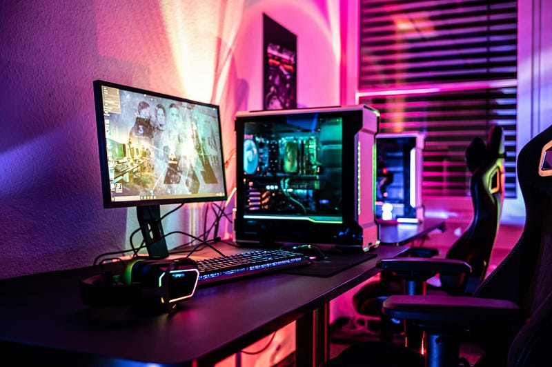
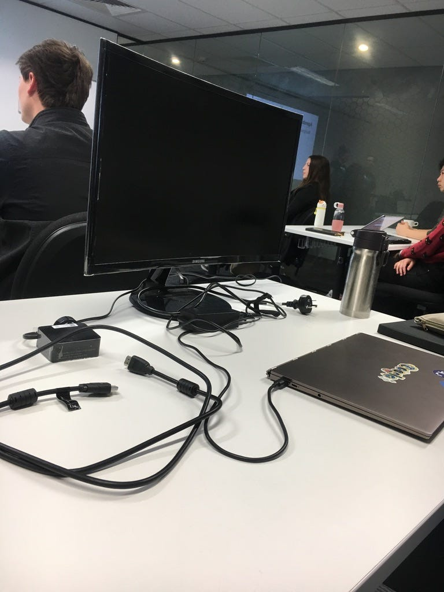
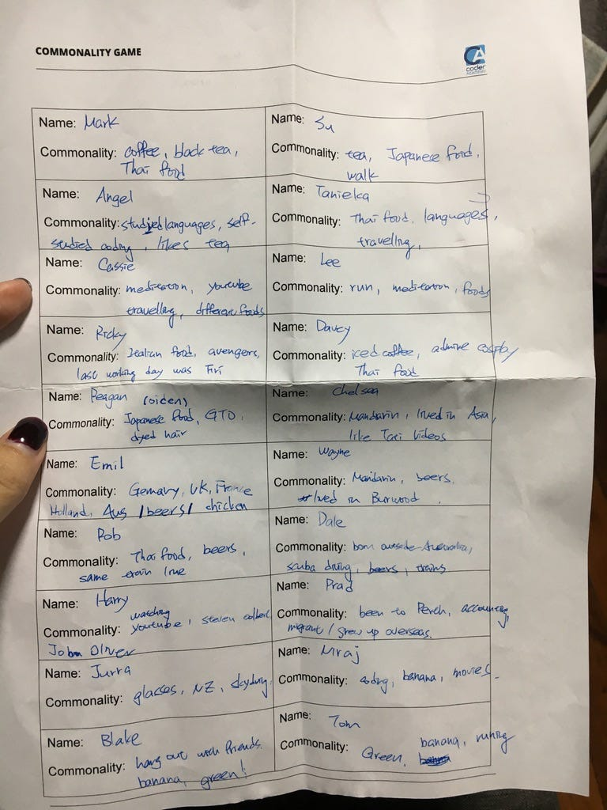
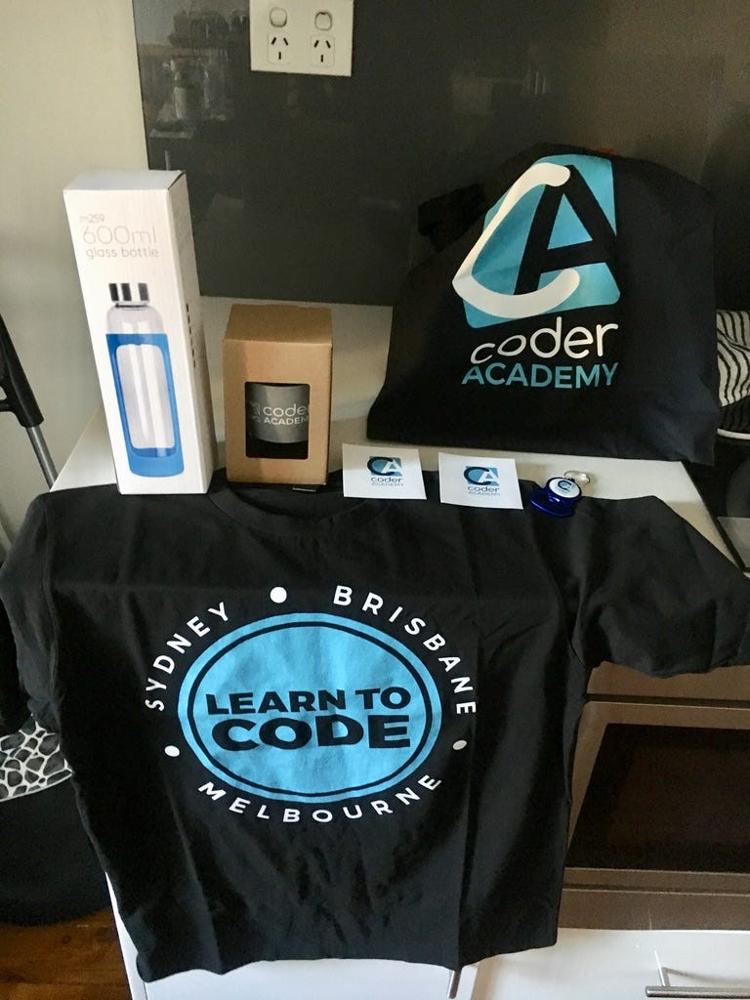

* * *

### 零基礎轉職澳洲工程師: 2019.08.19 Coding Bootcamp Orientation

Photo by [ELLA DON](https://unsplash.com/@elladon?utm_source=medium&utm_medium=referral) on [Unsplash](https://unsplash.com?utm_source=medium&utm_medium=referral)

非 Medium 付費會員，請前往方格子連結閱讀免費文章。當然如果你願意加入 Medium 付費會員來支持創作者，那就更棒囉～感謝你的閱讀！

[**零基礎轉職澳洲工程師: 2019.08.19 Coding Bootcamp Orientation | 澳洲雲端架構師 EC**  
 _這個系列我想要跟大家分享自己從零基礎轉職為工程師的心路歷程。從 2019 年在澳洲雪梨就讀 Coding Bootcamp 開始，到後來成功入職 Amazon 與微軟兩間科技大廠的求職經驗。我會介紹 Coding Bootcamp…_ vocus.cc](https://vocus.cc/article/6701132ffd89780001655e69)

* * *

### 緣起

不知不覺，EC 已經轉職成 DevOps 工程師一週年 (2023.08.14 是我的入職日)！天啊，真是值得可喜可賀，沒想到一個對 DevOps 零基礎的人，也可以成功拿到 offer 並在這份工作中存活下來，做中學真的是讓人進步最快的方式，一切都感激我的主管與同事的支持與幫忙，他們人都超級好～

我決定要開啟一個新系列「零基礎轉職澳洲工程師」來連載一下我從文組轉職工程師的轉職心路歷程，其中最重要的起點就是我在 2019 年在澳洲雪梨讀的 coding bootcamp。

### Coding Bootcamp 簡介

開始之前先來跟大家簡單介紹一下我當年讀的 coding bootcamp — [Coder Academy ](https://coderacademy.edu.au/web-development/bootcamp)(先說明一下，我是 2019 年讀的，之後的系列文分享都會以我當年的經驗為主，可能會跟現在很不一樣。如果你對於我的經驗有任何問題，都歡迎留言！我跟這個學校沒有任何利益合作關係，說不定在之後的系列文中我還會時不時吐槽他們XD)

  * 課程名稱：Full Stack Web Development Bootcamp (學 Ruby on Rails, JavaScript, HTML, CSS & MERN stack)
  * 時長：我當年讀的是六個月 full time (9am–5pm Monday-Friday) 的課程
  * 上課模式：雪梨校區現場教學 (當年還沒有 covid 這件事呢)，但是老師每堂課都會錄影放到 YouTube 上，所以如果請假或是當天上課沒聽懂，回家還可以看影片複習。
  * 費用：好像約澳幣兩萬 (時過境遷，我真的不太記得了)
  * 課程特色：課程結束後，學校會幫你媒合一個月的業界實習，很多學生基本上都是靠實習找到自己轉職後的第一份工作。在這六個月的課程內，我們會完成 4 個 projects，分別是：

  1. **個人 terminal 小遊戲** ，我當年做的是算生肖
  2. **個人 Portfolio Website** : 用純 vanilla JavaScript, CSS, HTML 刻的，當年的我們甚至不知道有 libraries 跟 frontend frameworks 可以用
  3. **個人 e-commerce website:** 用Ruby on Rails 寫，我當時做的是二手美妝品的網站
  4. **團體 full-stack project:** 這個要去外面找真實的顧客，針對他們的 business problem 跟需求，做出一個 business solution。我們當年的客戶是做房地產網站的，我們幫他們做了一個可以在 floor plan 上標註標籤跟附註的 solution。)

好的，以上落落長的前沿終於結束了，那就讓我們開始進入正文吧XD

* * *

### 2019.08.19 Coding Bootcamp Orientation

今天是 coding bootcamp 開始的第一天，跟我想像中完全不一樣XDD

一到學校就先被引導到廚房公共區，開始與同學交流 (small talks)，我人生真心最討厭 small talks 😭。好險我一眼就看到上週一起去參加 NSW governmetn hack 的緬甸女孩「蘇」，宅宅我立刻覺得安心了不少XD

大家聊了一下，時間一到就進了教室，蘇示意我她有特別想坐的位子，我才發現她居然帶了一個 20幾吋的外接螢幕來學校！！！這真的不會太威嗎XDD (Su 是一個個頭嬌小，講話很秀氣的女生。)

蘇自己帶來的螢幕

進了教室老師先簡單介紹了一下課程，接下來所有工作人員跟學生就開始自我介紹。我們這班大概 25 個學生，其中 6 個女生(女生比例頗低，上一屆好像有 9–10個人! 可見專門提供給女生的女性獎學金並沒有什麼實質效益XDD)，絕大部分都是土生土長雪梨人，剩下的幾個移民有:

  * 我 (台灣)
  * 緬甸同學「蘇」
  * 義大利「里奇」：義大利CS本科，在雪梨做 data analyst，也是之前和我與Su一起參加過活動的義大利小哥(未來的 EC：這個我之後會膩稱為里奇大哥的義大利小哥，之後將會變成我一個非常要好的朋友！我們後來甚至還不約而同從雪梨搬到布里斯本，現在也是時不時會見面的好朋友)
  * 尼泊爾「尼拉吉」：他是我見過英文最好的尼泊爾人! 而且他的自我介紹超好笑，他說「每當別人知道我來自尼泊爾，大家都會問我說你爬過喜瑪拉雅山嗎? 我必須很誠實地跟你們說，我從來沒爬過! 我甚至連 base camp 都沒去過XDD」
  * 俄羅斯「妮娜」：這位姊姊本來也是讀 CS，她就是那種你們刻板印象中的俄羅斯人，講話超級霸氣、臉上表情不多，一看就知道是一個狠人！(未來的 EC：我們在 bootcamp 的前五個月裡幾乎沒講到幾句話，但沒想到最後的final project 我跟她一組，抖！但我們就是因為一起做 final project 而變成很好的朋友！好到即便我後來搬到了坎培拉或布里斯本，只要我每次回去雪梨，我都會約她出來見面)
  * 埃及Emil: 這位先生的名字超像Email的啦XDDD
  * 一個十歲就移民過來的中國大哥「偉恩」：social 時發現中國大哥人還不錯(可能還沒發現我的政治立場?XD)，人超好笑的！中間我累到不行我們還用中文小聊了兩句哈哈

最特別的是，我們班有一個澳洲白人姐姐「雀爾喜」，在中國住過三年! 所以她也會講中文，我跟中國大哥和雀爾喜還用中文小聊了幾句XDD 然後在場沒有任何印度學生! (感覺跟雪梨的人口比例不太符合哈哈)

大家的背景相當多元(不過年齡層以20出頭的大學畢業生為主，我本來以為會來的都是 30–40 歲想轉職的人？)，很多人會樂器 (有一個做混音的，有一個昨天剛推出唱片的XD)、很多人會騎重機、很多人喜歡打遊戲(感覺身為一個宅宅，但卻不喜歡打遊戲的我，好不宅宅喔 LOL)。

中午學校提供了免費午餐，然後這時候當然要跟同學們繼續交流啊QAQ (聊到我又啞了一次)，下午開始玩一個要跟所有同學/老師/工作人員講話，尋找每個人跟你的三個共通點的破冰遊戲……我真心用盡我最後一絲力氣（內心不斷在想give me a breakkkkkkk!!!!），最後收集了22個人，我也算是盡力了吧LOL

破冰遊戲簡直要累死 I 人

第一天上課我比較有好感的同學有: 好學小夥伴蘇 (是一個bootcamp都還沒開始，就積極展開各式活動的人! 而且她想參加的活動多到她還做了一個excel sheet 哈哈哈)、第二次見面的好聊義大利里其大哥、會講中文人超級好的澳洲姐姐雀爾喜、超好笑的中國大哥偉恩、剛發吉他專輯的澳籍菲律賓裔小弟雷根 (未來的 EC：這位小哥是我們 bootcamp 的 coding 神童！！！他後來去了 HelloFresh 跟 Atlassian)~ 來看看我心目中這份喜歡的人類名單會不會維持下去XDDD

今日(有夠令人崩潰的)流程：

  * 跟同學在廚房交流區 social (約 15 分鐘)
  * 課堂上全員自我介紹 (應該花了半小時)
  * 中間有兩次 30 分鐘的休息時間 — 繼續跟同學 social
  * 一小時午餐時間 — 繼續跟同學 social
  * 下午玩破冰遊戲 (1.5–2小時 social)

今天真心跟陌生人講的話快比我過去半年來的多ＱＡＱ（我都已經感冒了，大家可以不要再逼我了嗎？哭！）

下面是今天獲得的贈品，有一個冷水壺/咖啡杯/提袋/t-shirt/兩張貼紙/開瓶器鑰匙圈 (友人 Clair 表示: 看起來有種宅宅的感覺XD)

上課第一天的 swags

今天下午上課在講 self-branding，我真心覺得我來錯地方了，這麼需要social、需要self-marketing 的地方，不是我想要去的地方啊LOL 我要是這麼喜歡與人交流或講屁話，我就不會來做 IT 了啊QAQ (未來的 EC：嗯，結果後來我發現在澳洲科技業/西方職場，self-branding 就是一切，尤其是在 Tier 1 公司如 Amazon、微軟更是如此)

真心希望這只是一時的，不然我辭去穩定的工作來讀 bootcamp 真心會是我人生最大的錯誤XDDD

* * *

**如果你喜歡海外生活、澳洲職場、文組轉職工程師的相關文章，歡迎按下「拍手」給我鼓勵 (喜歡的話請多拍幾次！)。同時記得「**[**按此訂閱我的Medium部落格**](https://medium.com/@cloudarchitectec/subscribe)**」，這樣你就不會錯過我的更新囉～**

**需要職涯導師嗎？澳洲雲端架構師 EC 提供轉職工程師、澳洲求職、移民生活等全方位諮詢服務。**[**現在就填寫線上 1:1 諮詢預約表單，開啟你的職涯新篇章!**](https://docs.google.com/forms/d/e/1FAIpQLSeWoo4ZVLNc6IQc76nRU29ydr2T9vUJrlNgX5fFrkqiOT-K3g/viewform)

**如果想要進一步支持 EC，歡迎透過以下連結請我喝杯咖啡！你們的支持是我持續創作的動力，如有任何問題或是想要看的主題，歡迎留言與我互動 :)**

  * **歡迎追蹤 Facebook**[**澳洲雲端架構師 EC 臉書粉專**](https://www.facebook.com/cloudarchitectec)
  * **歡迎追蹤 Threads**[**Cloud Architect EC**](https://www.threads.net/@cloud_architect_ec)
  * **合作請聯繫:**[**cloudarchitectec@gmail.com**](mailto:cloudarchitectec@gmail.com)

