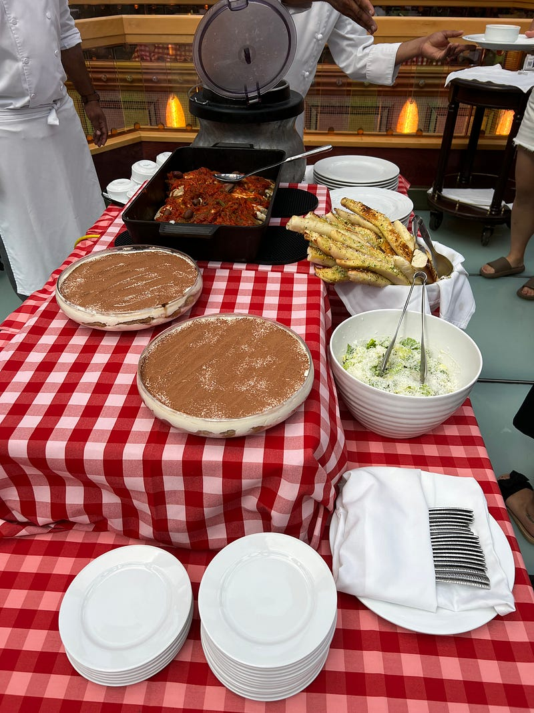
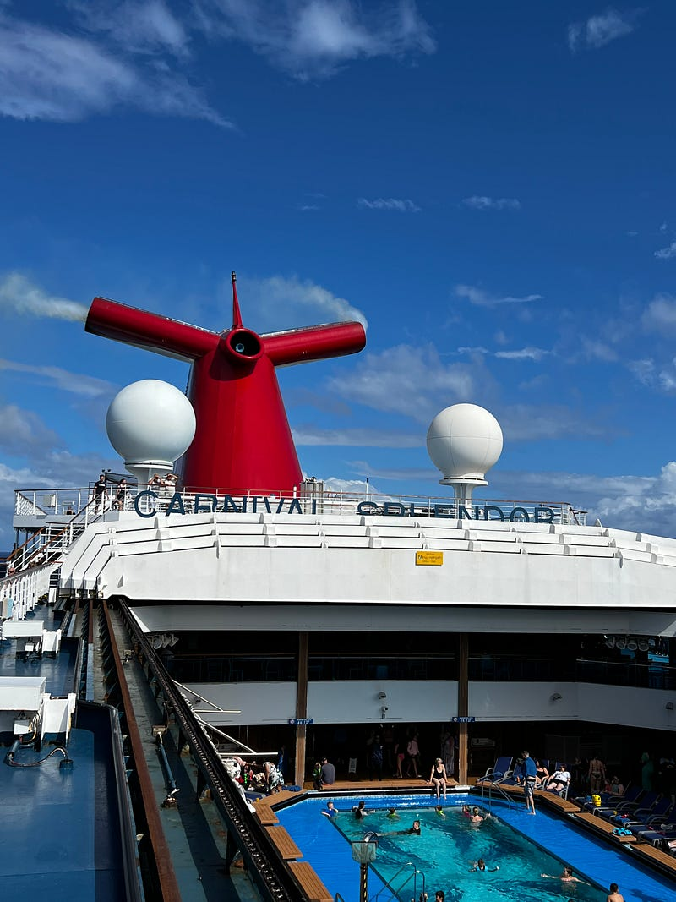
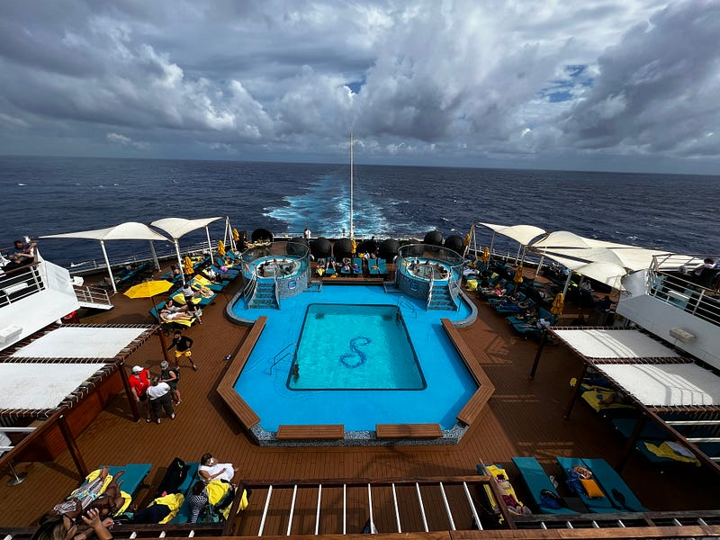
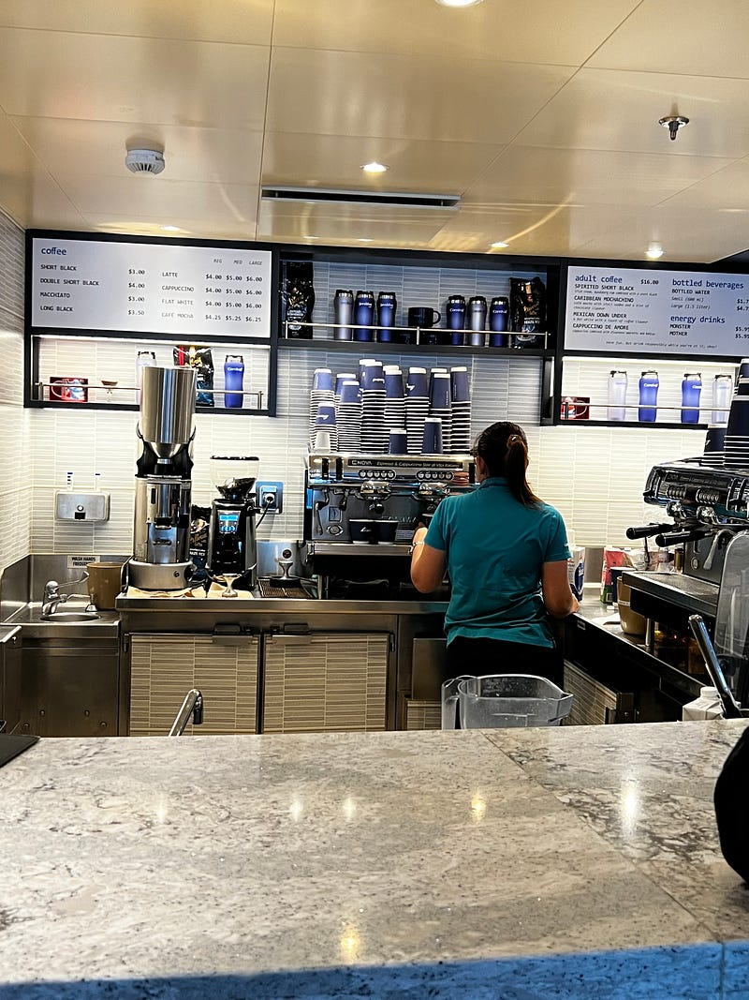
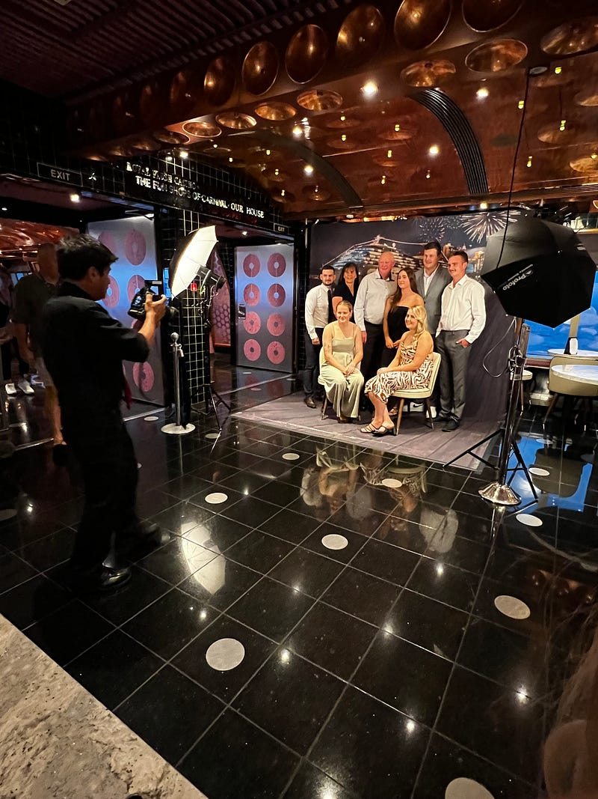
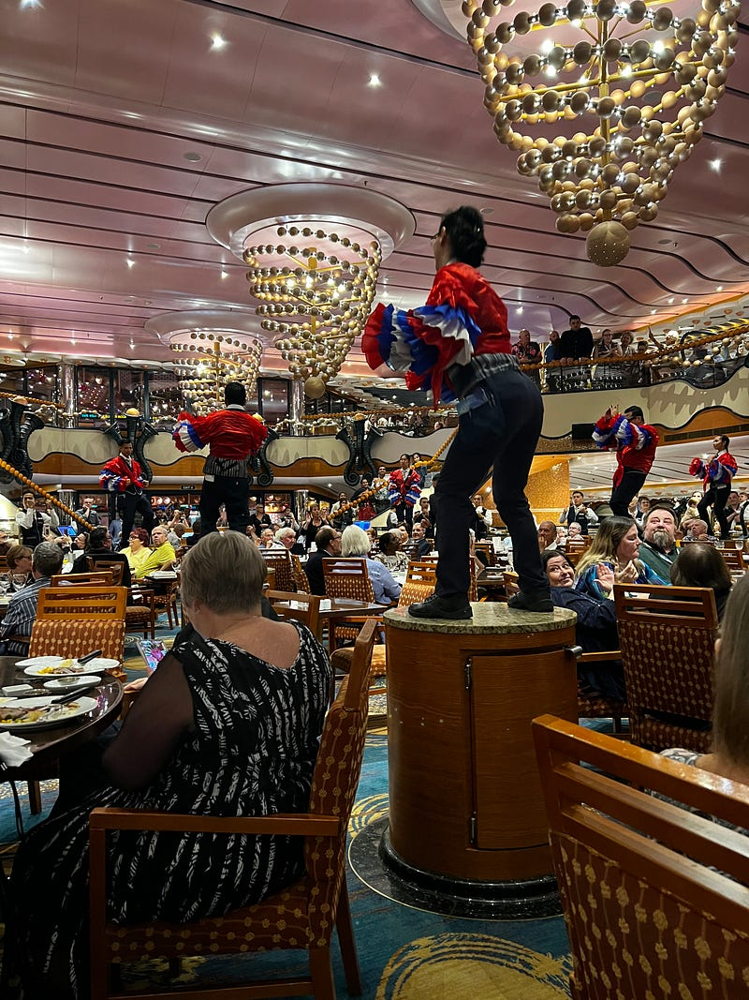

* * *

### [旅遊] 2023.05.17 Carnival Splendor 澳洲南太平洋郵輪 — Day 3 Sea Day 2

可能是隻恐龍吧?XD

非 Medium 付費會員，請[點此免費閱讀這篇文章](https://medium.com/@cloudarchitectec/%E6%97%85%E9%81%8A-2023-05-17-carnival-splendor-%E6%BE%B3%E6%B4%B2%E5%8D%97%E5%A4%AA%E5%B9%B3%E6%B4%8B%E9%83%B5%E8%BC%AA-day-3-sea-day-2-fd37273abd58?source=friends_link&sk=144b8379e27df07c117d8c38db8a5a78)！當然如果你願意加入 Medium 付費會員來支持創作者，那就更棒囉～感謝你的閱讀！

* * *

今天是第二天 sea day，遊輪持續前進中，我們進入了下一個時區，所以遊輪工作人員提醒我們記得要手動把時間往前調一個小時(因為海上沒訊號，所以手機不會自動調整)。

**義大利麵烹飪課 $45pp**

 事前準備

今天的第一個行程是製作義大利麵，我們跟著遊輪的餐廳主廚(其他廚師也會在一旁指導)，一起做了條狀義大利麵(不是spaghetti) 跟義大利麵 (ravioli)，非常有趣！

完成品

做完之後餐廳會直接把你自己做好的義大利麵餃現煮給你品嚐(我選擇了青醬)，除此之外這個課程還包含了午餐(沙拉、大蒜麵包、魚排、提拉米蘇)，我個人覺得非常值得，因為在外面上烹飪課少說也要$100，這個還包了午餐!

午餐

**甲板**

吃完午餐後，今天的天氣總算好一點了，於是我們跑到甲板拍照。

九樓: mid deck九樓: aft deck

**咖啡**

回程看見咖啡廳沒人，順便買了一杯 barista coffee，結果超難喝哈哈哈哈 (雖然說$4這個價錢沒有很貴，但這個咖啡品質我真的不行lol 剛好把以後每天的咖啡錢都省下來了哈哈)

五樓: 咖啡廳

**Formal night**

今天我們終於迎來遊輪的第一個主題之夜「Formal Night」，大家都換上正式服裝，準備拍照。

遊輪上設置了很多虛擬背景的攝影棚，之前通常都沒有人去拍，但今天可能著正式服裝的人多了，每個攝影棚都在排隊。攝影師會幫忙指導動作，但他們有些指示還滿奇妙的XD

照片隔天會洗出來放在四樓的照片牆區，如果滿意的話，乘客可以花錢購買照片，一張約$35。不滿意的照片可以丟在回收桶。注意這裡的照片是不能翻拍的。

其他遊客的家族照

**晚餐：舞蹈表演**

今天的晚餐我們還是坐在316桌，今天總算船平穩了一點(前幾天因為浪太大，所以這個表演取消了)，於是有服務生站上桌子的表演，還滿嗨的。底下的服務生也會跟著一起跳~

餐廳服務生的舞蹈表演

明天終於要開始小島行程了，期待!!!

—

如果你喜歡閱讀海外生活、澳洲職場、轉職工程師的相關文章，歡迎追蹤我的 Medium 部落格，這樣你就不會錯過我每週六的固定更新！近期我也會不定期更新我在澳洲旅遊的遊記 ^0^

也麻煩大家多多幫我推廣給你們的親朋好友，或是任何你們覺得這篇文章會對他們有所幫助的人！你們的鼓勵是支持我繼續寫作下去的動力 :)

有任何問題或是想要看的主題，歡迎留言跟我互動 :)

**延伸閱讀**

  * [[旅遊] 2023.05.16 Carnival Splendor 澳洲南太平洋郵輪 — Day 2 Sea Day 1](https://medium.com/@cloudarchitectec/旅遊-2023-05-16-carnival-splendor-澳洲南太平洋郵輪-day-2-sea-day-1-77c20aea9c2d)
  * [[旅遊] 2023.05.15 Carnival Splendor 澳洲南太平洋郵輪 — Day 1 雪梨登船](https://medium.com/@cloudarchitectec/旅遊-2023-05-15-carnival-splendor-澳洲南太平洋郵輪-day-1-雪梨登船-fd3e84083d62)
  * [[旅遊] Carnival Splendor 澳洲南太平洋郵輪 — 事前準備及須知 (2023.05出發)](https://medium.com/@cloudarchitectec/旅遊-carnival-splendor-澳洲南太平洋郵輪-事前準備及須知-2023-05出發-b7ee58cf7bc4)
  * [[介紹] 大家好，我是EC!](https://medium.com/@cloudarchitectec/介紹-大家好-我是ec-afcf45d128eb)
  * [[生活]澳洲首次買房流程分享](https://medium.com/@cloudarchitectec/生活-澳洲首次買房流程分享-2021-5bd28c444bfb)

