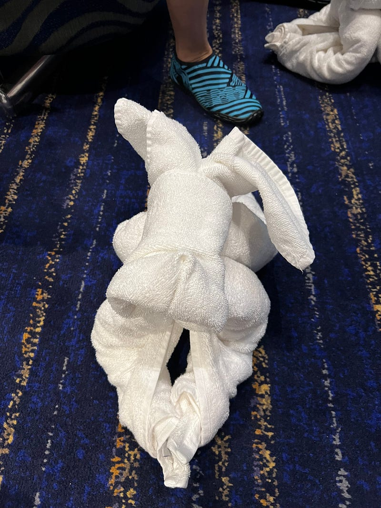
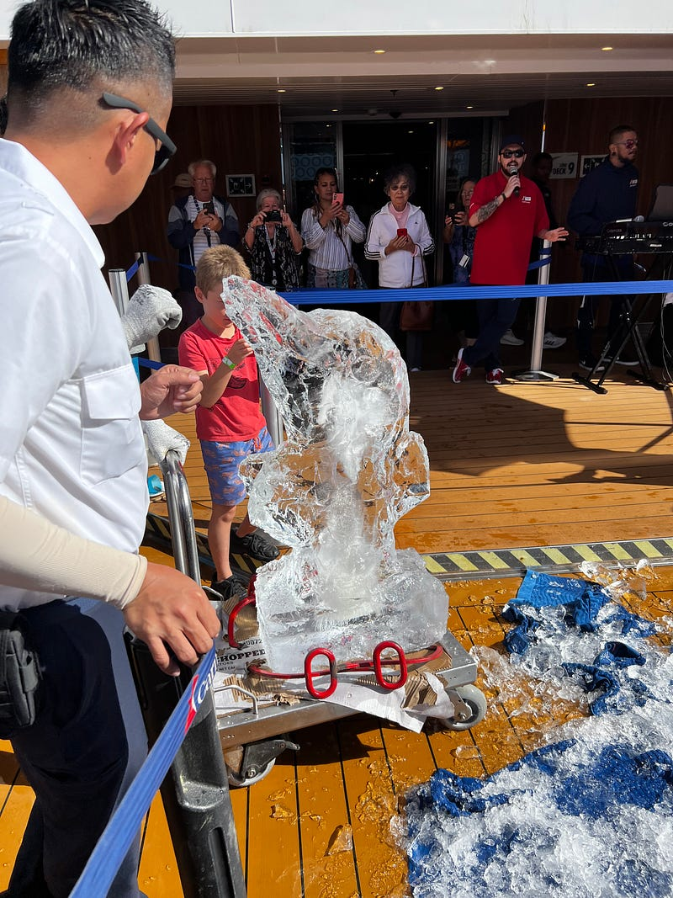
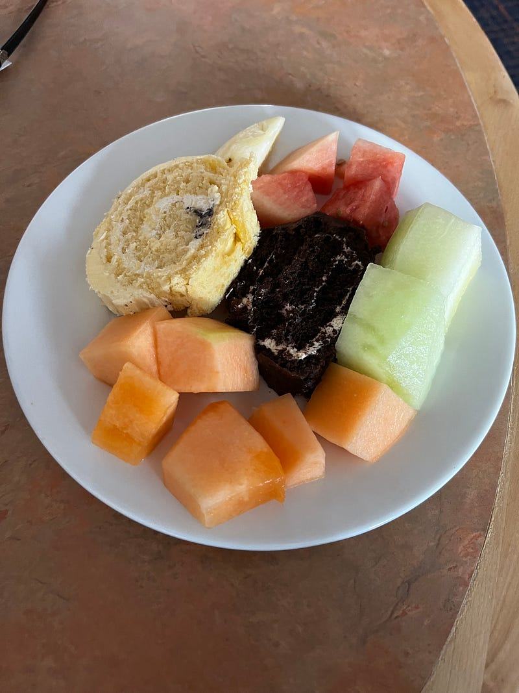
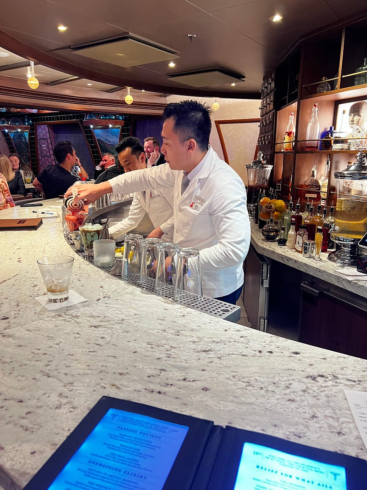
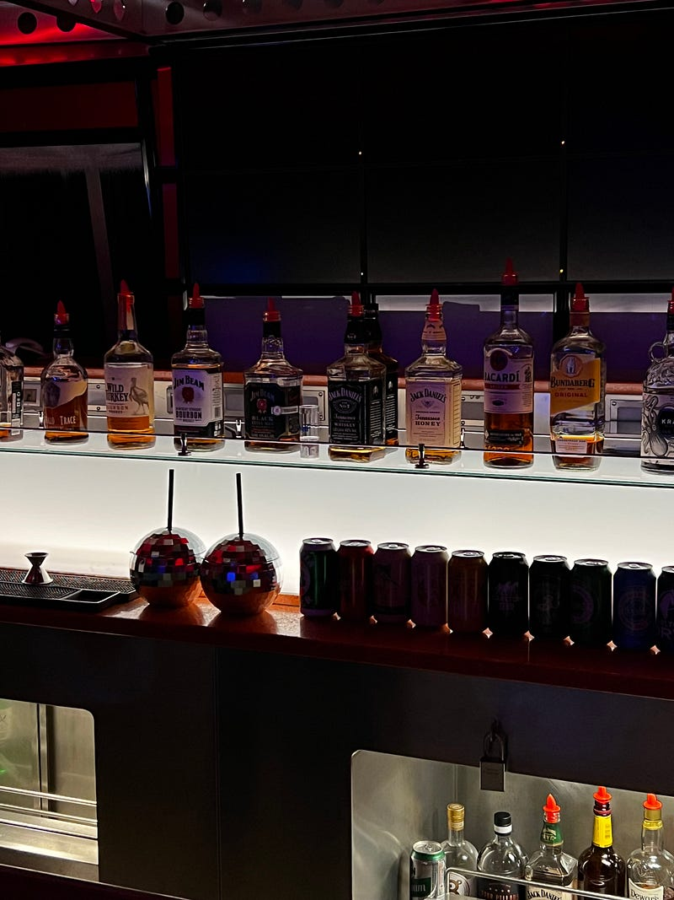

* * *

### [旅遊] 2023.05.22 Carnival Splendor 澳洲南太平洋郵輪 — Day 8 Sea Day 3

Photo by [Adam Gonzales](https://unsplash.com/@adamgonzales?utm_source=medium&utm_medium=referral) on [Unsplash](https://unsplash.com?utm_source=medium&utm_medium=referral)

非 Medium 付費會員，請[點此免費閱讀這篇文章](https://medium.com/@cloudarchitectec/%E6%97%85%E9%81%8A-2023-05-22-carnival-splendor-%E6%BE%B3%E6%B4%B2%E5%8D%97%E5%A4%AA%E5%B9%B3%E6%B4%8B%E9%83%B5%E8%BC%AA-day-8-sea-day-3-614ba584616d?source=friends_link&sk=be26e425a85aa33ec44c70630be59d06)！當然如果你願意加入 Medium 付費會員來支持創作者，那就更棒囉～感謝你的閱讀！

* * *

今天我們完全大睡特睡到10點。稍微整理了一下，我出門去參加10:30的折毛巾教學。

### 折毛巾教學

我們先後折了小狗、大象跟恐龍，坐在我後面的杯杯人超好，不斷提供我指示(他自己沒有在折)，最後還幫我拍照，算是一個很有趣的體驗。船上也有販賣毛巾教學故事書，一本$17，我覺得還滿有趣的。

我折的毛巾小狗，還滿成功的吧XD

### 藍色圓球休息區

接著去吃了早餐，然後借了兩條海灘巾，找了一個藍色圓球準備在那邊悠閒得讀書休息，可是風好大又好冷，一點都沒有享受的感覺

甲板上的藍色圓球休息區

覺得有點可惜，要是天氣再熱一點就好了！五月的郵輪真的不太適合怕冷的我，只要不在房間的時間(房間的空調可以自己調溫度)，我大概有50%的時間都覺得很冷哈哈哈

### 冰雕秀

接著去看冰雕秀，一開始真的很像是烏龜，最後才發現他們雕的是海豚XD

冰雕海豚

因為太晚吃早餐了，中午一點也不餓，不過中午的甜點是各種口味的現切瑞士捲，於是忍不住拿了一些甜點跟水果回房間。

現切瑞士捲與水果

今天晚上是第二個 formal night，我們跟泰國情侶約了一起拍照，但是Nan 暈船暈得非常嚴重，感覺每個場景他拍一張照就快不行了。因為他們的房間在一樓，據說超級晃，所以他好像也沒辦法回房間休息，感覺真是太可憐了。

### Piano Bar

今晚第一次體驗了 piano bar，其實氣氛還是不錯的，跟泰國情侶聊的很開心！鋼琴酒吧的觀眾可以自由點歌，但觀眾要求彈的歌都太老了，我幾乎都沒聽過！而且駐唱歌手感覺特別喜歡唱一些逗趣的歌，我個人沒有太喜歡這種風格，不過觀眾非常嗨就是了。

### Alchemy Bar

今天還試了 alchemy bar 的調酒，我覺得雖然比其他酒吧貴個$3–4，但是酒真的比較好喝

酒保會穿上實驗室的服裝! 他們的酒單還會發光，超酷

### 郵輪夜店 Red Carpet

最後去了遊輪上的夜店 red carpet，嗯音樂真的不怎麼樣哈哈哈哈。倒是播了幾首夜店經典歌

夜店的 bar

—

如果你喜歡閱讀海外生活、澳洲職場、轉職工程師的相關文章，歡迎追蹤我的 Medium 部落格，這樣你就不會錯過我每週六的固定更新！近期我也會不定期更新我在澳洲旅遊的遊記 ^0^

也麻煩大家多多幫我推廣給你們的親朋好友，或是任何你們覺得這篇文章會對他們有所幫助的人！你們的鼓勵是支持我繼續寫作下去的動力 :)

有任何問題或是想要看的主題，歡迎留言跟我互動 :)

**延伸閱讀**

  * [[旅遊] 2023.05.21 Carnival Splendor 澳洲南太平洋郵輪 — Day 7 Signal Island (New Caledonia)](https://medium.com/@cloudarchitectec/%E6%97%85%E9%81%8A-2023-05-21-carnival-splendor-%E6%BE%B3%E6%B4%B2%E5%8D%97%E5%A4%AA%E5%B9%B3%E6%B4%8B%E9%83%B5%E8%BC%AA-day-7-signal-island-new-caledonia-3c5a3f9160ee)
  * [[旅遊] 2023.05.20 Carnival Splendor 澳洲南太平洋郵輪 — Day 6 Mystery Island (Vanuatu)](https://medium.com/@cloudarchitectec/%E6%97%85%E9%81%8A-2023-05-20-carnival-splendor-%E6%BE%B3%E6%B4%B2%E5%8D%97%E5%A4%AA%E5%B9%B3%E6%B4%8B%E9%83%B5%E8%BC%AA-day-6-mystery-island-vanuatu-9ef28cfc136)
  * [[旅遊] 2023.05.19 Carnival Splendor 澳洲南太平洋郵輪 — Day 5 Lifou (New Caledonia)](https://medium.com/@cloudarchitectec/%E6%97%85%E9%81%8A-2023-05-19-carnival-splendor-%E6%BE%B3%E6%B4%B2%E5%8D%97%E5%A4%AA%E5%B9%B3%E6%B4%8B%E9%83%B5%E8%BC%AA-day-5-lifou-new-caledonia-8fd47f2e4301)
  * [[旅遊] 2023.05.18 Carnival Splendor 澳洲南太平洋郵輪 — Day 4 Noumea (New Caledonia)](https://medium.com/@cloudarchitectec/%E6%97%85%E9%81%8A-2023-05-18-carnival-splendor-%E6%BE%B3%E6%B4%B2%E5%8D%97%E5%A4%AA%E5%B9%B3%E6%B4%8B%E9%83%B5%E8%BC%AA-day-4-noumea-new-caledonia-19c06631cb44)
  * [[介紹] 大家好，我是EC!](https://medium.com/@cloudarchitectec/%E4%BB%8B%E7%B4%B9-%E5%A4%A7%E5%AE%B6%E5%A5%BD-%E6%88%91%E6%98%AFec-afcf45d128eb)

