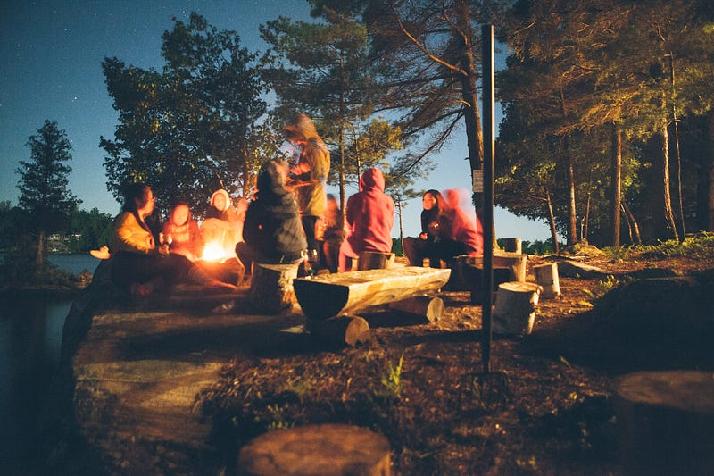
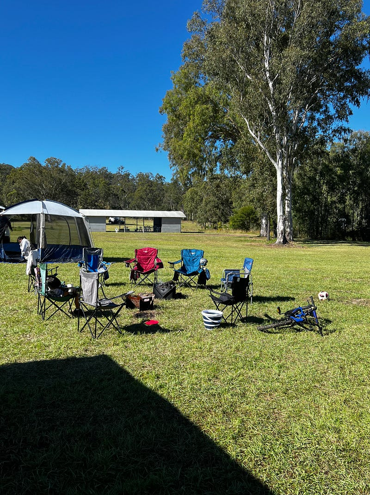
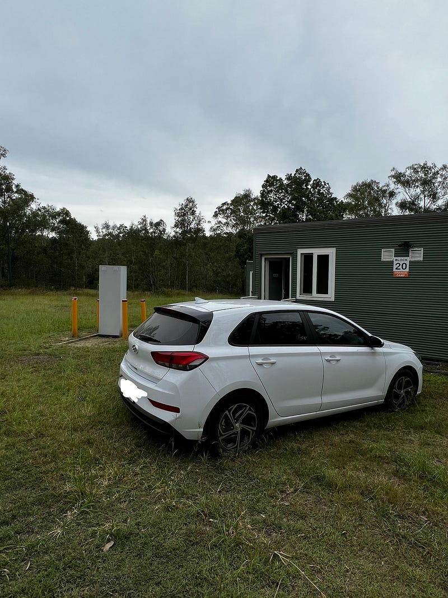
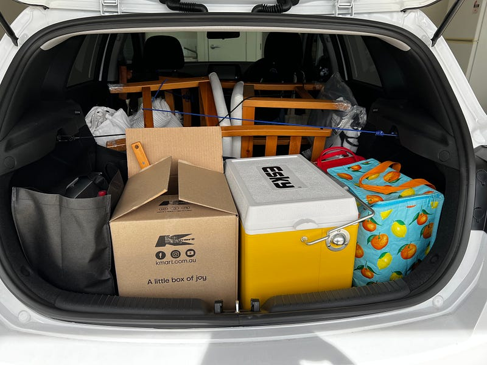
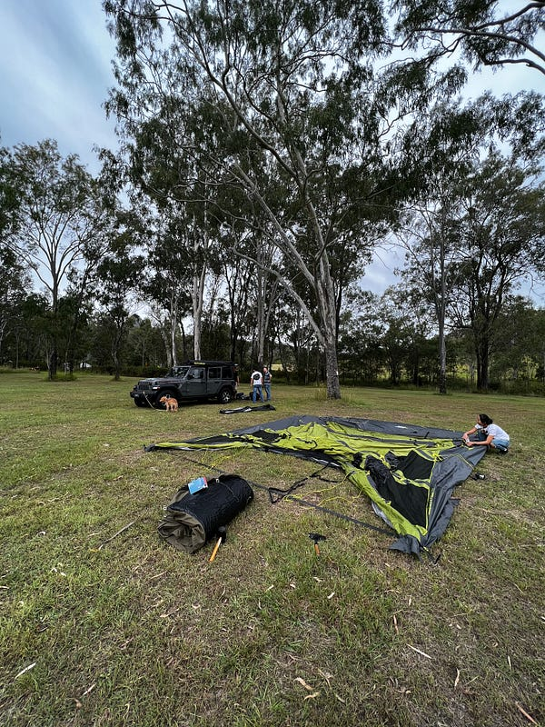
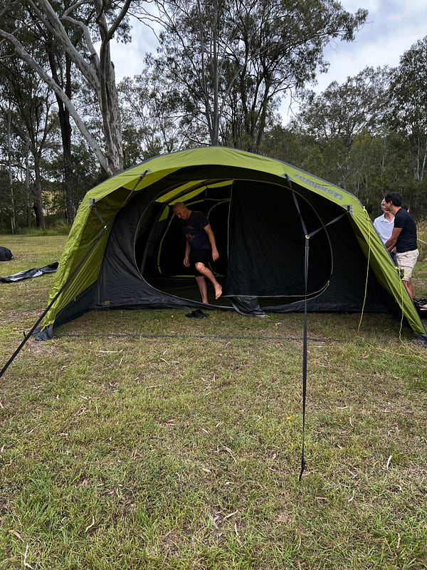
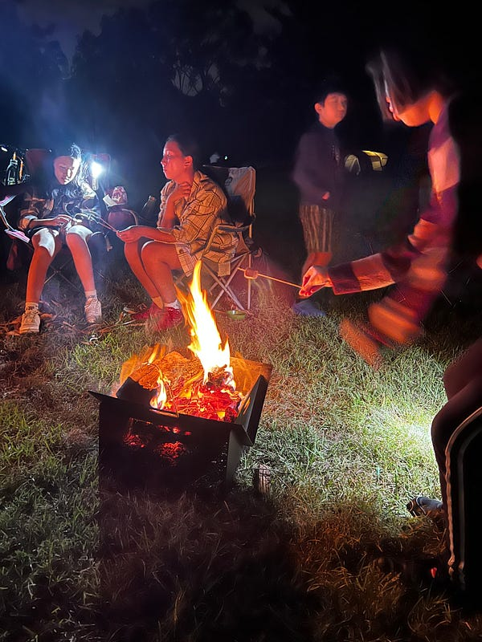
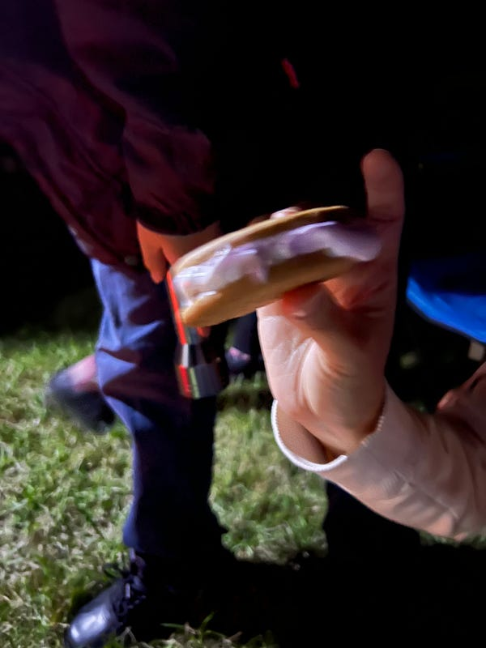
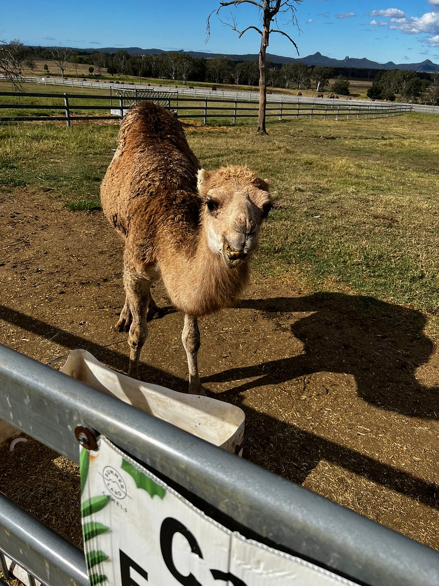
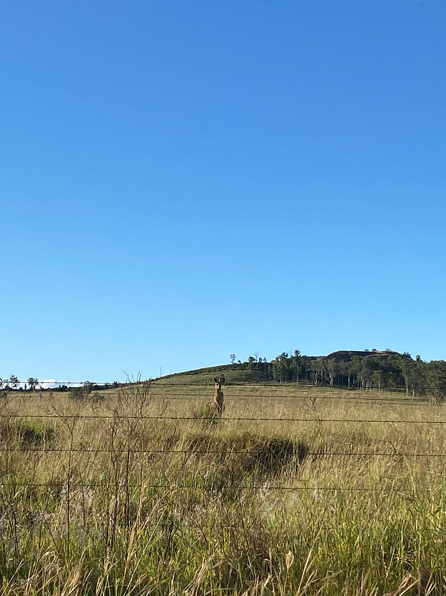

* * *

### 澳洲布里斯本：人生第一次露營就上手？Ivory’s Rock 露營初體驗

Photo by [Tegan Mierle](https://unsplash.com/@tegan?utm_source=medium&utm_medium=referral) on [Unsplash](https://unsplash.com?utm_source=medium&utm_medium=referral)

應前微軟同事 JJ 之邀 (不是唱歌的那位，雖然他自己也是帶著個人麥克風在營地狂唱！而且身為一個中國人還會唱「愛拼才會贏」，我真心是在現場狂笑不已XDDDD)，我跟室友 C 首次嘗試了澳洲露營😆

營地是距離我們家開車約1.5小時，在布里斯本西南邊的 Ivory’s Rocks: <https://www.ivorysrock.org.au/>

營地一角

由於我們不想在還沒有確定自己是否喜歡露營前投資太多設備，所以沒有買帳篷，而是選擇住貨櫃屋(cabin)裡。

小屋與我的 i30

瓦斯爐跟冰桶(esky)都是跟朋友借的，就連露營椅我們也是硬是不買，而是改帶著我們家的兩把餐桌椅 (dining chairs)出發，簡直是機智到一個極致😆

塞滿滿的後車廂跟兩把餐桌椅

這是一個超級大的華人露營團，加起來大概有20–30個人，還有各種年紀的大小朋友(小朋友基本上都是移民二代，完全都是英文溝通)。在這趟旅程中也觀察到不同家庭的教育方式，以及體會到移民一代與二代之間微妙的家庭關係，覺得很有趣。

同行友人的其中一個豪華帳篷，還有人開露營車來

露營少不了營火跟烤棉花糖！

我們就靠著我們的 s’more 工廠，成功成為小朋友們最愛的阿姨😆(s’more 是美國人最愛的露營點心，作法是在一片 grain cracker 上放上一片巧克力，然後把烤過的棉花糖放上去，用棉花糖的熱度來融化巧克力，最後再放上一片grain cracker 夾起來)，超級好吃😋😋😋

營火以及受到小朋友喜愛的 s’more

第二天我們還開車半小時去附近的駱駝農場（這裡的駱駝是可以買回去當寵物的喔😆），吃了駱奶冰淇淋與拿鐵，偷偷說，駱奶單喝起來是一種加了鹽的羊奶味😆 然後跟JJ一家人去爬山健行！真的是非常有趣又豐富的行程～

駱駝的睫毛真心長！

對了，差點忘了說，從駱駝農場回來的路上，室友 C 看到路旁的草叢裡有野生袋鼠，於是我就把車速放慢觀察他們（當時路上只有我一台車，所以即使把車停在路中間也沒問題），沒想道袋鼠本來在旁邊跳著跳著，突然就往我們的方向跳過來，然後就在我的車子前穿越了馬路😆😆😆

就是這隻袋鼠！他在路旁跟我們遠遠相望了一下，然後就決定跳過鐵絲網，路過我的車前

他們真心沒有在怕車子的哈哈哈哈！然後我也終於達成了在澳洲開車看著袋鼠經過我車前的成就🦘（好可惜我的車當時還沒有安裝行車記錄器，不然就可以分享影片給大家了😆)

* * *

**如果你喜歡海外生活、澳洲職場、文組轉職工程師的相關文章，記得「**[**按此訂閱我的Medium部落格**](https://medium.com/@cloudarchitectec/subscribe)**」，這樣你就不會錯過我的更新囉～**

**需要職涯導師嗎？澳洲雲端架構師 EC 提供轉職工程師、澳洲求職、移民生活等全方位諮詢服務。想進一步了解諮詢細節，請點擊**[**< <澳洲雲端架師 EC：專為轉職者量身打造的職涯諮詢｜海外職場×履歷優化 × 面試攻略 × DevOps /雲端職涯>>**](https://medium.com/@cloudarchitectec/career-consultation-services-943c23bea3e7)**，開啟你的職涯新篇章!**

**如果想要進一步支持 EC，歡迎透過以下連結請我喝杯咖啡！你們的支持是我持續創作的動力，如有任何問題或是想要看的主題，歡迎留言與我互動 :)**

  * **歡迎追蹤 Facebook**[**澳洲雲端架構師 EC 臉書粉專**](https://www.facebook.com/cloudarchitectec)
  * **歡迎追蹤 Threads**[**Cloud Architect EC**](https://www.threads.net/@cloud_architect_ec)
  * **合作請聯繫:**[**cloudarchitectec@gmail.com**](mailto:cloudarchitectec@gmail.com)

