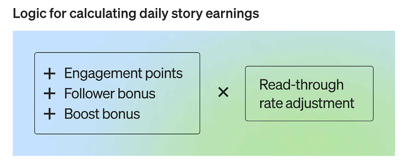
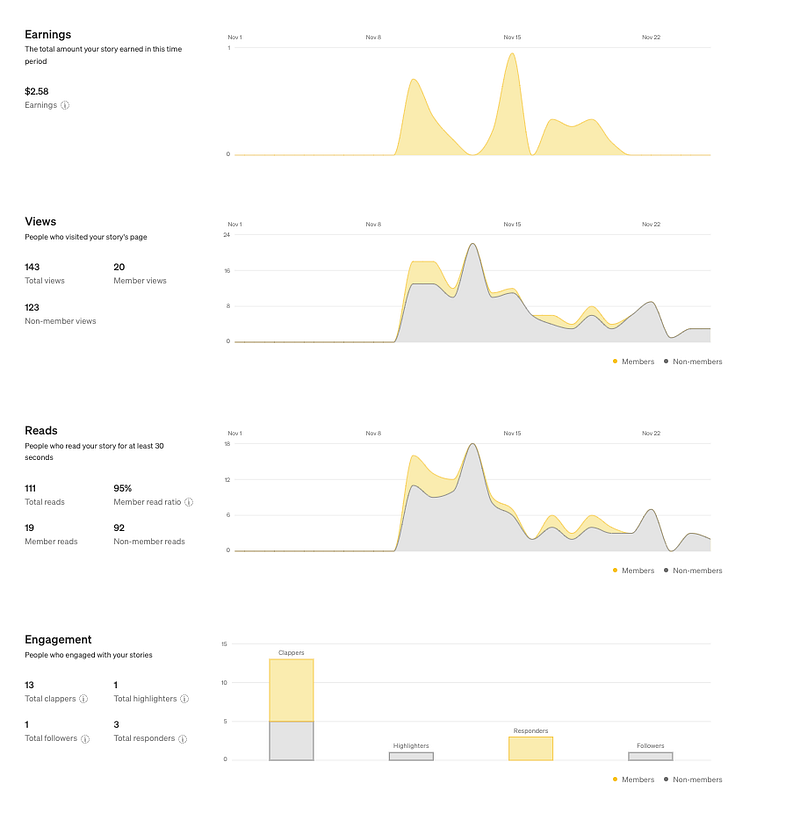
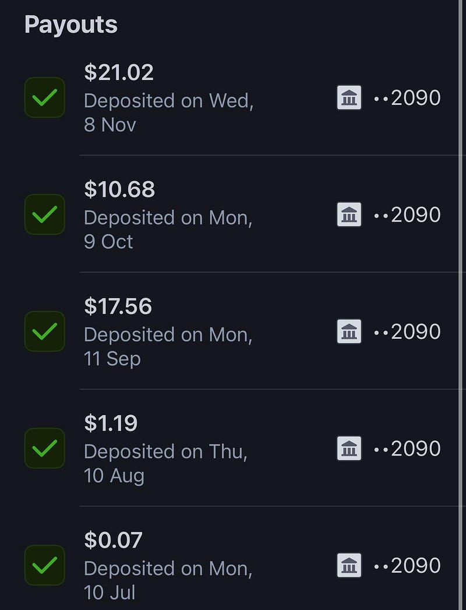
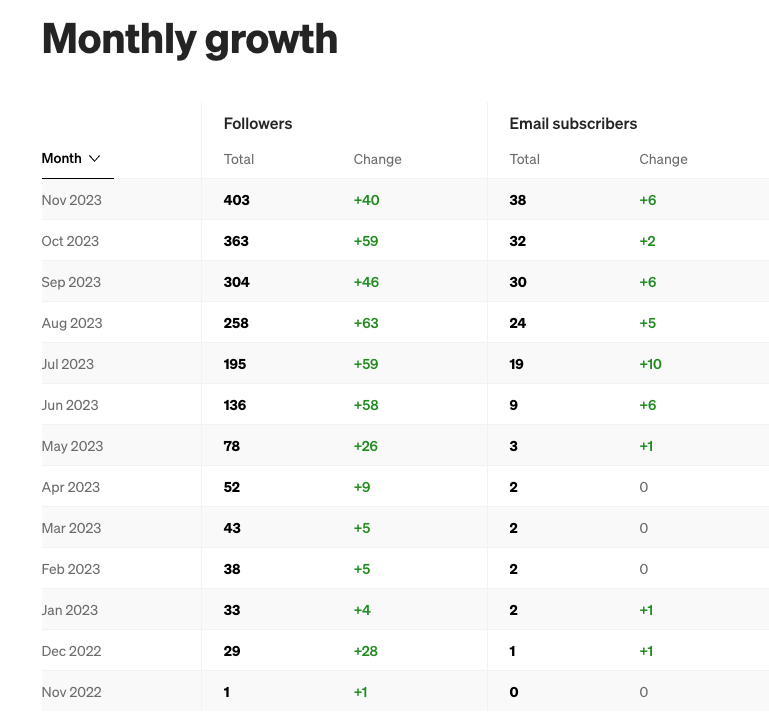
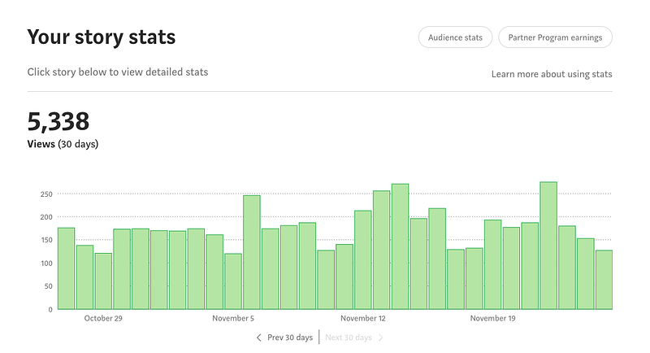

* * *

### 經營 Medium 一年，我到底賺了多少錢？

Photo by [Ian Schneider](https://unsplash.com/@goian?utm_source=medium&utm_medium=referral) on [Unsplash](https://unsplash.com?utm_source=medium&utm_medium=referral)

### 來賓請掌聲鼓勵鼓勵

2022.11.19 是我發表第一篇 Medium 文章的日子！當時我幫自己設定了一個小小的目標，也就是我希望自己能每一週至少發表一篇文章並持續寫作一年！

今天是 2023.11.25，我目前已經在 Medium 上發表了 91 篇文章！所以我可以很自豪地說，我不僅達成了我一年前設下的目標，甚至發表了幾乎是當初預期的兩倍的文章，我覺得自己真是太棒了～～～

不知不覺 2023 年也即將進入倒數計時，如果你在今年也達成了什麼個人目標，歡迎留言跟我分享！

如果你好奇我都寫了一些什麼文章都寫了什麼，歡迎參考以下這篇文章列表，根據你有興趣的主體來閱讀：

* * *

[**[目錄] 雲端架構師 EC — Medium 文章列表**  
 _這是澳洲雲端架構師 EC 的 Medium 目錄，方便大家搜尋我發表過的文章。如果有對哪個類別的文章特別有興趣，也歡迎留言跟我說喔 ^^_ medium.com](https://medium.com/@cloudarchitectec/%E7%9B%AE%E9%8C%84-%E9%9B%B2%E7%AB%AF%E6%9E%B6%E6%A7%8B%E5%B8%AB-ec-medium-%E6%96%87%E7%AB%A0%E5%88%97%E8%A1%A8-2023-06-03-%E6%9B%B4%E6%96%B0-76c1ed3b871d)

今天我想要來跟大家分享如何成為 Medium 作者，靠著分享你的知識、心得、對世界的觀察來賺錢呢？

另外我也會公布我這一年來靠著 Medium 寫作獲得的斜槓收入！先說好，我的 Medium 收入真的是微乎其微，所以如果你想要知道如何靠 Medium 賺大錢，這篇文章可能幫不了你XD

但如果你好奇的是如何成為 Medium 作者、Medium 文章收入的計算方式以及我經營Medium 一年的心得，那就請繼續看下去吧！

> 小提醒：Medium 的規定隨時都有可能會變動，我自己就經歷過好幾次，以下資訊以 2023.11 月公布的資訊為主。大家如果有疑問，還請查閱 Medium 的官方規定。

### 如何成為 Medium 收費作者（也就是加入所謂的 Medium Partner Program）

我在 2022 年加入 Medium 時，即使只是一般 Medium 會員，而不是 Medium 付費會員，只要滿足以下兩個條件就能申請加入 Medium Partner Program (加入後你才能選擇是否要把自己發表的文章設定為付費閱讀，才能開始從 Medium 賺取收入)：

  * 在過去六個月內至少在 Medium 上發表過一篇文章
  * 必須要有至少 100 個 followers

也就是除了寫作的時間成本之外，我並不需要投入其他額外的金錢成本，就能開始賺稿費。不過我還是必須先累積一定的粉絲人數才行，所以雖然我 2022.11 就開始寫作了，但我在 2023.06.23 才符合條件正式加入 Medium Partner Program。

不過今天寫這篇文章才發現，原來 Medium 的規定又改了！難怪我不斷看到中文創作者選擇搬家離開 Medium XD

  1. **加入 Medium 付費會員 (2023.07.19 新規定)**

加入 Medium 付費會員的費用是一個月 5 美元或是一年 50 美元 (其實不太便宜XD)。加入付費會員後可以享有[這些好處](https://help.medium.com/hc/en-us/articles/115004545567-Become-a-member#:~:text=Medium%20Memberships%20are%20%245%2Fmonth%20or%20%2450%2Fyear)(剛剛查了一下居然沒有中文版的說明，我覺得 Medium 對於中文社群真的很不友善！)

付費跟免費最大的差別是，Medium 免費會員一個月最多只能免費閱讀三篇「付費」文章(免費文章不受此限制，可以盡情閱讀)，Medium 付費會員可以無限制閱讀付費文章，我覺得對於輕量閱讀的 Medium 讀者影響其實不大，除此之外就沒有什麼特別吸引人之處了，難怪有很多人都不加入付費會員🤣

我自己是成為 Medium 創作者後，才決定要加入 Medium 付費會員的，主要是因為我想要支持在 Medium 上的創作者。

Medium 2023.07 月調整作者收入的計算方式後，讀者是否為Medium 付費會員，對作者的收入影響很大，這點文章下面會再進一步解釋。簡單來說，如果你不是 Medium 付費會員，當你閱讀文章或拍手時，你喜歡的作者其實沒有辦法獲得任何收入XDDD

**2\. 在過去六個月內至少在 Medium 上發表過一篇文章**

**3\. 位於 Medium Partner Program 支持的國家 (2023.07.19 新規定)**

我知道因為地區限制的關係，有一段時間台灣的作者是沒有辦法透過 Medium Partner Program 獲得收入的，或是說要登記帳號的手續非常複雜，不知道現在的情況是否改善了？

我在 2023.07 加入時，過程其實滿簡單的，不過我人在澳洲，而且提供的是澳洲的銀行帳戶。

**4\. 年滿 18 歲 (2023.07.19 新規定)**

### 文章收入計算方式

Medium 的文章收入計算其實非常複雜！雖然官方有公佈一些計算上的規定，但他們其實沒有列出實質算式，所以我們只能知道哪些因素跟收入有關，但沒有辦法確切知道到底實際上他們是怎麼推算的。

上面提到過，從 2023 年 7 月開始，只要讀者不是 Medium 付費會員，你們任何一切與作者的互動(拍手、留言、追蹤) 或者是你們花在文章上的閱讀時間，都不會幫作者帶來一絲一毫的收入XD

  1. **Medium 付費會員花多少時間閱讀你的文章 (How long members spend reading or listening to your story)** ：閱讀 (reads) 的時間越多，文章收入就越多。但單純點開文章只能算作瀏覽(views)，並不能算是閱讀。根據 Medium 的說法，讀者在文章上停留了三十秒後，才會計算為讀者閱讀了此篇文章。
  2. **互動點數 (engagement points)** ：根據閱讀/聽取你的文章的時間、拍手人數、對你的故事進行了標註、回應的人數，以及在閱讀你的文章後成為你的粉絲的人數來計算。
  3. **粉絲加成 (follower bonus)** ：如果閱讀你的文章的讀者是 Medium 付費會員並已經是你的粉絲，那你就可以在互動點數上獲得一定程度的加成。
  4. **推廣獎勵 (boost bonus):** 如果你的故事被 Medium 官方推廣的話，那你的文章也會獲得一定的加成。
  5. **會員閱讀比例調整 (Member read ratio adjustment)** : 一天中，Medium 付費會員閱讀你的故事超過 30 秒的百分比例，將會影響上述你所獲得的點數（可能會調高或調低）。

詳細規定請參考[這裡](https://help.medium.com/hc/en-us/articles/360036691193)，但算式大概是這樣的：

Medium 文章收入官方算式

以我最近發表的某一篇文章為例，這篇文章在 11 月幫我賺了 $2.58。143 個 文章瀏覽次數 (views，意即「點開文章的人」) 中，只有 20個人是會員。111的文章閱讀次數 (reads，意即「點開文章之後，真的有看文章的人」) 中，只有 19 個人是會員。

其實我的轉換率還是不錯的(95%)，20 個會員裡面有 19 個人有閱讀文章。但是這也就表示我這篇的文章收入主要就是來自那 19 個人的閱讀。

### 我的 Medium 收入

之前提到過我總共發表了 91 篇文章，但我加入 Medium Partner Program 之後，其實並沒有馬上開始開始把文章設為付費才能閱讀，因為我一直在免費文章才能讓更多人看到我的文章 vs 設為付費文章之後才能獲得收入之間掙扎。一直到 2023 年 9 月開始，我才想到一個兩全其美的辦法。也就是把文章設定為付費才能閱讀，但同時提供一個免費的付費連結。

所以經營 Medium 一年之後，我總共獲得了多少收入呢？

答案是 $50.62 澳幣，也就是約 1054 台幣，甚至還不夠付我的 Medium 會員費哈哈哈

Medium income

我目前為止有 403 個粉絲，38個人使用 email 訂閱我的 Medium，平均來說每個月閱讀次數大概是 5000。

粉絲數量文章閱讀次數

其實真的算是非常小咖啦！而且仔細一看就會發現付出跟收入完全不符合正比，感覺真的就是在用愛發電😆

### 總結

#### **為什麼開始**

其實我一直以來都有寫作的習慣，但我通常都是放在個人臉書與自己的朋友分享，因為我寫的東西都是我當下個人的感受與想法，說實在的我覺得滿私人的，要跟不認識的人分享好像有點奇怪XD

後來會開始在 Medium 上面寫作有幾個原因：

  1. 想要有個地方可以讓我把文章集中起來，畢竟臉書上要搜尋自己發表的文章真的滿難的
  2. 希望可以跟更多人分享我對這個世界的觀察
  3. 希望能增加一點額外收入：雖然這點到目前為止我覺得不是太成功，因為根據我在每篇文章上花的寫作時間來說，拿同樣的時間去做其他副業，感覺會有更多收益XD

#### **為什麼我還沒走**

前面說過，因為 Medium 不斷調整相關規定的原因，其實很多 Medium 作者後來都決定退出這個平台，改用其他平台或自己架設網站。那我為什麼還沒走呢？

  1. 第一個原因應該是因為我懶XDD 雖然我也有自架網站的相關技能，但我好像也沒有打算接業配或把自己打造成一個網紅，所以我覺得繼續用這個別人已經建立好的平台發表也不錯。雖然如果 Medium 再度縮減作者收益的話，我也可能會認真考慮不在這裡寫作了。
  2. 另一個主要的原因是因為我在 Medium 的寫作過程中，收穫了很多讀者留言、來信、甚至是在我的追蹤粉絲達100人時，我還辦了一個跟粉絲視訊互動的活動，這些回饋都讓我覺得我的寫作分享非常有意義，我也從你們身上學習到很多不同的視野與觀點，我覺得這是我開始在 Medium 寫作之後的最大收獲！非常感謝你們的支持與互動！

#### **其他感想**

其實我覺得 Medium 不是一個對於中文創作者太友善的平台！首先他們的官方說明幾乎沒有中文版，身為一個中文作者，我的文章也不可能會被 Medium 官方推廣 (你們可以看到一些英文作者分享他們的 Medium 收入，通常都是來自於某篇文章被 Medium 官方推廣後爆紅，或是他們把文章投稿至一些讀者群龐大的 publications，這點都是中文社群比較難發生的事)。

再來是民族性跟 Medium 在中文社群的市佔率吧？我覺得中文讀者加入 Medium 付費會員的比例遠比英文讀者低，我覺得光是這一點就值得寫一篇文章，但以後有空再說吧XD

看完這篇後，歡迎跟我分享你的心得？如果你也曾經考慮在 Medium 上寫作，看完這篇之後你有沒有滅火呢？如果你是 Medium 作者，又是什麼支持你繼續創作下去？都歡迎留言跟我分享喔～

* * *

**如果你喜歡海外生活、澳洲職場、文組轉職工程師的相關文章，記得「**[**按此訂閱我的Medium部落格**](https://medium.com/@cloudarchitectec/subscribe)**」，這樣你就不會錯過我的更新囉～**

**需要職涯導師嗎？澳洲雲端架構師 EC 提供轉職工程師、澳洲求職、移民生活等全方位諮詢服務。想進一步了解諮詢細節，請點擊**[**< <澳洲雲端架師 EC：專為轉職者量身打造的職涯諮詢｜海外職場×履歷優化 × 面試攻略 × DevOps /雲端職涯>>**](https://medium.com/@cloudarchitectec/career-consultation-services-943c23bea3e7)**，開啟你的職涯新篇章!**

**如果想要進一步支持 EC，歡迎透過以下連結請我喝杯咖啡！你們的支持是我持續創作的動力，如有任何問題或是想要看的主題，歡迎留言與我互動 :)**

  * **歡迎追蹤 Facebook**[**澳洲雲端架構師 EC 臉書粉專**](https://www.facebook.com/cloudarchitectec)
  * **歡迎追蹤 Threads**[**Cloud Architect EC**](https://www.threads.net/@cloud_architect_ec)
  * **合作請聯繫:**[**cloudarchitectec@gmail.com**](mailto:cloudarchitectec@gmail.com)

