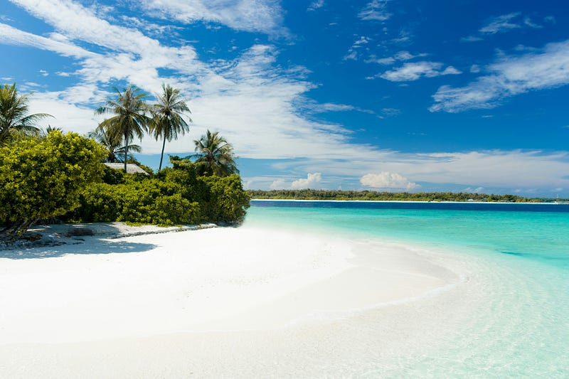
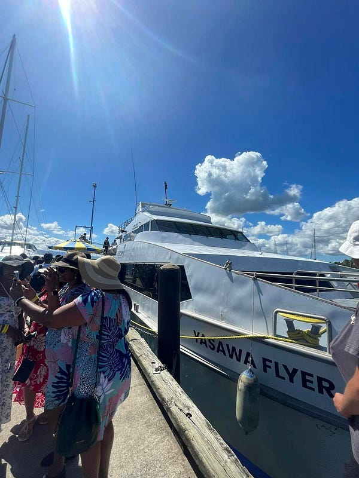
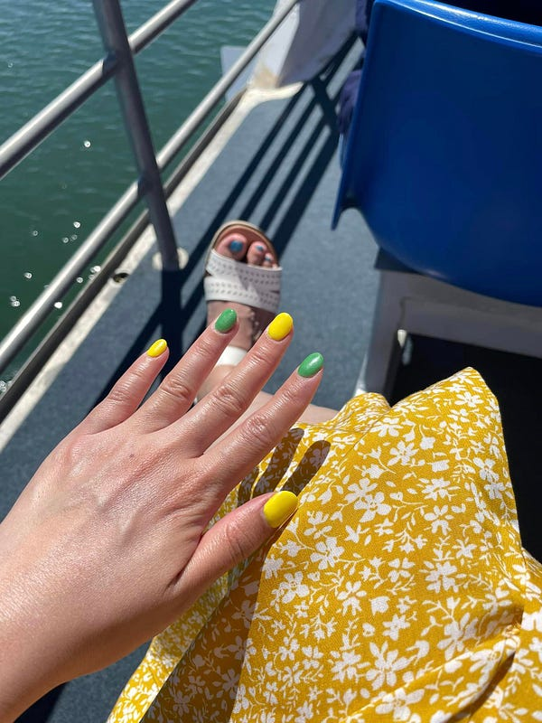
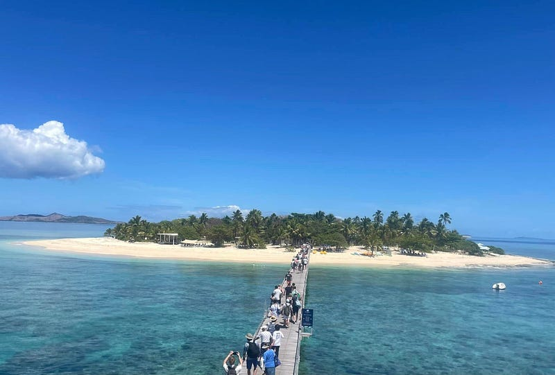
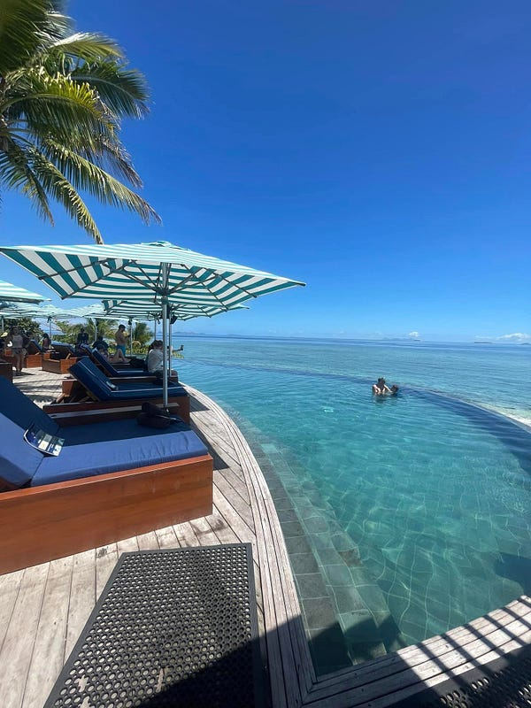
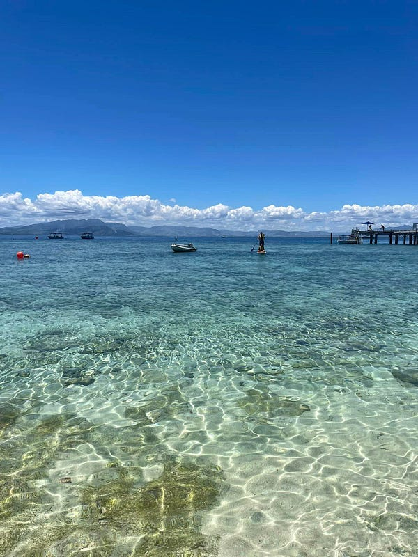
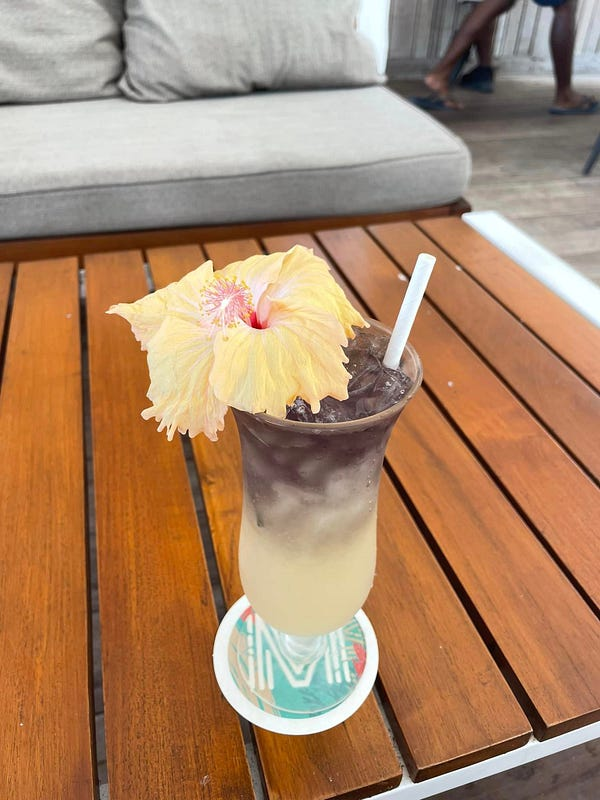
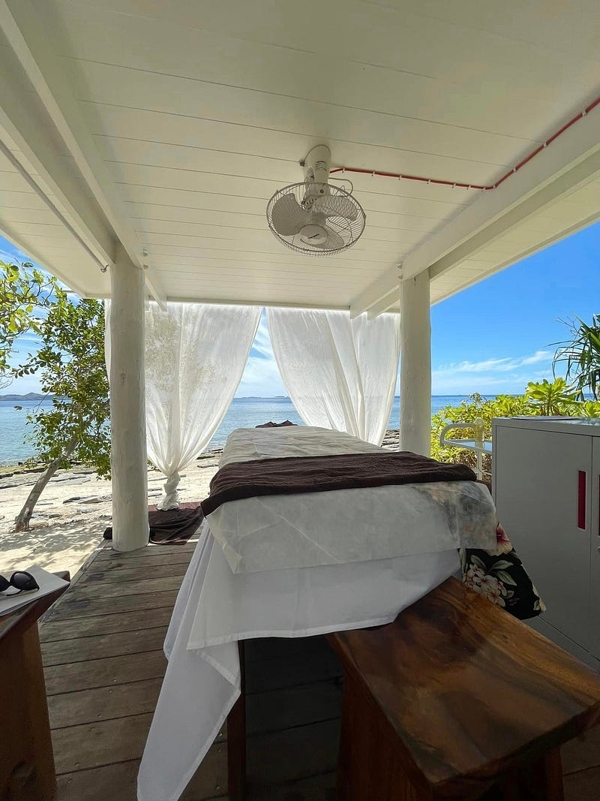

* * *

### 2022.10.12 斐濟自助旅遊 Day 3: Malamala Island

Photo by [jcob nasyr](https://unsplash.com/@j_cobnasyr1?utm_source=medium&utm_medium=referral) on [Unsplash](https://unsplash.com?utm_source=medium&utm_medium=referral)

非 Medium 付費會員，[請點此免費閱讀這篇文章](https://medium.com/@cloudarchitectec/2022-10-fiji-trip-day-3-malamala-island-1a66369081cc?source=friends_link&sk=3fd8ed9a5815797c621e75bb72355623)！當然如果你願意加入 Medium 付費會員來支持創作者，那就更棒囉～感謝你的閱讀！

* * *

我突然發現斐濟人講話喜歡講兩次XD 例如我的旅館叫 Tokatoka，這個島叫 Malamala Island～哈哈

準備登船前往 Malamala~

準備登船出海

途中必須再度炫耀一下我的美甲！Malamala 就是這個一個很圓的小島

美甲與排隊登島的遊客

我超級推薦這個小島的！因為這裡水超清澈無雜質，站在 jetty 上就可以看到底下的各種魚！

島上還有無邊際游泳池，跟各種免費的水上活動裝備租借，包含浮淺、獨木舟跟 SUP (stand up paddling)！我除了喝雞尾酒、按摩、玩水之外就是在各個角落睡午覺，太爽了！

食物無敵好吃、調酒無敵好喝！

這兩杯調酒的好喝程度都跟 Tokatoka 旅館不是同一個等級的

按摩區在海邊，可以一邊聽海浪聲一邊按摩。

服務人員的態度也超級無敵好，我甚至看到他們幫忙遊客夫婦帶小孩，讓遊客可以毫無牽掛地進行各種行程，我強力推薦大家一定要來！

* * *

**如果你喜歡海外生活、澳洲職場、文組轉職工程師的相關文章，歡迎按下「拍手」給我鼓勵 (喜歡的話請多拍幾次！)。同時記得「**[**按此訂閱我的Medium部落格**](https://medium.com/@cloudarchitectec/subscribe)**」，這樣你就不會錯過我每週的更新囉～你們的支持是我持續創作的動力，如果有任何問題或是想要看的主題，歡迎留言與我互動 :)**

  * 中文部落格: <https://medium.com/@cloudarchitectec>
  * 英文部落格: <https://medium.com/architecting-your-cloud-career>
  * Email: [cloudarchitectec@gmail.com](mailto:cloudarchitectec@gmail.com)
  * 臉書粉絲頁(文章與中文部落格相同): <https://www.facebook.com/cloudarchitectec/>

* * *

**推薦閱讀**

  * [2023.05.15 Carnival Splendor 澳洲南太平洋郵輪 — Day 1 雪梨登船](https://medium.com/@cloudarchitectec/%E6%97%85%E9%81%8A-2023-05-15-carnival-splendor-%E6%BE%B3%E6%B4%B2%E5%8D%97%E5%A4%AA%E5%B9%B3%E6%B4%8B%E9%83%B5%E8%BC%AA-day-1-%E9%9B%AA%E6%A2%A8%E7%99%BB%E8%88%B9-fd3e84083d62)
  * [Carnival Splendor 澳洲南太平洋郵輪 — 事前準備及須知 (2023.05出發)](https://medium.com/@cloudarchitectec/%E6%97%85%E9%81%8A-carnival-splendor-%E6%BE%B3%E6%B4%B2%E5%8D%97%E5%A4%AA%E5%B9%B3%E6%B4%8B%E9%83%B5%E8%BC%AA-%E4%BA%8B%E5%89%8D%E6%BA%96%E5%82%99%E5%8F%8A%E9%A0%88%E7%9F%A5-2023-05%E5%87%BA%E7%99%BC-b7ee58cf7bc4)
  * [Ivory’s Rocks 三天兩夜澳洲露營初體驗](https://medium.com/@cloudarchitectec/first-time-camping-in-an-australia-camping-site-ivorys-rocks-66c09b509bfb)
  * [2022.10.10 斐濟自助旅遊 Day 1: 初來乍到之這裡真的不是屏東嗎?](https://medium.com/@cloudarchitectec/2022-10-fiji-trip-day-1-541f5252848a)
  * [2022.10.11 斐濟自助旅遊 Day 2: Nadi 市區一日遊](https://medium.com/@cloudarchitectec/2022-10-fiji-trip-day-2-nadi-f85bcbdb3797)

