* * *

### **一個女生的歐洲獨旅: 2024.04.25 荷蘭 阿姆斯特丹 (Amsterdam) 回憶中的** 運河屋

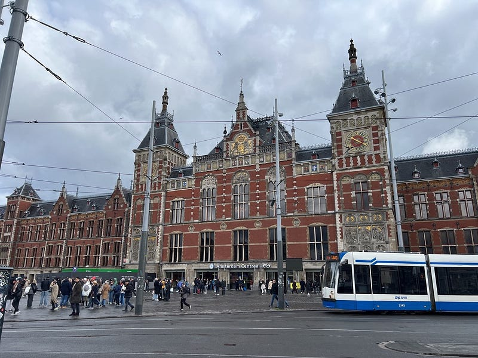阿姆斯特丹火車站

非 Medium 付費會員，[請點此免費閱讀這篇文章](https://medium.com/@cloudarchitectec/702447571dc5?source=friends_link&sk=2adcb1ec904fd7b14aacff142e7132ff)！當然如果你願意加入 Medium 付費會員來支持創作者，那就更棒囉～感謝你的閱讀！

* * *

結束了香港轉機一日行，我整個累到爆炸！

加上國泰的 Kosher 飛機餐難吃到爆炸，所以我選擇在香港機場飽餐一頓，然後上機就直接跟空姐說晚餐不用叫我了。

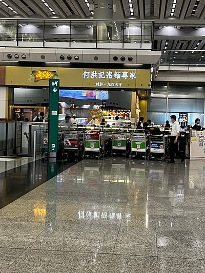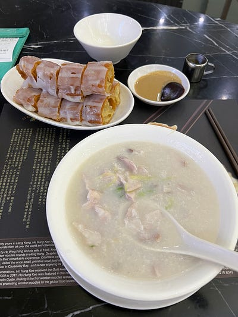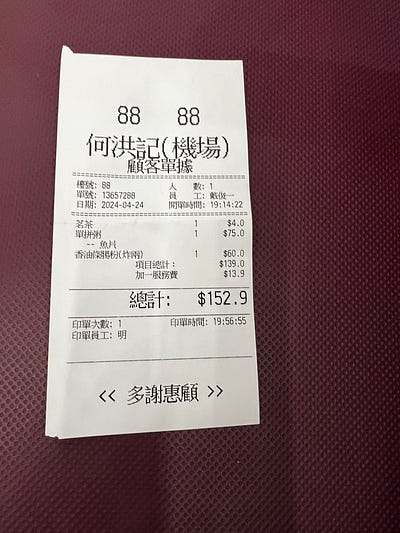雖然超好吃也吃超飽，但是這個價錢也超誇張lol

接下來要飛 13 小時到荷蘭阿姆斯特丹，隨著年紀增長，我真的覺得長程飛機越發難熬 (也可能是因為我的財力沒有隨著一起增長到可以坐商務艙的程度XDD)。

這次也是我人生第一次連續兩個晚上都在長程飛機上過夜，其實滿酷的！本來覺得會很難熬，沒想到我整個累到爆睡了一半的航程 YA!

抵達阿姆斯特丹機場後，我一樣悠悠哉哉在洗手間洗漱化妝，還順便聽了臺灣旅行團的行前說明。

導遊說今天下雨，一天都是戶外行程，而且荷蘭一向風大(畢竟風車國之名不是憑空而來) 建議大家拿到行李之後立刻換裝。

好的，導遊在說，我都有在聽!

於是領到行李之後我立刻換上 Kathmandu 的外套跟我為這趟歐洲行準備的夏季防水 hiking boots！事實證明這是個再正確不過的選擇，因為一出火車站，我立刻被寒冷的狂風吹得不要不要！

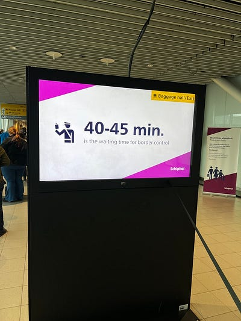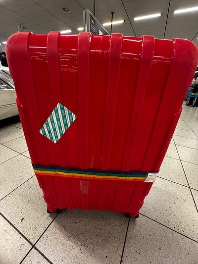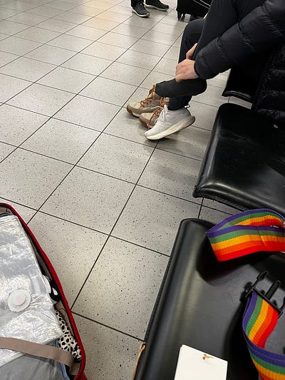本來就已經裂開的行李箱，成功從澳洲跨洋來到了歐洲XD

題外話，阿姆斯特丹的海關居然只有歐盟成員國加瑞士人才能用電子通關，其他所有人都要人工通關！！！我驚呆了，而且他們人工通關還只開兩個。於是光過海關就花了40分鐘！我建議他們向澳洲學習，這時候就覺得澳洲好先進！(雖然兩個荷蘭海關都很帥 >///<)

因為事前收穫很多警告，也看了很多歐洲竊盜猖獗的影片，所以我一到荷蘭就小心翼翼！結果後來發現荷蘭根本安全的要命哈哈哈哈哈（純粹個人經驗：荷蘭我總共去了阿姆斯特丹、海牙、萊登、台夫特這四個城市，每個城市都跟我2009–2010年來時一樣安全，給讚！)

如果是跟我一樣短程來訪的人，建議不用買 OV card (因為押金是不會退給你的，而且有一定的餘額下限，也就是說卡裡一定要維持 20 歐以上）。直接用手機 Apple Pay 即可，也就是荷蘭說的 OV pay，這個名詞我當初研究了好一陣子，但說白了就是進站跟出站都直接刷同一張信用卡就對了。OV pay 的火車機器是黃色柱子、公車上刷卡的地方會有ov pay 圖案。上下車都要刷卡，沒刷到罰錢。

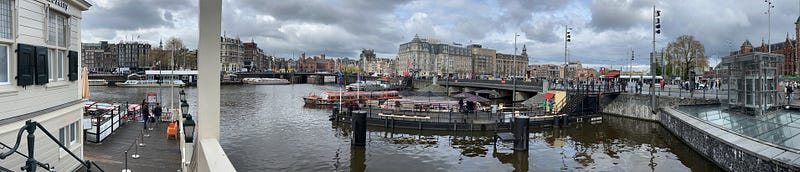阿姆斯特丹火車站一出來的河景

### Dolzon cafe

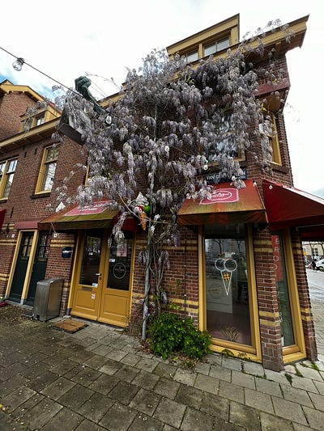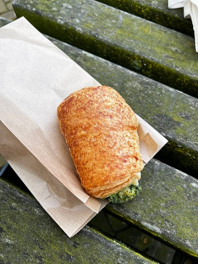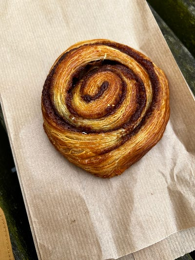很可愛的麵包店

火車站寄放完行李之後，我立刻去 Dolzon cafe 吃早餐。【[阿姆斯特丹美食】Dolzon麵包烘焙坊，每日新鮮出爐肉桂捲、黑麥麵包！](https://lillian.tw/dolzon/)這篇網誌推薦這家說是荷蘭最好吃的麵包店，我買了推薦的肉桂捲跟青醬麵包，的確覺得滿好吃的。不過這個咖啡店離中央車站其實有段距離，但可搭通勤渡輪加走10分鐘抵達。

題外話，阿姆斯特丹的渡輪是完全免費的，我個人還滿推薦搭的，除了行人之外還有很多腳踏車甚至小汽車直接開上船XD（跟我在臺灣/澳洲的渡輪經驗都非常不同，我覺得值得體驗！荷蘭人跟我說渡輪最長的航線是13分鐘，她也非常推薦安排進市區行程裡，可以從水上欣賞阿姆斯特丹的風光，我因為時間有限，就沒有特別去找那條航線了）。

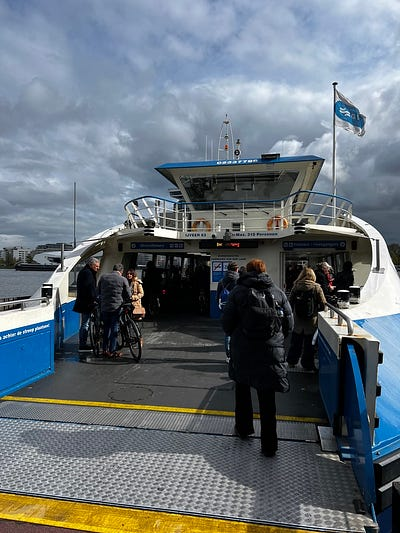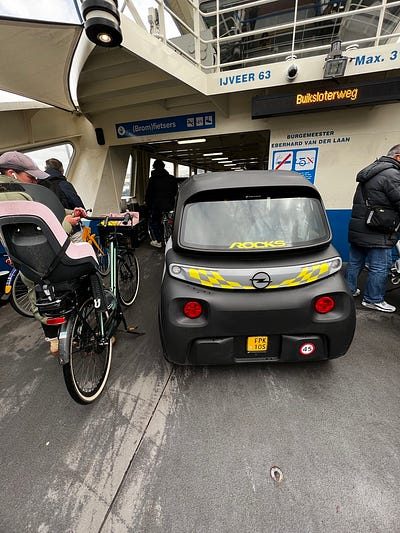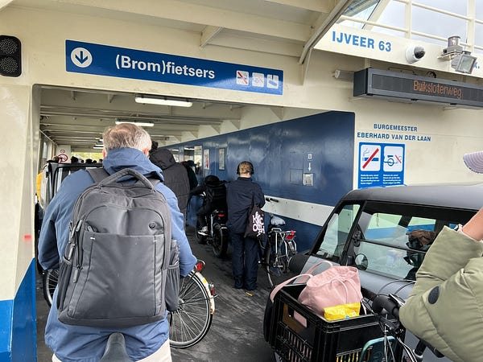阿姆斯特丹免費渡輪

吃完早餐後居然開始暴雨 QAQ 荷蘭的天氣的瘋狂程度完全超越墨爾本，我只好在中央車站的星巴克躲雨（他們暖氣開得很足，很舒服)。

### 運河游船

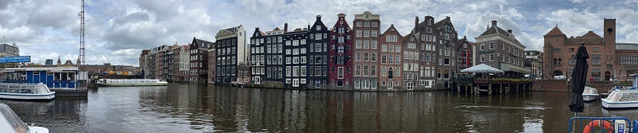最愛的荷蘭運河屋

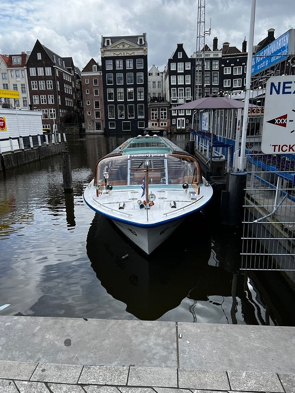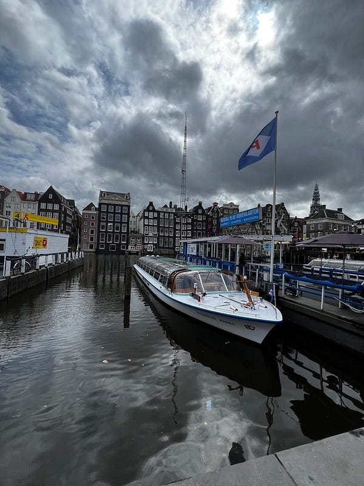運河游船

好不容易雨小了一點我決定去搭運河游船，船長阿姨有一種冷幽默! 這裡我建議大家記得坐面向船頭的右側，因為大部分的景點都在那邊（我很不幸地坐的是左側XD)。穿梭在阿姆斯特丹的運河間是個很特別的體驗，即使天氣不佳我也覺得很值得~

### 號稱荷蘭最好吃的尿尿小童薯條

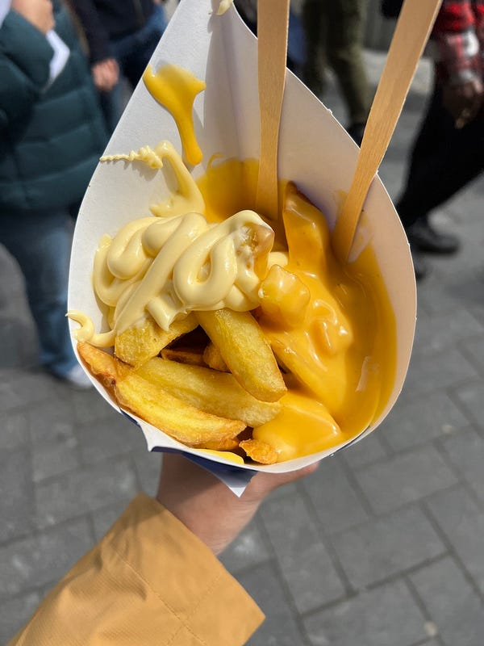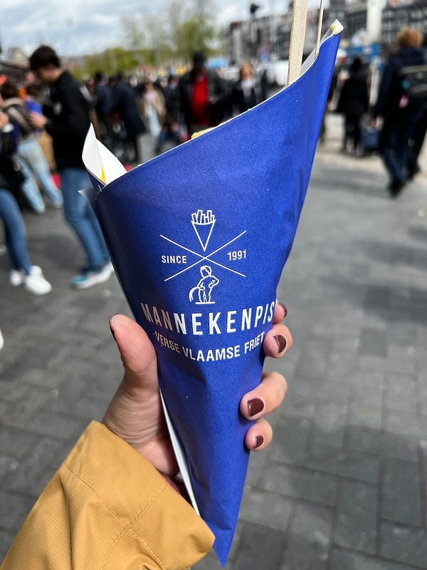尿尿小童薯條

搭完游船，我跑去買號稱荷蘭最好吃的尿尿小童薯條！其實我本來是對這個觀光客美食不屑一顧，但真心超多人排隊！而且我後來覺得在冷冷的陰雨天吃個熱熱的薯條也是不錯。

這裡要跟大家說荷蘭人薯條一般來說是沾美乃滋（而不是番茄醬)，然後小份薯條我覺得就值得2–3人嘗鮮了。點薯條記得要選沾醬（需額外付費，有超多醬料可以選擇，因為他們薯條本身是沒有味道的，單吃真的會很乾），我點的是松露美乃滋跟起司淋醬，我覺得兩個都很好吃！

### 辛格花市

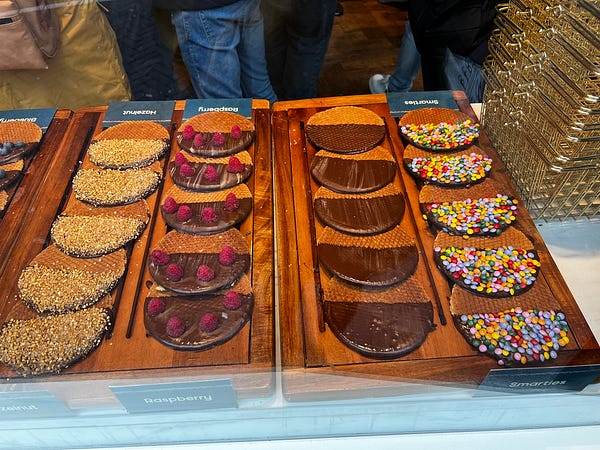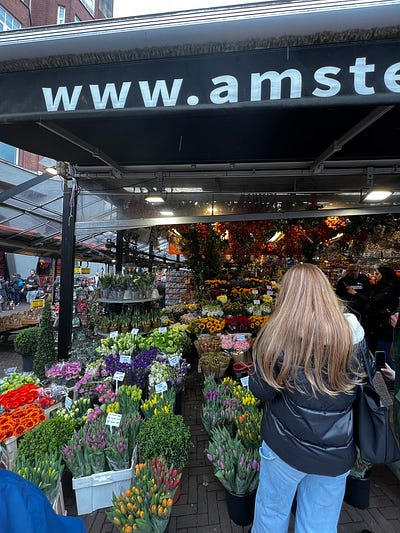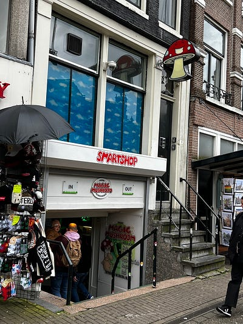辛格花市

吃完薯條，我看了一下時間，發現還有點空擋於是就前往辛格花市 (Bloemenmarkt, Singel)。據說這是唯一一個水上花市！但除了花之外，也賣滿多紀念品的，有興趣的人也可以來逛逛。

### 住宿選擇：海牙 AirBnB

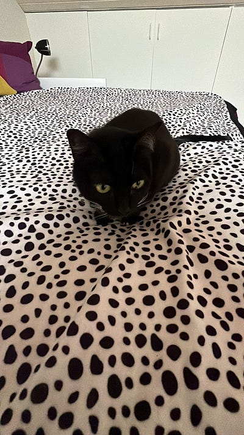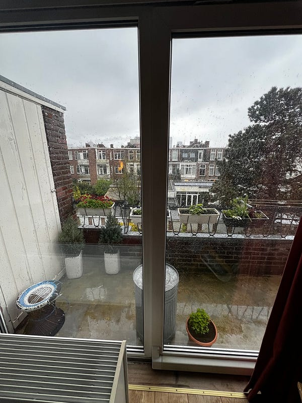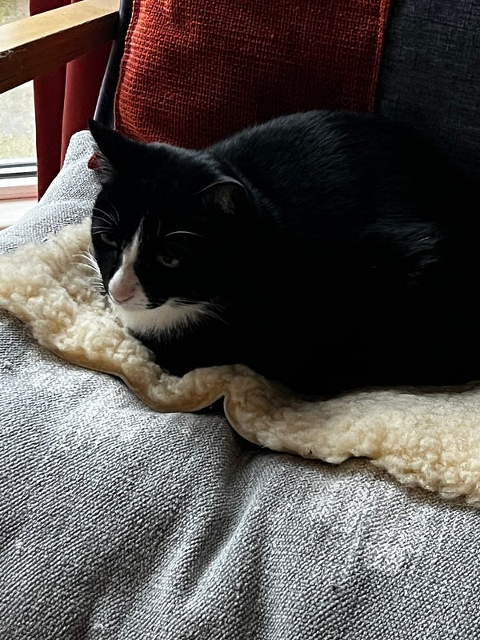AirBnB 的小陽台跟貓咪們都好可愛

接著我就回到 Amsterdam Central 準備搭約一小時的火車到 Den Haag，前往 airbnb！

會選擇住海牙的原因是因為：

1.阿姆斯特丹的住宿真的太貴了

2.我以前住過荷蘭，所以大部分阿姆斯特丹的景點我都去過了(大家可以發現觀光客必去的博物館我一個都沒去)。

這次回訪歐洲的主要目的是去我當年交換的 Leiden University 重溫舊夢(?)，而海牙到萊登只要15分鐘車程。事後證明這是一個正確的選擇，因為我後來去萊登跟 Delft 都很近～讚讚

Airbnb Host 是個教授(?)，而且有兩隻可愛的貓貓（一隻黑貓一隻賓士)，host 稱他們為 Cambodian cats，因為這是她在柬埔寨住了兩年之後從柬埔寨帶回來的貓貓。我覺得 host 是個很奇妙的人，她人感覺很友善好聊，但我同時也覺得她有在盡量避開跟我接觸的時間(但也有可能是我想太多，她的行程就是很滿?XD)。

例如我check in 後的五分鐘，她朋友就來她家玩，所以她跟我小聊了十分鐘後，給了我一個room tour，然後就跑去跟她朋友聊天了。第二天她說她有一整天在阿姆斯特丹的行程，我晚上十點睡覺的時候她才回來。第三天我懷疑她根本沒回家，然後第四天早上我就把鑰匙留在桌上 check out 了，真是個適合 I 人的住宿地點！

PS: 荷蘭的住宿貴到什麼地步呢？我這樣一個閣樓的房間，需要跟房東 share 浴室，一個晚上要130澳（在阿姆斯特丹住6人房hostel 要一百澳/晚)。我在德國住超大 studio apartment 也只要$110澳幣/晚，差距非常大！

* * *

**如果你喜歡海外生活、澳洲職場、文組轉職工程師的相關文章，歡迎按下「拍手」給我鼓勵 (喜歡的話請多拍幾次！)。同時記得「**[**按此訂閱我的Medium部落格**](https://medium.com/@cloudarchitectec/subscribe)**」，這樣你就不會錯過我的更新囉～**

**為了服務廣大讀者，雲端架構師 EC 線上諮詢服務，正式上線囉！如果你想要跟 EC 進行 1:1 線上職涯諮詢，麻煩請填寫：**[**雲端架構師 EC 諮詢服務預約表單**](https://forms.gle/Zuro8YryCN5hH9Gk9)

**如果想要進一步支持我，歡迎透過以下連結請我喝一杯咖啡！你們的支持是我持續創作的動力，如有任何問題或是想要看的主題，歡迎留言與我互動 :)**

  * Email: [cloudarchitectec@gmail.com](mailto:cloudarchitectec@gmail.com)
  * 臉書粉絲頁(文章與中文部落格相同): <https://www.facebook.com/cloudarchitectec/>

