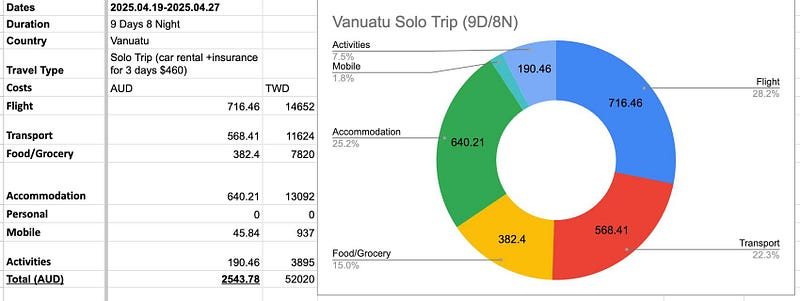

* * *

### 太平洋小島上的大冒險：萬那杜花費分析以及心得總結

這趟九天八夜的萬那杜獨旅，我大概花了$2500澳，約5萬2台幣。

其中機票、住宿、交通（租車三天$460澳)約各佔25%，食物佔15%。另外大家可以注意到我在萬那杜什麼紀念品或是禮物都沒買，因為真的沒有什麼好買的

其實這趟旅行我一直在想我會為萬那杜下怎麼樣的評語，以及我會不會推薦別人來玩呢？

最常拿出來跟萬那杜比較的國家，應該就是斐濟吧，所以以下主要會以這兩個國家來做比較。

這趟旅程我大概跟三五個澳洲人聊天過，他們都一致覺得比起斐濟更喜歡萬那杜。

### 萬那杜的優點

  * 離澳洲非常近，從布里斯本飛過來只要2.5–3小時（斐濟要4–5小時）
  * 光本島來說，萬那杜(Port Vila (Efate) )比斐濟漂亮很多，也好玩很多（但我在斐濟有跳島，覺得浮潛的景致漂亮很多，魚也多）。我覺得如果每個晚上都住一晚$200澳以上的「小島」度假村（這裡還有更貴的，一晚$500澳以上都有。度假村一定要挑可以浮潛的，然後裝潢美的，最好是那種根本在小島上出入都要搭船的），體驗應該會比我好很多。
  * 居民普遍非常友善，治安良好。一個女生出遊也很安全。
  * 食物比斐濟好吃！說不上人間美味啦，但是斐濟的食物難吃到讓你懷疑人生（兩國的食物都以西式為主，但萬那杜的亞洲料理選項多非常多）。

### 萬那杜的缺點

  * 蚊子真的爆炸多：我之前在斐濟的時候完全沒有被叮這麼慘
  * 雖然居民普遍友善，但想要騙觀光客的公車司機、計程車司機跟包車導遊真的不少，我遇到的機率大概有50%。好處是他們只是想騙你錢，不會造成其他傷害（就跟我跟當地人聊說，蚊子好多，他們回我說「可是我們這裡沒有瘧疾啊，不用擔心」我心想光是每天被蚊子爆咬，晚上都不敢出門我就很擔心了）。等你一旦適應並了解行情價後（但沒來過誰知道行情價），事情就會容易很多。上車前一定要先講好價錢、上車前就把錢拿出來放在另一個零錢包裡（千萬不要被他們看到錢包裡的大把鈔票），多數不會再變卦。
  * 路況真的差到爆炸，我後來覺得我人生再也不用玩什麼越野四驅車，光在萬那杜坐車跟開車就夠刺激了
  * 因為2024年底的大地震，市區到現在也還沒恢復過來，多數商店跟建築物都還荒廢中，我覺得至少要再2–3年才能恢復過來。

### 個人感想

這裡真的是 J 人地獄，因為幾乎所有時間/事情都不會按照你的計劃來，所以最好的辦法就是自己租車（租車價格跟澳洲差不多，但如果有幾個人一起分擔會省很多，而且讓你重新奪回對人生的掌控權）。我其實也非常享受在這裡自駕的感覺！

這次我自己帶了在 Kmart 買的浮潛裝備（snorkel mask + snorkel + reef shoes)，不用跟別人共用器具，也可以隨時想浮潛就浮潛，我覺得很棒！

這次獨旅遭遇了幾次危機（遇到地震、差點被浪捲走、不小心開到對向車道、被導航欺騙到荒郊野嶺、被騙錢），完成了很多挑戰（一個人在第三世界自駕、一個人浮潛、一個人划獨木舟），我覺得這裡還算是「一個很安全的可以冒險的地方」

沒錯，我決定就把這句話當成我的總結好了！假設你想要一個人冒險，卻又覺得非洲、南美洲或是緬甸太危險，那我推薦萬那杜給你們

看完整體分析，大家覺得萬那杜的旅遊花費如何？你們會想要去玩嗎？歡迎留言告訴我！

PS: 我去韓國（首爾+釜山）八天也是一樣約$2100澳，感覺是不是去韓國比較值得？

* * *

**如果你喜歡海外生活、澳洲職場、文組轉職工程師的相關文章，歡迎按下「拍手」給我鼓勵 (喜歡的話請多拍幾次！)。同時記得「**[**按此訂閱我的Medium部落格**](https://medium.com/@cloudarchitectec/subscribe)**」，這樣你就不會錯過我的更新囉～**

**需要職涯導師嗎？澳洲雲端架構師 EC 提供轉職工程師、澳洲求職、移民生活等全方位諮詢服務。**[**現在就填寫線上 1:1 諮詢預約表單，開啟你的職涯新篇章!**](https://docs.google.com/forms/d/e/1FAIpQLSeWoo4ZVLNc6IQc76nRU29ydr2T9vUJrlNgX5fFrkqiOT-K3g/viewform)

**如果想要進一步支持 EC，歡迎透過以下連結請我喝杯咖啡！你們的支持是我持續創作的動力，如有任何問題或是想要看的主題，歡迎留言與我互動 :)**

  * **歡迎追蹤 Facebook**[**澳洲雲端架構師 EC 臉書粉專**](https://www.facebook.com/cloudarchitectec)
  * **歡迎追蹤 Threads**[**Cloud Architect EC**](https://www.threads.net/@cloud_architect_ec)
  * **合作請聯繫:**[**cloudarchitectec@gmail.com**](mailto:cloudarchitectec@gmail.com)

