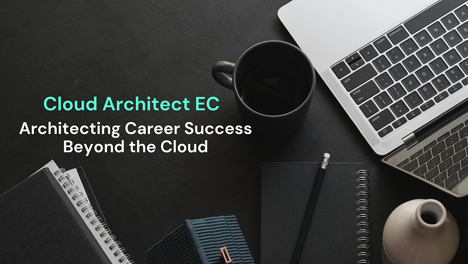
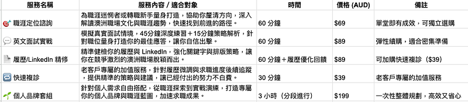

Architecting Career Success Beyond the Cloud

### 🔔 服務升級公告：諮詢服務全面優化 (18/07/2025 更新)

感謝大家一路以來的支持！過去 EC 的諮詢服務以自由對話為基準，針對各種職涯困境給予客製化建議。過往的模式雖然有彈性，但總覺得沒有辦法針對主題進行聚焦式討論，所以我決定將諮詢服務全面升級為「主題式諮詢項目」，讓你能根據需求，精準選擇最適合的服務。無論是履歷優化、英文面試、職涯探索，或整體職涯規劃，都能獲得更聚焦且具策略性的協助 ✨

### 🎯 想轉職科技業？考慮移民澳洲？不知道該怎麼突破職涯困境? 也許你該找人聊聊!

  * 想從非本科背景轉職進科技業，卻卡在「第一步」？
  * 想申請澳洲職缺，卻對英文履歷、英文面試、澳洲職場文化一頭霧水？
  * 履歷投了又投、LinkedIn 改了又改，卻總是石沉大海？
  * 雖然現職工作穩定，但對職涯感到迷惘，無法決定是否升職／轉職／換方向？
  * 好想聽聽轉職過來人對於澳洲職場的建議與真實反饋，卻找不到適合管道？

你不是一個人！

嗨～我是 EC，一位從文組轉戰科技業，先後進入澳洲 Amazon 與 Microsoft 工作的雲端架構師。我的職涯探索旅程並沒有因為轉職成功停下腳步，先後任職 AWS Cloud Architect (Cloud Engineer/Consultant)、Microsoft Solution Architect、DevOps & Platform Engineer，可以說即便是在 IT/雲領域中也嘗試了不同面向。

這些年來，我不僅在 Medium 上寫下轉職心得與職場觀察，也與將近 30 位學員進行過深度一對一諮詢！

### 🧠 主題式諮詢項目

這不是制式化的模板問答，而是根據你的背景與困境，進行一對一、量身打造的職涯診斷，並提供主題式的策略建議。

  * **🎯 職涯定位諮詢 (60分鐘，$69 AUD)** ：為職涯迷惘者或轉職新手量身打造，協助你釐清方向，深入解讀澳洲職場文化與職涯趨勢，快速找到前進的路徑。
  * **💬 英文面試實戰 (60分鐘，$89 AUD)** ：模擬真實面試情境，45分鐘深度練習＋15分鐘策略解析，針對職位量身打造你的最佳應答，讓你自信出擊。
  * **📄 履歷/LinkedIn精修 (60 分鐘＋履歷優化回饋：$89 AUD)** ：精準健檢你的履歷與 LinkedIn，強化關鍵字與排版策略，讓你在競爭激烈的澳洲職場脫穎而出。
  * **🔁 快速複診 (30分鐘，$39 AUD)** ：老客戶專屬的加值服務，針對履歷微調與求職進度後續追蹤，提供精準的策略與建議，讓已經付出的努力不白費。
  * **🌱 個人品牌套組 (共 3 小時，$199 AUD)** ：針對個人需求自由搭配，從職涯探索到實戰演練，打造專屬你的個人品牌與職涯藍圖，加速求職成果。

* * *

### 📅 如何預約？

  * ✅ **時間：每週開放 2 個名額**
  * 🕒 **形式：Google Meet 諮詢**
  * **👉 點擊表單直接預約：**[**雲端架構師 EC 諮詢服務預約表單**](https://forms.gle/Zuro8YryCN5hH9Gk9)**  
**收到表單之後我會跟你確認時間、寄送 Google Meet 的連結並提供付款連結。收到款項之後，就算預約成功囉～

* * *

### 💡為什麼要找 EC 諮詢

  * **在澳洲生活超過 10 年，經歷過打工度假、留學、移民(基本上全靠自己申請)，住過澳洲各大城市(雪梨、墨爾本郊區、布里斯本、坎培拉、柏斯、達爾文)，經歷豐富，讓你獲得最全面的澳洲資訊！** 想要更近一步了解我的經歷，可以閱讀 [<<大家好，我是澳州雲端架構師 EC! 跟我的轉職心得文>>](/posts/2018-01-01-iam-ec/)
  * **成功從文組轉職工程師，並進入科技業巨頭 Amazon & 微軟工作，熟悉跨國企業文化與招募流程，提供你澳洲科技業的職場現況及第一手消息！**歡迎參考我的 [LinkedIn](https://www.linkedin.com/in/elliettchen/) 職涯經歷跟轉職心得[<<文組轉職澳洲 IT 工程師，我靠 Coding Bootcamp 進了 Amazon 當工程師!>>](/posts/2022-12-03-bootcamp-to-aws/)
  * **在 Medium 上發表過近百篇分享轉職工程師、澳洲生活、職場、文化、英文面試等相關文章。建議可以先看過我寫的文章，如果覺得對你有幫助的話，再來預約諮詢～** 完整文章目錄請看：[<<澳洲雲端架構師 EC ｜精選文章懶人包>>](./2018-01-02-ec-post-list/index.md)

* * *

### 💬 學員的五星好評

> ** _Will_** _：都有回答到我的問題，條理思緒與表達都很清楚，給的建議都是我沒有想過原來可以這麼做的。履歷的幫助非常大。有處理過簽證的背景、懂簽證之外也有實際在科技業工作過、還有在澳洲生活過11年。這樣的背景其實會讓人很願意聽你分享。_

> ** _Peter_** _：對談流暢有清晰的條理跟邏輯，針對個人優缺點提供建議，全英文對談也能從中學習語法單詞。前輩的經驗與視野非常有參考性，考量機會成本基本上算是半公益性質的諮詢了(對比前輩薪資水準)_

> **_Yu-hsien_** _：解答了我的所有問題，還聊了一些我沒有想到過的事情！收穫非常多，沒有想到連履歷你都看得這麼仔細！_

> ** _Alison_** _: EC 能夠提供貼近澳洲職場的觀點，而且有認真在了解諮詢對象的背景跟問題、耐心傾聽並提供相對的建議，不是給千篇一律罐頭解答。整個諮詢過程覺得被尊重也獲得蠻多不同的 insight。非常感謝你的時間，我獲得很多有價值的建議。 最近嘗試了解澳洲軟體產業時候發現去澳洲工作的台灣工程師不少，但願意像你這樣持之以恆的分享澳洲職場、生活觀察的人很少，相關的 community 雖然有但也不太活躍。你的 medium 簡直像沙漠裡的綠洲，很開心也很感謝你願意花時間寫文章分享，期待你的每一篇新文章 ：D_

> ** _Eason_** _: 講師有充分回答到我想問的問題! 包含職涯規畫、履歷給的建議還有以及移民相關的回答! 我相信不少人也有需要工程師轉職的需求，以及海外移民等等，EC剛好都有這方面的經驗，而我們大部分周圍圈子內，同時做到科技業轉職跟移民的朋友偏少，如果朋友也對這類話題有興趣我會推薦!_

> **_克里斯_** _: EC用過去的經驗給予未來的一些建議，讓我更加清楚後續欲執行方向, 尤其EC具有相同的背景經驗, 更讓我有感覺~XD 感謝前輩願意跳出來給予台灣人一些寶貴的建議，十分受用，未來如果有需要會再跟您請教~_

> **_Marcos_** _: (我覺得獲得最大的收穫是)一些關於澳洲求職的眉角和方法，如果身邊也有人想到澳洲會推薦先和 EC 聊聊！_

> ** _Yao Wen_** _：諮詢過程像跟朋友聊天一樣很放鬆，EC 也分享自己轉職經驗中碰到的問題跟挫折與做了哪些策略跟行動都很清晰，也根據個人目前的狀況給予合適的建議、行動跟方向，非常有幫助~跟 EC 的互動感覺良好, 真實的經驗分享與建議讓我覺得值得推薦~ 有向 EC 諮詢真是太好了, 期待之後的新文章~_

> **_Gina:_**_這次的諮詢讓我對自己的求職規劃更加有信心，也釐清了許多原本感到迷惘的地方。EC 不僅提供了技術層面的建議，還幫助我從個人優勢、職場等多個角度思考更全面的策略。原本我對未來的移民決策感到猶豫，但經過這次諮詢，我更確信自己的選擇是可行的，也了解到該如何做好全方面的功課，確保每個環節都準備充分。 移民這條路上難免需要取捨與抉擇，但 EC 的建議讓我更清楚哪些是當前最重要的優先事項，該如何在現有條件下做出最適合自己的決定，並且保持彈性應對變化。諮詢過程中，獲得了實用的資訊，也感受到 EC 對於職涯與移民規劃的深刻理解，讓我能夠以更好的心態面對。_

> ** _Mei_** _: EC的諮詢切中要點，直接指出需要改進的關鍵問題。建議實用且具體，還分享了許多實用的寫作小技巧。鼓勵並非空泛的心靈雞湯，而是幫助我深入認清自身的優劣勢。非常感謝這次諮詢的機會！_

* * *

### 🙋‍♀️ 還在觀望？不如先來聊聊！

有些問題在 Google 上很難答案。如果你正卡在某個轉職十字路口、如果你想聽聽業界真實的聲音與實戰建議，也許我們可以一起聊聊，找出下一步的方向。

👉 點這裡預約諮詢：[**雲端架構師 EC 諮詢服務預約表單**](https://forms.gle/Zuro8YryCN5hH9Gk9)

📱 想追蹤更多？

  * **📘 Facebook**[**澳洲雲端架構師 EC 臉書粉專**](https://www.facebook.com/cloudarchitectec)
  * **🧵 Threads**[**Cloud Architect EC**](https://www.threads.net/@cloud_architect_ec)
  * **📩 合作信箱：**[**cloudarchitectec@gmail.com**](mailto:cloudarchitectec@gmail.com)

