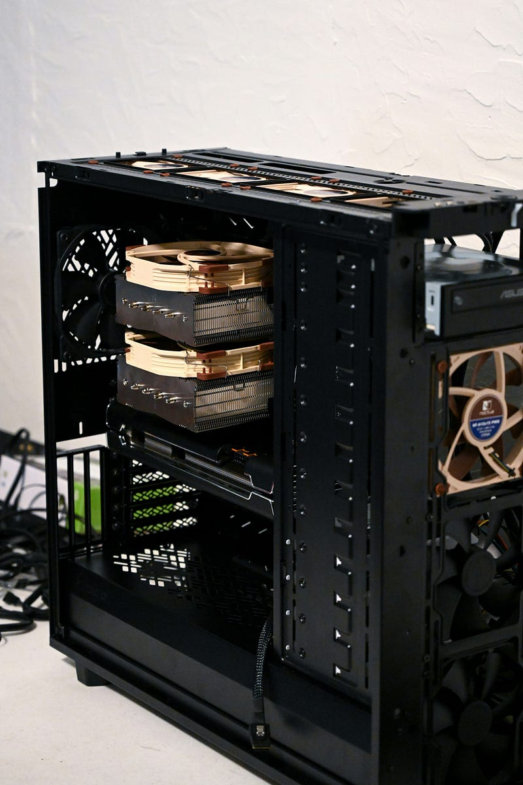
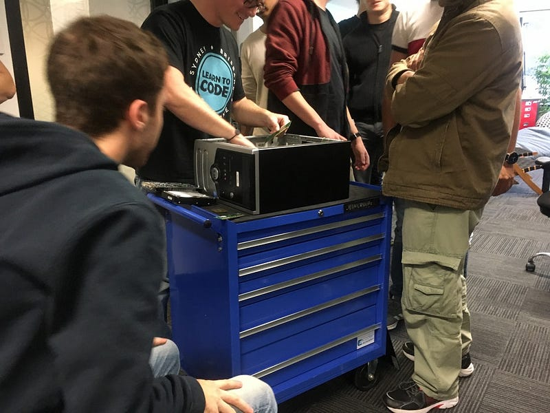
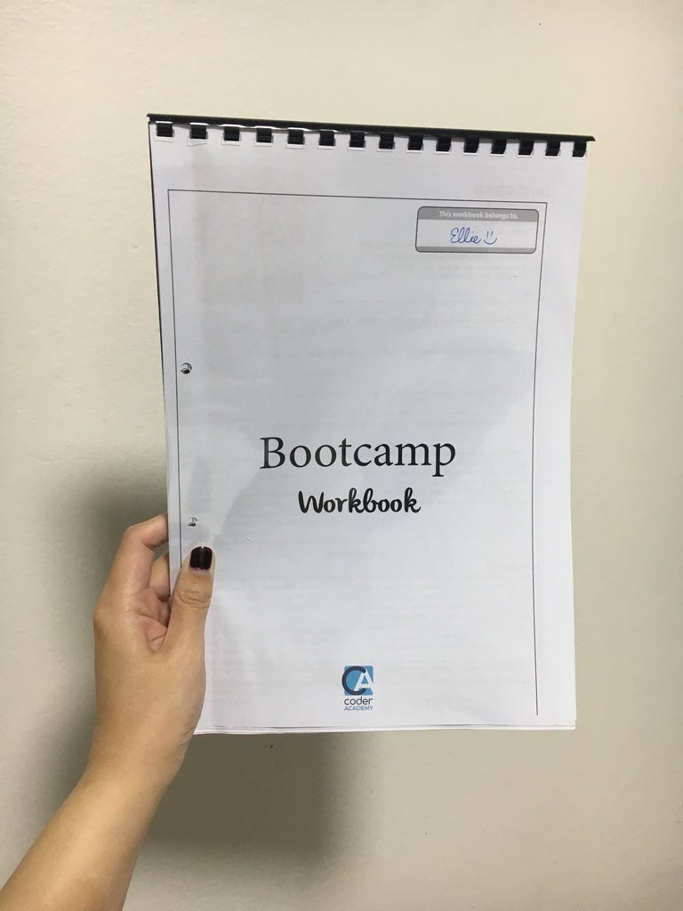

### 零基礎轉職澳洲工程師: 2019.08.20 The Real Game Begins

Photo by [Nathan Anderson](https://unsplash.com/@nathananderson?utm_source=medium&utm_medium=referral) on [Unsplash](https://unsplash.com?utm_source=medium&utm_medium=referral)

我先發誓我這篇要寫得很簡短! 如果不行… 我以後就立志要成為打字速度超快的打字王!😂 (未來的 EC: 當年的我居然會在自己的網誌跟自己精神喊話，也太好笑XDDD)

今天終於開始正式進入 coding bootcamp 的課程了！

### 安裝軟體

早上兩位老師開始帶開教我們安裝軟體，使用 Mac 電腦的 Mac team 速速就完工了，但我們 Windows team 整個零零落落! 而且我不懂，這種事不是就投影在大螢幕上大家一起照著老師做不就好了嗎? 他們偏偏要用口述的!!! 安裝新的電腦作業環境耶! 口述不會太難嗎😭

我一開始根本完全沒聽懂，只好一直偷看旁邊澳洲小哥(至今仍不知道小哥的名字是啥囧，因為他就是我昨天少數沒聊到的人之一，然後我本來以為他叫Elliot 但他好像又不是LOL)

總之整個早上就在裝這個，然後我們用 Windows 的人只有蘇一個人安裝成功XDD (不過後來我收到指示後，發現重開之後就安裝好了XD)

### 電腦基本硬體架構

裝完後，一樣分開兩個小隊，然後老師開始拆電腦大概跟我們說明了一下各個重點。講完這個就開始講 command line，就算這個東西我在 prework 中有做，我也只是勉強跟上而已! 老師講得啪啪快，重點是同學還能一直踴躍發問，我真心是要累死囧

### 午休時間的社交簡直是要逼死 I 人

午休不巧在搭電梯時遇見天使同學 (會叫他天使是因為他本名就叫 Angel XD)，於是只好跟他一起去買午餐，其實我超想中離的哈哈哈，但又找不到藉口!

總之我們到了一家日本餐廳，我點了外賣，然後這位小哥突然開口用中文跟我聊天，傻眼貓咪!!!! 原來他雖然在雪梨出生長大，但他媽媽是中國人，爸爸是西班牙人，所以媽媽會用中文跟他對話(他的程度我覺得就一般移民二代來說還不錯)，但他爸爸因為英文太好了，所以他一句西班牙文也不會講…. (他爸爸作為一個西班牙人，來到澳洲教「英文」??? 真心是想問澳洲人有事嗎?XDDD)

嗯? 這個故事告訴我們，如果想要小孩學好母語，首先你的英文不要太好(?)

結果小哥點了內用，我本來要坐下來跟他一起吃，結果我突然想到 Su 剛剛問我說吃完飯要不要一起去 officework，所以我就先走了(終於逃脫成功)! 沒想到一回到學校，就接到 Su 的簡訊說她同事臨時找她有事(她之前工作的地方離我們學校走路一分鐘XDDD 她也是辭職來讀的，但可見他們公司少不了她XD)，所以我就只好一個人默默坐在廚房吃便當，希望西班牙天使小哥不要覺得我故意拋下他!!! (祈禱他回來的時候沒看見我一個人坐在廚房吃午餐，不然也太糗了吧LOL)

因為我回來學校時大家都已經吃飽了，有人已經開始要玩桌遊了(這些人也是有事嗎? 午休時間才一小時，你們覺得你們玩得了一場嗎?XD)，我就只能很尷尬地坐在一旁猛吃，一邊想我到底為什麼在這裡XDDD

好不容易吃完我就閃進教室了，本來想宅一下，結果中國偉恩大哥「登高一呼」(沒有啦~ 他只是剛好在我附近看著我說「要不要跟我們一起出去走走?」XD)，我為了不要顯得太孤僻，就答應了! 結果發現他的「我們」是指義大利小哥跟尼泊爾小哥，剛好也是另外兩個我很喜歡的人類，於是我們就愉快地出去繞了一圈(天知道我根本才剛從回來哈哈哈哈哈哈!) 但不得不說走完的確覺得心情變好了，感覺我做人也不是太失敗XD

回來之後就開始狂做 workbook 的練習(這裡再度批評一下，有些題目根本只有用mac的人才做得了，老師也不事先說，我回家看slack才看到)，我也是做得零零落落!

### 馬克小哥

但我旁邊的馬克小哥感覺超威(澳洲人，典型亞裔長相，其餘背景不知)，所以我寫不出來的地方都抄他的，是說馬克小哥昨天就坐我旁邊，我以為他今天會換位子(因為我們感覺沒有特別聊得來XD)，結果他居然今天依然坐我旁邊(今天的確有同學位子大搬風)。

馬克小哥也是個奇人! 據說他每天晚上九點睡覺，早上五點起床，練巴西柔道+練習寫程式，我跟蘇說我覺得馬克小哥目測應該25–30歲吧? 蘇說「不可能，因為 20 幾歲的人絕對不會九點就睡!!!」 我簡直要笑死XDDDD (未來的EC: 現在我重看這一段還是每看一次笑一次哈哈哈哈)


