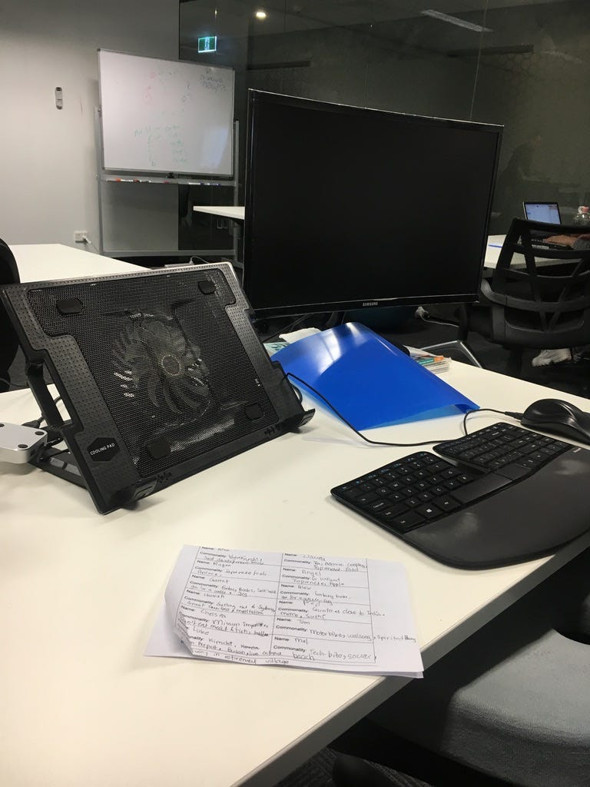
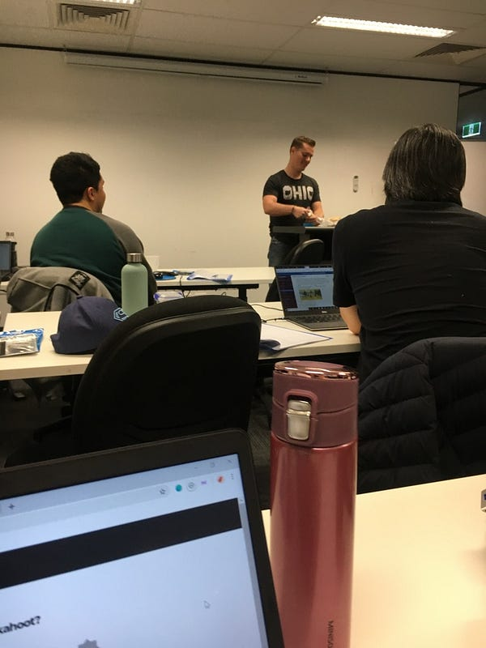
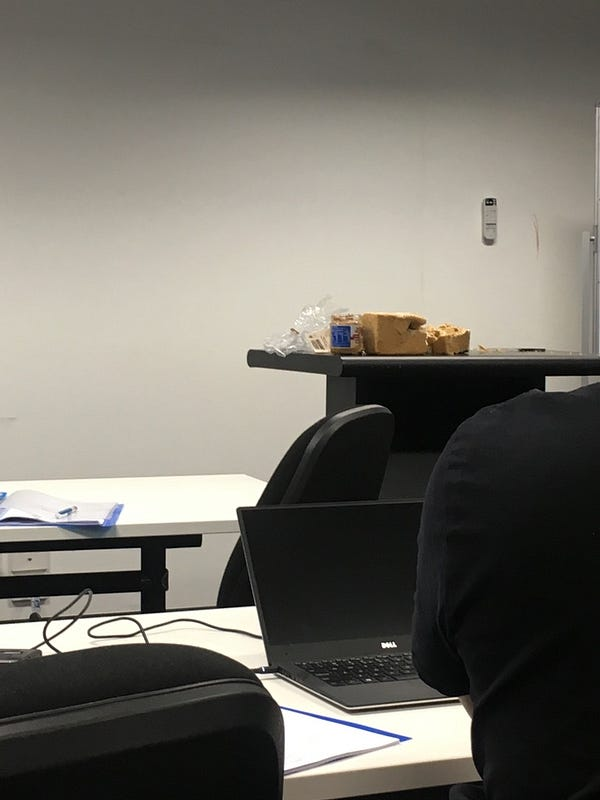
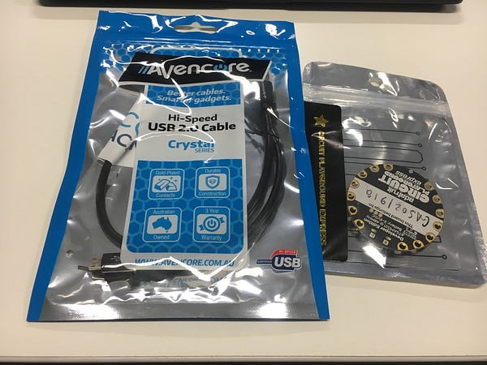
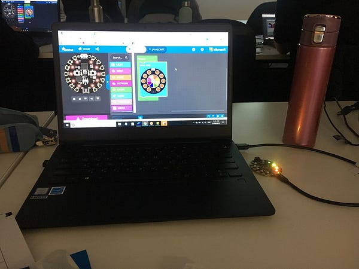
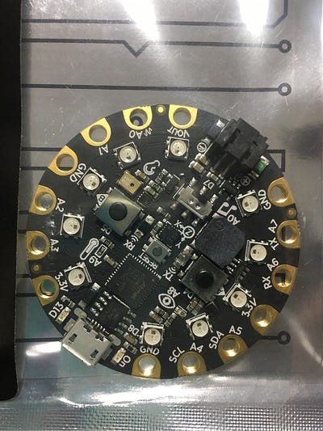

Photo by [Troy T](https://unsplash.com/@ttcollect?utm_source=medium&utm_medium=referral) on [Unsplash](https://unsplash.com?utm_source=medium&utm_medium=referral)

今天真心是上課超級好玩的一天!!!!!!!!!!!!!!!!

### Su 的裝備

但在開始之前，我必須跟你們分享一下 Su 的裝備到底有多誇張XDDD

*Su 的學習裝備*

除了第一天就自備外接螢幕外，第二天她還帶了筆電直立式散熱器、人體工學鍵盤、人體工學滑鼠，她跟我說這些投資很值得，全部加起來大概兩百澳不到LOL

另外她已經連續兩天跟我說「要是學校可以提供 standing table 就好了」… 所以哪天我要是去上學發現她買了一套在學校，我覺得也不是太意外?😂 (她在自己家裡也買了一套)

### Garret's lightening talk

今天一開始是老師 Garret 的 lightening talk……

沒錯! 這個 bootcamp還是一個包含公開演說 (public speaking) 的課程呢XD 

我們每個人(包括老師)都要輪流上台進行15–30分鐘的演講，題目任選!

所謂的 lightning talks 是一個西方科技業很流行的一種模式，要求大家在限時內(時間通常不會超過15分鐘) 針對特地主題發表演說。

主題可以是技術相關，例如新技術、個人 side project 等等，也可以是非技術性的，例如說個人嗜好等等。

Garret 講的是他自己成為程式設計師的故事，非常有趣！

而且他幾乎是什麼程式語言都學過，如果加上前端框架跟後端的伺服器，大概有二三十種(不誇張)，也太驚人了吧! (未來的 EC: 後來才發現 bootcamp 的師資流動量很高，很多老師可能教個一兩期就會離職，而且師資的程度參差不齊。有些讀完 bootcamp 之後沒有辦法成功找到的學生，也會留下來 bootcamp 當助教，甚至是當老師。而且我真心覺得 bootcamp 師資跟轉職的成功機率有很大的關係，後來我才發現 Garret 除了寫程式的能力很強、自學能力很強、他其實也很擅長教學！Garret從 bootcamp 離職後先是去了 Canva，後來也進了 Amazon 當 AWS Training and Certification Technical Trainer，真心是很強!)

### Kahoot 挑戰

結束後我們用一個叫 Kahoot 的軟體，一起玩搶答遊戲! 

遊戲有點像百萬大富翁一樣，題目跟選項在大螢幕上，每個人在自己的電腦上點選正確的解答(四選一)。除了要比正確率之外，手速越快的人也會得越高分，然後贏的人可以選一首歌來播，超級好玩的XDDDD (當然這個遊戲我遠遠落後，根本比不過那些常打電動的男生同學XD 最後獲勝者是天使小哥，然後他選擇播了 jingle bell ，我整個在內心狂笑不止! 哈哈哈哈哈)

### 模擬電腦運作

接下來是今天最爆笑的部分，老師要模擬寫程式的過程，他是電腦，然後每個同學輪流下指令，我們的目標是要一起製作花生醬三明治。重點是老師超故意的啦，如果你的指定沒有下得很明確，他就超亂來的XDDDD

例如第一個同學給的指令是「打開裝麵包的袋子」，結果老師直接從中間撕爆整個袋子，麵包直接掉在地上XDDD 

還有某同學給的指令是「打開花生醬」，結果老師直接把花生醬往地下砸，結果花生醬整個從瓶子底部爆開XDDDD

結果第一個花生醬三明治當然完全大失敗，我整個笑到不行XDD

我給的指令是「輕輕把花生醬上的封膜撕掉」，後來大家學乖了，每個指令要嘛加上溫柔地 (“gently”)，要嘛就要描述地很明確，避免老師又用暴力破解法XD (未來的 EC: 當年的我只覺得這段教學的娛樂性很強，在台下哈哈大笑。現在的我發現這真是深刻的一課，雖然電腦的運算能力比人類強大太多，但如果指令下得不夠明確或是不了解電腦的運作方式，其實很容易會得到意外的結果，這也是為什麼我們工程師常常在 debug 的原因！)

*程式訓練營早餐互動時光*

*最後被留在講桌上的花生醬吐司，也太慘烈了lol*

### 晶片玩具

今天我們也獲得了一個新玩具 Circuit Playground (長得有點像晶片)，我們可以寫程式控制它的變化，例如可以寫程式讓它唱歌(今天有同學成功XD)，還可以讓它閃七彩霓虹燈! 超酷的啦!!!!

這個酷東西真的很好玩，Garret真的是一個很有想法的老師！

*程式實作創意教學道具*

*老師自製程式概念教學工具*

*創意程式學習互動裝置*

### 凱西小姐

Coder Academy 為了推廣 Women In Tech，每個學期都會提供一名女性(或是自己身份認同是女性的學生) 一萬塊澳幣的獎學金，我不知道有多少人申請，但我那期進入獎學金面試關卡的有我、Su 跟凱西小姐。

中午吃飯的時候，我成功與凱西小姐搭話(是個澳洲小妹妹，長得超像 model，膚色蒼白，很瘦，而且腿很長! 其實我那天去面試獎學金的時候，就有在在外面聽到她跟面試官完全相聊甚歡，對話充滿了「哈哈哈哈」的笑聲。

結果我們閒聊沒兩句，她突然就說「最後拿到獎學金的是她跟 Su!」

聽說是到最後學校選不出來，所以就他們兩個人平分，一人學費減免五千，她跟我說她申請的作品也是做網頁XD 

可見我當天的直覺完全沒錯，輸給他們兩個我完全心服口服。凱西妹妹是個超級 hyper 的澳洲女生(她還自己做 emoji XDD)，Su 就不用說了，完全神人一個XDDD

今天的課程感覺不難，幾乎都是我在課前預習就做過的東西，所以五點一到我就開心地回家了!(在報名後、正式開課之前，學校有事先寄可以事先自己預習材料給我們，身為認真魔人的我當然是按部就班地完成了)

今天 Su 跟凱西妹妹下課後還要去參加一個叫作 Code Like A Girl 的技術聚會活動(需門票)，真心佩服他們。

另外這幾天我每天都輪流收到來自 CA 奶奶們(我的前同事 Rob、Sabah、Elaine、前經理 Saranne) 的慰問簡訊XDDD 覺得超級感心的啦~


