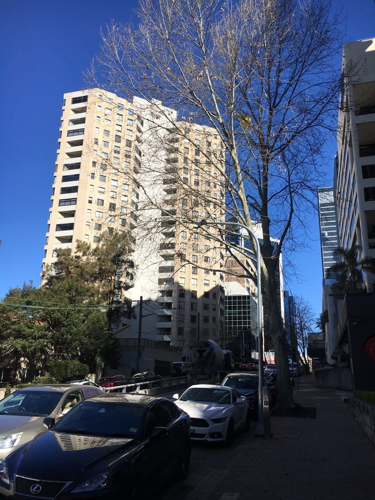

### 零基礎轉職澳洲工程師**:** 2019.08.23 Survived the 1st Week

今天也是平凡無奇的上課日XD

### 雪梨火車系統大崩潰

唯一不平凡的一點是早上雪梨火車系統又大崩潰! 本來從我家到學校只需約半小時的火車車程，結果我今天光到中央車站就先花了半小時，之後轉車好不容易擠上一班火車，根據指示在 Wynyard 換車，結果一到 Wynyard 根本沒火車可換 (所有北上火車都停駛)。

只好走出火車站去要搭接駁巴士，但排隊的人潮真心是多到我覺得我一輩子都不可能上得了，糾結了五分鐘，我選了 uber pool，花了我 $20!

結果到了之後，我在學校樓下遇到同學Ragan，他說他當時在 Wynyard 等了 20 分鐘的替代巴士，結果火車就修好了，所以他們一群人就回去搭火車，結果根本跟我差不多時間到…. 那我花了 $20 到底是為什麼(大哭)!!!

### 你是不是想賺我錢XD

午休時跟蘇一起吃飯，她帶了味增湯沖泡包!

可以在這種天氣享受到熱湯真是太棒了~~~ 吃飽後我們打算一起出去走走，結果在樓下遇到中國偉恩大哥跟尼泊爾同學尼拉吉，於是我們就四個人一起出去繞了一圈(不得不說偉恩大哥跟尼拉吉這兩個人真心是有夠好笑XDDDD)

隨便來舉個例他們兩個人有多好笑! 回到教室後，偉恩大哥突然問我說要不要喝茶，還說只有好朋友才有XD (他帶了散裝的普洱茶茶葉) 結果我拿著茶葉跟杯子準備出去時，他又突然叫住我說「你會洗茶嗎?」我回「蛤? 這還要洗嗎?!!」他回「沒有啊，我就問問你會不會洗茶而已」(是在耍我嗎XDD)

結果我泡完一喝，覺得根本喝不出味道，於是又加了一點茶葉，但我還是喝不出來，於是就被偉恩大哥嗆說「我看你珍珠奶茶喝太多，已經失去茶的味覺了吧」XD

然後偉恩大哥也問尼拉吉要不要喝，尼拉吉說「好啊! ….欸，等等，你這茶葉該不會是要賣的吧? 你是不是先拿來給我們試喝，然後之後就要叫我們買下來?」我在旁邊簡直要笑死XDDD

### 第一個週五

今天下午學校的總經理莎莉買了一堆啤酒、紅酒、白酒，所以下午可以一邊喝一邊做 coding 練習，覺得爽!!! 立馬喝了兩瓶啤酒，免錢的酒不喝對不起我自己!!!

Bootcamp 第一週，覺得很開心，每天都學到很多東西，同學也都很有趣，但這個bootcamp真的可以帶我去我想要去的地方嗎? (不過我想去的地方又是哪裡呢?XD)

這可能是我人生最主動學習的時候XD 一開始問問題只是為了讓老師對我有個好印象，現在則是因為我是真的有一種求知若渴的心！

* * *

**如果想要閱讀更多 EC 的文章，**[**請參考[目錄] 澳洲雲端架構師 EC — Medium 文章列表**](./2018-01-02-ec-post-list/index.md)

**為了服務廣大讀者，雲端架構師 EC 線上諮詢服務，正式上線囉！如果你想要跟 EC 進行 1:1 線上職涯諮詢，麻煩請填寫：**[**雲端架構師 EC 諮詢服務預約表單**](https://forms.gle/Zuro8YryCN5hH9Gk9)

**如果想要進一步支持我，歡迎透過以下連結請我喝一杯咖啡！你們的支持是我持續創作的動力，如有任何問題或是想要看的主題，歡迎留言與我互動 :)**

