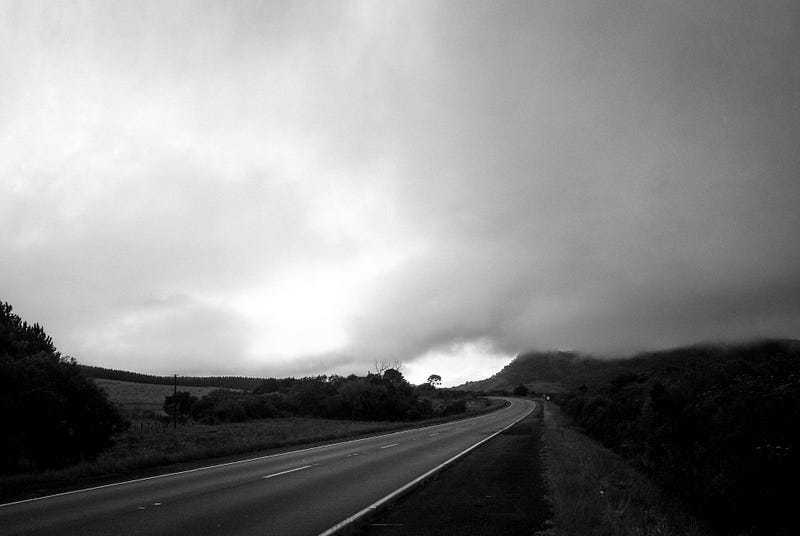

Photo by [Jorge Vitorino](https://unsplash.com/@jorgevitorino?utm_source=medium&utm_medium=referral) on [Unsplash](https://unsplash.com?utm_source=medium&utm_medium=referral)

沒有跟上進度的後果就是我今天的 Kahoot 輸得一蹋糊塗XDDD 真心是好多題的答案我都不知道哈哈，最後的總排名是 13/17 ☹

是說我們來上課的同學也開始變少，我們班照理來說應該有25個! 不知道他們是不是在 census date (選課退選日) 之前退選了，還是他們都選擇在家看錄影?

Su也已經三天沒來了，因為她健康狀況不佳。

放學前馬克突然感嘆「我真心不知道那些沒來上課的同學要怎麼接得上?」 我說「對啊~ 我每天都來上課，但我都快覺得我要跟不上了😭」

今天我已經開始深深懷疑 「Am I too stupid to become developer?」 (哈哈! 最近上課的難度已經難出一個新高度!!!)

這週班上同學也開始出現進度不一致的情形，厲害的同學都在做當天的東西，但很多人都還在做昨天、前天或是上週的東西XD (這時候其實很掙扎，因為你真心會覺得自己好笨! 有些你想了一個晚上也解不出來的問題，隔天早上來問同學，同學說「喔~我還沒寫耶! 那我現在來試試~」然後五分鐘後他就用五行 code 解決了這個問題!!!! =口= 這個人就是聰明的馬克！)

今天早上又在樓下咖啡店遇到雷根小哥(我幾乎每天都在咖啡店遇到他)，雷根小哥也有同樣的掙扎，就是時間有限，但要做的事又太多(不過說歸這樣說，雷根小哥跟馬克小哥分別是今天 Kahoot 的第一二名XDDD 高手們總是很謙虛?)

今天午休跟雀爾喜姐姐、里奇小哥、偉恩大哥、Niraj小哥一起吃飯! 雀爾喜姐姐之前在中國學中文的時候當過雅思老師，於是大家就開始聊雅思的事(偉恩大哥表示「小時候就在澳洲長大的我完全無法參與」XD)。雀爾喜姐姐講了很多，讓我突然覺得雅思其實不只是語言考試，其實更是一種文化(邏輯思維)的考試!!! 難怪有很多問題我們都答不出來，因為英文母語者的思維模式真的跟我們不一樣，你不管問他們任何範圍的問題，他們都可以找到切入點侃侃而談，但對我來說，要是問到我不熟悉/不感興趣的主題，我就什麼話都說不出來啊XDD (但這代表我英文不好嗎? 我覺得也不至於吧？)

但雀爾喜姐姐真的好愛講話，如果你不插話打斷她的話，她就一個人狂講好幾分鐘。我昨天不覺得，可能是因為我跟天使小哥都會直接插話(?)，但今天的大家都沒有(我也忙著吃飯+其實對聊雅思技巧不是很感興趣XD)，所以她真心源源不絕地講!!! 我吃完就默默撤退了，還趁機一個人去外面快速散了十分鐘的步XD


