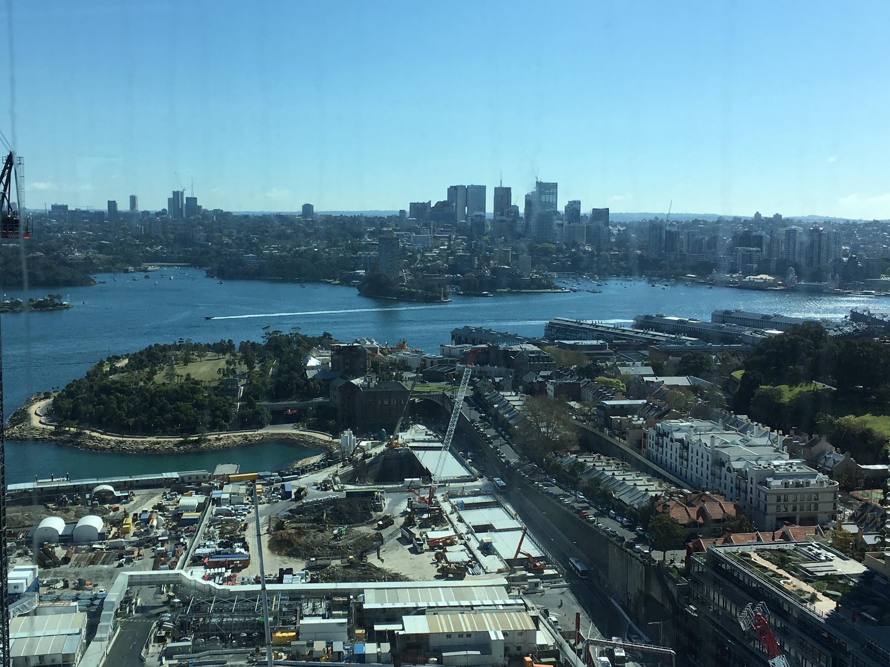
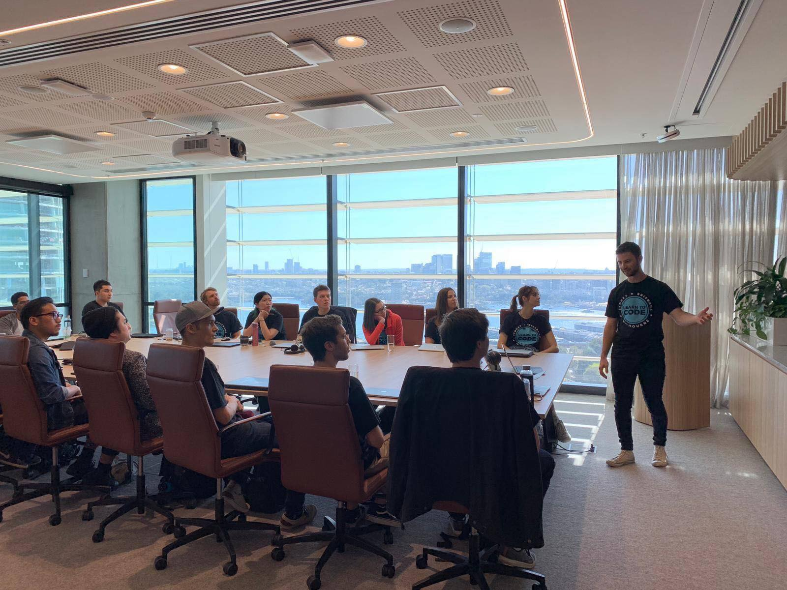
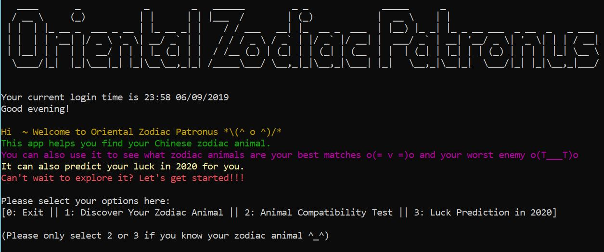

### 2019-09-05 & 2019-09-06
終於完成我們第一個 project了，我的日誌都快變週記了XDD

趕快趁稍有喘息的空檔補日記，因為是後來寫的，再加上這幾天真心忙到發瘋，所以敘事可能會有點意識流(?)
首先來個簡單的自我反省吧XD

最近覺得我的個性有點太放了，真心必須在學校收斂一點!!!

其實我一直都是這樣，把身邊的人分成兩類，一類是圈圈之外的人，例如不熟悉的友人/每天會見面的同事/路人，對於他們，我什麼都不想說，連場面話都不想假裝，就是一個句點王😆 另一類是圈圈內的人(這個圈圈通常滿小的)，對於圈圈內的人來說，我非常活潑，因為我基本上無話不說哈哈~

最近覺得我在課堂上過於活潑了，其實 bootcamp 的人對我來說應該位於圈圈之外，但可能因為我跟他們見面的頻率太頻繁了，而且互動過於緊密，所以我開始把所有同學跟老師都劃在圈圈內對待，但其實不該是這樣，感覺已經對別人帶來困擾，所以必須要好好收斂一下!!! 目前覺得可以放在圈圈裡面的人應該只有里奇大哥、Niraj大哥、Su、偉恩大哥~

上面那段的簡單翻譯就是，很不幸地我跟我們  bootcamp的老師磁場不合XDDD 別誤會，其實他教得很好，但我們真心就是話不投機(不管是課堂互動或是日常社交對話)，我可以很明顯感受到他不太喜歡我! 天啊，好久沒有這種感覺了，通常我身邊的人都很喜歡我哈哈哈(但也有可能是大家都裝得很好，所以我沒發現😅) 導致我有問題都不是很敢去問他，每次都有種熱臉貼冷屁股感XD 但我有時候又克制不住自己發言的衝動，老師應該也覺得我在課堂上/教室裡很煩人😂😂😂

相反的我就很喜歡助教，說真的，助教完全就是一個榮恩!!!! 助教跟榮恩的講話方式(尤其是叫我名字時)真心一模一樣XDDD 而且我覺得助教在回答你的疑難雜症時會用引導的方式讓你自己慢慢推導出答案，而不是讓你覺得自己在問笨問題或是覺得自己是一個搞不清楚狀況的愚婦~

總之，我真心必須要克制自己想發表意見的衝動，只在關鍵/必要時刻發言! 這麼做不是因為我怕老師討厭我，我根本一點都不在乎別人討不討厭我(而且反正他本來就討厭我啊XD) 只是因為我覺得這樣做對所有人都好~ 所以接下來我會努力克制自己發言的慾望的!!!(三思而後行，我可以的😁🙊)

回到標題，我們有三天完成我們的第一個 personal app，在這三天裡，我真心崩潰無數次! 就像我的好朋友 W說的「fuck career transition!」當初有個輕鬆寫意、錢多事少離家近的工作我不珍惜，一心想轉職，現在嘗到苦果了吧XDDD (雖然我事後冷靜下來想想，之前在CA的生活雖然很棒，但我可能也撐不了多久啦😂)

首先我必須要說這個作業的設計真心很爛，要做的事情超級多，但給的時間又超級短，然後老師宣布的時候又很模糊，所以大家都有各自的解讀，然後幾乎每個同學都要把每條規定再拿去問老師或助教一次，然後每個人多多少少還會拿到不一樣的答案??? 所以光連每個文件，甚至是每個sections 要怎麼寫都撲朔迷離囧 再加上我又不是一個很 chill 的人 (緊張大師就是我 = v =)，在看到幾個天才同學做的 apps 之後，我整個人心態完全崩盤，根本不知道自己要幹嘛(人生第一次不知道要怎麼寫作業，也算是一種新奇的體驗?😏)，又覺得自己的app爛死了(設計的功能很簡單就算了，寫的code也沒比人高明) (:3」∠)_
...我只能說好險我最後還是撐過來了?

週五我們全班移師到Australian Computer Society (ACS)位於 Barangaroo 的辦公室發表我們的app，必須說ACS的辦公室真心無敵霹靂高級!!!! 如果說，一般台灣辦公室的環境是60分，我會給CA的辦公室90，那ACS的辦公室就是 1000 分XDD (下面就是我們從窗戶看出去的畫面，請原諒我隨手一拍，拍得滿爛的LOL)

沒錯，我沒有多打一個0，請聽我細細道來，首先他們的辦公室在雪梨CBD中的CBD，位於27樓，俯瞰整個雪梨港灣大橋，而且辦公室整片都是落地窗，所以你幾乎是從高空360度欣賞雪梨的精華 harbour view。其他什麼免費早餐區，超大bar台，超大落地窗海景會議室我們就不提了。再來ACS身為一個IT職業協會，他們裡面擺了好幾台互動式觸控螢幕跟一堆遊戲機，你能想像兩個同學可以在超大的互動式螢幕上用雙手把程式丟來丟去當拋接球遊戲嗎? 根本就是科技電影中才會出現的畫面好嗎XDDD 而且ACS的戒備之森嚴，我們所有人必須”團進團出”，因為不這樣的話，我們根本完全無法進辦公室，也無法搭電梯XDDD (下圖就是我們發表時用的海景會議室，照片是我從學校臉書偷的LOL)

今天的presentation 一人只有5分鐘(另一個奇怪的設定，5分鐘要你 demo 你寫的程式，還要講設計理念跟其他東西，這合理嗎? 至少給我們一人10分鐘吧? 又或只是我個人的time management有問題?😂) 總之我們採取抽籤的方式決定順序，在19個人中我很幸運的抽到6號，完全是一個完美的數字，因為我完全不想在後面發表(得要提心吊膽多久🙈)，但也不想當第一個XD 以下是發表順序跟大家的作品概念

1
度假地點推薦app:
根據你選擇的旅遊天數，幫你決定旅行目的地並推薦旅遊活動

2
造橋app (這位同學本來是個造橋工程師):
模擬造橋工程測量的app (內含一些基本造橋數學及物理公式)，玩一玩之後感覺你好像也可以造一座橋了XDD

3
精神動物app:
簡易版的心理測驗(問題描述很爆笑XD)，可以測出你是哪種精神動物，這位同學挑了一些超級獵奇的動物選項!

4
媒體資料庫 app:
可以記錄你的電影音樂心得，聽起來有點無聊，但這個同學用了一些我們從沒學過的高級程式概念(好像是他在這三天中自學加問老師的)，超強!

5
筆記app:
這位同學的投影片版面很漂亮(這樣講是否有點傷人LOL)

6 我
生肖app:
功能為 1. 算你的生肖 2.告訴你跟那些生肖屬性合，跟那些不合 3. 算你在2020會不會犯太歲XD
完全就是勝在主題新奇有趣，沒什麼特別強的coding skills LOL

7
Trivia app:
請原諒我無法把trivia翻成中文，大意就是西方人愛玩的知識性益智問答

8
職業健康安全 app:
專為久坐辦公室的上班族而設計，告訴你如何在辦公室裡做各個部位的伸展運動

9
勇者冒險app:
這位同學基本上做了一個簡易版的RPG故事遊戲(概念大概是像薩爾達傳說那樣)，不‧會‧太‧威‧嗎!!!

10
海戰棋app:
里奇大哥的作品，是所有app裡面我最愛的一個! 我不能打遊戲的英文名稱，因為太容易被發現。基本上，他寫了一個跟電腦對戰的踩地雷遊戲!!!! 這個遊戲的完成度感覺可以拿去賣吧? 太誇張了!!!

11
從缺

12
也是一個角色扮演app:
這位同學威的地方是她找了一個可以撥放音樂的 Ruby Gem! 也是一個很有趣、很多graphics 的app

13
剪刀石頭布競技場 app:
角色以剪刀石頭布競技，會隨著對戰結果展現角色的傷害值

14
運動賽事統計資料app

15
字卡app:
小聰明雷根小弟的作品。概念很簡單，但是 coding 技巧極為高超，介面非常美，功能性很強，也是一個完成度很高，可以拿出去賣的作品!!!

16
水果或蔬菜app:
讓你猜這是水果或蔬菜的遊戲。厲害的地方在於這個同學用了一個呈現圖片的Ruby Gem，也就是你猜對的瞬間會有一顆超大青花菜跳出來在你的螢幕上XDD

17
彼特幣估價王:
這個同學的設計理念超搞笑，是一個因為彼特幣的浮動匯率而苦惱的同學，所以他的設計理念就是讓你覺得超難猜、超苦惱! 我簡直是要笑死XDDDD
每解釋一個功能這個同學就會說「恩~ 我故意把它設計得很煩，因為彼特幣就是讓我覺得這麼煩」XDDD 超鬧的啦哈哈哈! 也是一個廣受好評的app

18
擷取美國太空總署發表的照片並一鍵就可以設定為電腦桌面的app:
這位同學用的是API，大概是我們下個term才會學到的技能(這位同學不會太領先全班嗎?XDD)
不過壞處是這位同學的app要連結到太空總署才能用(據說有時間及時區限制)，很不幸的，輪到這位同學時超過了時間，所以她的app直接當場掛點LOL (不過後來結束後她還是有機會展現了一下她的app啦! 只是因為這位同學是個非常沉默的個性，所以當下場面超級乾LOL)

19
樂透號碼程式:
恩~有看上一篇的人都知道這是誰的app。重點是偉恩大哥在演示的時候，問大家要挑什麼號碼，然後立刻被聰明的馬克同學看穿邏輯漏洞!!! 請讓我們替偉恩大哥默哀三分鐘XDDD
事情是這樣的，某一個同學先說要選4號，然後過了幾個人之後，馬克突然說「我要再選一次4號」(大家都知道大樂透的號碼照理來說是不能重複選的XD)

其實偉恩大哥當場的反應其實超棒，他立刻就回說「不要啦~ 4上面已經選過啦，再選一次多無趣啊~」。不過他還是又再輸入了一次 4 啦，然後我們就看到4號在樂透彩券上出現了兩次(bug 😂)

總之聽完所有發表之後，我覺得我的app雖然不是最好的，但至少也不是最差的XDD 而且我完全就以趣味性取勝，好幾個同學看到我都想要叫我幫他們算一算XDD (下圖是我的 app)

嚴肅的話題上面講完了，接下來講點趣事。今天在台上發表時，我講12生肖的故事講到一半......突然我的 slack message 整個彈到大螢幕上，原來是我們轉PT的Niraj大哥傳訊息跟我說「EC~ Good luck to your presentation today」!!! 前面說過我們一人只有五分鐘發表，要有多巧才能讓Niraj大哥剛好在我發表時祝我發表一切順利XDDD (好險他沒傳什麼私人訊息給我，不然整個當場被全班看光XDD)

另一個趣聞來自今天坐我旁邊的里奇大哥，在雷根小弟發表完之後，里奇大哥突然很緊張的跟我說「EC~ 可以跟你借紙筆寫一下嗎?」 (我把筆記本攤開在記錄大家的app ideas)，我一答應，他就力馬寫下了一串數字，然後說「我剛剛偷看到了，這是雷根小弟的GitHub帳號，快記下來!!!」

然後我就用電腦搜尋了雷根小弟的帳號，然後想也不想就點下 GitHub的追蹤按紐。這時候里奇大哥在旁邊幽幽得說「…..其實我不會公開追蹤大家的帳號，因為我怕大家知道我在stalk 他們!」我說「是喔~ 我覺得這沒什麼吧? 」(GitHub 有點像是 developers 專用的Linkedin? 每個人都可以在上面發表你的open source coding projects)

里奇大哥說「……恩~ 其實我還有在偷看AA與BB的GitHub，今天終於知道雷根的了…… 喔~其實我也有在偷看你的GitHub啦!」我「………你可以直接追蹤我關係」里奇大哥你在幹嘛啦XDDDD GitHub 又不是什麼發表私人心情日記的地方，我完全不怕被追蹤好嗎😆 其實我之前就對里奇大哥的 stalker屬性略有所感，因為他之前曾經告訴我他一個人默默在廚房吃飯，然後偷聽兩組同學在廚房裡的對話XDDDD 真心是要被他笑死哈哈哈

今天因為我早早就發表完了，所以心情很輕鬆(雖然後來回家後我還是改project改到快十點才交XD)，再加上ACS離CA超近的，所以我就跑回去跟以前的同事 catch up (哭訴?)了一下，覺得非常開心💓😍

