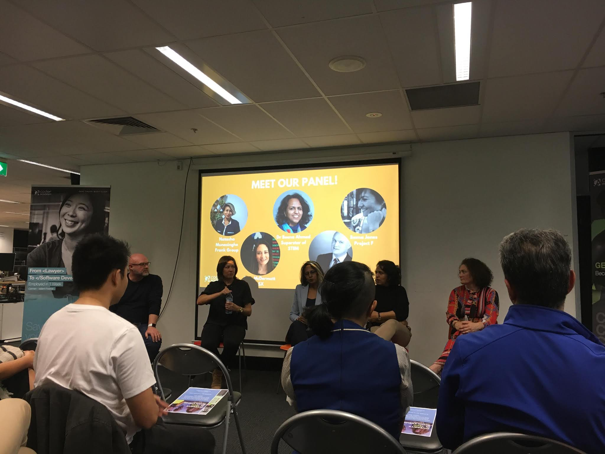

### 2019-09-11

今天上課問了老師一個問題，結果他突然超嗨的XDDDD

他說「這個問題真的是問得太好了」，然後就開始很興奮地解釋，完全嚇了我一跳 (其實我並沒有覺得那個問題特別聰明或特別有意義?)

連老師講完自己都說「我知道我剛剛太興奮了」~ 笑死😆😆😆😆

今天的課程一樣看似輕鬆，但我深深覺得這只是假象~ 他們真心很喜歡教了一些基本概念後，就期待你能做出很複雜的project……

但重點是，我們的同學們完全就可以超越大家(至少是我XD)的期待!!! 他們真是太棒棒了😂

今天早上簽到時(沒錯，我們每天都要簽抵達時間跟離開時間，簡直比高中生更高中生XD)發現簽到表更新了，我們班正式從25個人降到 20
個。Su跟Niraj要轉去part-time，剩下三個不知道是直接退出，還是也要轉?(因為他們三個實在太不常出現了，我甚至一點風聲都沒收到lol)

**Second Meetup**

晚上去了這週的第二個 meetup，其實我後來真的一點也不想去LOL (我真的錯了! 當初就不應該報名的😭😭😭) 

但因為這也是我們學校辦的 meetup，如果突然不去感覺一定會被抓包，所以我就去了! (而且 Su也要去，雖然她也一樣後悔XDD)

相較於第一個 technical meetup，這是個研討會形式，主題是如何增加女性在IT產業中的比例。

不過這個研討會完全比我想像中精采，有一個觀眾提出了一個政治不太正確的發問，結果被五個 panelists 群起而攻之，我簡直要笑死XDDD

其實我可以理解這個人的想法，也覺得他沒有惡意，但在這種場合做出這種發言真心是找死LOL

尤其是有幾個panelists個性又特別強，當場火花四濺哈哈

PS: 今天有一個女生人超好的，她看我拿完啤酒之後有點不知所措，就以眼神示意我加入她與她朋友的三人對話。

(沒錯! 今天的 meetup 終於有酒水提供了，但他們宣傳上完全沒提到這個，難怪大概只有20個人參加)

而且她居然是在澳洲第二大房產網 domain 工作，後來想想完全沒有要任何聯繫方式好像有點可惜? (不過這麼會 social 的我應該也就不是我了?😂)

