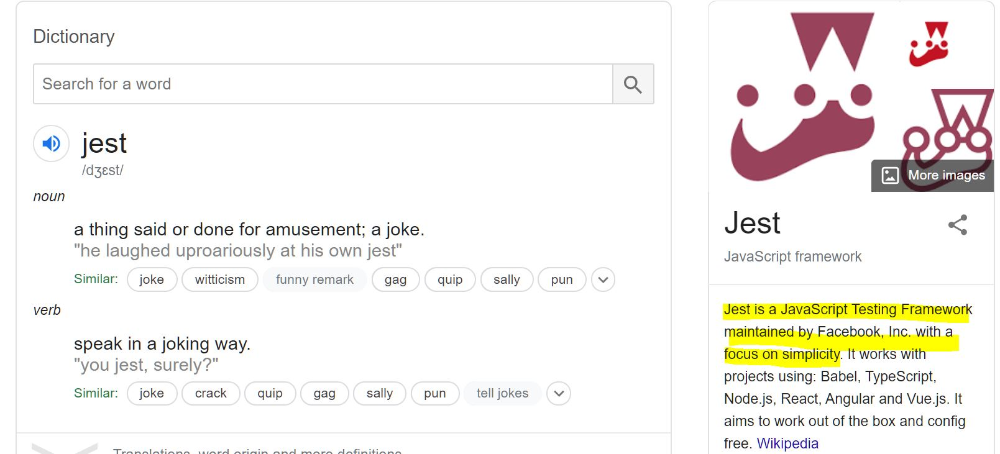

**
2020-02-05 Wed**
**
**
今天是我們做 project的最後一天，但我們還是有一堆東西沒完成。早上小組討論我們組又開始有點吵起來(不過其實我們這組一直都吵吵鬧鬧啦XD)，我覺得我們的網站還是需要再多做一點styling
(因為我覺得目前看起來真是太醜了XD 雖然styling根本不算分，但我覺得如果完全白底黑字沒有styling，第一眼看起來就覺得這個網站不怎樣.......)。
羅比小弟說他可以完全負責styling沒關係(因為coding的部分不管是frontend
或是 backend，他其實也都做不出來，styling是少數他可以做的事)。重點是他之前其實幫我們的網站做了一些styling，但是真的很醜啊 (後來也都被妮娜刪光光了，我想她應該也是覺得太醜受不了吧? 😂)!!!!!! 醜到我真心接受不了，於是我就開始很掙扎!!! 因為雖然他很熱心想要負責這一塊，但我真的沒有辦法接受他做的styling，可是我也總不能直接開口說「我不希望你做這個，因為你真的做得很爛(因為他其實也做不了任何其他事，coding不行，寫文件也不行，他每次寫的documentation我跟妮娜都要大改，他才是澳洲人耶...)」。
於是我們討論了一下結果僵持不下，羅比小弟就說那他下樓抽根菸休息一下。然後就只剩我跟妮娜在樓上，我就直接跟她講了我內心的掙扎，然後我就莫名其妙哭了????? (我自己也台灣人問號LOL 難道我其實這陣子以來壓力很大嗎?XD) 我掙扎的部分在於，我覺得自己對羅比很壞! 雖然他的確什麼都做不好，但我是否不該剝奪他參與這個project的機會? 但我又覺得如果他做完的東西，我跟妮娜後來都要全部砍掉重做(這個情況在我們整個project期間已經發生過無數次)，那一開始為什麼又要交給他呢? 而且今天已經是最後一天了，我們完全沒有機會再重做……
妮娜看到我哭了於是就開始努力安慰我，然後就說她想要去附近的officeworks買筆，於是拉著我出去走走，回來時我就心情平復很多了。(妮娜的說法是「如果你真的覺得他做得很爛，你就直說啊，這樣他才能改進」。我說「事情不是這樣說的啊，羅比的個性又不像我們兩個一樣這麼強(可以當面接受批評也沒關係)，而且我們都知道羅比因為壓力問題，有定期在看心理諮商師，這些話我怎麼可能直接對他說出口?」)
其實我哭的時候，助教布魯斯剛好在廚房裝水看到了，於是我一回來就收到學校工作人員送我的timtam 跟祝福小語，其實還滿貼心的 💗 (雖然布魯斯沒有直接跑來安慰我，但我猜他應該是轉告給所有的工作人員了LOL)
總之等我們三個都休息回來，我們決定重新開始分工，我跟妮娜早上狂做styling(一開始妮娜還說styling大概一兩個小時就可以做好，我完全覺得她太天真! 結果事情完全就如我預料啊XD)，下午三四點我們決定styling就到這裡了，因為真心還有太多其他事要做，接著我們就開始 deployment。
羅比後來被分配到的工作是做技術文件的一小部分，內容是把我們所有用的軟體 package 列出來(這點很簡單，打開程式的某一個檔案複製貼上就好)，然後每一個package要寫一個簡短的描述。我們之前做過類似事情，當時我就跟羅比說，這種東西不用自己寫，你就google 每個package的名字，然後複製貼上簡介上的第一行就好了。這種明明可以複製貼上的事，他到底為什麼要自己寫LOL (重點是自己寫也寫不好，因為他根本也就搞不清楚每個 package 的功能是什麼啊……) 後來他寫的東西我就直接用了，因為我根本沒時間改，但我真心覺得這麼簡單就可以達到一定標準的事，為什麼他也做不到呢……

(就像這樣，google之後複製貼上簡介的第一句不就好了嗎? 為什麼要在你根本就不了解每個package是做什麼的情況下自己寫呢???😂)
最後一切大致搞定之後，我們開始討論presentation的事，結果又是一陣吵吵鬧鬧。後來妮娜就說「不然每個人都說一下心目中覺得要怎麼進行 presentation
，然後我們再討論要怎麼做。說個大概流程就好，不需要太多細節。」
我的答案是我覺得我們應該要講一下這個project的overview、客戶對於這個project的要求、然後展現一下我們project的架構圖(因為我們的project真心很複雜，放這個圖看上去就有夠威)、然後妮娜可以講一下 image
annotation 的部分(因為這是我們project的核心，我也覺得會是所有人最感興趣的地方)，最後做一下demo。妮娜的答案是她覺得我們應該要從 user
stories 的角度展開，說明admin
users用這個軟體可以做什麼，regular
users 用這個軟體可以做什麼，我覺得也是一個很好的切入點。
接著輪到羅比小弟的回答，他一開始講的東西跟我的回答一模一樣，後來就開始說所以他覺得投影片上要列哪幾點，每一點要寫什麼。講到這裡立馬我就打斷說「我們只是討論要怎麼進行 presentation
(例如怎麼切入、流程什麼)，不用講太細節的東西。」結果羅比回說我知道啊，然後就開始繼續重複那一套。我當下坐在那裏突然覺得「所以你對presentation這件事完全沒概念對吧…… (過去這六個月來，羅比從來沒有上台present過他的project，因為他對這件事有心理障礙。他是真的有在看心理諮商，所以我估計老師也沒有強迫他一定要上台)」。總之我們僵持不下，後來決定妮娜做投影片，我報告。(妮娜也不喜歡做presentation，因為她一上台緊張，講起英文來就很不順。我沒有特別討厭或喜歡presentation，對我來說這就是一件必須要做的事而已，反正也沒選擇餘地XD)

