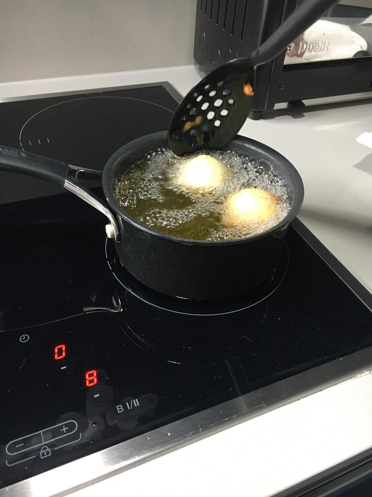
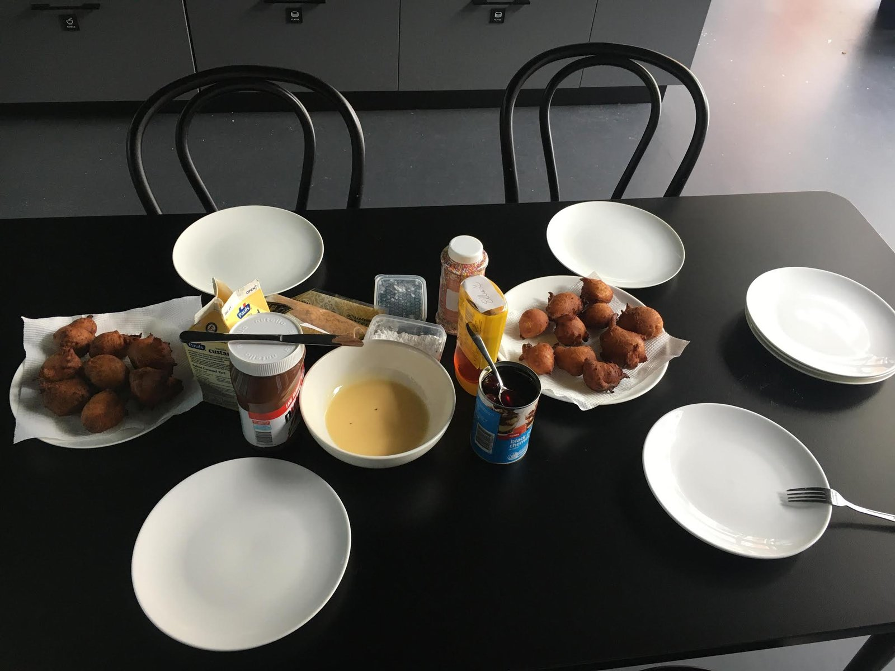
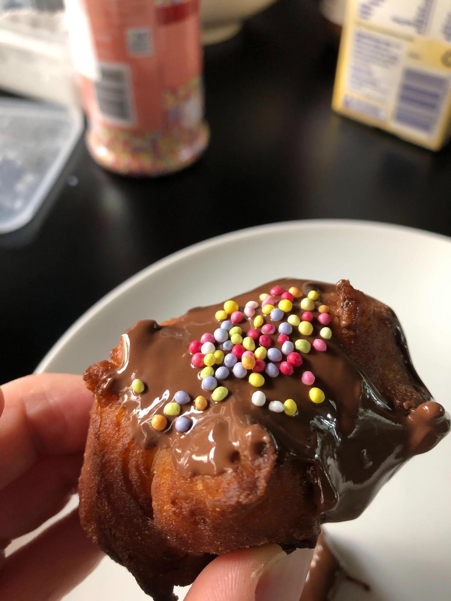
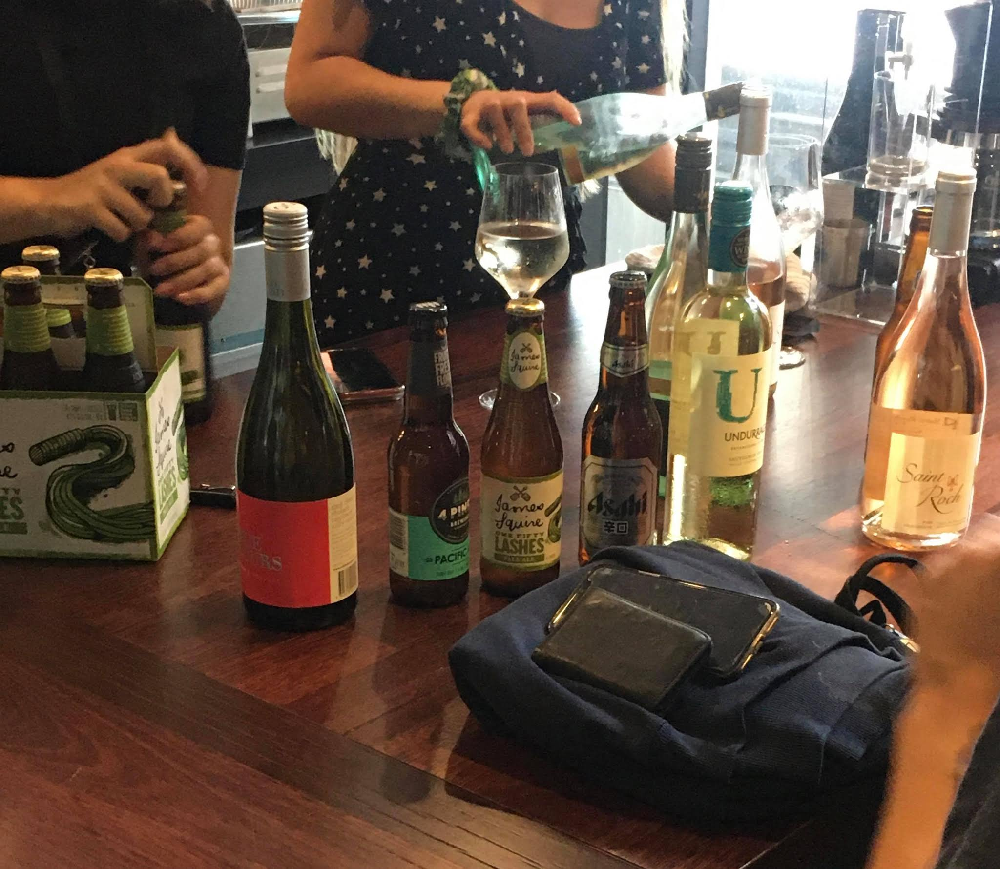

---

title: "零基礎轉職澳洲工程師: 2020.02.21 Internship – Survived the First Week"
date: 2020-02-21
slug: "2020-02-21-internship-survived-the-first-week"
cover:
  image: "images/87033110_170804301040403_8636623888689659904_n.jpg"
  alt: "零基礎轉職澳洲工程師: 2020.02.21 Internship – Survived the First Week"
images: ['images/87033110_170804301040403_8636623888689659904_n.jpg', 'images/87044098_191884335365396_1040341405232267264_n.jpg', 'images/86935389_559356518012915_7477196840069234688_n.jpg', 'images/87037672_236776254002169_1176147622591725568_n.jpg', 'images/87018620_2262422097398510_4067544310910812160_n.jpg']
categories: ["零基礎轉職澳洲工程師"]
tags: ["程式訓練營", "Coding Bootcamp"]
episodeseries: ["零基礎轉職澳洲工程師"]
draft: true
---

**2020-02-21 Fri**

今天早上我終於把做了超久的 typescript challenge 做出來了(雖然這其實只是其中一個XD)!!! 人超好的里奇大哥其實還在D先生不在時問我說要不要看一下他的答案，我說不用 (心想，就讓我死在這裡吧XD)，沒想到後來居然還是成功做出來了!!!
不過我後來跟里奇大哥分享我的答案後，他立刻幫我抓出一個
bug，還順便再跟我解釋了一遍O(c) (演算法裡面的時間複雜度的一種)到底是什麼，我心想這個概念雖然我們在 bootcamp 裡大概學過(其實也不算，因為教我們這個的助教自己也說不清XD)，然後D先生其實也已經講過一次給我聽，但我還是覺得這個概念太違反人體工學了吧😂!!!! 不過里奇大哥再講過一次之後我的確是覺得好了一點~
今天大家終於沒有聚在一起吃飯，所以我愉快地跟里奇大哥一起吃完午餐，還有時間去外面大散步! 覺得好舒壓~~~😍
下午繼續做我的 task (雖然D先生昨天帶著我做了一堆，但我們根本還沒把我們打算做的部分做完囧)，因為如此我的程式現在裡面充滿一堆bugs
哈哈哈哈 不過D先生叫我先不要管那些，還是先從簡單的做起(雖然他的簡單項目對我來說根本也不簡單XD) 我先用暴力破解法把 floor
plans 的上傳數量限制為2，接著D先生給了我提示要怎麼解決下一個簡單任務。天知道雖然有了提示，但我自己研究了老半天還是看不出個所以然哈哈~ 於是我就隨口問了旁邊的里奇大哥，有沒有聽過 D 先生提示裡的那個 component，里奇大哥說「我也沒有……」。然後里奇大哥就幫我查了一下，五分鐘之後我就按照他的指示做出來了XDDD
他真是太棒了!!!! (其實我也google了一下，但我後來發現我google的關鍵字根本跟里奇大哥完全不一樣哈哈~ 這年頭，就算想上網抄答案，也必須要有點慧根才行啊😂)
其實我真心覺得里奇大哥的自學能力超強，而且觸類旁通速度超快! 他這幾天靠著自己的摸索，幾乎要把他的task完成了!!! 相較之下，H小姐還卡在我跟里奇大哥第二天花了三個小時解出來的
mini challenge，根本完全還沒開始做其他事(雖然這樣說對她也有點不公平，因為身為正式員工的她這幾天要開的會比我們多~ 但她已經有1.5年的軟體工程師的經驗，照理來說轉換
framework 的速度應該要比我跟里奇大哥快吧? XD)
每週五S公司都有固定的兩個活動，首先是下午三點的
demo time，每一個人(包含我們三個新人、M先生、D先生跟兩個designers) 都要向大家展示自己這一個禮拜的成果，而且全程會錄音加錄影存檔，方便大家(主要是CEO)之後參考。這時候就慶幸我是在場唯一一個用 windows
電腦的人，windows的錄影功能不能用哈哈哈(只能錄音) H小姐就只展示了她的mini challenge 的當前進度(請注意，她根本還沒做完哈哈哈)，而且她目前做的方法完全跟 challenge instructions 無關lol
另一個活動就是下午四點到六點的 team time，這時候不管大家手上有什麼工作未完成、也不管大家現在有多忙，所有人都要一起參與這個活動。這個禮拜的活動是由D先生帶著大家一起做義大利甜甜圈，超有趣的啦哈哈哈 然後每個人要帶不同 toppings，我帶了蜂蜜跟肉鬆去嚇死她們哈哈哈
(只有M先生敢試吃了一口)

今天也剛好有這棟大樓的喝喝 event，所以我們又一起下去聊了天~

我今天還約了羅比小弟跟妮娜一起下班後喝酒小聚(其他參加的人還有里奇大哥、偉恩大哥、哈利、麥克斯)，結果絕大部分的人都有一堆苦水要吐XDDDD 雖然他們不需要像我跟里奇大哥需要使用一套全新的
frameworks 集合(typescript + Angular + GraphQL)，但就算他們的實習公司是用我們bootcamp教過的程式語言，大家還是覺得現實世界的coding跟我們以為的完全不一樣XDDDD
然後不管是妮娜、羅比小弟、偉恩大哥，都認真考慮過是不是該終止實習囧
甚至里奇大哥今天超認真問我說，如果他決定不繼續實習的話，我會生氣嗎? 我說「不會啊，雖然我會覺得很難過，但我尊重你的選擇，因為你開心與否最重要!」里奇大哥停頓了一下回我說「…… 可是你要是跟我說你不實習了的話……我會超生氣的!!!」我聽完整個大笑XDDDD
跟大家聊完天之後我完全覺得好了很多，雖然我其實每天也都覺得很 miserable，不過我倒是沒有想過要退出實習，因為我不想當個
quitter😆。我只是覺得就算撐過實習我也不會找到工作而已，然後妮娜今天就安慰我說「不會啊~ EC 你可以的!!! 如果不行的話，我們就自己創業!!!」整個快笑死~ 我覺得妮娜就是我最新的西方心靈導師，每次跟她聊完都會充滿力量~
