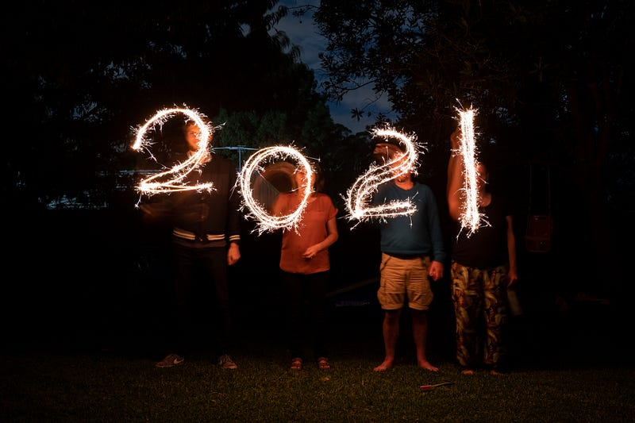

* * *

### [生活] 2021 年回顧

Photo by [Tarryn Myburgh](https://unsplash.com/@tarrynm?utm_source=medium&utm_medium=referral) on [Unsplash](https://unsplash.com?utm_source=medium&utm_medium=referral)

(原文發表於 2022.01.02)

3月搬來坎培拉，4月時參加了五公里的 Canberra 馬拉松節。其實一開始我真的還滿享受探索坎培拉的，可能是因為當初 Ryan 幫我搬家時一同在坎培拉玩樂了幾天，也可能是因為當時 Lawrence 還在⋯⋯唉，總之我非常想念有你們的坎培拉 T^T

7月時戴上了牙套！這件事其實我想了好幾年了，也不知道為什麼去年一時衝動就真的實行了XD 隱適美其實滿貴的，大概要1萬澳幣，但是Amazon 幫員工保的醫療保險非常罩，一年可以拿到$1500的補助。我目前已經領了$4500了，完全是戴越久領越多！想想在Amazon 工作真的是滿幸福的!!!

但對於牙套療程這件事我現在還是持保留態度，因為我真心覺得太煩了(哭)，目前只能 trust the process lol

8月初去了人造滑雪場幫 Mickey 慶生，是個非常開心、非常特別的回憶！打了第一劑輝瑞疫苗，坎培拉開始為期兩個多月的 lockdown，簡直沒把我逼瘋。心情每況愈下，開始覺得每天工作都是折磨QAQ

9月中打了疫苗第二劑，9月底封城限制開始逐漸鬆綁，於是我一時衝動，買了一間一房公寓。

找房、看房、買房的心路歷程也是相當煎熬！明明我才是那個出最多錢的人，但整個過程中都覺得我是最 powerless 的那個人，不管是屋主、owner’s agent、律師、broker，我總覺得每一個人都 has more say than me!

11月、12月我連去了兩次雪梨訪友，這時我已經快被坎培拉跟工作逼瘋了! 但是這兩趟旅程見了很多好朋友，給了我非常多力量！尤其是12月中與好久不見的Winnie 同遊，完全大聊特聊，超級開心~

最後在年末順利入住新房，持續花了很多時間在佈置房子，其中非常感謝我的前房東，完全是超級大好人，讓我可以順利提前解除租約。還有 Mickey，完全是一個買房子的人是我，但她比我更高興的人XDD

回顧這一年，大多數的時間我都被工作上的心魔所折磨(其實沒有任何人在逼我，但我總是因為達不到自己的期望而感到沮喪)。Imposter Syndrome 是真的(雖然我完全不覺得我是 Imposter Syndrome, I am the Imposter here!!!)，但好險在一年的尾聲我終於開始學會釋懷了一點(但也可能是因為我12月一心再期待放假，只想擺爛，希望不要在週二開始上班又再度發作XD)。

如果你覺得憂鬱、覺得沮喪，最糟糕的狀況就是把自己封閉起來，誰也不想說。但其實跟朋友或身邊的人聊聊，真的會好很多，你會發現自己並不孤單(因為大多數人肯定跟你有一樣的煩惱)。如果情況真的很糟糕，強烈尋求專業協助！我以前也覺得心理諮商都是屁，但他們其實真的能幫到你。如果覺得跟諮商師不合拍，果斷換另一個，絕對會找到跟你合得來的XD

總之人生不就是這樣，雖然也沒什麼好期待的，但感覺還是可以靠著珍惜日常小確幸繼續度過每一天XD

Let’s hope better days will come~

—

如果你喜歡我的文章，歡迎加入免費會員追蹤我的部落格，這樣你就不會錯過我每個週末的更新！也麻煩大家多多幫我推廣給你們的親朋好友，或是任何你們覺得這篇文章會對他們有所幫助的人！最近的粉絲數停滯不前，希望大家能多多幫我推廣！你們的鼓勵是支持我繼續寫作下去的動力 :)

有任何問題或是想要看的主題，歡迎留言跟我互動 ^0^

**延伸閱讀**

  * [[生活] 坎培拉AWS生活四個月分享(2021.03–2021.07)](/posts/2021-07-06-aws-cbr-life/)
  * [[介紹] 大家好，我是EC!](/posts/2018-01-01-iam-ec/)
  * [[近況] 微軟裁員潮到一個段落…了嗎?](/posts/2023-04-06-2023-layoff/)

* * *

👉 **需要職涯導師嗎？澳洲雲端架構師 EC 提供轉職工程師、澳洲求職、移民生活等全方位諮詢服務。想進一步了解諮詢細節，請點擊** [**<<澳洲雲端架師 EC：專為轉職者量身打造的職涯諮詢｜海外職場×履歷優化 × 面試攻略 × DevOps /雲端職涯>>**](/posts/2018-01-03-ec-consultation/)**，開啟你的職涯新篇章!**

☕️ **如果想要進一步支持 EC，歡迎請我喝杯咖啡！**

**📱 想追蹤更多？**

  * 📘 [Facebook 粉專：澳洲雲端架構師 EC](https://www.facebook.com/cloudarchitectec)
  * 🧵 [Threads：Cloud Architect EC](https://www.threads.com/@cloud_architect_ec)
  * 📩 合作信箱：[cloudarchitectec@gmail.com](mailto:cloudarchitectec@gmail.com)