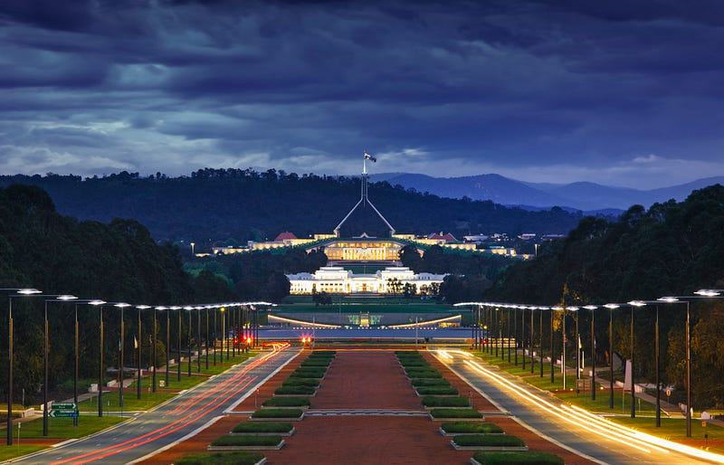

* * *

### 坎培拉AWS生活四個月分享(2021.03–2021.07)

Photo by [Social Estate](https://unsplash.com/@socialestate?utm_source=medium&utm_medium=referral) on [Unsplash](https://unsplash.com?utm_source=medium&utm_medium=referral)

(原文發表於 2021.07.24，現在轉發到 Medium 上。原來我曾經有這麼喜歡過坎培拉的時刻XD

前情提要: 2021年3月我結束為期六個月的 AWS Tech U Graduate Program，從雪梨搬到坎培拉，正式加入Federal Team。後來我一直在坎培拉住 2022.12月才搬去布里斯本)

搬來坎培拉也四個多月了，最近終於開始跟項目了！(不得不說大公司的步調真的好慢啊，一方面覺得很爽、很惜福，但有時候還是不免惴惴不安XD)

前陣子做了一個澳洲國防部的實驗項目，用的技術是 Kubernetes (事實上我根本不懂 Containers, Docker 或是 k8s)，但是我跟的前輩完全就是這領域的專家，所有問題問他完全瞬間就可以找到答案，超級強！

前輩們還放手讓我寫了一些小東西，算是我人生第一次正式提交 pull request 給客戶審核，覺得超級酷!!!

客戶感覺對於我們的表現非常滿意，項目結束後好像有機會再繼續簽下一個項目(當然整個項目都是兩位前輩在carry，我完全就只貢獻了一小小小小部分)。

目前手上還有兩個項目，一個是澳洲地球科學研究局的資安評估報告(security assessment)，另一個是澳洲統計局為期兩年的大項目，跟大數據相關。我還拿到了統計局的 contractor 員工證，真的覺得好酷喔!!!

覺得在坎培拉工作最酷的地方就是客戶基本上都是政府機構，項目的影響力其實非常大！最麻煩的地方是拿到客戶權限的過程非常漫長，而且不小心洩漏機密還要罰款或是坐牢LOL

另一個我前一陣子在忙的是公司內部的 Security Area of Depth Program，經過三個月的努力我終於成功通過了! 這個訓練program 是給專長非資安(security)的技術顧問 (technical consultant) 一個在資安領域進修的機會，成功通過後你就可以獲得一個 Security AoD 的頭銜(但這個頭銜其實好像也不能幹嘛哈哈)

為了這個 AoD 我寫了一個小資安挑戰(其實也就是一個超級簡單的 Lambda function 跟一個 CloudFormation stack 而已)。沒想到居然被人注意到了，他們打算要把這個挑戰放到今年八月 AWS 在美國休士頓舉辦的 re:inforce conference 上使用：[https://reinforce.awsevents.com/](https://l.facebook.com/l.php?u=https%3A%2F%2Freinforce.awsevents.com%2F%3Ffbclid%3DIwAR3f3dVzBGEDyOjrJWn9zF0_64S9X-VTyZE0StlEoB59A6hIgnviKY56Bpg&h=AT3dworzgH2zB7-tH3kJ9aEZ7aLAH08ZE76yAvRxiY_A11Z2ZKusNZDdQHHht4ti96A3zkfqC1J7Sc4yQWI8n9dHoHli0UqER4gmFlTppFNuUuRW26GWJgXhQ5cjVP0FOA&__tn__=-UK-R&c\[0\]=AT2Vfg0G04NAetq0IppfY35EQDDg9VUtzP_LjDshnh_o1MTo6BBYCIYlF0nhKFEjU9vVU7qVMmaT_UenIpbFW9OSb8r0TVebc5UkXqmH023P4CP-ebAtn-8UZS0K4gfTW9oC90IQWzOTjTKI8gaexAPlfq0)

負責的部門甚至還邀請我去休士頓現場參加會議跟協助挑戰的進行。這個為期conference 光是門票就要$1099美金，更別提機票跟住宿肯定是公司會負責，可是因為澳洲目前還在鎖國，所以我根本去不了(大哭，我恨 Covid)

總之目前為止對於在坎培拉的生活非常滿意！工作上總是有很多新鮮事(因為我真的太菜了，所以什麼事對我來說都非常新鮮有趣)。

同事們雖然層級都比我高，經驗也比我豐富(他們都是至少有10–25年工作經驗的人)，但是人都超好而且也超尊重我們。不管是前輩或經理想拉我進項目還會先問我有沒有興趣，完全沒有那種「你是新人我要你幹嘛你就去幹嘛」的態度。

也非常喜歡我經理信任式的管理方式，我們可以自由選出哪天要進公司上班、哪天要在家工作，不需要打卡，也沒有表訂的上下班時間，反正你自己管好自己要做的事情就可以了。甚至我上次問了經理請假流程，他說「我相信你要是哪天要請假，你一定是把事情都安排好了、該通知的人都通知到了，所以請完你直接在我的 calendar 上做個紀錄就好，不需要事先問我能不能請假」，是不是超棒!!!

坎培拉雖然小，但住在市中心的我生活機能還是非常便利的，去公司上班的日子我中午還會走回家吃午餐(我家到公司走路10分鐘)。

在這邊也認識了一些新朋友(還有我本來就認識的老朋友)，假日我最喜歡跑去不同的地方探險~

唯一的缺點就是這裡真的太冷了，希望冬天趕快過去，還有坎培拉不要再下雨了!


