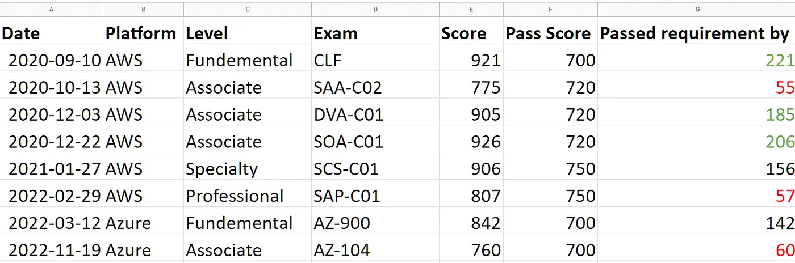

### 微軟 Azure 雲端證照: AZ-104 Azure Administrator Associate 考試心得

AZ-104 Azure Administrator Associate Badge

* * *

**考試日期：2022.11.18**

今天要來分享我的第二張 Azure 證照 AZ-104 Microsoft Azure Administrator Associate 的考試心得。

### Azure Associate Level 證照比起 AWS Associate Level 證照難度更高

考試的過程中我只覺得，這個考試真的也太難了吧XDDD

完全比 AWS Associate level 的三張證照難很多，理由如下:

1\. 這個考試常常考一些很細節、我覺得很不重要的地方(我認為背誦細節毫無意義，反正實際操作的時候系統自然會擋下來 lol)。

2\. 考試題型很多變，不像 AWS 就是單選題或是多選題，Azure 還有連環情境題、是非題、連連看題、多重順序題，我個人其實覺得題型多變沒什麼不好，但也不需要搞得這麼複雜吧XD

3\. 有部分考試題型，回答完之後是不能回去檢查答案的，例如多重情境題跟單重情境題，所以你一按下一題或是下一大題，之後就沒有辦法再回到上一頁改答案。

4\. 情境題的設計極差，題目敘述總共有三個頁面，每一個題目頁面都落落長，然後 5–6 個問題又分別在他們各自的問題頁面，我光回答一題就要4個tabs在那邊反覆看來看去，真心覺得莫名其妙! (這點我已經在考試feedback上提出，希望之後Azure或改進這點)。而且一開始進入考試就是這個情境題，寫完這題我完全已經心如死灰XDD

### 測驗結束後的考生意見調查

題外話是，這次考試出成績非常快，一交卷立刻就會在螢幕上顯示通過與否跟考試成績。跟我上次考AZ-900的經驗非常不同，上次一交卷，螢幕直接一片空白，也沒說通過與否(我還以為是電腦當機了)，然後過了兩天才出成績。不知道是因為考試平台進步了，還是因為這次考試完我有填考試feedback (因為被情境題氣到XD)，所以系統獎勵我的成績立刻出現XDDD

Azure 考試結束後，考生可以針對「每一題」考試題目提出回饋意見，這點非常有趣! AWS 只有一個整體考試經驗的簡單意見調查而已。

### 個人雲端證照的分析

考完之後我覺得這個考試也太難了，於是調出我的雲端證照統計表研究了一下，在我考過的八個雲證照中，根據我個人的考試成績(完全不客觀的統計分析XD)，我有以下的心得：

  * 最難考的雲證照: AWS Solution Architect Associate, AWS Solution Architect Professional, Azure Administrator Associate
  * 最簡單的雲證照: AWS Cloud Practitioner, AWS Developer Associate, AWS System Admin Associate

個人雲端證照統計


