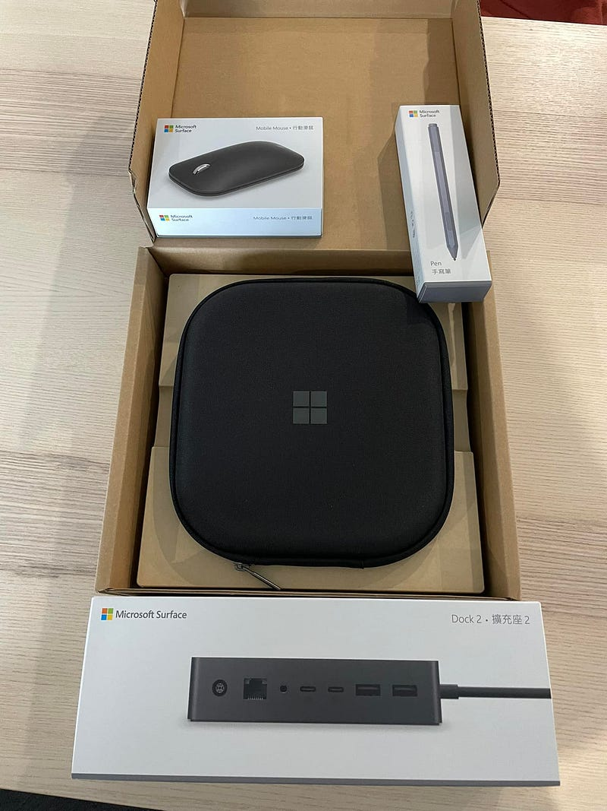
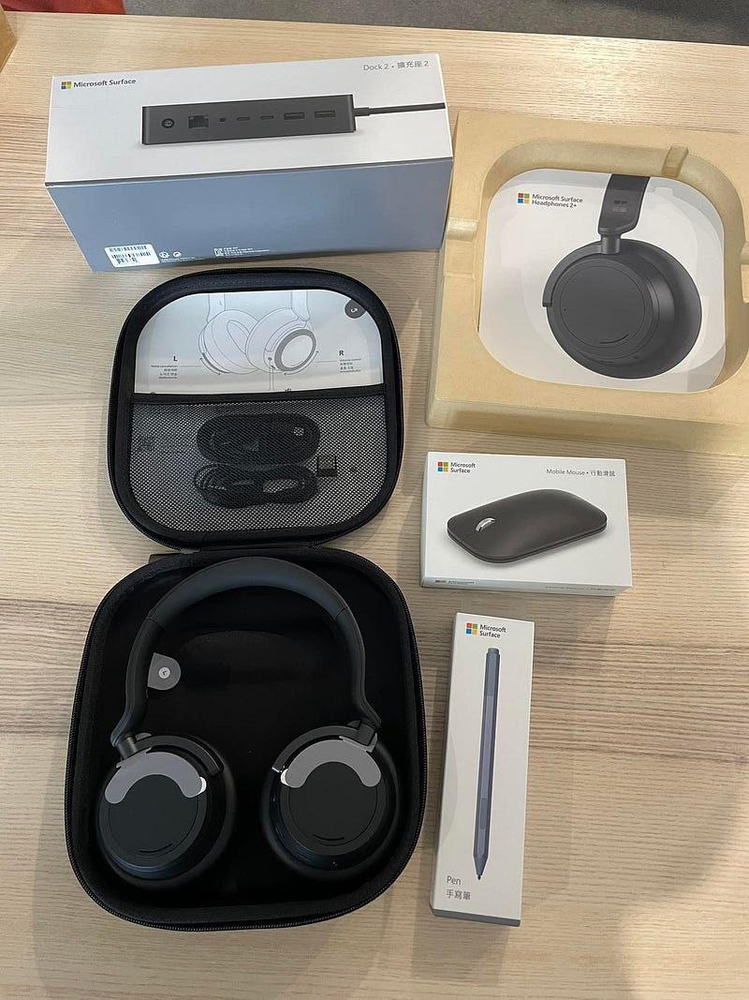

* * *

### 從 AWS (Amazon Web Services) 到微軟 Azure：為什麼我決定跳槽到另一朵雲？

### At Amazon, it’s always Day 1!

這是 Amazon 有名的 Day 1 文化，因為創辦人 Jeff Bezos 覺得一旦一個企業進入了 Day 2 文化，就代表他們從此失去了新創精神。然而經過了 760 個 Day 1 (兩年兩個月)，我在亞馬遜的日子也到了一個段落。在種種機緣巧合下，我決定加入微軟 Azure。

好的，我知道大家的第一個問題就是「你為什麼要換工作!!!???」

AWS 是雲端科技的龍頭，市占率大概是 1/3 之一，遠遠超過第二名的 Azure (23%) 與第三名的 GCP (Google Cloud 9%)。所以很多人其實不能理解為什麼我要捨棄 AWS，改去Azure，但我的理由如下:

  * 新的職位叫 Cloud Solution Architect (我之前在 AWS 的職位叫 Associate Cloud Architect)。新職位與我本來的職位相似，但又略有不同，Solution Architect 是一個我想要嘗試的領域。除此之外，職稱上的 Associate 不見了，意思也就是說我不僅跳槽了，還升等了哈哈
  * 我對 multi-cloud 其實一直滿感興趣的，也很好奇 Azure 的雲服務與營運模式，也很好奇微軟的公司文化。雖然我有好幾個 AWS 同事都說: 「EC, please don’t go to the dark side!!!」 哈哈~ 必須說，在雲端科技上，AWS 真心方方面都是當之無愧的第一 ，不過 Azure 近幾年的市占率大幅提升(2022 年是首次Azure在紐澳地區的市佔率超過AWS)，我覺得也是值得去一探究竟，順便幫大家來體驗/分析一下兩大巨頭的不同XD
  * 新工作的 base salary 比之前高 (畢竟職等變高了XD)，而且據說微軟的福利與 work life balance 都比 AWS 更好。就我目前加入一個月的觀察來說，我覺得福利這點倒是還好，但是 work life balance 是真的好很多，因為公司的文化真的差別很大。
  * 新的職位是一個產業導向的職位 (industry-aligned role)，我負責的產業是金融服務業( Financial Services Industry)，客戶會是澳洲四大銀行、大型退休金公司、保險公司等等。
  * 新的工作地點在溫暖的布里斯本，其實當初微軟給了我雪梨跟布里斯本兩個選擇，但我其實沒有考慮過雪梨這個選項 (因為我之前在雪梨住過七年，覺得沒什麼新鮮感)。

同時在今天我也收到了來自微軟的新裝備! 首先我必須要說，那個紙箱真心也太破爛，害我一瞬間懷疑微軟是不是寄了一些二手設備給我XDDD

一打開盒子，我想說「這個電腦看起來也太小了吧? 難道微軟的科技這麼先進?」 拆開之後才發現，是微軟自己出的耳機 Surface headphone 2!!!!!!!!!!!

*Surface headphones 2, surface mouse, surface pen and surface dock*

Surface headphone 是我這輩子唯一考慮過要買的微軟產品!!! 我的天天啊! 微軟真心超大方的，光這一盒設備加起來市值就是$900澳幣(近台幣兩萬)。算是為新工作帶來了一個好的開頭XD


