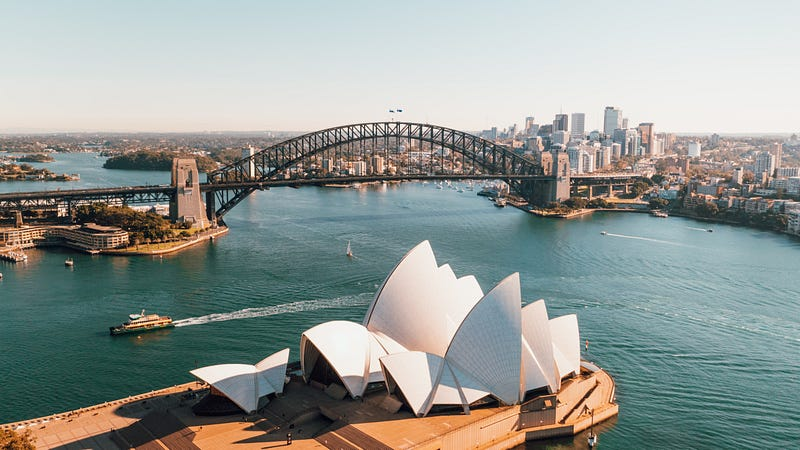

* * *

### **台灣人的文化衝擊 — 我的澳洲辦公室文化觀察**

 Photo by [Caleb Russell](https://unsplash.com/@calebrussell?utm_source=medium&utm_medium=referral) on [Unsplash](https://unsplash.com?utm_source=medium&utm_medium=referral)

非 Medium 付費會員，請[點此免費閱讀這篇文章](https://medium.com/@cloudarchitectec/%E6%BE%B3%E6%B4%B2%E8%81%B7%E5%A0%B4-%E5%8F%B0%E7%81%A3%E4%BA%BA%E7%9A%84%E6%96%87%E5%8C%96%E8%A1%9D%E6%93%8A-%E6%88%91%E7%9A%84%E6%BE%B3%E6%B4%B2%E8%BE%A6%E5%85%AC%E5%AE%A4%E6%96%87%E5%8C%96%E8%A7%80%E5%AF%9F-bd4e75445ebe?source=friends_link&sk=ae7ade4f1de5e50ae10a7be8a9964169)！當然如果你願意加入 Medium 付費會員來支持創作者，那就更棒囉～感謝你的閱讀！

* * *

大家好，我是EC! 在澳洲已經 10 年，一路從打工度假、留學生、靠著獨立技術移民拿到澳洲永居權 (PR)，到現在已經入籍成為澳洲公民。

在這十年中我做過很多工作，從夜市擺攤、housekeeping、麥當勞，在中國老闆開的移民仲介下做移民代辦，最後終於成功融入澳洲辦公室白領文化。

今天要來分享我近五年在澳洲辦公室感受到的文化衝擊 (雇主分別為 Chartered Accountants ANZ、Amazon Web Services 和 Microsoft) 。

  * **平等**

在澳洲職場，我很少感受到階級的區別，不管是比我資深 30、40 年的同事、我的經理，或是我經理的經理，大家一律互稱 first name。

就算是他們要請我做一件工作，也都是使用詢問跟幫忙的語氣，例如「EC, I have this project regarding xxxxx. Would you be interested in working on it?」或是「EC, would you please help me to xxxxx?」

完全不會有台灣職場那種「上級交代我一件工作事項，我就得無條件接受並且去執行」的感覺XD

  * **尊重**

每位同事或經理都非常尊重每個人有不同的時間規劃。不管你是突然生病要看醫生，或是你因為要接小孩小孩而需要調整上下班時間 (例如早上十點才能進辦公室，或是下午三點就要提前下班)，大家都會直接告知，也不會有人因此提出異議或是給予異樣的眼光。

另一個例子是澳洲人的基本年假就是一年 20 天。台灣好像是工作滿一年才有 7 天? 但即使如此，我很多在台灣工作的朋友告訴我他們就算有假，也不一定能請。或是即使能請，也不能一次請太多天。

這一點我在澳洲從來沒遇到過，在 Covid 之前，我都是一次把 20 天請完 (等於整整放假一個月)，從來也沒有任何人說過我什麼。聽到我要請假回台灣跟家人團聚或是出國去玩，同事們只會說 「Have fun! Enjoy your break!」從來沒有人質疑說，那我請假一個月，我負責的工作要怎麼辦？因為經理自然會負責分配，或是確保我們請其他人力來幫忙ＸＤ

  * **正面回饋**

澳洲人從不吝嗇於給於正面回饋！不管是我剛剛做了一件小事（主持一個會議或是解出一個 bug），他們總是不吝於給予稱讚。如果要給意見，他們也不會說直接說你這樣做不好，而是會先稱讚你切入的角度或做的事，然後再說你有沒有想過另一種可能性，或是其實有一種方式可以達到更好的效果。

  * **為自己發聲**

最後一點可能是我一開始最難適應的地方，在澳洲不管你是想要加薪、升遷換工作內容、換部門，都可以開門見山跟你的直屬主管討論，而他們也會盡全力幫助你達成。因為對於經理來說，協助你在你的職涯上更進一步，也是他們的職責之一。

例如我的 AWS 經理就很直接地跟我討論過升遷的 timeline，對於下一個等級，我現在還缺乏那些經驗跟能力，然後他幫我安排 project 時，就會特別針對這些我需要加強的地方來安排。

或是之前一位帶我的 AWS 前輩曾經對我說「EC 如果你不喜歡現在這個 project 的工作內容，你一定要跟我說喔！我們可以想辦法幫你調整，我們希望你在這裡做的是你喜歡並且可以加強你的技能的工作。因為你要是做得不開心，你就會開始找尋其他機會，我們並不想因為這樣失去你。」

已經習慣澳洲職場文化的我，也曾經動過回台灣工作的念頭 (來澳洲之前，我只在台灣工作過一年)，可是每當聽到身邊朋友分享的故事，我又覺得台灣的職場我好像回不去了XDDD

* * *

**如果你喜歡海外生活、澳洲職場、文組轉職工程師的相關文章，歡迎按下「拍手」給我鼓勵 (喜歡的話請多拍幾次！)。同時記得「**[**按此訂閱我的Medium部落格**](https://medium.com/@cloudarchitectec/subscribe)**」，這樣你就不會錯過我每週的更新囉～你們的支持是我持續創作的動力，如果有任何問題或是想要看的主題，歡迎留言與我互動 :)**

  * 中文部落格: [https://medium.com/@cloudarchitectec](/@cloudarchitectec?source=about_page-------------------------------------)
  * 英文部落格: [https://medium.com/architecting-your-cloud-career](https://medium.com/architecting-your-cloud-career?source=about_page-------------------------------------)
  * Email: [cloudarchitectec@gmail.com](mailto:cloudarchitectec@gmail.com?source=about_page-------------------------------------)
  * 臉書粉絲頁(文章與中文部落格相同): [https://www.facebook.com/cloudarchitectec/](https://www.facebook.com/cloudarchitectec/?source=about_page-------------------------------------)

* * *

**延伸閱讀**

  * [[澳洲職場] 你該轉職嗎? 來自轉職成功者的忠告 (文組轉IT)](https://medium.com/@cloudarchitectec/%E6%BE%B3%E6%B4%B2%E8%81%B7%E5%A0%B4-%E4%BD%A0%E8%A9%B2%E8%BD%89%E8%81%B7%E5%97%8E-%E4%BE%86%E8%87%AA%E8%BD%89%E8%81%B7%E6%88%90%E5%8A%9F%E8%80%85%E7%9A%84%E5%BF%A0%E5%91%8A-%E6%96%87%E7%B5%84%E8%BD%89it-9bb2bb9485ca)
  * [文組轉職澳洲 IT 工程師，我靠 Coding Bootcamp 進了亞馬遜](https://medium.com/@cloudarchitectec/%E6%96%87%E7%B5%84%E8%BD%89%E8%81%B7%E6%BE%B3%E6%B4%B2-it-%E5%B7%A5%E7%A8%8B%E5%B8%AB-%E6%88%91%E9%9D%A0-coding-bootcamp-%E9%80%B2%E4%BA%86%E4%BA%9E%E9%A6%AC%E9%81%9C-30fef5aaa97f)
  * [科技業龍頭 FAANG 的薪資結構解析: 澳洲亞馬遜新鮮人年薪 230 萬台幣!?](https://medium.com/@cloudarchitectec/%E7%A7%91%E6%8A%80%E6%A5%AD%E9%BE%8D%E9%A0%AD-faang-%E7%9A%84%E8%96%AA%E8%B3%87%E7%B5%90%E6%A7%8B-%E4%BB%A5%E6%BE%B3%E6%B4%B2%E4%BA%9E%E9%A6%AC%E9%81%9C%E7%82%BA%E4%BE%8B-584e9c564079)
  * [澳洲微軟雲端架構師 Microsoft Azure Cloud Solution Architect 面試心得 (同場加映 AWS 面試心得)](https://medium.com/@cloudarchitectec/%E6%BE%B3%E6%B4%B2%E5%BE%AE%E8%BB%9F%E9%9B%B2%E7%AB%AF%E6%9E%B6%E6%A7%8B%E5%B8%AB-microsoft-azure-cloud-solution-architect-%E9%9D%A2%E8%A9%A6%E5%BF%83%E5%BE%97-%E5%90%8C%E5%A0%B4%E5%8A%A0%E6%98%A0-aws-%E9%9D%A2%E8%A9%A6%E5%BF%83%E5%BE%97-9dff9fc59ae8)

