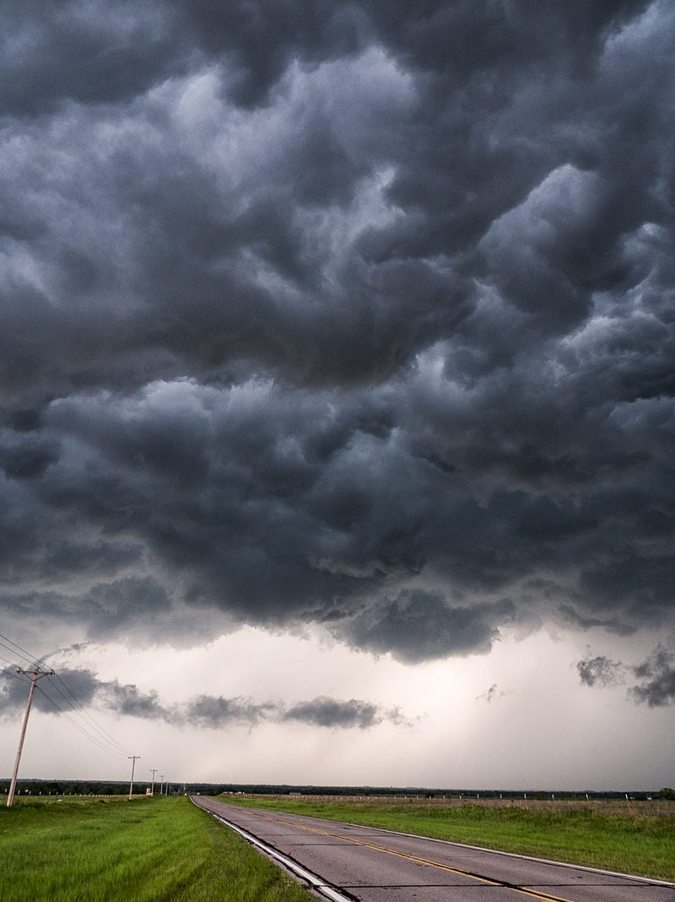

### 澳洲微軟菜鳥 Azure Cloud Solution Architect 的一天

Photo by [Raychel Sanner](https://unsplash.com/@raychelsnr?utm_source=medium&utm_medium=referral) on [Unsplash](https://unsplash.com?utm_source=medium&utm_medium=referral)

* * *

Azure Cloud Solution Architect (CSA) 是我在微軟的工作職稱，這是我加入微軟的第八週。在微軟之前，我在另一個雲服務平台 AWS 工作，也就是說這些 Azure services，對我來說都是全新的知識。

上週有客戶寫信問 sales 一個關於 Azure 防火牆 (Web Application Firewall) 的問題，對方的 DevOps 工程師提出了兩個可能的解決方案，但不知道哪個好，於是向微軟求救，想知道微軟的 best practices。由於是技術問題，於是 sales 就把信轉交給我負責。然而我從來沒有用過這個服務，也不是網絡 (networking) 專家，於是就開始起了我尋覓答案的旅程!

首先，我先在網路上搜尋了一下相關資訊，有了一點基本的概念後，我覺得這個問題可以有第三個解法，於是傳訊息給帶我的前輩想要找她驗證我的想法。想當然而，人家很忙沒空回我。好險我早就經過 AWS 的一番薰陶，知道不懂的就要馬上問/求救，於是我立刻在 team channel 上發問，結果沒人理我……

後來我又私訊了我的經理，跟另外兩個在紐西蘭跟新加坡的 CSA (她們之前是我的AWS同事)，沒想到大家不知道答案。

好不容易過了幾天，帶我的前輩終於有空了，她跟我說她也不知道答案，但給了我另一個內部的論壇連結跟另一個 security CSA的聯繫方式。

最終的最終，我總算在各種不同的管道中蒐集到了我想要的資料，歷經與客戶的數封 emails 往返，我提出了三個選項的解決方案 (根據解決方案的安全性跟複雜度，我建議他們依序開始嘗試)，然後跟客戶約了一個時間開會，也就是這週三。

不得不說開會前我還是有點緊張的，其實我根本不知道這個問題的答案，我只是從各種網路資源、Azure的官方文件、微軟內部的論壇回答跟幾個其他team 的人回我的 email 中拼湊出了答案。這也是我第一次在沒有前輩的陪同下直接跟客戶開技術性會議。

會議開始後，客戶 (DevOps 工程師) 告訴我她已經進行了解決方案一，把 security framework 升級到版本 3.2，然而這並沒有解決問題。我跟她說「在我們繼續討論之前，我想要知道升級後你們有遇到新的問題嗎?」 她說沒有，所以也是一件好事。(她本來也在想說不定升級後會有其他問題，所以她一開始也是不敢升級的XD)

接著客戶告訴我她也進行了解決方案二，嘗試了各種設定組合之後，還是沒有辦法達到我們想要的結果。這也是我們可以預期的，因為我其中一個微軟的同事早已告訴我，解決方案二不可能會成功，這點只是應證了他的理論而已。(在我之前給客戶的email中，我已經表明這點。但由於客戶真的不想走選項三，所以我建議她我們還是先試試選項二，說不定會有奇蹟出現? 哈哈)

於是我們只好面臨了我們最不希望選的解決方案三，由於這個解決方案特別複雜，所以客戶還沒有嘗試。此時客戶的經理也在會議中，她問我「所以方案三不是一個好的解決方案嗎?」 我回答「不是的，方案三也是一個很好的解決方案，只是因為這個方案的設計比較複雜，而且一旦設計得不好，很容易會產生安全漏洞，所以我們才會想說要從比較安全/簡單的方案一跟二開始。然而我們現在已經試過方案一跟二，知道他們無法滿足我們的需求，方案三是我們最後的選擇。」

客戶與客戶的經理之後各問了我一些問題，我都成功以 AWS 訓練出來的 consulting skills 回覆了，客戶說他們會回去設計一下方案三的草稿。我跟他們說等草稿出來後，我可以幫忙 review，或是請其他同事幫忙確認我們的設計是否完整。

於是成功的度過了這一個回合!!!

其實我對於自己是相當自豪的，我居然有辦法對一個自己都不知道正確答案的 solution design 侃侃而談。同時我也對客戶覺得相當過意不去，身為微軟 Azure 員工，我沒有足夠的知識提供客戶最佳解 :(

=========

開完上述會議之後，sales 又轉了另一個客戶的問題給我，這次是關於 Azure Front Door (AFD)，AFD 是一個 content delivery framework (CDN)，專有名詞我在這裡就不解釋了。AFD 又是一個我沒有用過的 Azure service，於是我在網路上搜尋了一下，還是沒辦法找到我要的答案。本來想在跟前輩 1:1 時問她這個問題，結果她放我鳥根本沒出現 QAQ。

於是我最後打電話給我另一個 Cloud Engineer 朋友，但他們公司用的是 AWS 平台，而不是 Azure。於是我還得把我的問題從 AFD 轉換成 AWS CloudFront (這是 AWS 的 CDN 服務)，他才有辦法了解我的問題。好險跟他討論過後，我終於有了一些想法，可以回覆客戶。

真心是太佩服我的機智XD

=======

這就是我菜鳥 CSA 的一天 :(

總之我們的工作就是「代客 Google」，各種求神拜佛希望會有內部資源或是依靠我的各種人脈，希望可以找到一個答案。然後再根據我們的專業判斷把解答提供給客戶，如果有任何我們不確定的答案，就使出我的 consulting skills/soft skills，給出一個「雖然我現在不知道答案，但我會回去研究一下再回覆你 (I don’t have an answer to this question on top of my mind, but I’ll do a bit research and get back to you the next day. Does that sound good to you?)」 這句英文非常實用! 請大家一定要學起來XDDD

**延伸閱讀**

  * [[澳洲職場] 你該轉職嗎? 來自轉職成功者的忠告 (文組轉IT)](/posts/2022-12-10-career-transition-analysis/)
  * [文組轉職澳洲 IT 工程師，我靠 Coding Bootcamp 進了亞馬遜](/posts/2022-12-03-bootcamp-to-aws/)
  * [科技業龍頭 FAANG 的薪資結構解析: 澳洲亞馬遜新鮮人年薪 230 萬台幣!?](/posts/2022-11-25-faang-salary/)
  * [澳洲微軟雲端架構師 Microsoft Azure Cloud Solution Architect 面試心得 (同場加映 AWS 面試心得)](/posts/2022-11-25-ms-csa-interview/)

