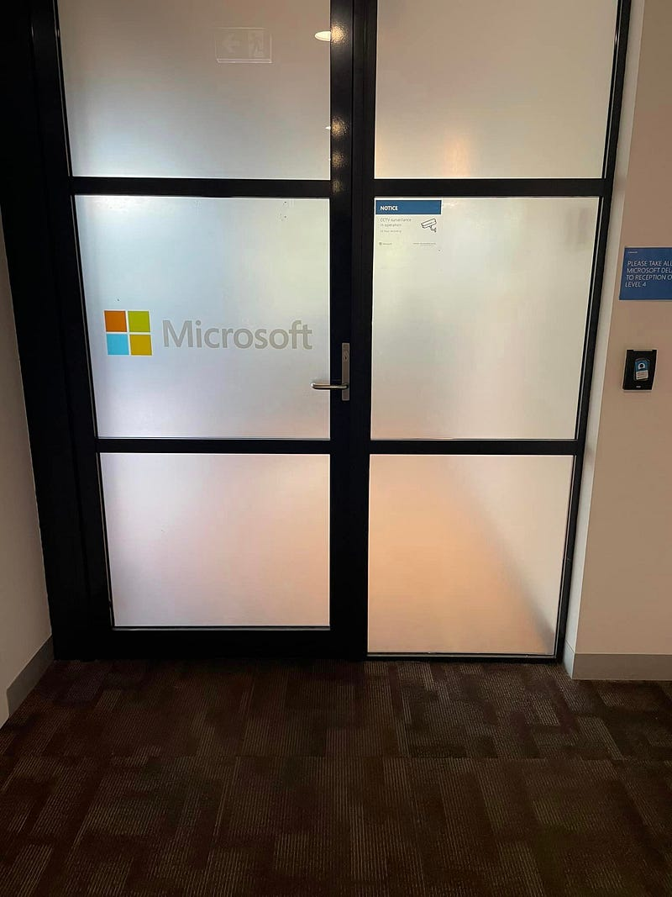
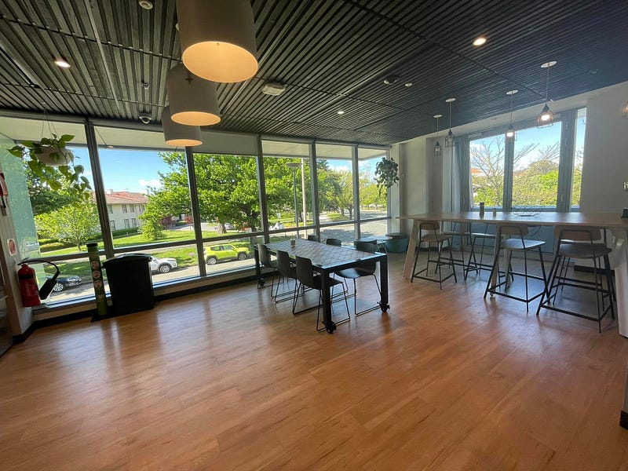
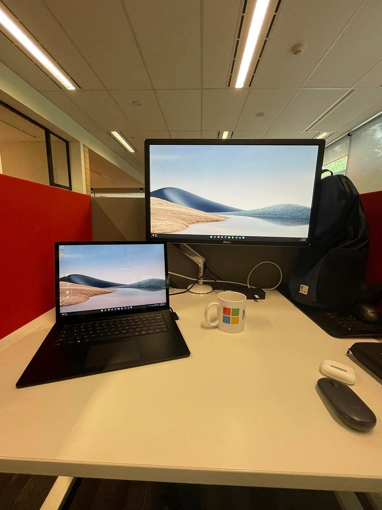

* * *

### [職場] 澳洲微軟新進員工第一週的心得+坎培拉微軟辦公室分享

微軟坎培拉辦公室-門口

* * *

(這篇是原來是我 2022.10.28 寫的文章，現在轉發到 Medium 上面跟大家分享XD)

加入微軟的第一週! 近來坎培拉的天氣真心遭到不行，每天都狂風暴雨像颱風天一樣。今天終於放晴，於是我立刻前往坎培拉辦公室一探究竟 (但今天最高溫還是只有15度，布里斯本都已經32度了 lol)

結果不看不知道，一看嚇一跳! 微軟的坎培拉辦公室非常迷你，而且樓層也很低 (分別在大樓的二樓跟四樓，請不要問我三樓怎麼了，我也不知道XDD)

微軟坎培拉辦公室-廚房

廚房沒零食，重點是居然只有一個螢幕哈哈哈哈哈哈 (Amazon 是雙螢幕，而且桌子大概是微軟的兩倍大)。這個差異深深讓我體驗到由奢入儉難啊XD

微軟坎培拉辦公室-辦公桌

硬體設備除外，我覺得MS的同事人都還不錯。我的 manager 非常搞笑，我每次跟他catch up 都要被他逗得哈哈大笑。我的 team也非常迷你，加上manager 跟我也才8個人。這一週我幾乎跟每個人都 one-on-one 聊過 (是我主動傳訊息給大家約 one-on-one catch up的)，覺得大家的故事都非常有趣!

我的team還有另一個比我早加入兩週的同事，也是從AWS來的，跟我分享了很多很好的意見！(說真的我覺得我們兩個都有點不適應，因為AWS跟微軟文化真的太不一樣了。)

我的另外一個文化衝擊則是我跟兩個 MS graduate level 的同事聊天 (MS 的graduate program 是兩年，也不輪調，就在同一個職位。兩年在 AWS 我們都可以被 promoted to L5了)。他們都是以 experienced hire 的眼光看我 (覺得我是職場前輩)，可是我內心還是覺得我是一個 graduate/associate，讓我不禁懷疑我撐得起我現在的 level 嗎？

另一個文化衝擊是，我的這個職位其實分成三個組織：Core (也就是 infrastructure)、Application Innovation、Data Analytics。我所屬的 team 是 core，但其實我個人的背景偏向 app innovation (因為我是 web development 出身)，然後我在 AWS 的最後一年做的是 data analytics 的 project ，也就是說這三個分支裡我最沒有關係的就是我現在的core team 哈哈哈

週四的時候我跟同組同事聊天，她問我你的專長領域跟有興趣的領域是什麼，結果我答完她直接沈默，然後她說「你知道我們team 是 Azure core 對吧？」哈哈哈哈哈哈哈哈哈哈，這個問題建議你問經理喔! 我也不知道他為什麼要找我進來 Core team，可能是真的有看到我的潛力吧? XDD

週三時我跟另一個布里斯本的同事聊天 (他是做app innovation 的)，他也是問我的背景，結果我一答完他就說「我們team好像還有缺，我去跟我們經理講一下吧」，我說「我才進來三天，你就試圖挖角我嗎？」(這個同事人也是超好笑，而且他人超好，他還介紹了另外兩個布里斯本的同事給我認識，所以我還沒搬家就已經先認識了三個布里斯本同事了)

總之，我覺得我整體來說還是挺 chilled 的，想說 onboarding 這件事我不久前才做過一次，慢慢來啦! 但內心又覺得有點不安，畢竟 infrastructure 不是我擅長的領域 (其實我也沒有擅長的領域)、SA (technical sale) 也不是我做過的職位，然後我現在的 level 是要自己扛 customer engagement 的(沒有前輩可以罩我了QAQ)。

總之，希望可以成功撐過一年 (祈禱)~

* * *

👉 **需要職涯導師嗎？澳洲雲端架構師 EC 提供轉職工程師、澳洲求職、移民生活等全方位諮詢服務。想進一步了解諮詢細節，請點擊** [**<<澳洲雲端架師 EC：專為轉職者量身打造的職涯諮詢｜海外職場×履歷優化 × 面試攻略 × DevOps /雲端職涯>>**](/posts/2018-01-03-ec-consultation/)**，開啟你的職涯新篇章!**

☕️ **如果想要進一步支持 EC，歡迎請我喝杯咖啡！**

**📱 想追蹤更多？**

  * 📘 [Facebook 粉專：澳洲雲端架構師 EC](https://www.facebook.com/cloudarchitectec)
  * 🧵 [Threads：Cloud Architect EC](https://www.threads.com/@cloud_architect_ec)
  * 📩 合作信箱：[cloudarchitectec@gmail.com](mailto:cloudarchitectec@gmail.com)

