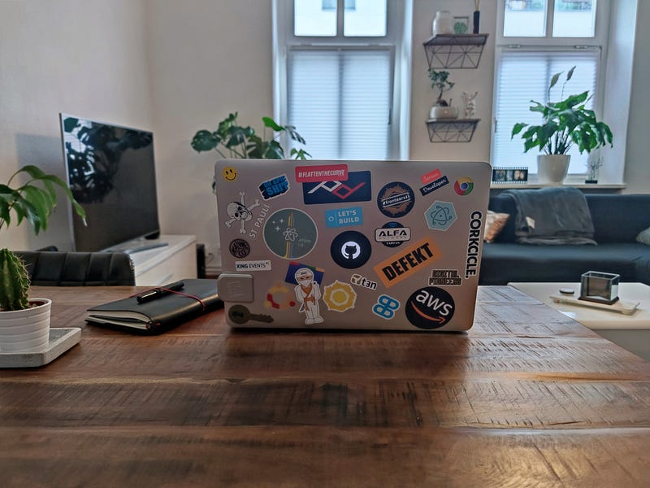

---

### [職場] 澳洲亞馬遜 AWS Professional Services 員工的必經關卡 — Awesome Builder

Photo by [Alex Kulikov](https://unsplash.com/@burntime?utm_source=medium&utm_medium=referral) on [Unsplash](https://unsplash.com?utm_source=medium&utm_medium=referral)

* * *

Awesome Builder (簡稱AB) 是 AWS Professional Services Team 新進員工的必經關卡，分為三個階段，每個階段都要通過 3–5 位考官的認可 (考官人選包含直屬經理、同部門的前輩、不同部門但平常需要合作的同事)，才能順利通過。

這些考官每個人會被分配到不同角色 (CTO、CIO、Tech Lead、PM 等等)，他們會根據自己的角色假裝自己是真的客戶，在簡報過程中發問、對於你提出的解決方案提出質疑，甚至會刻意問一些難以回答的問題來測試你的反應XD

AB 考驗的不只是上台對客戶做簡報的能力，還要考驗你是否可以幫助客戶釐清問題、根據客戶需求提出推薦的雲端服務架構圖 (proposing architecture diagram)，最後動手做出一個簡化的概念模型 (PoC — proof of concept)，讓客戶可以看到把現有 IT 架構移到 AWS 雲端服務上的優勢。

  * **AB1: Kick-off and Gather Customer Requirements**

AB1 在於開始跟客戶建立關係、介紹雲端技術及AWS 的 frameworks (取決於客戶對於 cloud computing 的熟悉程度，如果客戶有豐富雲端經驗的話，這個部分就可以省略)，以及盡可能的詢問客戶各種問題來了解他們的需求。訣竅就是盡可能讓客戶多講話，透過問題抽絲剝繭來了解客戶面臨的挑戰以及他們未來的發展藍圖。會在這關失敗的人，通常是太著重於講述於自己排練好的講稿，又或者是根本沒有深入聆聽客戶的需求，就急急忙忙跳入 solution design 的階段。

  * **AB2 Solution Design & Whiteboarding**

AB2 在於根據 AB1 所收集到的資訊，就客戶面臨的問題提出解決方案，呈現方式可以直接畫白板或是用相關軟體(例如 draw.io) 畫出不同 layers 的解決方案架構圖。這一關需要跟客戶討論我們提出的解決方案、回答他們關於各個使用的雲端服務的問題，確定這個解決方案是客戶希望繼續進行的方向。

  * **AB3 Proof of Concept & Next Steps**

AB3 則是需要把 AB2 討論出的解決方案建出一個 PoC，向客戶證明這個解決方案是可行的，並且 demo 一下效果，最後必須成功吸引客戶繼續進行到在AWS平台上部署 (deployment)。

AB 的目的是確保你已經足夠瞭解AWS的文化與產品，有辦法代表AWS出席客戶會議，只要能通過就代表大家確定你已經適合出去與客戶交流(customer readiness assessment)，不會說出什麼不實資訊或不符合公司文化的言論。你一定會想說，這種內部審核關卡不就是走個流程嗎？但我身邊還真的有人沒通過，事實上我自己的AB2也差點沒過XD

我的 AB1 表現其實非常好，AB2差點滑鐵盧，AB3我個人覺得其實也是勉勉強強。但我覺得考官們給我的最終評語真的是讓我非常喜歡AWS文化的一點「我們一致認為你的簡報能力非常出色、時間掌控的能力也很好。對於你知道的答案，你可以非常有自信的回答。但我們也注意到有些問題你真的是完全答不上來，不過這並不是你的錯，因為就你現在的職涯發展來說，那些問題的確是你從來沒有接觸過面相，所以你也沒有辦法考慮到那些人工作上會面對的問題，進而提出解決方案。這需要經驗的累積，等你以後項目做多了，你就會知道了。」

所以他們就讓我通過了!!!

真心是有夠體貼，也有夠合理！他們並沒有要求我要知道太多技術上的細節，當發現我有知識盲區時，也沒有覺得是因為我準備不足，而是從我的角度出發，體諒到這的確是現階段的我沒有辦法做的事。

我在 AWS 前六個月處於他們的畢業生計畫 (Tech U Graduate Program)，每天的工作就是訓練 (IT知識與顧問技巧) 跟學習 AWS 雲端服務。後來移居坎培拉才正式加入我所屬的團隊，但是正式進入團隊的前兩個月的重點其實就是 AB 跟其他雜七雜八的訓練。

果然只有AWS這種財大氣粗的公司，才能這麼有閒有錢地培訓新人。我們一進來就是直接領正式員工的薪水，四月底績效評估後我還加薪了！天知道我有多汗顏，其實進入公司後根本什麼屁事也沒做lol

雖然聽起來超爽，但這一路上走來我的確每一步都在掙扎(其實現在也還是)，但我真心是非常感激 AWS！

一路上遇見的所有AWS員工，不管他們的職位有多高、平常有多忙，都非常樂意幫你排除任何困難。如果有機會的話，我真心會推薦大家去AWS工作！


