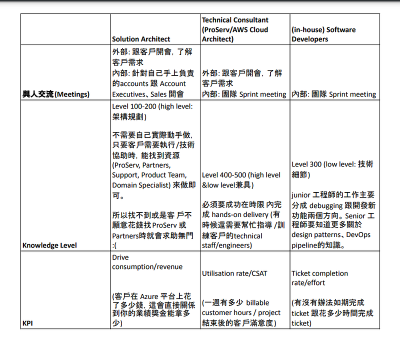
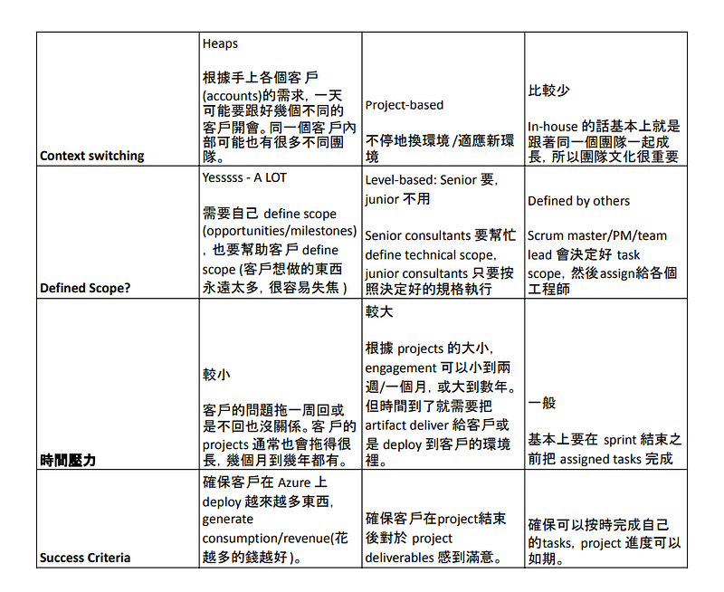
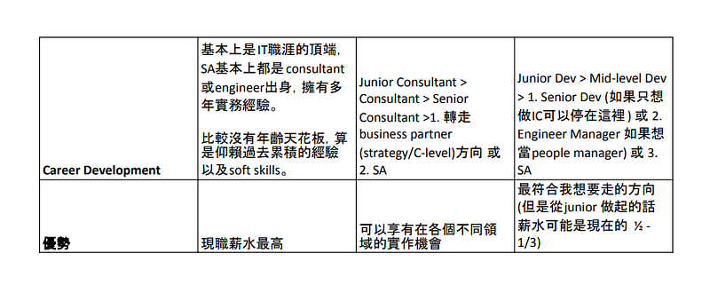

> 雖然標題只寫了 Solution Architect 與 Cloud Engineer，但我認為 Software Engineer/Developer 算是大家比較熟悉的工程師相關職位，所以我決定把這個職位也納入討論，希望這三者的職務比較會對大家有所幫助～

### 前言

說實話最近在微軟過得不是很開心，因為我覺得 Solution Architect (SA) 這個職位並不適合我。跟身邊的人討論了一下，有人支持我轉換跑道，認為開心最重要。有人從現實面出發，要我好好考量，因為現職微軟給我的薪水非常高(我的科技業年資到目前為止是 2.5 年，沒有相關大學學歷，現在年薪大概是好幾百萬台幣，其實真的是非常幸運，但我同時也覺得每天工作真的好難熬)。

有個即將從微軟離職的 SA 同事跟我說，其實我討厭的只是微軟體系下的 SA，在其他地方當 SA 不是這樣的 (她之前是 AWS 的 SA)。但我也沒有辦法確認，難道我要再申請回去 AWS 當 SA 嗎?XD

所以我花了幾個小時寫了這一個對照表，就我個人的經驗來比較 Solution Architect (現職，年資 5 個月)、Cloud Consultant/Cloud Engineer (AWS 年資 2 年)、Software Developer (實習過一個月，但我身邊很多軟體工程師朋友)，希望可以藉此釐清我的思緒。

### Solution Architect、Cloud Engineer、Software Developer 比較表格

(朋友說: 如果你花了好幾個小時在寫這個比較表格，我覺得這就是你該離職的警訊XDD)

(我沒想到在 Medium 上要插入表格這麼難，我還得先把 word 轉成 pdf 再截圖。如果有人知道更好的方法，請告訴我XD)

### 職務日常比較 ｜Day-to-Day life

#### 🧑‍💻 軟體工程師（in-house Software Developer）

簡單來說，開發流程會從 Sprint Meeting 開始分配任務，接著就進入任務執行階段：

  * 把任務（task）根據思路分成子任務（sub-tasks）逐一攻破
  * 解不出來時會自主研究或向團隊求救
  * 通常每天會有「站立會議（daily stand-up）」分享進度或提出問題
  * 接著會進行測試（Testing）、程式碼審查（Code Review）、優化（Refinement）
  * 每次 sprint 結束後會進行「回顧會議（Retro）」反思並改進

這樣的工作流程通常明確、可預期，也較適合喜歡「一項項完成任務」的人。

#### ☁️ 雲端技術顧問／工程師（Cloud Consultant／Professional Services／Cloud Architects）

雲端技術顧問/工程師的工作內容隨著每個項目的要求變化較大，大致流程為：

  * 被分派到專案（project/engagement），但加入前常常不清楚具體內容，只知道一些關鍵字
  * 不能選擇專案領域或技術範疇，只能邊學邊做。例如我曾被指派到資料工程（data engineering）領域，不得不從頭學起：包含程式語言（Python 和 Pandas）、AWS 雲端服務（AWS Athena、QuickSight）
  * 開「內部會議（project scope review）」了解專案範圍，有時根本沒有會議，直接就跟客戶開 Kick-off Meeting
  * Kick-off Meeting 就要跟客戶確認規格、目標、交付內容（deliverables）。要是都有共識，那就會很直覺。要是只有初步共識，那就要在時間壓力下確定範圍與 MVP 最小可行產品（minimum viable product）
  * 深入瞭解客戶的環境與作業模式，進而開始撰寫基礎建設（IaC, infrastructure as code）／程式功能（functions）／腳本（scripts）
  * 技術交付完成後撰寫文件讓客戶知道如何使用，並進行移交（handover）

這類工作具備挑戰性與多樣性，但也很吃個人學習能力與溝通技巧。

#### 🧠 雲端架構師（Solution Architect）

Solution Architect 的日常偏向「技術銷售（technical sales）」，每天需要：

  * 跟手上的客戶（accounts）開會維繫關係、確認進度、尋找新機會（opportunities）。依負責產業跟客戶規模的不同，一天可能開 3–12 場會議。如果客戶是大型企業，你可能只負責一個客戶，但它底下會有上百個內部團隊與不同專案。中型企業則約有十個客戶，小型企業可能多達百個客戶
  * 通常 Solution Architect 會跟業務（Sales）搭配合作。Sales 負責前期溝通、辨識機會，而當客戶需求確定、具財務潛力時，會需要 Solution Architect 提供技術架構建議（architecture & potential solutions）。

當客戶確定要執行方案之後，可能會有三種情境發生：

  1. 客戶外包給雲服務商的內部顧問部門（微軟是 MCS，AWS 是 ProServ）： SA 的責任是協助監督進度、維持溝通橋樑。這個情境對 SA 通常來說是最輕鬆的，因為大家都是自己人。但是這同時也是最貴的選項，所以一般來說都不會是客戶的首選。
  2. 客戶外包給外部顧問（Azure partners）: 但 partners 的品質不一，如果有些 partners 的經驗或能力不足，那你就得跳下來、適時引入其他 Azure 的資源 (Support Engineers, FastTrack, Corp CSA, Product Team) 來幫忙解決問題。有些 partners 跟客戶會開始自成小圈圈把你排除在外，這時候你就要很努力打入他們的小圈圈，確保每一個階段都有順利達成。
  3. 客戶選擇自行實作：遇到困難就可能頻繁求助你，但 Solution Architect 通常不做實作，只會在自己的環境建 PoC（Proof of Concept），如果之前沒有相關的實務經驗，其實很難協助客戶解決企業規模等級的問題（Enterprise-level Production Environments）

無論是哪種情境，只要預估的 Azure consumption 金額不達標、進度延遲，就會面臨「從上而下的追殺（leadership escalation）」：你的經理就會開始被 leadership 追殺，然後你就會開始被你的經理追殺。

除了會議與專案之外，還要處理客戶寄信/訊息發問的技術問題：

  * 研究＆寫信回答客戶問題，或是跟客戶開會釐清他們的問題，然後想辦法幫他們解決。
  * 如果答不上來就找其他資源來回答問題。針對不同的問題類型，公司內部會有不同的官方管道，但你不一定真的找得到人。主要還是靠你的人脈，如果你有辦法認識很多人，知道他們擅長的領域，建立良好的關係，你就有辦法在適當的時機把這些人拖進你的會議幫你解決問題。如果你不是這種人，那你就會過得很辛苦(就像我XD)。
  * 同時要判斷客戶的這個問題能不能被 qualify 成一個 opportunity，例如這個問題解決了，客戶是否會在 Azure 上 deploy，這個 deployment 可以帶來多少 Azure consumption/revenue (注意有些 Azure resources 是免費的，例如 virtual networks，所以客戶 deploy 再多也不會算入你的業績)
  * 最後，還得花大量時間在 Sales 系統上記錄每個進度、障礙點、解法與升級流程（escalation）。

以上就是我個人對這三個職位落落長的分析，歡迎大家跟我分享你們的看法。你們覺得我對於三個職位的描述精確嗎? 還是只是我因為現在的工作不是太開心，而有所偏頗? lol

我對自身職涯的期待是自我技術的成長，我不想做 customer-facing role，不喜歡 on-call，也不太喜歡顧問業。喜歡正常上下班，有明確定義的工作範圍，然後我可以一項一項完成工作事項，同時有一項自己的專業。但會不會我只是因為不喜歡現在的工作內容，所以才覺得其他方向更好呢?
