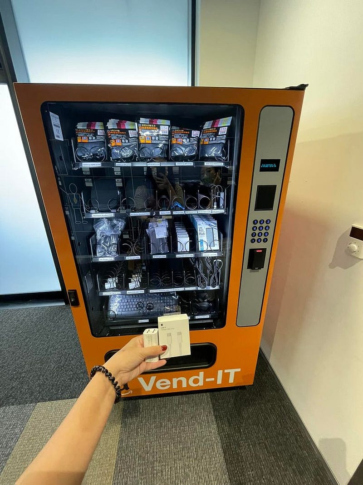

之前我在 AWS 工作的時候，最喜歡的就是拜訪各地的辦公室。澳洲來說，我去過坎培拉、雪梨、墨爾本、伯斯，海外的話則是去過新加坡跟台北的辦公室，每個都長得很類似，但又有自己不同的風格!

其中我最喜歡的就是這台 IT 設備販賣機(不是每個辦公室都有，像坎培拉就沒有)，員工們可以刷 AWS 的員工證免費獲得工作上需要的 IT 設備。例如以下這台就是我去年在台北辦公室使用的自動販賣機:

我看到的時候非常驚喜，因為久居澳洲的原因，我幾乎所有的3C插頭都是澳洲規格的八字型，於是我立刻在 IT 販賣機拿了一個 61W 的 usb-c 台灣插頭跟一條兩公尺的 usb-c 線XD！

同在亞馬遜工作的友人提醒我：「你知道刷這個會通知你的經理嗎？」

我：「我不知道XD 但不會怎樣吧，我經理肯定會覺得，如果有需要，那就拿啊（說完我立刻連刷兩個XDD）」

回家後與我弟分享，我弟當下的第一反應就是「所以花費之後是從薪水扣嗎？」

我答「當然是免費的啊，應該是直接記在我們 team 的 cost centre 上吧？」

以上是台灣思維與澳洲思維的衝擊對話~ 哈哈哈


