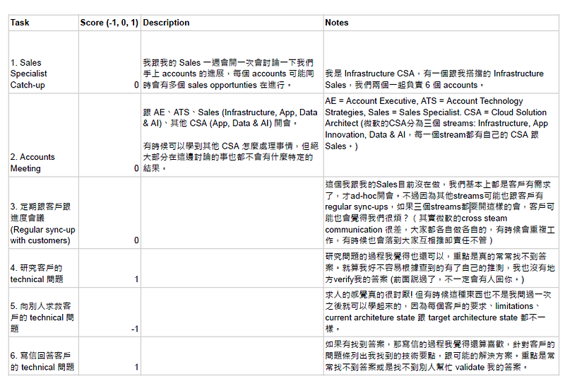
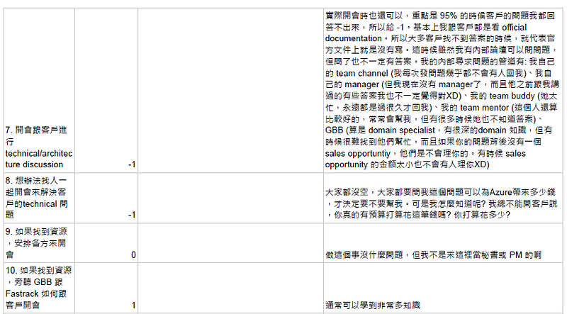
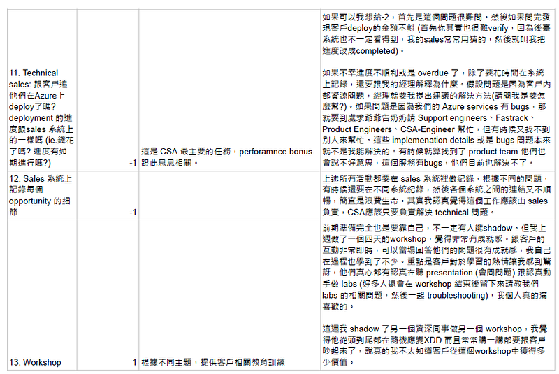
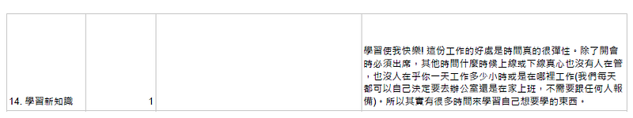

---

### 如何評估現職是否適合你 — 工作任務 (work tasks) 評分表

### 前言

這個方法是我最近在 podcast **大人的 Small Talk E**[**P121 不再憑直覺換工作！轉職也有系統化做法？**](https://podcasts.apple.com/us/podcast/ep121-%E4%B8%8D%E5%86%8D%E6%86%91%E7%9B%B4%E8%A6%BA%E6%8F%9B%E5%B7%A5%E4%BD%9C-%E8%BD%89%E8%81%B7%E4%B9%9F%E6%9C%89%E7%B3%BB%E7%B5%B1%E5%8C%96%E5%81%9A%E6%B3%95/id1452688611?i=1000506406004)上學到的，聽完之後覺得是一個以系統性方法來分析職位內容跟個人工作傾向，非常適用於最近在考慮要不要轉換職涯方向的我，所以想要加上我自己個人的解讀來跟大家分享一下。

### 如何做工作小任務分析:

  1. **把你每天在工作上要做的事情，以小時為單位記錄下來。** 例如我週一做的事為: 跟客戶開會一小時 x4 、花時間回客戶郵件一小時 x 1、研究某一個雲端技術一小時 x2。紀錄兩週之後，你就可以歸納出你的工作大概是由 10–30 個小任務所組成。
  2. **為每個小任務評分** : 如果是你喜歡做的小任務，或是做完會給你成就感的小任務，我們給它 1 分。如果是你討厭的小任務，或是做完也沒有成就感的小任務，我們給它 -1 分。如果是你既不喜歡也不討厭的小任務，我們則給它 0 分。
  3. **分析並歸納你的 1 分小任務，找出你偏好的職場方向:** 例如 Podcast 主持人 Bryan 的職位是土木結構工程師，但他後來發現他所喜歡的小任務都是跟人有關，例如跟客戶開會、專案管理、跨部門合作、專案報告，而不是結構計算與分析。但在他的現職的 20 個小任務中，只有 5 個 1 分小任務。
  4. **觀察在工作環境中，有哪些職位的工作內容包含了更多你的 1 分小任務:** 例如 Bryan 後來發現他們公司有個職位叫專案工程師，這個職位的工作 20 個小任務裡面就包含了較高比例 Bryan 喜歡的 1 分小任務。
  5. **(這點可能比較適用於大公司) 發現其他包含更多 1 分小任務的職位之後，你就可以開始多跟這些職位的人接觸，了解他們的日常工作內容(可能他們實際上做的事會跟你想像的有出入)，甚至是主動提出要幫忙他們的工作，藉此嘗試一下這個職位的工作內容(當然此時你的本質工作還是要做好):** 繼續使用 Bryan 的例子，隨著他幫忙的事情越來越多，同時他也做得特別好，老闆就漸漸把專案管理相關的工作交給他，把結構計算的工作交給其他人。此時雖然他的工作職稱沒有變，但他的工作內容其實已經逐漸偏向他想要的專案工程師了。(當然如果你不幸遇到慣老闆，此時也可能會變成你拿一份薪水，但卻要做兩個人的工作，所以尺度還是要稍微自己把握一下XDD)

### 以 Solution Architect 為例

以下是我對於 Solution Architect 這個職位的工作小任務分析，我總共歸納出 14 個小任務。有趣的是，我最後的總分是 0 分XDD (也就是我喜歡的小任務跟不喜歡的小任務剛好打成平手)。Bryan 的廣播裡沒有提到評分加總這個概念，但我覺得如果你的整體評分可以是正數或是越高越好，那就代表其實你的現職並沒有那麼難以忍受(可能只是其中一兩項你不喜歡)，所以你也可以用此作為要不要轉職的標準，畢竟世界上沒有完美的工作，人總是要做出取捨XD

如果你們有嘗試這個工作小任務分析，也歡迎在留言跟我分享你們的結果。你們的工作可以被分成多少的小任務? 裡面負 1 分小任務比較多，還是正 1 分小任務比較多? 你們的總分是正數還是負數呢? 你們覺得這個分析有幫助嗎? 因為我也非常好奇大家的分析結果! 哈哈
