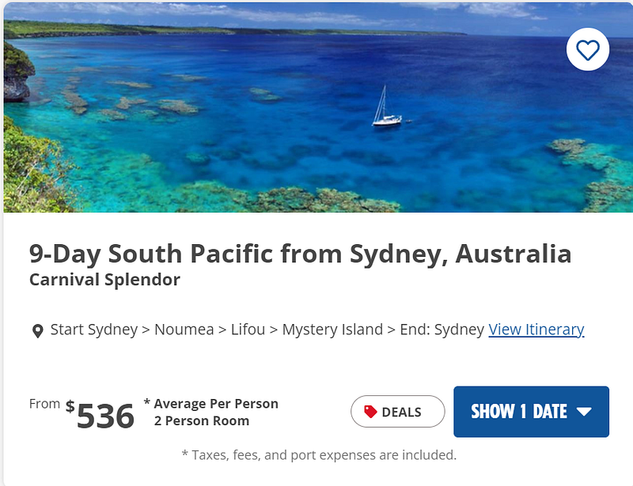
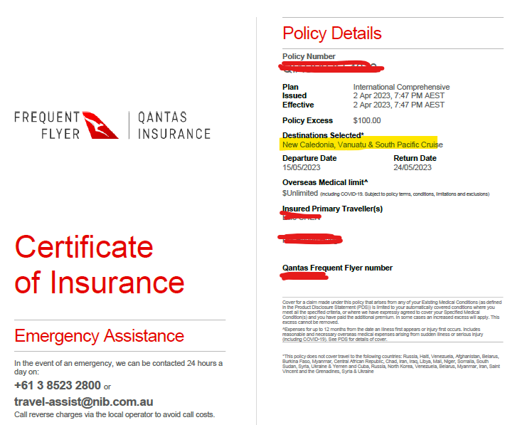

### **Carnival Splendor 澳洲南太平洋郵輪 — 事前準備及須知 (2023.05出發)**

* * *

### 前言

這週六我要飛往雪梨，在雪梨度過一個週末(曾經在雪梨住過七年的我，這次安排了跟許多朋友見面的行程，總共排了週六午餐、週六晚餐、週日午餐、週日晚餐共四場，真的好忙喔XD)，接著下週一開始為期九天的遊輪之行!

這是我人生第一次在澳洲坐郵輪，也是人生第一次坐郵輪，這篇文章要來跟大家簡單分享一下我目前查到的相關資訊。等我回來之後應該也會把郵輪的心得寫成部落格(從此轉職旅遊作家?XD)，請大家多多支持!

**郵輪行程:**[**Carnival Splendor**](https://www.carnival.com.au/cruise-ships/carnival-splendor?gclid=Cj0KCQjwu-KiBhCsARIsAPztUF1B8jgTP6Wzn-B7RAF8712AR9k2fl12NQaL460P8mqYZKXyv6O8cewaArifEALw_wcB)

*。這次我是跟另一個朋友一起前往，我們訂的是有陽台的雙人房，一個人大概是1200澳幣，我覺得就一趟包吃包住的旅行來說價位還算合理。*

**郵輪路線** : Start Sydney > Noumea > Mystery Island > Lifou > End: Sydney (雪梨出發，雪梨結束，中間停三個小島)

### **郵輪注意事項**

  1. **Covid 測試**

  * 上船時必須出示 24 小時內的快篩 (RAT) 陰性證明。測完快篩之後，記得把快篩結果跟證件(澳洲駕照或是護照都可以)放在一起合照，證明這是你自己的快篩結果。

**2\. 保險(澳洲出發的南太平洋郵輪)**

  * 保險: 其他郵輪航線的保險好像可以自行決定是否購買，但是Splender 這個航線會經過 Vanuatu (台灣: 萬那杜/中國: 瓦努阿圖) 跟 New Caledonia (新喀里多尼亞)，就 2023.5月來說還是強制購買海外 Covid 旅遊險。
  * 注意這裡的海外旅遊保險有其相關規定: 澳洲醫保卡(medicare)或是信用卡公司附的保險，都是不符合規定的! 一定要買特定的郵輪旅遊險，包含以下關鍵字 ‘multi-night cruise’ 跟 ‘Covid’ 才可以，大概一個人的保險費會在 $150–200 澳幣之間(視年紀跟健康狀況保費會略有不同)。
  * 我個人買的是網友推薦的[ Qantas 的 South Pacific 保險](https://insurance.qantas.com/travel-insurance?gclid=Cj0KCQjwu-KiBhCsARIsAPztUF11YPIV4aCyM_0p5EbnWG6QNxEE13DjY4vIBzXedN8qPvC1Morl8T4aAl6vEALw_wcB&gclsrc=aw.ds)

*，而且買保險的時候記得要把 Vanuatu 跟 New Caledonia 這兩個國家加進去(如下圖黃色標誌)。我2023.4月買的保費是一人$103，算是比較便宜，但是保險範圍比較廣的郵輪保險。*

**3\. 行李規定**

  * Carnival 的行李規定是一件20公斤，每個人最多可以帶兩件。但據網友說他們的行李限重不太嚴格，但是為了工作人員的身體健康著想，建議一個箱子還是不要裝太重。
  * 另外這個郵輪是從雪梨出發，像我跟朋友分別從布里斯本跟塔斯馬尼亞出發，這時的行李重量就必須要考慮航空公司的限重，我買的澳航跟維珍航空的機票剛好都是限重 23 公斤。
  * 從今年四月開始，Carnival 的遊客每人可以帶一瓶750ml的紅酒/白酒(注意: 烈酒是不行的，只有 wine 才可以)。
  * 另外每個遊客可以帶 12 瓶 350ml 以內的非酒精飲料，但注意這裡只能帶罐裝或是紙盒裝(can or carton)，寶特瓶跟玻璃瓶 (bottle or glass)是不行的。
  * 大家都知道違禁物品是不能帶的，但是延長線 (power board) 跟煮水壺 (kettle) 也不能帶。延長線的話可以上船跟服務人員要，請他們送到房間。

**4\. 主題之夜**

  * 每家遊輪公司根據航線長短會有不同的主題之夜，我這次進行的為期九天的 Carnival Splendor 的主題夜分為: 白色之夜(White Night)、80年代搖滾螢光之夜(80’s Rock’n’Glow )、甲板趴(Mega Deck Party，其實看描述就是之前的島嶼趴)。派段細節請參考[這裡](https://help.carnival.com/app/answers/detail/a_id/3895/~/deck-parties#:~:text=The%20Mega%20Deck%20Party%20is,low%20can%20you%20go%3F%22.)

*。*
  * 根據網友的分享，會針對主題夜打扮的遊客大概是一半一半，所以有興趣的人可以針對郵輪主題稍微準備一下，沒有興趣參與的人就穿自己舒適的衣服即可

**5\. 雪梨行李寄放選擇(以下是我上網查到的資訊，但我自己沒有試過)**

  * 如果需寄放行李(例如下郵輪的時間是早上，但你回程的飛機訂的時間比較晚)，則有幾個選項:
  * Circular Quay 車站附近的 Bounce storage at circular quay: <https://usebounce.com/city/sydney/sydney-circular-quay>
  * 雪梨中央車站裡面也有付費的行李寄存(可以事先上網預約): <https://baggagestorage.com.au/locations/central-station/>

**6\. 下船日**

  * 如果下船後需要搭飛機回家的人，建議機票時間訂在下午兩點以後，雖然行程上寫個早上6:30就會回到雪梨，但網友分享真正可以下船的時間大概是 10–12點之間。
  * 如果需要趕飛機的人，記得前一個晚上不要把行李放在房間門口(郵輪有統一把行李搬下船的服務)，而是當天自己推著行李下船，這樣下船後不用再等行李。

好的，行前分享就到這裡! 如果大家有什麼郵輪旅行的小祕訣，還請跟我分享!!!


