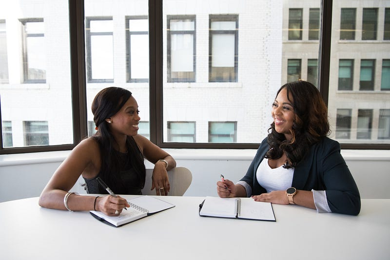

Photo by [Christina @ wocintechchat.com](https://unsplash.com/@wocintechchat?utm_source=medium&utm_medium=referral) on [Unsplash](https://unsplash.com?utm_source=medium&utm_medium=referral)

### 前言

今天想要跟大家來分享在澳洲求職過程中電話篩選 (phone screening) 的相關經驗。首先，phone screening 跟 phone interview 是兩個不同的概念。Phone screening 通常是由人資主導，主要目的是核實你的個人基本資料、履歷內容，進一步詢問申請職位跟公司相關的問題。Phone interview 就是一個正式的面試關卡，只是透過電話進行(而非傳統的面對面面試)，通常面試官會是你的主管或是團隊裡的其他同事，不會是人資。

一個好的人資，必須要在這通短短的電話之中，進一步了解申請人的工作資歷、技能以及性格(看看跟公司文化是否相符：culture fit)，然後判斷這個申請人是否值得進入面試。畢竟面試官的時間是很寶貴的，無效的電話篩選過程只會增加公司的人事成本!

* * *

### **澳洲求職流程**

先簡單介紹一下澳洲求職的流程 (每間公司的流程可能會有所出入，但基本上都會有這幾道關卡):

  1. **履歷篩選:** 由人資進行第一階段的履歷篩選。
  2. **電話篩選:** 通過履歷篩選後，人資通常會寄一封 email 跟你約一個時間進行 15–20 分鐘的 phone screening。下面我將會以之前申請 DevOps Engineer 的經驗作為例子來進一步分享。
  3. **第一輪面試:** 我最近兩次的面試經驗(2022–2023年)，第一關面試都是跟 Hiring Manager。這跟我前幾年的求職經驗很不一樣，通常 Hiring Manager 不都是最後一關嗎?XD
  4. **第二輪面試:** 通常會跟另一個 senior team member 或是跟你的 skip manager (也就是你未來的經理的經理)面試。
  5. **第三輪(或更多輪面試或其他測驗):** 我 2020 年面試 AWS (Amazon Web Services) 的時候，總共經過了六輪面試，2022年面試微軟的時候則是三輪。通常規模較大的公司基本上都需要通過 3–5 輪面試才會拿到正式 offer。

### 實際 Phone Screening 問題分享

接下來我要分享某次電話篩選中人資問我的問題(以及我對她的吐槽XDD):

  * **Can you please tell me what your current role is and when did you start it? (你可以告訴我你現在在微軟的職位是什麼嗎? 還有你是從什麼時候開始現在的職位)**

基本上這是我第一次在 phone screening 被問到這種問題，可能想要核實一下我的履歷的資訊是否是最新版的??? 不然我不懂問這個問題有什麼意義，履歷上不都寫了嗎XD

通常來說，正確的問法應該是 「Can you please tell me a bit more about your current role? (可以麻煩你簡介一下你現在的職位嗎?)」雖然說這也是履歷上就有的資訊，但這個問題是一個很好的開場，以一個申請人熟悉的題目進行暖身，人資也可以藉由這個問題進行延伸，更加了解申請人的職務、工作技能等等。

  * **What’s your current salary? (請問你現在的薪水多少?)**

基本上我覺得這題滿失禮的，而且感覺很不「澳洲人」(非常台式思維?XD)。遇到這種問題，千萬不要傻傻回答數字。我當下的回答是「Sorry, I’m not comfortable answering this (不好意思，這題我不方便回答)」。然後人資聽完也沒有多說什麼，她就直接進行下一題了

  * **What’s your salary expectation for this role? (請問你預期的薪水是多少?)**

這題我通常也不會直接回答，通常我的答案會是 「Can you please tell me what the expected salary range is for this role? (可以麻煩你告訴我貴公司對於這個職位的預期薪資範圍嗎?)」就我個人目前的經驗來說，人資都會跟我說他們這個職位的大概範圍。

當然，有的人資可能會持續逼問你一個數字，這時候我會試圖至少再問一個問題「What’s the expected level of this role? Mid-level? Senior? (請問這個職位是一個中階還是資深職位?)」，然後根據對方的回答我會說「Thanks! Based on my research, the salary range of a mid-level DevOps Engineer in Australia is around 130–150K per year. Does that align with your salary expectation for this role? (謝謝。根據我的研究，澳洲中階 DevOps Engineer 的年薪大概是 13–15 萬澳幣之間，請問這個數字符合貴公司對這個職位的預期嗎?)」

  * **Do you have any holiday plan in the next 6 months? (請問你在接下來六個月有任何休假的計畫嗎?)**

再說一次，這裡不是澳洲嗎?XDD 我以為澳洲人不會問這個問題，不過我 2022 年面試微軟的時候也有這個問題，我猜有些公司就是會在意這件事吧?

  * **What’s your notification period? (請問你的離職預告時間是多長?)**

澳洲通常是四週，但如果你個人不想要兩份工作之間銜接得太緊湊的話，也可以視個人情況給出長一點的時間，例如六週 (這樣除了合約上規定的四週預告期，中間還有兩個禮拜可以稍微休息一下)。

  * **What do you want to apply to our company? (請問你為什麼要申請我們公司?)**
  * **What do you want to apply to this role? (請問你為什麼要申請這個職位?)**
  * **What do you want to leave your current role? (請問你為什麼想要離開你現在的職位?)**

這題切記不要據實回答 (例如: 我討厭我的老闆或是我討厭我的工作之類的XD)。通常我回答的方式會從新職位的技能或是職涯發展方向出發，例如這題我的回答是「My current role is more about solution architecting and stakeholder management, and I really miss my hands-on keyboard time when I was a technical consultant with AWS. I’ve always been interested in cloud infrastructure and DevOps, so I want to get back to a more hands-on, technical engineering role. Therefore, the role with your company is perfect for my skills and career goals. 我目前的工作著重於提供雲端架構解決方案以及跟不同團隊之間的跨部門溝通，我很懷念以前在亞麻遜當雲端技術顧問的時間，當時我花很多時間在寫程式。我一直都對雲端基礎建設跟DevOps很有興趣，所以我打算回到一個更著重技術落實的職位，因此貴公司的這個職位非常適合我的技能以及未來的職涯發展方向。」

  * **Where do you live and are you okay to come into the office in the city? (你現在居住的區域是? 我們辦公室在市區，通勤對你來說會是問題嗎?)**

我猜她會問的原因是因為我住的地方離市區有段距離，通勤時間大概是單程一小時。但我覺得這個問題非常有趣，因為她甚至沒有先告訴我一週要去公司幾天XDDD 澳洲公司目前都以 hybrid 的工作模式居多，也就是一個禮拜有幾天進辦公室、有幾天在家公司。

所以我先問了她「Is your company implementing hybrid working arrangement at the moment? How many days do I need to go into the office? (請問貴公司目前一週需要進幾天辦公室呢?)」人資的回答是三天進辦公室，我覺得還算是我可以接受的範圍。如果五天都要進辦公室的話，我可能無法或是需要考慮搬家。

  * **Are you currently interviewing elsewhere? What’s your progress so far?(你目前有在面試其他公司嗎?進展如何?)**

我真的是，第一次在澳洲被問到這個問題LOL 這次的電話篩選經驗讓我覺得這家公司有一種很守舊、很傳統的公司文化。

  * **What can you bring to this role? (你覺得你可以為這個職位帶來什麼助益呢?)**

人資總算問了一個我覺得非常好的問題!!! 這個問題就是加分題，大家回答時一定要根據個人的資歷跟技能，以及現在申請的職位條列出 2–3 點你覺得自己就是這個職位的最佳候選人的技能/經驗。

  * **Are you an Australian citizen? (請問你是澳洲公民嗎?)**

這個其實不是一個身分歧視的問題，而是在澳洲有些職位 (尤其是需要跟政府單位打交道或是需要處理澳洲人民的資料的職位) 申請人必須要有澳洲公民的身份。但同時這個問題也可能跟你在澳洲的簽證狀態有關，人資需要確定你能合法在澳洲居留以及工作**(** 不同的澳洲簽證可能會有工作時數的限制)

  * **How did you find this role? (你怎麼知道這個職缺的?)**
  * **Do you have any questions for me? (你有什麼問題想要問我的嗎?)**

大家一定要好好把握這個機會問人資問題！我通常會問一些關於團隊的問題(例如：團隊有多少人? 他們都在布里斯本嗎? 還是這個團隊會橫跨澳洲不同城市或是不同國家?) 跟面試問題 (請問面試有幾關？內容分別是什麼?)

通常電話篩選的時間不會太長，所以也不能問太多問題，不然人資會覺得很煩，因為他們還有很多其他申請人要聯絡，但我覺得關鍵的問題一定要問。

### **總結**

以上就是我近期的電話篩選經驗分享，希望會對你們有幫助！


