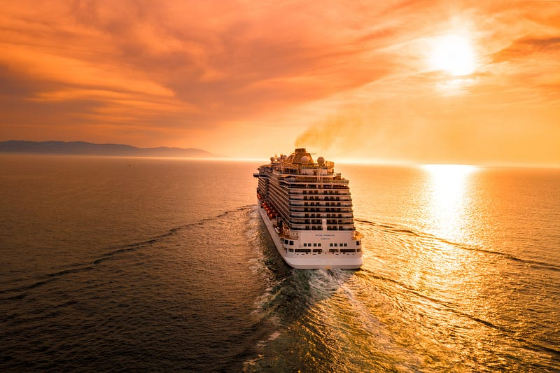
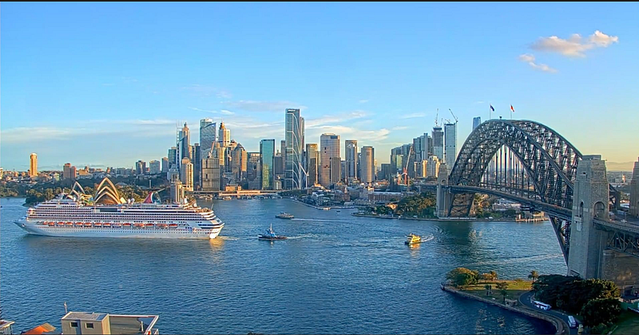
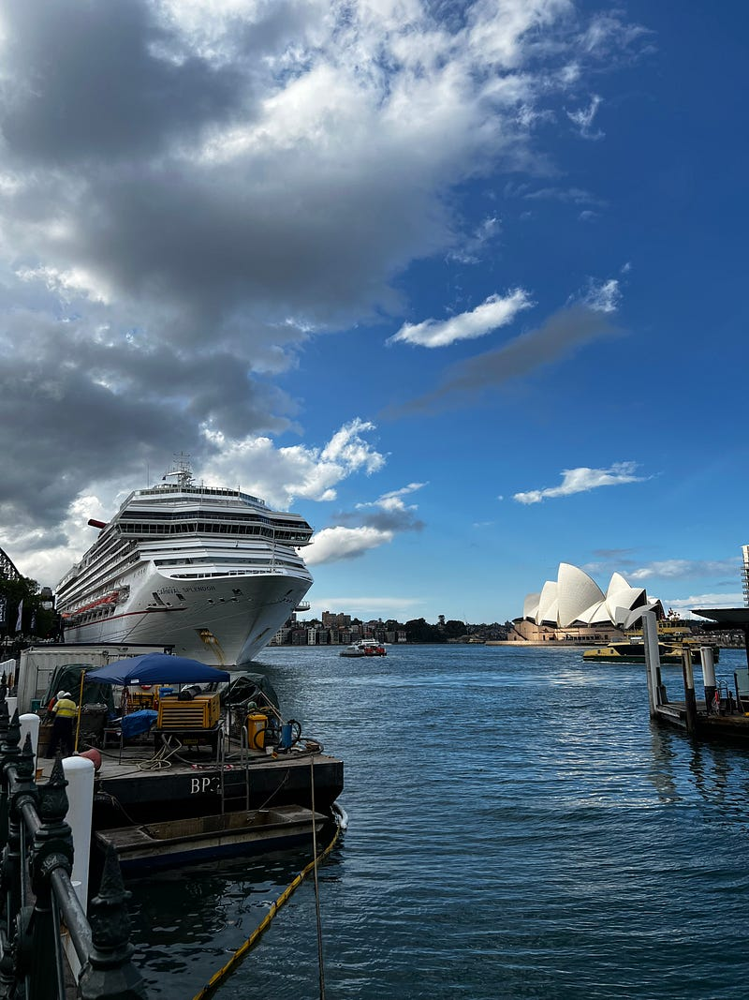
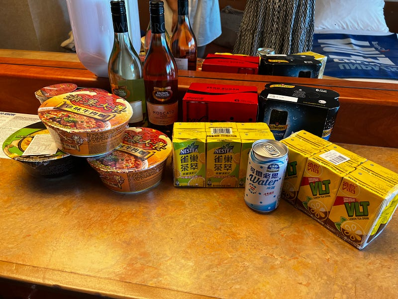
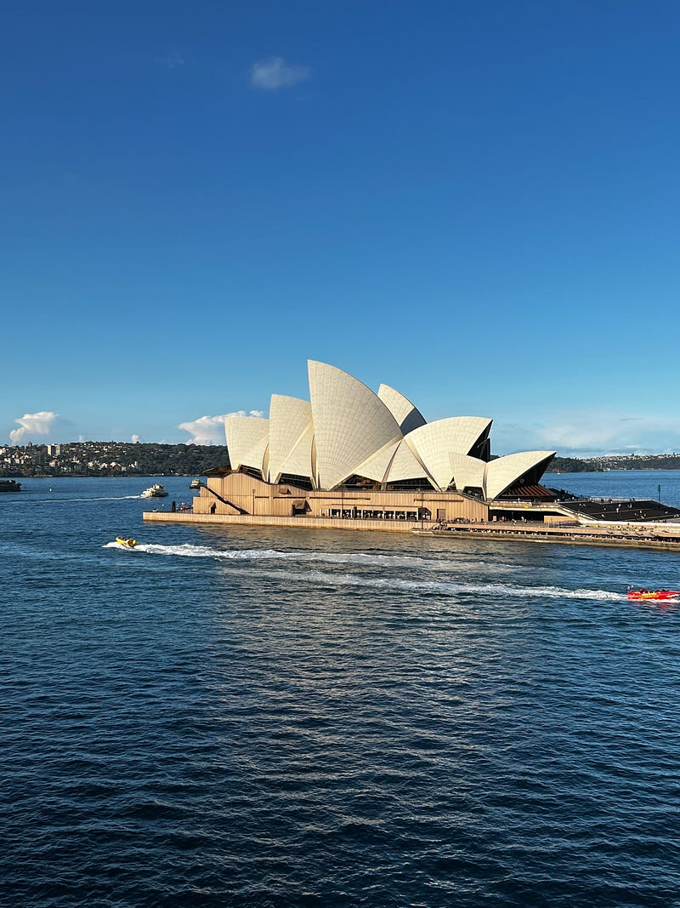
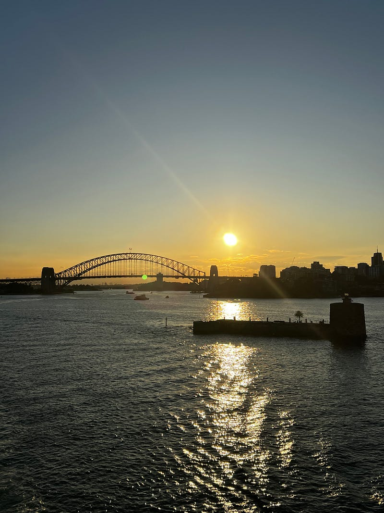
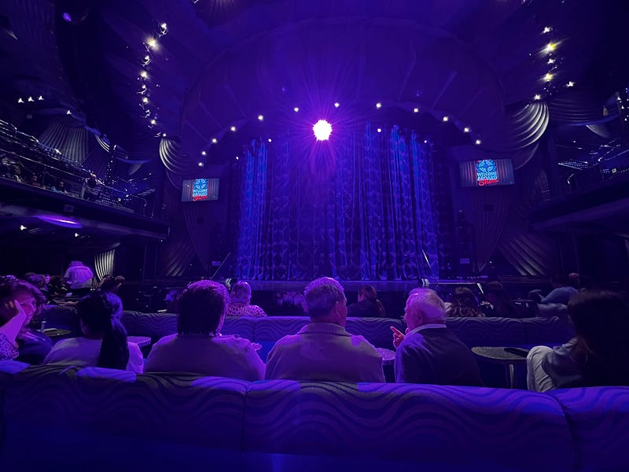
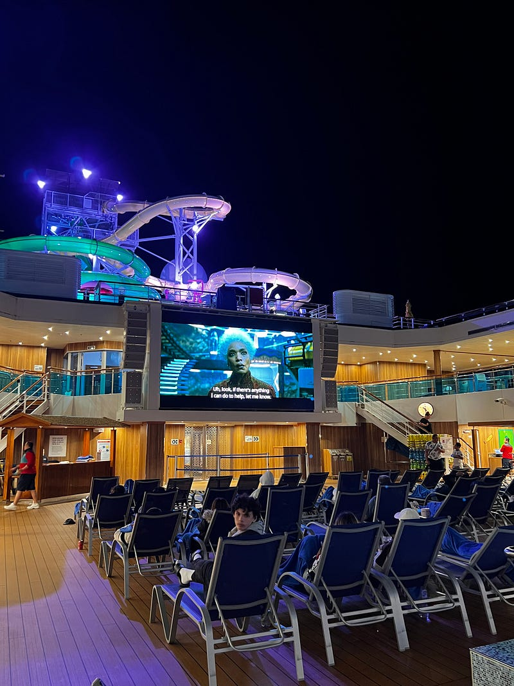

* * *

### 2023.05.15 Carnival Splendor 澳洲南太平洋郵輪 — Day 1 雪梨登船

Photo by [Alonso Reyes](https://unsplash.com/@alonsoreyes?utm_source=medium&utm_medium=referral) on [Unsplash](https://unsplash.com?utm_source=medium&utm_medium=referral)

* * *

### **前言**

住在布里斯本的我跟住在塔斯馬尼亞的友人 Ashley 決定一起進行一個為期九天的南太平洋遊輪之旅。這是我人生第一次的遊輪旅行，Ashley 則是在十年前參加過一個類似的遊輪行程。這趟遊輪之行從雪梨出發，途中會經過 Vanuatu (台灣: 萬那杜/中國: 瓦努阿圖) 的 Mystery Island 跟 New Caledonia (新喀里多尼亞)的 Noumea 小島、Lifou 小島。除去登船當天以及下船當天，我們會有四天在海上的行程以及四天在小島上的行程。

我們訂的是有陽台的雙人房，一個人大概是1200澳幣，我覺得就一趟包吃包住的旅行來說價位還算合理。詳細的行程資訊請參考遊輪公司的官方網站**:**[Carnival Splendor](https://www.carnival.com.au/cruise-ships/carnival-splendor?gclid=Cj0KCQjwu-KiBhCsARIsAPztUF1B8jgTP6Wzn-B7RAF8712AR9k2fl12NQaL460P8mqYZKXyv6O8cewaArifEALw_wcB)。

### **雪梨 Circular Quay**

我跟 Ashley 其實週六早上就先分別飛往雪梨，在雪梨度過了一個週末，然後星期一下午才開始我們的登船行程。我們一到 Circular Quay 立刻就看到了我們的遊輪，然後就開始了瘋狂拍照的行程，不只自己要拍，還要幫別人拍XD

郵輪以及雪梨歌劇院

### **Cruise Check-in**

郵輪 Check-in 的動線還滿流暢的！記得飲料必須要隨身攜帶，不能託運 (Carnival 的新規定是一人可以帶一瓶 750ml酒 + 12 瓶 350ml 以內的無酒精飲料，但這次並沒有人特別檢查！Ashley 帶了13瓶飲料也沒人發現XD)

25瓶飲料、2瓶酒以及泡麵

上船後的第一件事就是參加安全講習 (safety briefing)，結束後就可以直接去房間了，房卡會放在房門口信箱裡，用一個信封裝著。

我們訂的陽台房出發前剛好正對著雪梨歌劇院，真的是非常幸運~

從陽台看雪梨歌劇院

**出發啦**

4點遊輪正式出航，一路上看到了很美的夕陽與晚霞。

雪梨大橋與夕陽

**晚餐 — Gold Pearl (Main Dining Room)**

Check-in 時我們選的是 early dine-in，所以5:15 就可以入座用餐了。我們的桌號剛好就是我的生日，會不會太巧！！！

如果沒有特別去換桌號或是去其他地方吃飯的話，每天晚上會固定坐在同一桌跟同一批人吃飯。我們跟兩對情侶一起共桌，有趣的是情侶的男生都是澳洲人，女生則有一個是泰國人、一個是歐洲人。想當然而，跟澳洲人一起坐肯定就得開始閒聊，於是我們就開始尬聊了起來XD

### **Welcome Aboard Show**

吃完晚餐我們回房間休息了一下 (其實我已經累到不行了，因為我早上還上班處理了一堆事)，然後去了劇院觀賞晚上 9:30的 welcome aboard show。表演的工作人員真的都很認真努力，但這個 show 其實感覺看與不看都可以XD

三樓劇場

### **第一天小結**

渡輪還算平穩，但三不五時還是會有搖晃感，我們倆個人都吃了一顆暈船藥做準備，所以完全沒有不舒服的感覺。但如果特別會暈船的人，可能還是要三思再決定要不要參與遊輪行(或是需要勤奮地吃暈船藥XD)。

九樓的露天電影院


