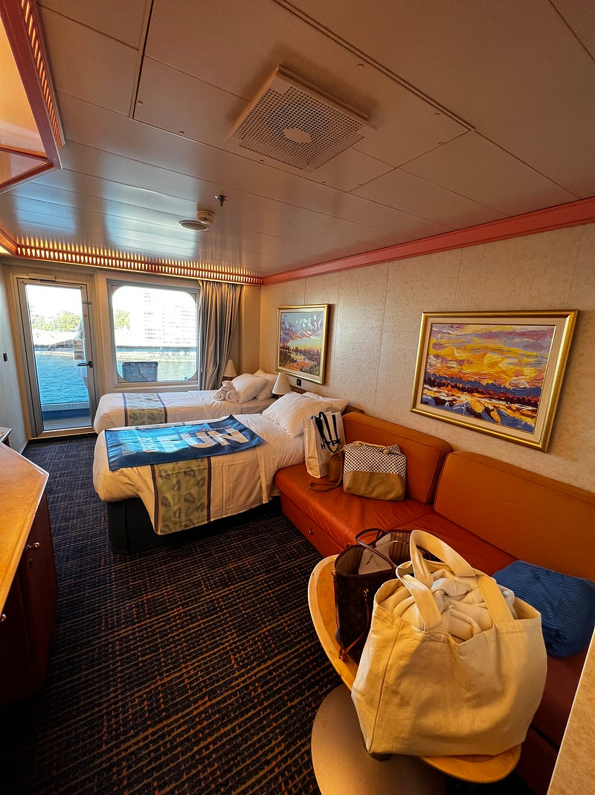
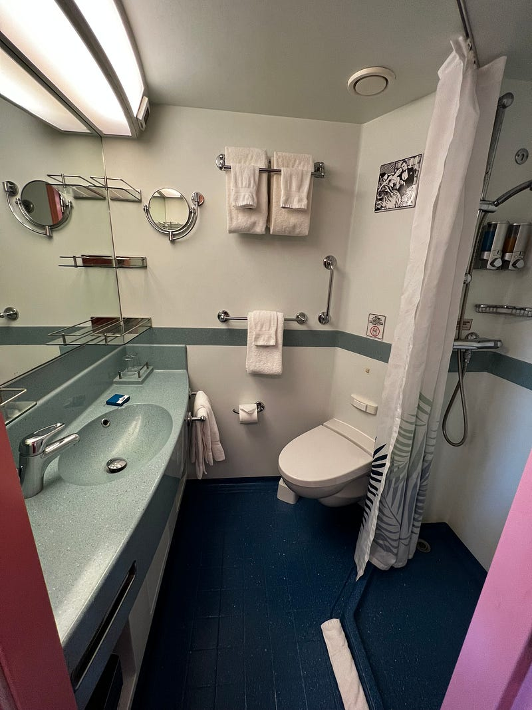
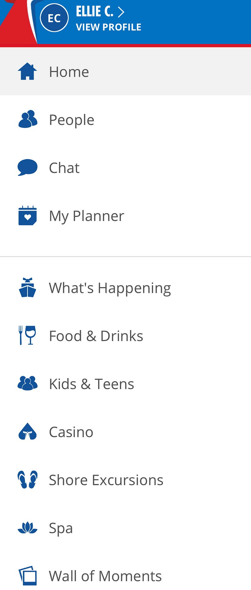
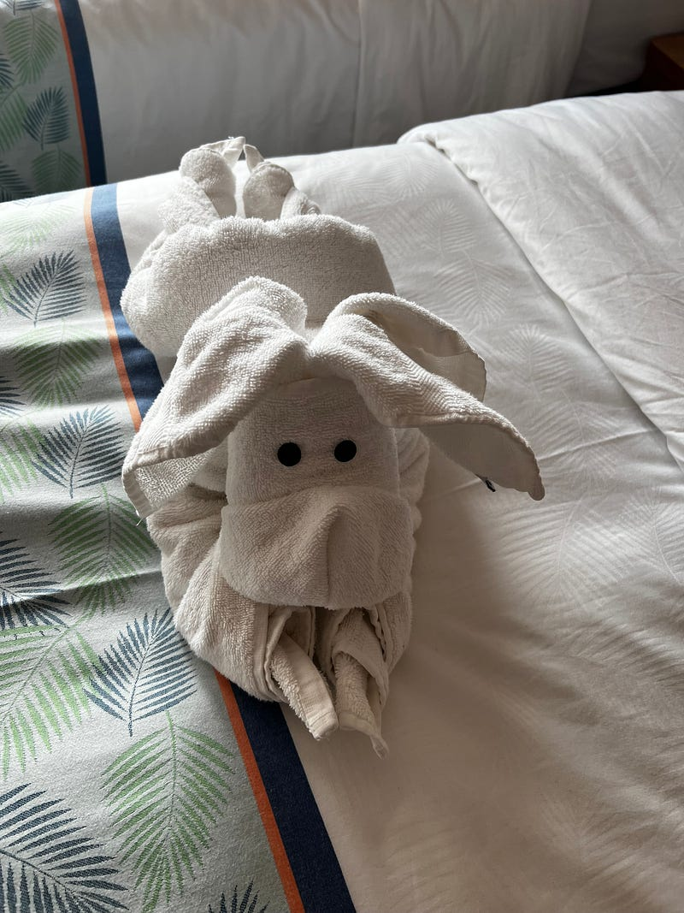
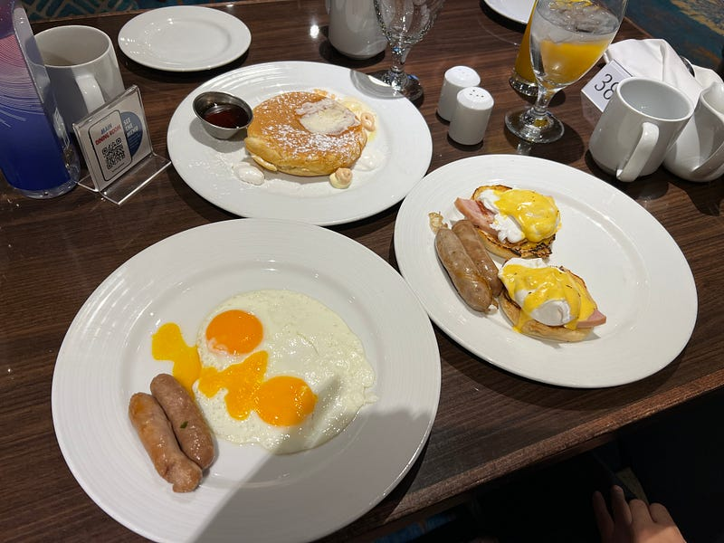
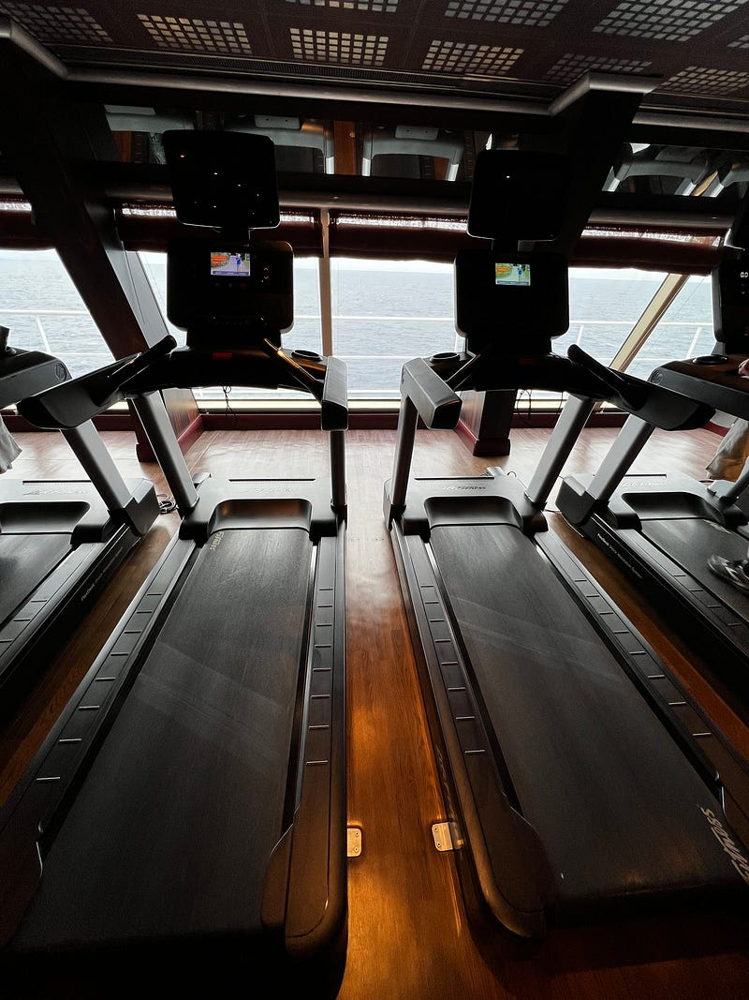
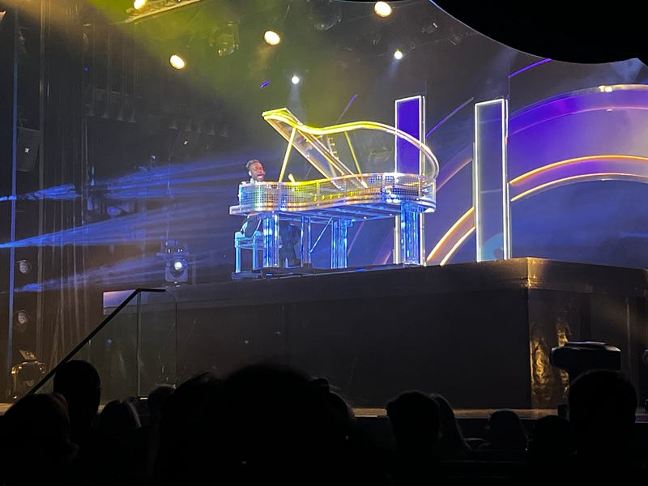

---

title: "Carnival Splendor 澳洲南太平洋郵輪 2023.05.16 — Day 2 Sea Day 1"
date: 2023-05-28
slug: "2023-05-28-carnival-splendor-day-2"
cover:
  image: "images/medium-0*xfQ3sXJxvDvXfgLi.jpg"
  alt: "郵輪海上航行美景"
  credit:
    photographer: "Douglas Bagg"
    photographer_url: "https://unsplash.com/@nzdoug16"
    photo_url: "https://unsplash.com"
images: ['images/medium-0*xfQ3sXJxvDvXfgLi.jpg', 'images/medium-1*67HCCHz_fSzckeRLuUmWYg.jpg', 'images/medium-1*Syk9imF-O3YSSPzPSj5Lvg.jpg', 'images/medium-1*HAJu3QMuwOx5D1Fulmf_QA.jpg', 'images/medium-1*_EPSTaZhWKOAQXT-bsDP8w.jpg', 'images/medium-1*_lwlQc-BAqX6CueoYussvg.jpg', 'images/medium-1*EdpwnroHyE04LCgDEfxy6g.jpg', 'images/medium-1*K1Kd6G4Gg6BdbzDDefKRbA.jpg']
categories: ["旅行紀錄"]
tags: ["旅遊", "郵輪"]
episodeseries: ["Carnival Splendor 郵輪"]
---

* * *

### Carnival Splendor 澳洲南太平洋郵輪 2023.05.16 — Day 2 Sea Day 1

* * *

### 遊輪房間

首先，應讀者 Huli 大大的要求，先來分享一下遊輪房間的內部照片。說真的，遊輪房間比我想像中大很多XD (本來還以為會是一個很狹小、逼仄的空間，但其實兩個人住非常舒適，收納空間也不少)。

*遊輪房間: 陽台房*

*遊輪房間衛浴*

### 遊輪 App

Carnival 有一個手機 App 叫 Carnival Hub，非常好用。只要連接上遊輪的免費 wifi (免費 wifi 只能拿來看 Carnival Hub，沒有辦法上其他網站)，你就可以在 Food & Drinks 裡看到 main dining room 每天的早餐/晚餐菜單 & 其他餐廳的營業時間、What’s Happening 李可以看到每天的活動清單(喜歡的話可以存成書籤，跟你同房的人也會看到你標註了感興趣的活動)，還可以在 Wall of Moments 裡上傳自己遊輪行程的照片與同船的人分享。

### 陰天

今天早上起床就一陣陰雨綿綿的 fu，讓人只想待在房間耍廢哈哈

*遊輪傳統之一 每天房務員都會放上新的毛巾動物*

### 早餐

今天早餐我們還是在 Gold Pearl 餐廳吃的，因為我看了菜單有我想嘗試的鬆餅。如果想在餐廳吃早餐 (不去 buffet 的話)，記得先在手機上用 Carnival Hub app 預約，桌子好了之後會收到 app 通知。不要像有些人沒有預約就直接去餐廳，絕大部分的時間都沒辦法 walk in。但不得不說遊輪的食物品質滿一般的，也不能說難吃，但也沒有到超級好吃的地步XD

*遊輪早餐*

### Disco Dance Move

吃完早餐，我們參加了一個迪斯科舞蹈教學，我們完全就是上去亂跳，但也有些阿姨奶奶們非常投入! 如果放鬆心情去體驗的話，也是滿有趣的XD

### 健身房

健身房意外多人，而且器材也不少。在跑步機上跑步的時候可以看到外面的海景，是名副其實的海景健身房! 今天我跑了 30 分鐘的步，意思意思一下，不枉費我打包了整套健身房的服裝來XD

*健身房裡的跑步機*

### Lobby Bar Mojito $16

接著去船上的酒吧點了我第一杯雞尾酒，其實價格不貴，但喝起來沒什麼酒精感，是不是偷工減料？

### 消費

我目前真的覺得郵輪上沒有什麼值得花錢的地方XD 免費的餐廳除了 buffet 跟 main ding room (Gold Pearl 之外)，還有漢堡店、披薩店、三明治店、印度料理，今天還有亞洲熱炒(Asian Wok)，其實選擇滿多的！

需要額外付錢的餐廳有一人 $65 的牛排館 (3 courses) 跟一人 $140 的 chef table， 但感覺沒有特別吸引人。

### 活動

另外遊輪上的活動雖然多，但我覺得其實都滿無聊的XD 通常要麻是一些吸引人額外花錢的活動(商品特賣會、spa/按摩/髮廊體驗活動)，要嘛就是一些比較適合澳洲老人家的活動(trivia、跟主持人互動的 show 等等)，都不是我非常有興趣的活動哈哈

但好處是因為我這趟遊輪行並沒有購買一天約 $20 澳幣的網路套餐(九天就大約是 $180 澳幣)，所以整個人處於與世隔絕，心情非常平靜的狀態，我覺得也是不錯哈哈

*表演*

### 第二天小結

到目前為止覺得有點無聊XD

遊輪活動雖然很多，但沒什麼我感興趣的，期待之後抵達小島後會好一點，不然我覺得我以後可能不會再參加了哈哈。

當然每個人的感受不同，跟我同行的 Ashely 超級喜歡遊輪! 我在旅程中也遇到了很多非常喜歡遊輪這種旅行方式的人。我覺得郵輪適合：喜歡 social、跟陌生人互動的人 (尤其是中老年人XD)、想省旅費的人(九天包吃包住包交通只要 $1200 澳幣一人，是真的非常划算。更別提這是因為我們訂了價位較高的陽台房，我在旅程中遇到其他旅客訂的是便宜一點的房型，在打折後只付了 $200–400 澳幣/pp!)、不想要花太多時間規劃行程的人。

我個人理想的旅行型態是在旅程中到處走走，四處參觀博物館、美術館，探索咖啡廳跟餐廳，觀察路人以及當地的文化習俗等等，所以大家應該可以明白為什麼我對遊輪始終都抱持著一種「還好」的心態了XD
