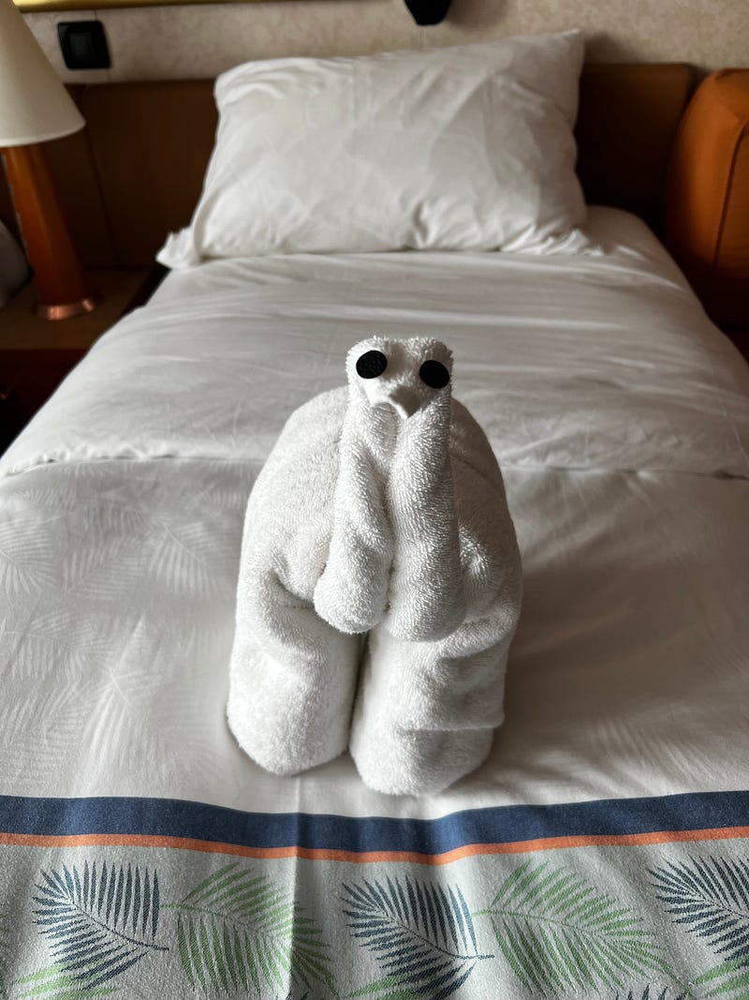
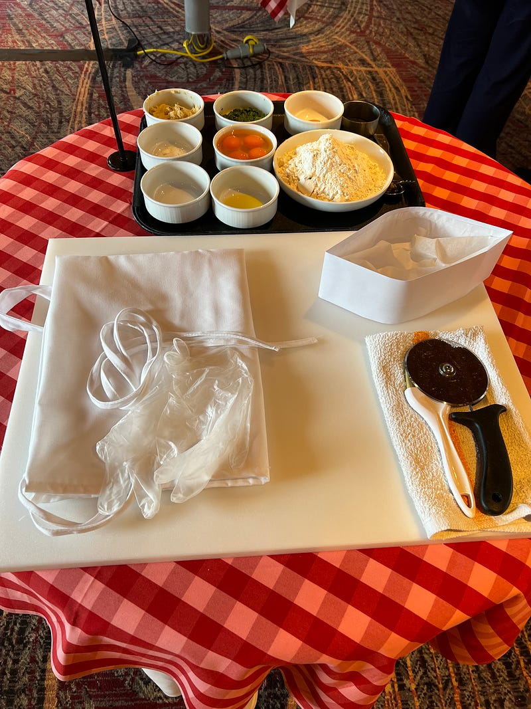
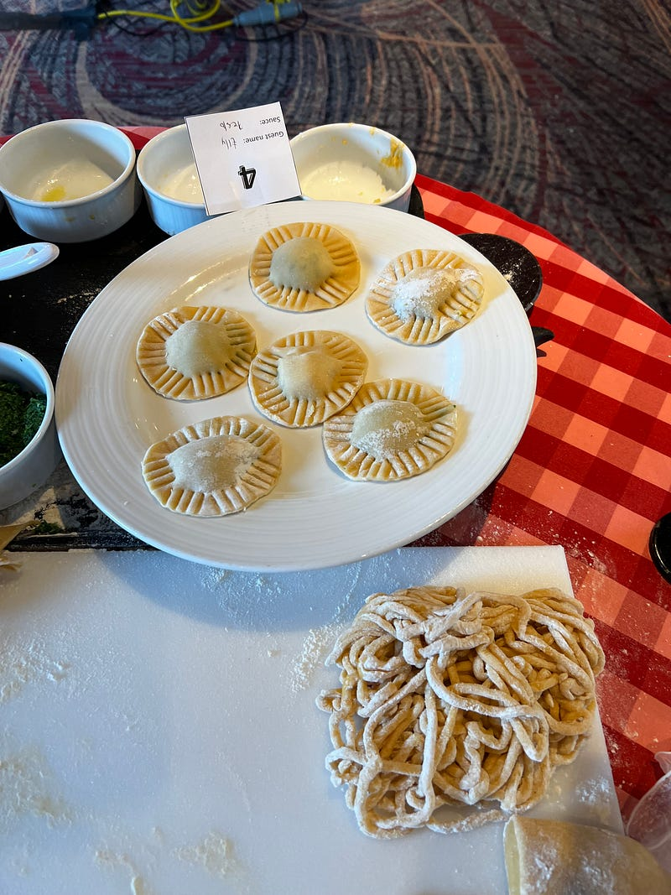

---

### Carnival Splendor 澳洲南太平洋郵輪 2023.05.17 — Day 3 Sea Day 2

*可能是隻恐龍吧?XD*

* * *

今天是第二天 sea day，遊輪持續前進中，我們進入了下一個時區，所以遊輪工作人員提醒我們記得要手動把時間往前調一個小時(因為海上沒訊號，所以手機不會自動調整)。

**義大利麵烹飪課 $45pp**

 事前準備

今天的第一個行程是製作義大利麵，我們跟著遊輪的餐廳主廚(其他廚師也會在一旁指導)，一起做了條狀義大利麵(不是spaghetti) 跟義大利麵 (ravioli)，非常有趣！

*手工義大利麵餃製作完成品*

做完之後餐廳會直接把你自己做好的義大利麵餃現煮給你品嚐(我選擇了青醬)，除此之外這個課程還包含了午餐(沙拉、大蒜麵包、魚排、提拉米蘇)，我個人覺得非常值得，因為在外面上烹飪課少說也要$100，這個還包了午餐!

*郵輪義大利麵烹飪課午餐*

**甲板**

吃完午餐後，今天的天氣總算好一點了，於是我們跑到甲板拍照。

*九樓: 中央甲板海景*

*九樓: 船尾甲板風景*

**咖啡**

回程看見咖啡廳沒人，順便買了一杯 barista coffee，結果超難喝哈哈哈哈 (雖然說$4這個價錢沒有很貴，但這個咖啡品質我真的不行lol 剛好把以後每天的咖啡錢都省下來了哈哈)

*五樓: 咖啡廳*

**Formal night**

今天我們終於迎來遊輪的第一個主題之夜「Formal Night」，大家都換上正式服裝，準備拍照。

遊輪上設置了很多虛擬背景的攝影棚，之前通常都沒有人去拍，但今天可能著正式服裝的人多了，每個攝影棚都在排隊。攝影師會幫忙指導動作，但他們有些指示還滿奇妙的XD

照片隔天會洗出來放在四樓的照片牆區，如果滿意的話，乘客可以花錢購買照片，一張約$35。不滿意的照片可以丟在回收桶。注意這裡的照片是不能翻拍的。

*其他遊客的家族照*

**晚餐：舞蹈表演**

今天的晚餐我們還是坐在316桌，今天總算船平穩了一點(前幾天因為浪太大，所以這個表演取消了)，於是有服務生站上桌子的表演，還滿嗨的。底下的服務生也會跟著一起跳~

*餐廳服務生的舞蹈表演*

明天終於要開始小島行程了，期待!!!


