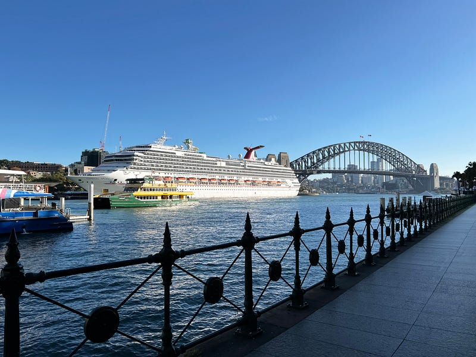

* * *

### 2023.05.24 Carnival Splendor 澳洲南太平洋郵輪 — 返回雪梨 & 心得總結

郵輪與雪梨大橋

* * *

郵輪遊記最終章~ 感謝讀者 [再思](https://medium.com/u/e54a0db63c4c) 的留言鼓勵，不然這篇可能會就此消失在我的待寫清單之中XDD

### 返回雪梨

今天回到雪梨啦! 終於回歸了網路世界XDD 立刻幫郵輪跟雪梨大橋合照一張，然後跑到歌劇院旁邊的咖啡廳點了一杯咖啡~ 還是澳洲的咖啡好喝!

以下要來分享我這趟 9 天南太平洋遊輪行的心得總結:

### 總花費(以下數字為澳幣，可以自己乘 20 換算成台幣)

  * **Cruise $1208/pp** : 九天的南太平洋郵輪陽台雙人房，一個人的價格是$1208。其實我覺得包吃包住包交通這個價格比起一般出國旅行的機票跟住宿花費來說，真的是輕鬆又省錢，難怪會有很多人喜歡郵輪旅行XD
  * **旅行保險 $103/pp** : 去南太平洋規定要買保險。
  * **郵輪上的開支 $187** : 其實郵輪上真的沒什麼好花錢的(因為已經包吃包住包一些免費活動了)，我九天花了不到$200! 而且有很多錢都還是硬花的，因為我實在太無聊了XDDD 例如我花 $6.5 買了一杯現榨果汁，花 $4 買了一杯咖啡 (後來發現咖啡實在太難喝了，後面的咖啡錢都省下來了XD)，花了$60買了三杯調酒，基本上只有[ Alchemy Bar ](https://www.carnival.com.au/onboard/alchemy-bar)的調酒好喝。在賭場花了$20，因為我實在太無聊了。只有義大利麵製作課我覺得花得很值得哈哈
  * **島上的 tour 開支$180** ：我們去了四天小島，我們都是到了島上才訂行程，所以四天我就花了這些錢，但根據個人選擇的行程不同花費應該也會不一樣。
  * **紀念品$10** ：基本上我就只買了兩張明信片跟兩張郵票哈哈哈

九天行程的總花費為 $1588 澳幣(約為台幣3萬3)。我覺得郵輪行對於我來說真的是一個有錢沒處花的地方，因為要花錢的地方例如賭場 (我不感興趣) 跟酒吧 (酒太難喝了)，我都因為種種理由花不了錢哈哈哈哈

### 郵輪上各式活動的個人排名

  1. **義大利麵製作課(付費)** : 雖然這是一個付費活動，但我覺得付 **$** 45 可以讓餐廳主廚教你做義大利麵，自己做不好副廚還會出場幫你的面整型，做完之後餐廳會當場把你製作的義大利麵餃煮給你吃，還附上 3 courses 的午餐，我完全覺得值回票價!
  2. **動物毛巾教學** : 學會自己摺毛巾動物，我覺得非常好玩!
  3. **Q &A with Cruise Director Lizzie**: 覺得聽到很多郵輪小知識，我覺得非常有趣。
  4. **Theme Nights (Island, White, 80s Rock & Glow)**: 主題之夜，建議喜歡拍照的人記得準備相對應的服裝，可以大拍特拍。對於不喜歡照相的我(我喜歡拍食物、拍風景、拍有趣的事物。跟朋友合照還能說是紀錄一下當下，但我不喜歡單純拍我自己的照片XDD) 來說也是一個還好的活動。但我朋友 Ashley 熱愛拍自己的美照，所以她非常喜歡這類活動!
  5. **Dance class** : 有一些簡單動作的舞蹈課，還算有趣。
  6. **每天晚上的唱跳秀** ：我沒有每天晚上都去，我看了三場，只有最後一天晚上的秀我覺得超級精彩!!! 前面兩場我都覺得不去看也不會損失什麼XD
  7. **Piano Bar** : 去鋼琴酒吧氣氛還是滿好的，而且你還可以點歌!不過歌手跟觀眾的年齡層都有點太大了，他們點的歌，都不是我聽過的歌lol 我覺得如果可以彈一些流行歌曲應該更有趣。
  8. **脫口秀** ：值得去看一下，但我覺得這個應該很看當天脫口秀表演的人對不對你的胃口。我看了三場只喜歡第一個人，剩下兩個一個是我覺得笑話很低級，另一個人我覺得根本不好笑XD
  9. **冰雕** : 其實就只是看他們雕冰雕，但至少是個免費的活動。
  10. **Bingo (付費)** : 去體驗一下跟整場觀眾一起玩賓果的經驗也算是滿有趣的，但屬於體驗過一次後我應該不會再參加的活動。
  11. **Deal or no deal (付費**): 這是把一個澳洲同名的遊戲型電視節目 [Deal or No Deal ](https://en.wikipedia.org/wiki/Deal_or_No_Deal_%28Australian_game_show%29)搬到船上，我印象中台灣也有類似的節目，查了一下叫[平民大富翁](https://zh.wikipedia.org/wiki/%E5%B9%B3%E6%B0%91%E5%A4%A7%E5%AF%8C%E7%BF%81)，是沈玉琳的節目XD 觀眾要花錢才能參與遊戲，我覺得有點無聊XD
  12. **賭場(付費**): 我個人沒什麼偏財運，也不是特別愛賭博，所以我覺得勉強打發時間還可以(可是輸錢都輸很快，有可能5分鐘就輸了澳幣20，我覺得打發時間的CP值很低XDD)。

下面是我根本不感興趣，所以沒去參加的活動XD

  * **Trivia** : 澳洲人真的很愛玩這個，但是這個對外國人來說真的很難，就算你英文再好可能也一樣(我的雅思閱讀跟聽力都是滿分9)，比起英文理解，這更多是文化的問題。例如播 90 年代的電影讓你猜電影名(不好意思那個年代的電影我只知道他們的中文名XD)、猜70/80/90年代的歌曲/歌手名(如果是2000年以後的歌我還知道歌手跟歌曲的英文名，在那之前我根本不行XD)、或是播澳洲電視廣告讓你猜品牌名(例如播烤肉醬廣告讓你猜品牌是萬家香一樣)，每次參加 trivia 我都覺得自己是個智障lol，對團隊毫無貢獻。我每次可以貢獻的題目通常是地理題(講出世界上各個國家)跟歷史題(請問第一次世界大戰是哪一年) 之類的。
  * **Karaoke:** 澳洲人或是西方人的卡拉 OK 跟亞洲人習慣的那種包廂式卡拉OK是不一樣的，他們通常都是一個 bar 中間有個小舞台跟麥克風，大家輪流上台唱歌，然後底下都是陌生人，這種我也不行。

### 郵輪必帶跟可以不用帶的物品

**我覺得必帶的東西**

  * **足量的暈船藥** ：不管你自己暈不暈船，暈船的人真的比你想像的多，就算你自己不需要，也可以拿來幫助別人或交朋友XD 我跟 Ashley 幾乎沒什麼暈船的現象(我個人有兩次覺得不太舒服，但也沒有到真的暈船)，但我們認識的人裡面有超多暈船的人，而且是不舒服到完全吃不下東西的那種！而且這些人不只是航程一開始暈，到了航程尾端還是有人覺得超不舒服，真是太可憐了><
  * **筆** ：需要填文件的時候很有用 (或是寫明信片的時候! 雖然我被朋友笑說這個年代還有誰在寫明信片QAQ)
  * **高跟鞋** ：拍照時使用，看起來腿會比較長。男生的話，也可以準備拍照時看起來會更高更好看的鞋子!
  * **Reef shoes** : 完全必帶，Kmart/big w 一雙$10就有，我在小島的海灘上被刮到腳超痛!
  * **Snorkeling mask** : Kmart 有便宜的，也可以在 Amazon 買全罩式的，浮潛時視野比較清晰(類似[這種](https://www.amazon.com.au/AouloveS-Panoramic-Adjustable-Breathing-Anti-Leak/dp/B0BFGZKC24/ref=asc_df_B0BFGZKC24/?tag=googleshopdsk-22&linkCode=df0&hvadid=633553393862&hvpos=&hvnetw=g&hvrand=17006967514425320654&hvpone=&hvptwo=&hvqmt=&hvdev=c&hvdvcmdl=&hvlocint=&hvlocphy=9069077&hvtargid=pla-1943332306067&th=1&psc=1))。
  * **泳衣** ：可以至少帶個三套，因為旅程中有連續四天的小島行程，平常在遊輪上不管是玩滑水道或是泡加熱 spa 池都需要。
  * **透明的卡套** ：在船上所有消費都是透過一張 sail & sign card，同時也是你房間的鑰匙。一上船之後就會拿到這張卡，但他們不會發任何卡套，於是很多人只好在商店購買，建議自己攜帶一條掛在脖子上的卡套省錢。 PS: 卡套的英文叫 lanyard，我自己覺得這是一個台灣人學英文的時候不太會學到的字XD
  * **泡麵** ：一開始我想說餐廳的選項那麼多，應該不需要吧！但真的吃到最後覺得好膩!!! 我後來吃了兩次泡麵，覺得自己特別幸福~

**不需要自己帶的東西** ：

  * **海灘巾** ：房間裡就會有，平常需要的話可以再去櫃檯借(一人可以借不只一條)，所以不需要自己帶。
  * **非酒精飲料(請按照自己平常喝飲料的習慣，酌量攜帶即可)** ：前面說過一人可以帶12瓶，於是我跟朋友就帶好帶滿，但其實我們平常根本不是那麼常喝飲料的人XDD 所以我後來帶了一堆回去布里斯本(Ashley 把她的飲料都給我了)，建議大家還是按照自己平常的飲食習慣準備(但我覺得一人帶一瓶酒是必需！九天喝完一瓶不為過XD)

### 總結

這是我人生第一次搭郵輪旅行，我覺得好像也很有可能是最後一次XD 我覺得郵輪適合什麼事都已經差不多安排好，不需要自己花太多時間規畫路線、餐廳、住宿、行程的人。也適合喜歡上述郵輪活動的人，我個人旅行偏好四處走走、逛逛博物館/美術館、探索當地餐廳/咖啡廳、跟當地人聊天聊解他們的文化，這些完全在郵輪型中都無法滿足，所以我真的覺得郵輪對我來說滿無聊的XD 但是跟我同型的友人 Ashley 或是郵輪上認識的朋友泰國情侶，他們就很享受，也歡迎大家跟我分享你們喜歡/不喜歡郵輪的原因喔~


