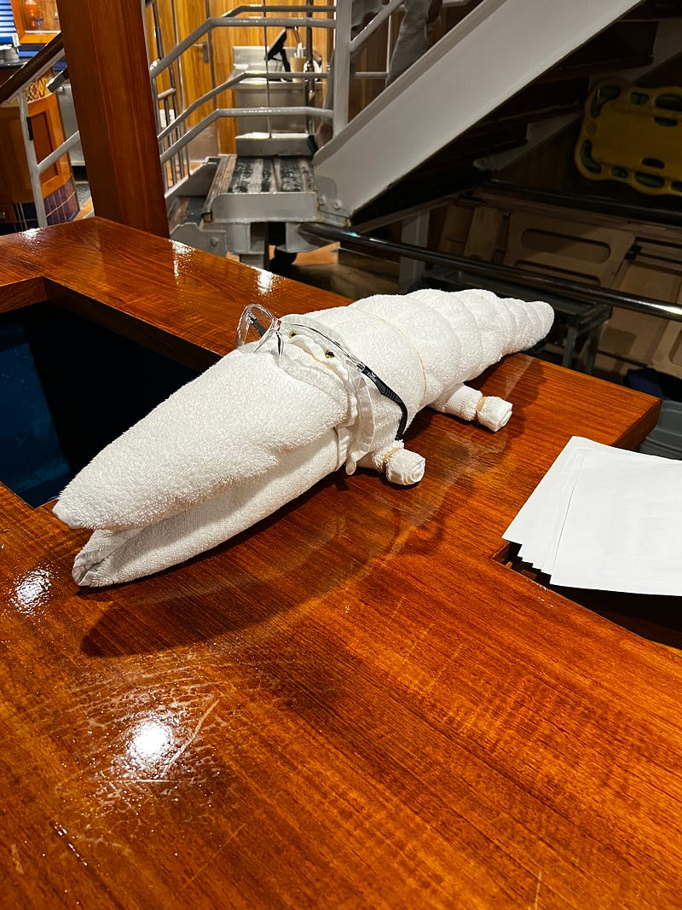
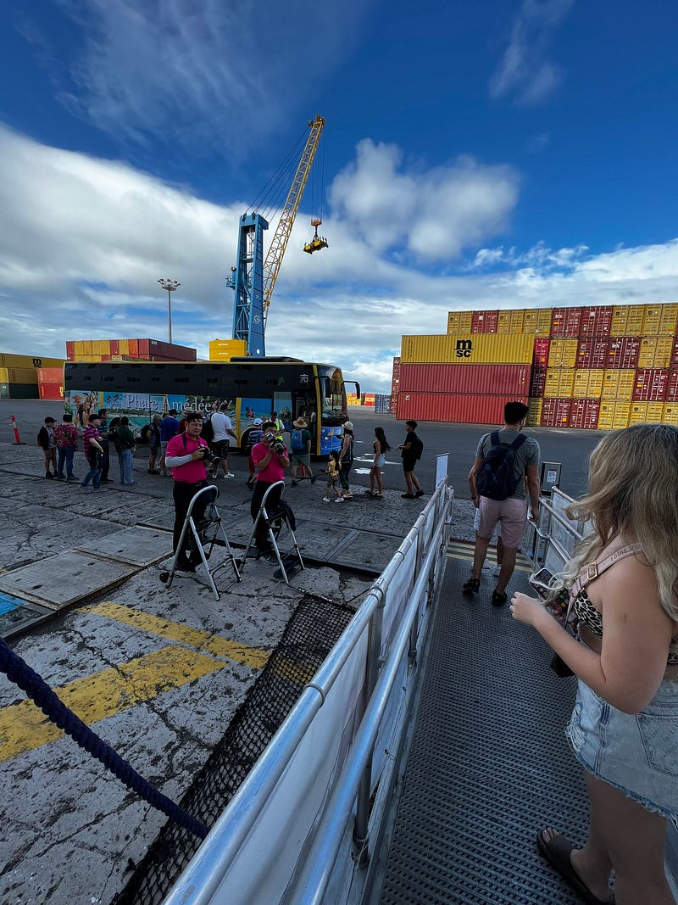
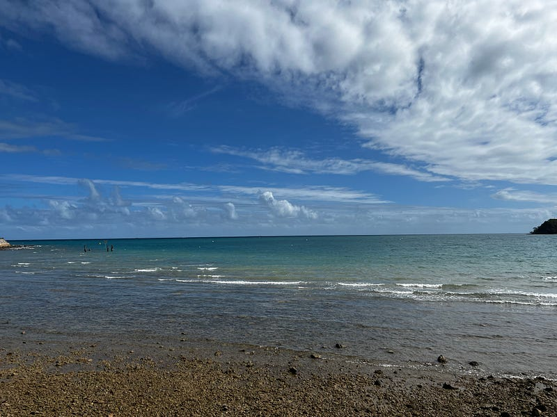
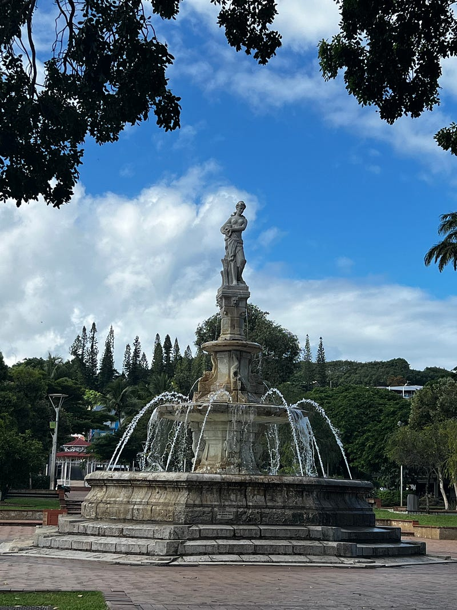
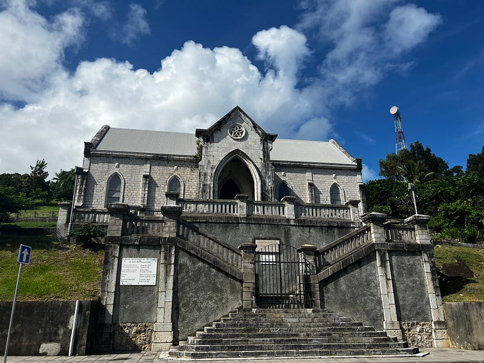
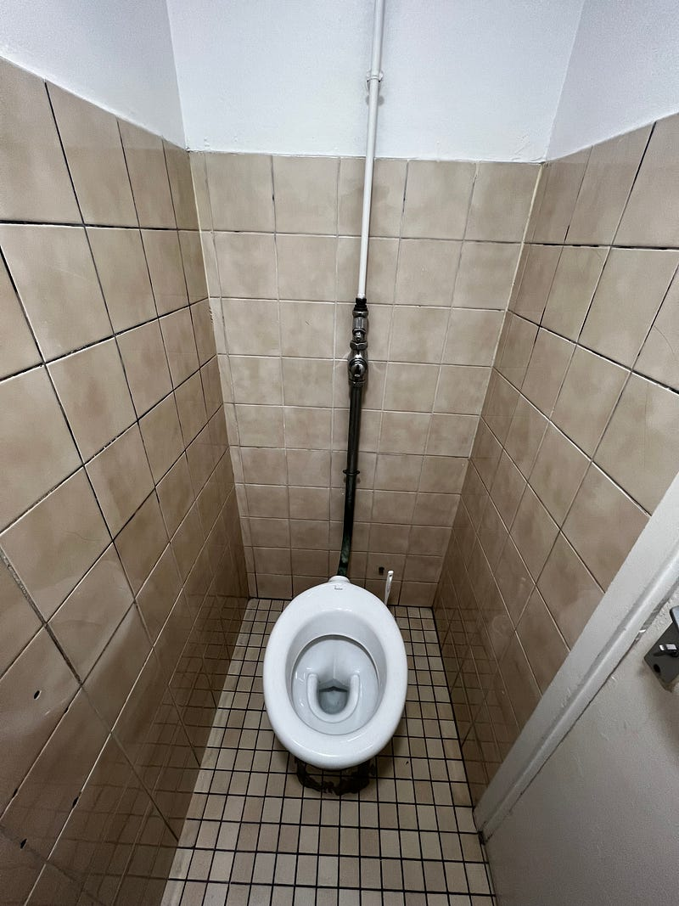
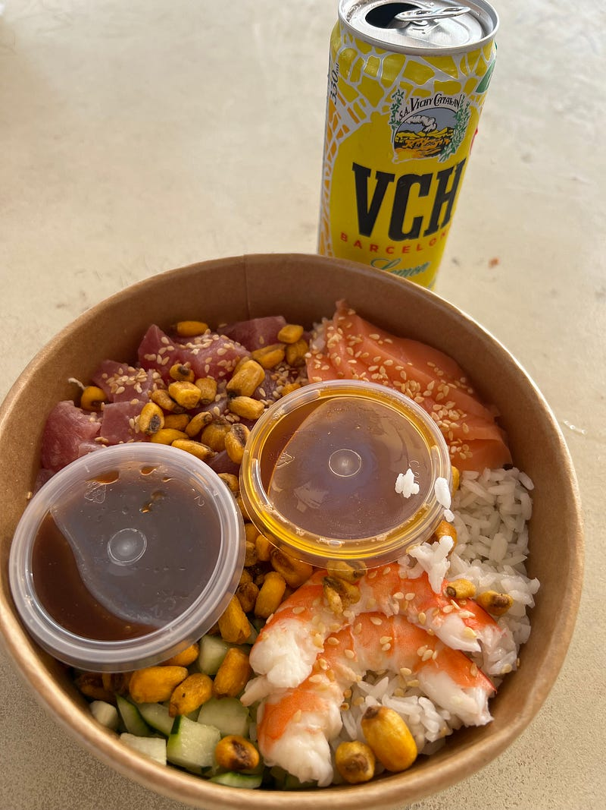
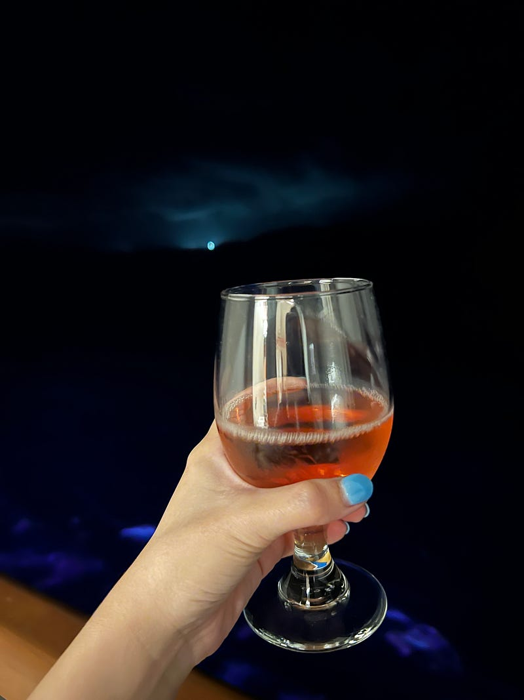
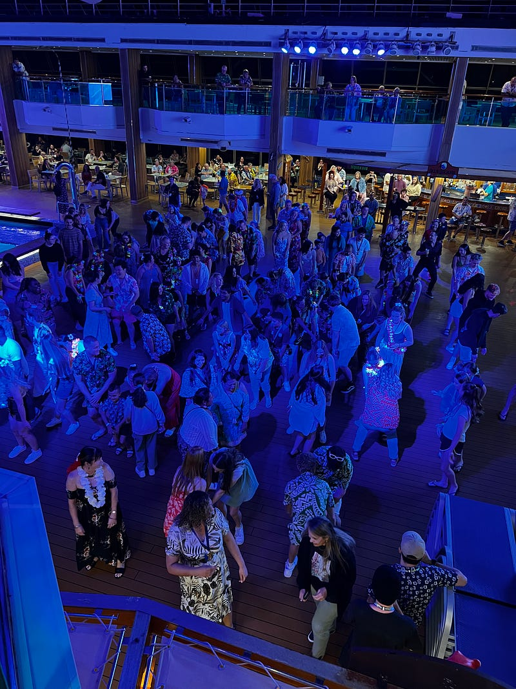

* * *

### [旅遊] 2023.05.18 Carnival Splendor 澳洲南太平洋郵輪 — Day 4 Noumea (New Caledonia)

毛巾鱷魚

* * *

**第一個小島**

終於到達了第一個島 Noumea！從陽台望出去非常 city vibe (或是更精確的說，港口工業區vibe)。吃完早餐後就準備下船啦～下船的時候還有工作人員會站在旁邊準備幫你拍下船照XD

Noumea 下船中

**島上行程**

之前就聽說過下船後訂行程的價格大概是遊輪上的一半，於是我們下船後才訂了 hop on hop off bus，一人$15澳幣 (在船上訂好像要$60，好誇張)。價差更大的tour 可能會差到一人$100，所以千萬不要傻傻在遊輪上訂行程喔！Noumea 的海水非常清澈，只可惜因為幾個月前有鯊魚攻擊遊客的事件，所以 Noumea 到目前為止還是全面禁止游泳 QAQ

Noumea 海邊

**Noumea 市區**

今天主要的行程就是搭觀光巴士以及在市區內亂晃。

Noumea 公園教堂

然後還有另一個特別奇怪的觀察，就是這裡的廁所都還算乾淨，但每一個馬桶都沒有馬桶蓋，why????!!!! 我跟 Ashley 百思不得其解耶

**午餐**

後來我在港口邊的超市買了一個生魚片 poke bowel，醬料很微妙。一盒是微辣的蔥油、一盒是烤肉醬，上面還有像是炸過的玉米粒。生魚片本身還滿新鮮好吃的，但我多希望他們給我一點醬油跟芥末哈哈哈

**新克里多亞 New Caledonia**

其實新克里多亞給我一種跟斐濟類似的感覺，不過這裡因為曾是法國殖民地，所以主要語言還是以法語為主。人民很友善，但不像斐濟完全就是以觀光業維生，感覺以一般商業跟工業工作也不少，所以反倒沒什麼好玩的，就是一種比較鄉下的都市感。難怪之前晚餐跟我們同桌的 Nathan 就說這個島他沒有打算要下船。

**郵輪行程過半感想**

目前郵輪行第四天，覺得時間過得很快，但真的也覺得遊輪滿無聊的~

而且我真心不知道每天都在累什麼的，回到船上之後我立刻昏睡了兩個小時。錯過了dining room 的用餐時間，於是我今天吃了兩片現烤手工披薩（不得不說剛出爐的披薩真的是無敵)，然後在 buffet 吃了很多水果，其實滿甜的。

之後我回到房間陽台，一邊喝酒一邊聽著海浪聲看我之前在 Netflix 下載的影集，其實滿愜意的。

**Island deck party**

今天總算天空作美，大家終於有辦法在甲板上跳舞

—

如果你喜歡閱讀海外生活、澳洲職場、轉職工程師的相關文章，歡迎追蹤我的 Medium 部落格，這樣你就不會錯過我每週六的固定更新！近期我也會不定期更新我在澳洲旅遊的遊記 ^0^

也麻煩大家多多幫我推廣給你們的親朋好友，或是任何你們覺得這篇文章會對他們有所幫助的人！你們的鼓勵是支持我繼續寫作下去的動力 :)

有任何問題或是想要看的主題，歡迎留言跟我互動 :)

**延伸閱讀**

  * [[旅遊] 2023.05.17 Carnival Splendor 澳洲南太平洋郵輪 — Day 3 Sea Day 2](https://medium.com/@cloudarchitectec/旅遊-2023-05-17-carnival-splendor-澳洲南太平洋郵輪-day-3-sea-day-2-fd37273abd58)
  * [[旅遊] 2023.05.16 Carnival Splendor 澳洲南太平洋郵輪 — Day 2 Sea Day 1](https://medium.com/@cloudarchitectec/旅遊-2023-05-16-carnival-splendor-澳洲南太平洋郵輪-day-2-sea-day-1-77c20aea9c2d)
  * [[旅遊] 2023.05.15 Carnival Splendor 澳洲南太平洋郵輪 — Day 1 雪梨登船](https://medium.com/@cloudarchitectec/旅遊-2023-05-15-carnival-splendor-澳洲南太平洋郵輪-day-1-雪梨登船-fd3e84083d62)
  * [[旅遊] Carnival Splendor 澳洲南太平洋郵輪 — 事前準備及須知 (2023.05出發)](https://medium.com/@cloudarchitectec/旅遊-carnival-splendor-澳洲南太平洋郵輪-事前準備及須知-2023-05出發-b7ee58cf7bc4)
  * [[介紹] 大家好，我是EC!](https://medium.com/@cloudarchitectec/介紹-大家好-我是ec-afcf45d128eb)

