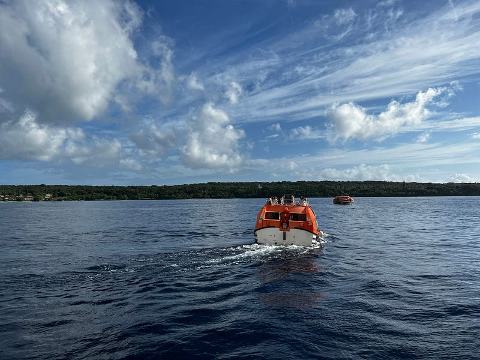
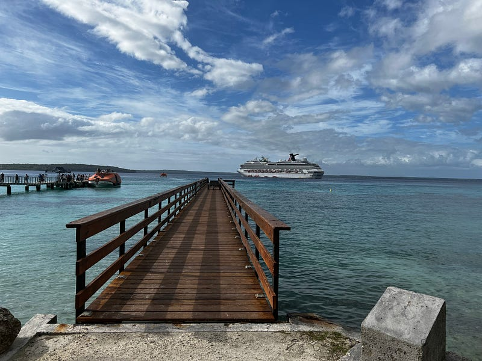
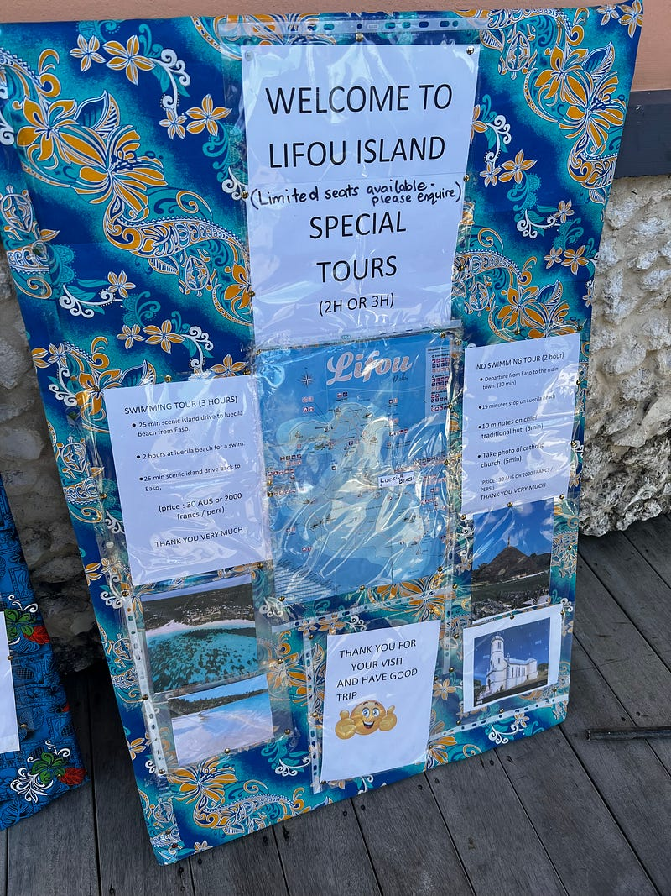
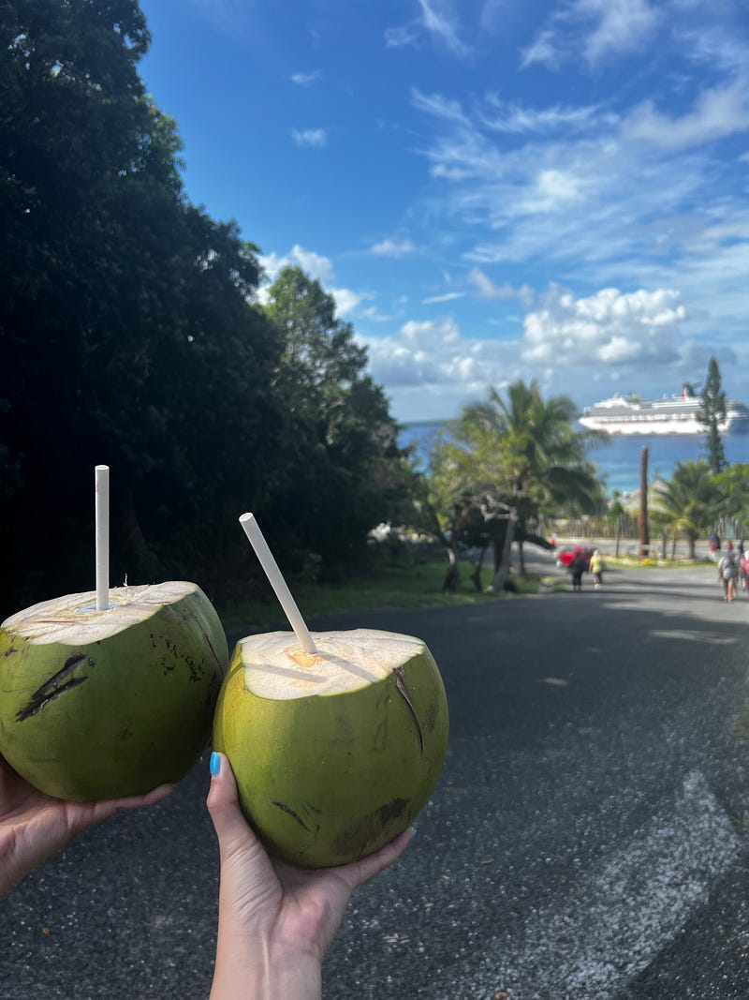
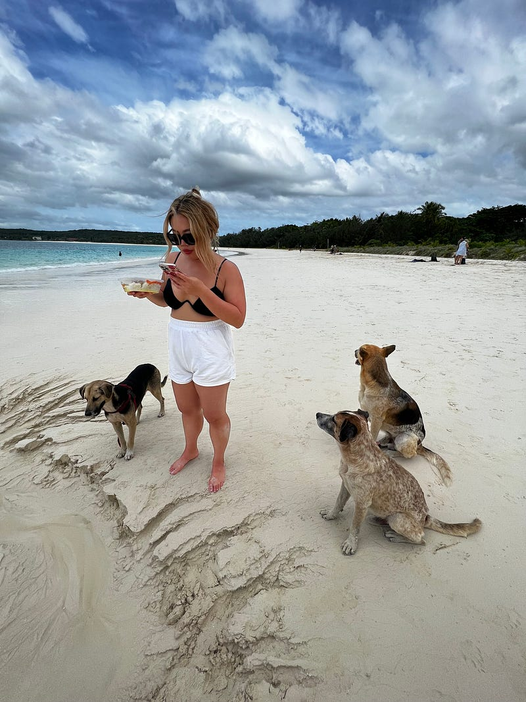
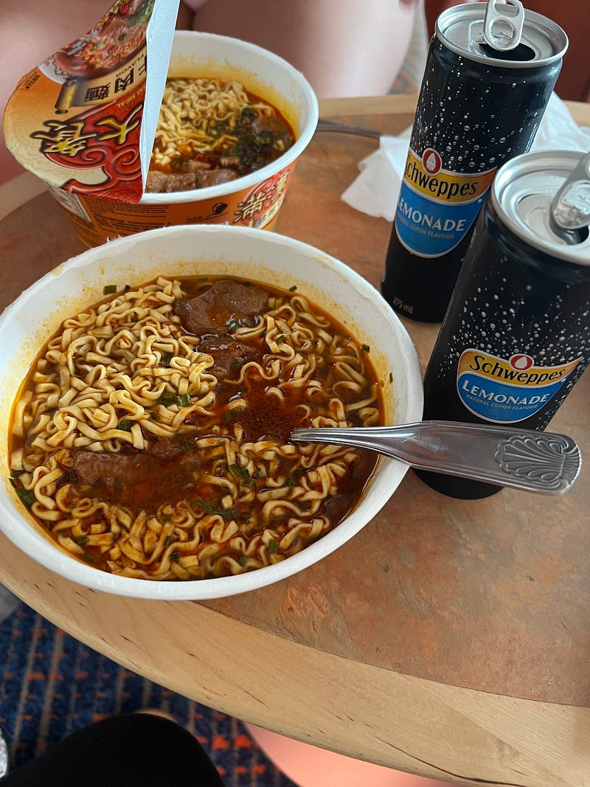
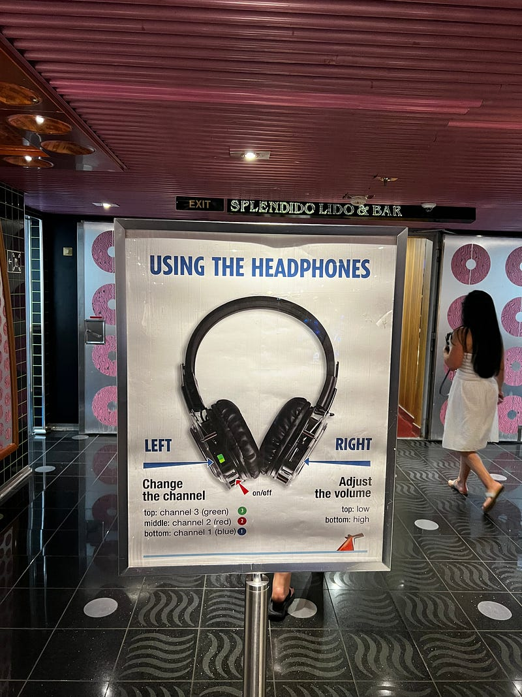
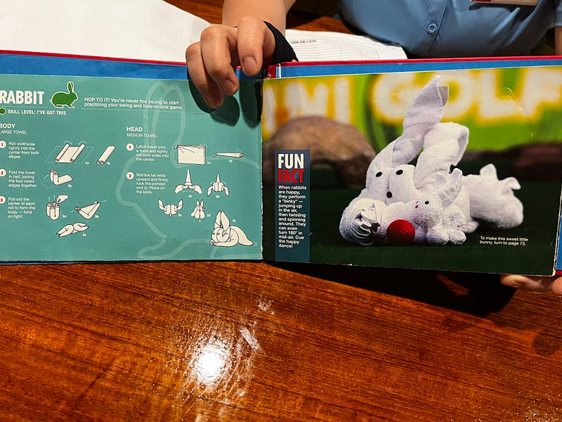
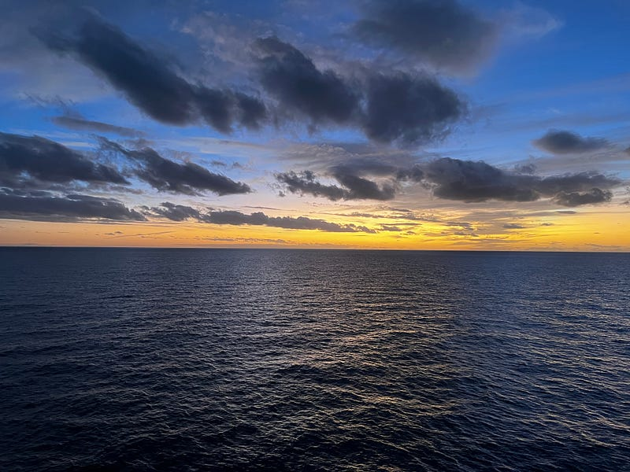

---

title: "Carnival Splendor 澳洲南太平洋郵輪 2023.05.19 — Day 5 Lifou (New Caledonia)"
date: 2023-06-02
slug: "2023-06-02-carnival-splendor-day-5"
cover:
  image: "images/medium-1*_py8lpX0RHKA53ZMEMP2bw.jpg"
  alt: "郵輪房務創意毛巾兔子"
  caption: "今天的毛巾動物是什麼呢? (下文有答案)"
images: ['images/medium-1*_py8lpX0RHKA53ZMEMP2bw.jpg', 'images/medium-1*--9Pw_aiyqSGzhUf2ZieUQ.jpg', 'images/medium-1*QIggv6ObbyFwbpMKfAXchA.jpg', 'images/medium-1*7PgD26vI-d-yONvrGR-qEw.jpg', 'images/medium-1*KbwckbPHton3dvodP2-OQg.jpg', 'images/medium-1*pFEUKRkQrGBUcK7CPCSwxA.jpg', 'images/medium-1*PL5k02W0pByIHUcKRJ7ffw.jpg', 'images/medium-1*mW5U1eIHTAk5xFCjC0CE-g.jpg', 'images/medium-1*sj7OZg5di7AAyxWxN0KN1Q.jpg', 'images/medium-1*Kl99scnbT80o6Vyh5HnuGg.jpg']
categories: ["旅行紀錄"]
tags: ["旅遊", "新喀里多尼亞", "郵輪"]
episodeseries: ["Carnival Splendor 郵輪"]
---

---

### Carnival Splendor 澳洲南太平洋郵輪 2023.05.19 — Day 5 Lifou (New Caledonia)

* * *

### 第二個小島 Lifou

這個小島沒有足夠深的港口，所以船只能停在海上，透過接駁小船把遊客送到島上。為了避開人潮，我們 6:30 就起床了，7 點吃了 buffet 早餐，順利搭上 8:30 的接駁小船。

*Lifou 接駁小船*

*Lifou Jetty*

### Swimming Tour

這次我們一樣是上了島再訂 tour，我們訂的是三小時的 swimming tour $30 (說是 tour，但就是開車半小時載你到另一個海邊，然後把你放在那游泳，兩個小時後再回來接你)。跟我們同行的泰國情侶 Nan & Pattie 說，同樣的行程在郵輪上訂的話要 $150!!!

*Tour 告示牌*

其實這個海灘真的滿美的，沙子非常細，海水也無敵清澈！不過今天晴時多雲，所以沒有到非常溫暖，但也不冷就是了。

*椰子 cheers!*

Ashley 在這裡買了一個雞肉咖哩便當，立刻成為野狗包圍的對象XDD

*野狗虎視眈眈!*

### Lifou vs Noumea

Lifou 跟 Noumea 感覺差很多，雖然有居民居住，但感覺是非常鄉間的那一種，主要道路雖然有鋪柏油，但也不是鋪得太仔細。當地 tour 櫃檯的人員英文都很一般，所以也很難跟他們聊天、進一步了解他們的當地文化。唯一的例外是送我們從海邊回來的女司機，她說她以前去紐西蘭當過交換學生，跟我們解釋了很多 Lifou 島的近況，總算是更加了解了這個島了一點。

### 游完泳就是要吃泡麵啊

回到港口後我們發現這個島好像也沒有其他行程可以進行，於是決定返回船上，游泳後吃泡麵果然真心最爽！！！

本來不想睡的我，可能是因為洗完澡又吃完泡麵太舒服了，想著說要坐在床上玩手機，結果我直接坐著睡著哈哈哈哈

*這其實是我第一次吃滿漢大餐，大家聽到都很驚訝XDD*

### White Night

今天晚上是 white night，所以大家穿上白色的服裝。不過今天晚上的派對是 silent party，也就是每個人戴著耳機各自聽自己喜歡的音樂跳舞。我記得雪梨也有同樣主題的夜店。

*White Night 耳機*

我覺得郵輪最棒的地方就是幾乎所有的活動都是老少皆宜，不管是爺爺奶奶或是小朋友，都能一起參與絕大多數的活動。

PS: 跟工作人員閒聊了一下，才知道原來我今天的毛巾動物是兔子！他們還有一本書教你如何折毛巾動物

*原來是兔子 Rabbit! 這裡會強調是 rabbit 是因為還有另一種毛巾兔子叫 bunny*

### 郵輪安全反思

今天船非常 bumpy，聽說是因為附近有地震的關係。讓我突然覺得搭郵輪還是滿危險的!

如果因為地震而引起海嘯，那郵輪上的人感覺也跑不掉。據說郵輪上載的油只夠在海上航行兩天，所以兩天後一定要停靠在港口補油。而且船上沒有信號，如果沒買網路的話，要是真的有事情發生，甚至不能傳最後的訊息給親朋好友XD

