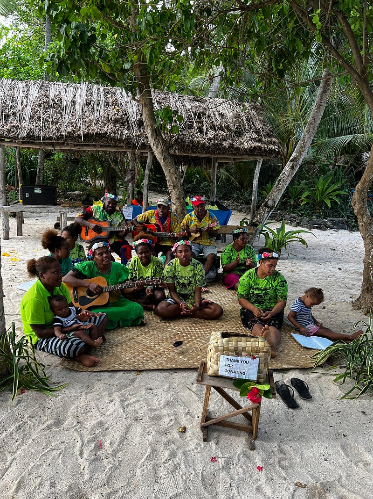
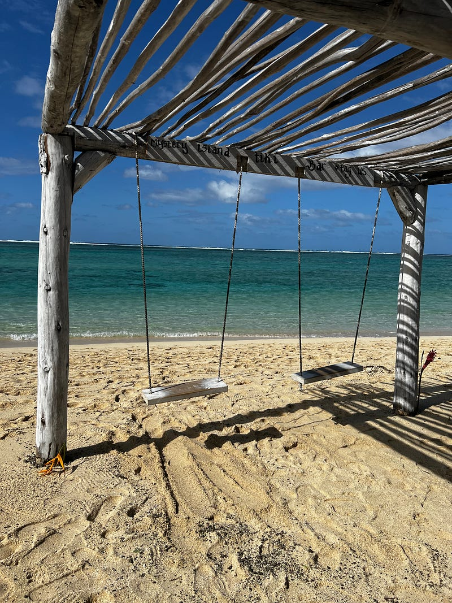
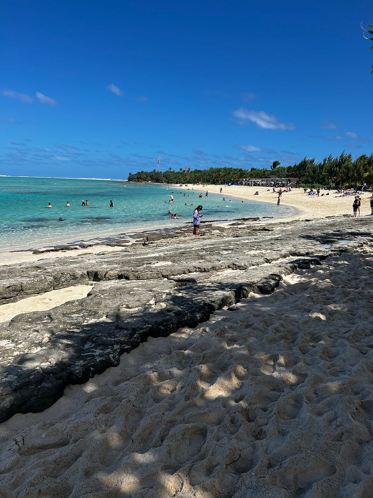
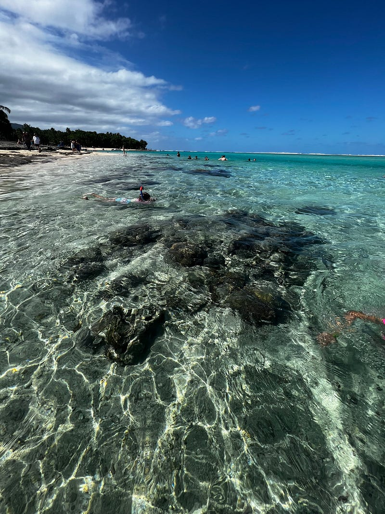
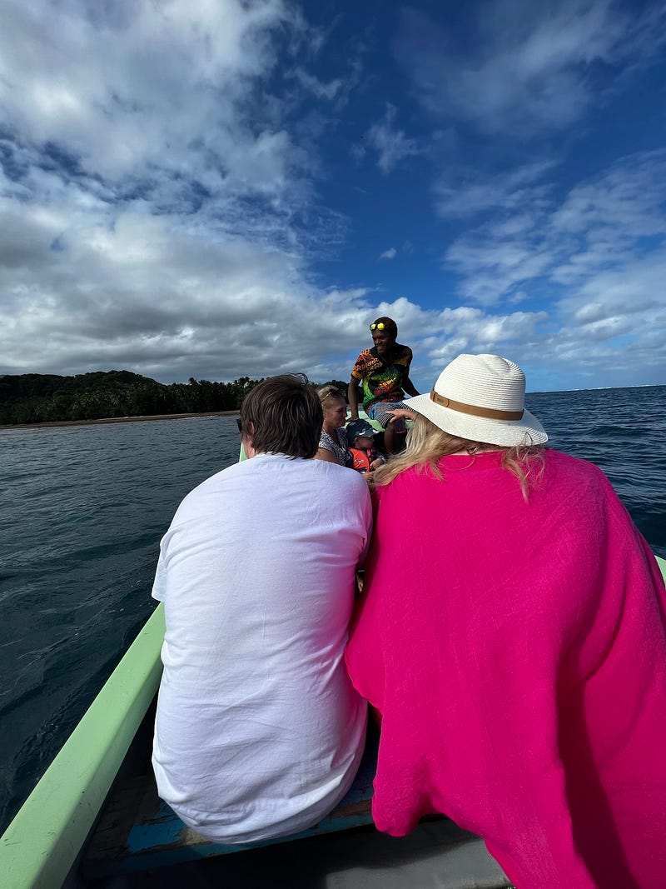
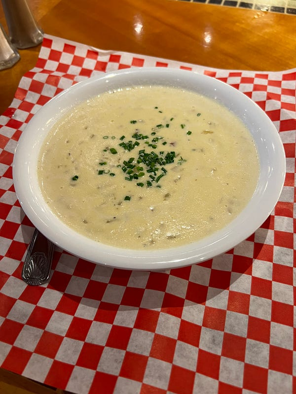
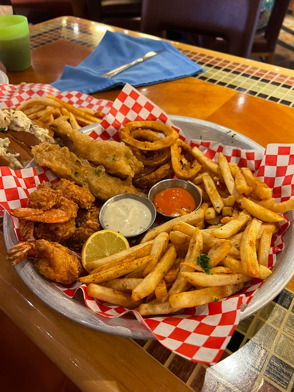
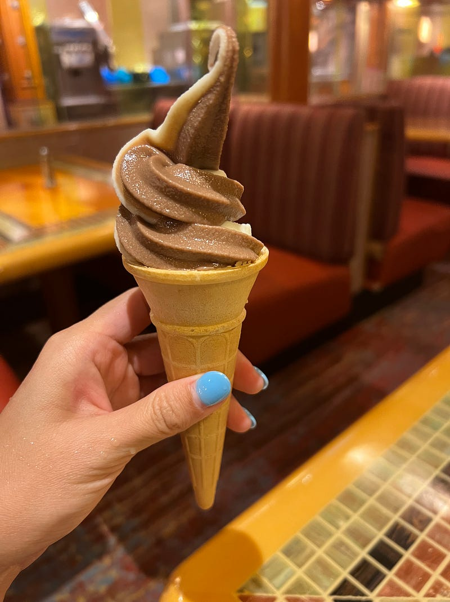

---

title: "Carnival Splendor 澳洲南太平洋郵輪 2023.05.20 — Day 6 Mystery Island (Vanuatu)"
date: 2023-06-02
slug: "2023-06-02-carnival-splendor-day-6"
cover:
  image: "images/medium-1*yItZzDJmTnYicECMi0Kc0g.jpg"
  alt: "郵輪房務創意毛巾螃蟹"
  caption: "毛巾螃蟹"
images: ['images/medium-1*yItZzDJmTnYicECMi0Kc0g.jpg', 'images/medium-1*49dzPf3ncGQ8Rd9ILVmNYQ.jpg', 'images/medium-1*LV2Q5sXNZspZ2X7R_4ctoQ.jpg', 'images/medium-1*vYkAtRnaY9u5PW_sevx7Iw.jpg', 'images/medium-1*vmYPiXmc6lgDAyQ1cYItkw.jpg', 'images/medium-1*9IcJ4KIjbFEvdsyxyVwFAg.jpg', 'images/medium-1*g_gRl-BxQrTYKwXsnREJLw.jpg', 'images/medium-1*b2rWJ-wohW5j2M7jKemQfQ.jpg', 'images/medium-1*uqXU87fqe7SQiEMwTIyvvg.jpg']
categories: ["旅行紀錄"]
tags: ["旅遊", "萬那杜", "郵輪"]
episodeseries: ["Carnival Splendor 郵輪"]
---

**第三個小島 — Mystery Island**

今天終於到了唯一一個 Vanuatu 的小島 Mystery Island，今天也是要坐接駁小船前往。可能玩到旅程的中後段，大家已經開始累了，似乎沒有太多人想搭早上的船前往小島XD

Mystery Island 感覺是一個非常商業化的小島，例如一上島就看到居民圍成一圈的歌唱表演，前面還擺了捐獻箱 (我倒也不是說他們必須免費唱歌給我們聽，但這個島嶼相較於其他島嶼來說觀光化/商業化很多，反倒讓人覺得失去了島嶼特殊的文化?)。島嶼的中間有另外一群村民，也是同樣的配置(歌唱表演加捐獻箱)XD

*島民音樂表演*

這個島可以走的地方還滿大的，所以我們就繞島走了一圈。沙灘上有些cabana，還有兩座盪鞦韆，真的滿舒服的~

*無敵海景鞦韆，超美的~*

這個島有非常多各式snorkeling tours，不跟團的人也可以直接在岸邊浮潛，看到非常多大大小小的魚，我覺得很棒。但這裡真的建議穿 reef shoes，沙灘上的沙子顆粒非常粗，而且有些地方是沙灘跟礁岩並存，沒有穿鞋就進去浮潛的我被割到好幾個地方 QAQ。而且沙子粗到我走在島上完全寸步難行，如果沒有reef shoes，建議穿運動鞋下船，在沙灘上再換夾腳拖。

*沙灘與礁岩並存*

而且今天的海流非常強勁，完全會把你從東邊推到西邊，我完全離岸邊越來越遠!

*海水非常清澈*

**Cave & Sea Turtle Tour**

浮潛完曬了一會太陽，我們就去了一個$50 的 cave & sea turtle tour (其實他們還有一個$45的 lagoon & cave tour，兩者在說明板上的路線不同，但實際上我們搭了同一艘船，所以等於白白多付$5)。

雖然說是保證看到海龜，船上的工作人員在航程中也指了好幾處，但我跟Ashley 完全沒看到。總共坐船時間約1小時，這個價格我覺得不是太推薦這個行程。

每次導遊一指，前面桃紅色的姐姐就會附和說"喔喔喔~ 看到了!" (但是她男友跟坐在後面的我們什麼都沒看到?lol)

*Mystery Island海龜尋找船遊*

**Mystery Island 小提醒**

回來之後開始等待我們預約好的按摩，這裡建議大家最好一來就先預約好按摩，因為後來就全部客滿了。島上大概有3–4間按摩區，只有第一間最便宜一小時$40，其他都是一小時$50，但相較於澳洲還是非常便宜的！

另外島上賣食物的攤子只有一攤，也只賣一種食物 chicken & chips $10，用荷葉裝，看起來還滿有fu的。我們後來tour回來想吃，整個攤子的人都不見了，所以建議有打算在島上用餐的人及早購買(其他攤子只會賣一些汽水跟洋芋片)。

後來到了兩點半，我們本來以為可以順利去按摩，沒想到員工跟我們說因為前面的客人延長時間，所以要再等20分鐘才能輪到我們!!! 我們覺得他們實在太不守信用了，於是決定直接回船上吃buffet。

**餐廳加點 Seafood**

由於我們回到船上的時間有點晚，除了吃到了一點 buffet 的食物(午餐的buffet 3:30結束)，我們還加點了一個 seafood platter to share 跟我單點了一個海鮮巧達濃湯$7。湯是現點現煮，而且海鮮料超多，所以我覺得還滿划算的。seafood platter 這樣的份量$20還算okay，不過炸物吃多了還是有點膩

*郵輪額外付費海鮮拼盤*

*郵輪額外付費海鮮巧達濃湯*

*郵輪上有24小時霜淇淋機!*

吃完後本來想去泡spa pool，但看了兩個池都人滿為患，於是我決定回房間好好洗個澡，洗完之後在陽台上發個呆。其實我覺得陽台房訂的還是滿值得的，不需要出去外面多公共空間跟別人擠，自己輕鬆洗完澡後就可以有自己的空間 :)
