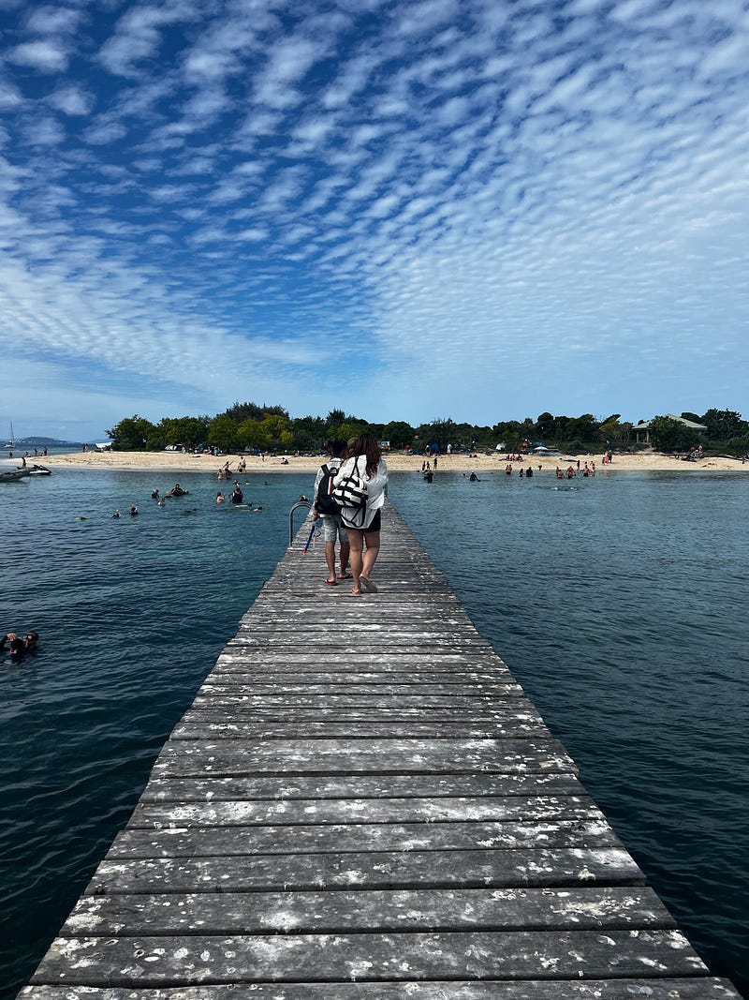
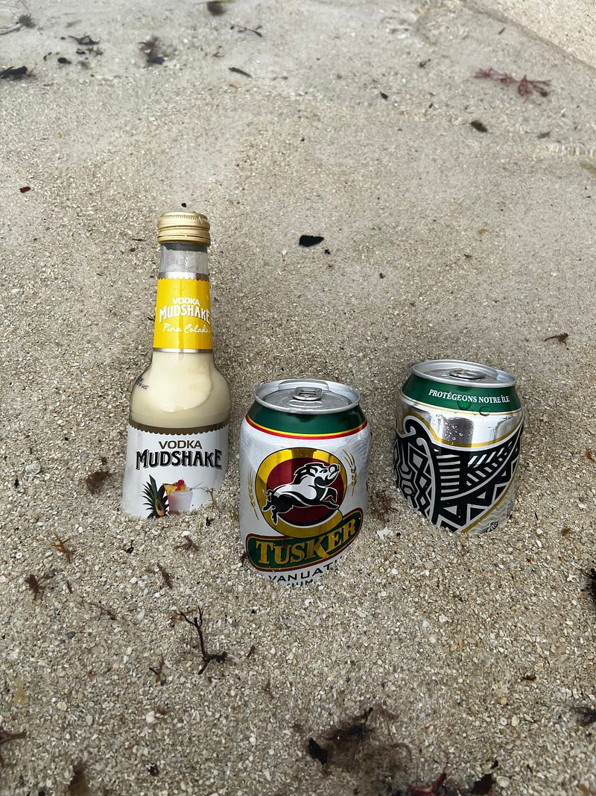
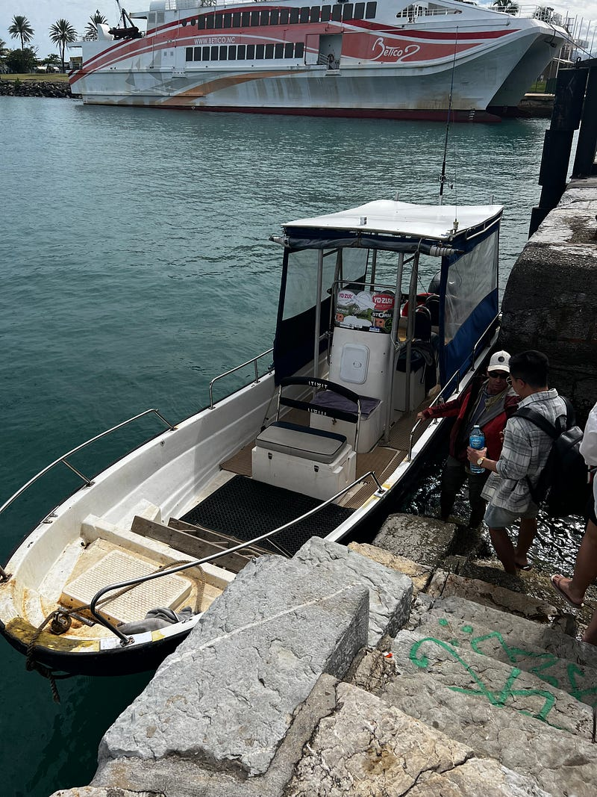
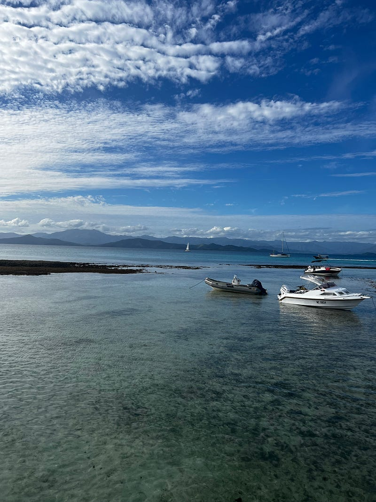
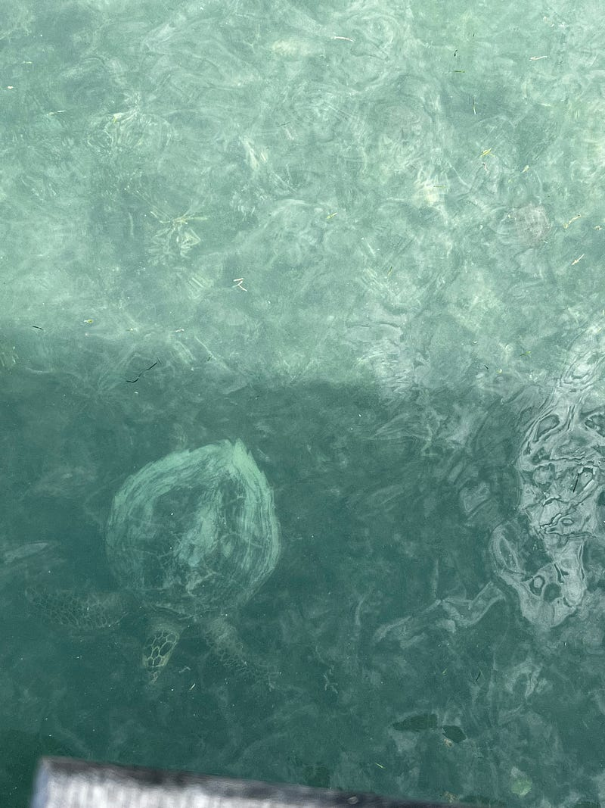
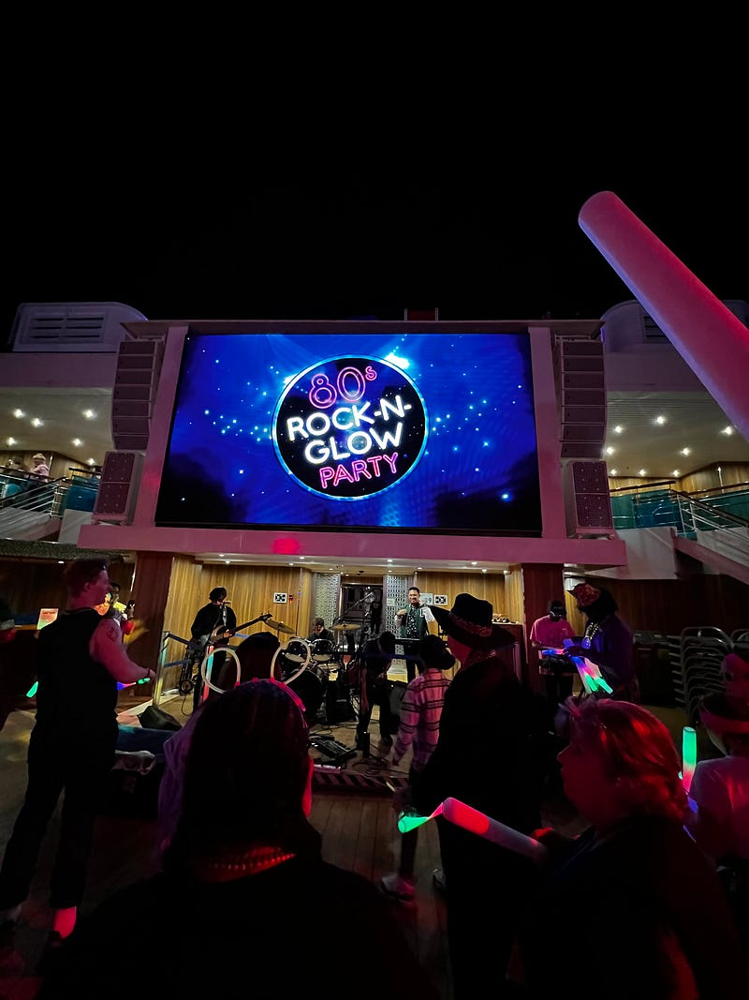
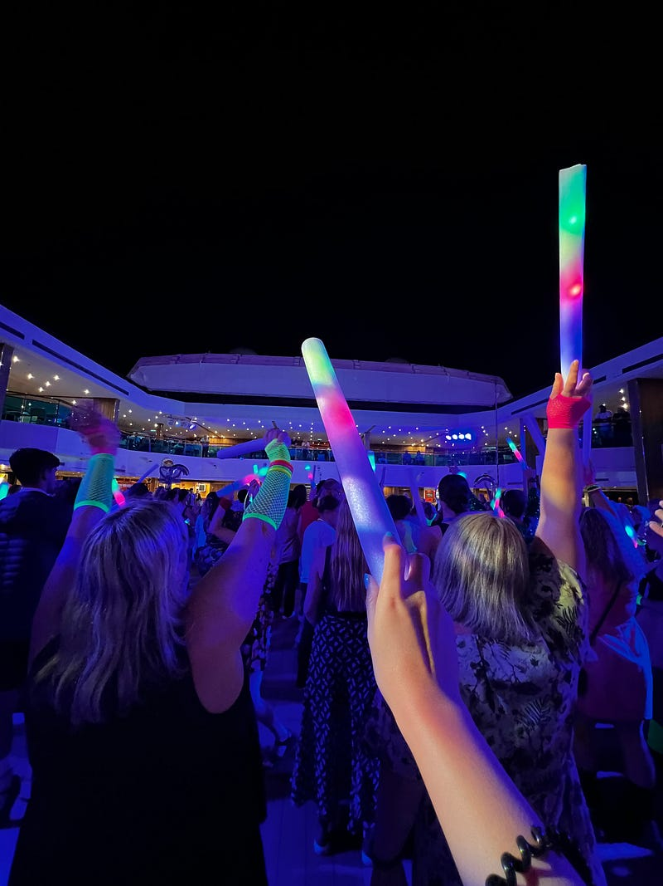

---

### [旅遊] 2023.05.21 Carnival Splendor 澳洲南太平洋郵輪 — Day 7 Signal Island (New Caledonia)

毛巾猩猩(?) 房務員還把 Ashley 的眼鏡放在上面，超好笑!

* * *

**神奇的五分鐘 wifi**

今天早上我們又回到了 Noumea港口，不知道為什麼我突發奇想在陽台上搜尋了一下，居然連上了短暫的 free wifi (那個人沒有設密碼!!!) 只可惜快樂的時光特別短暫，五分鐘之後我進去房間刷了牙，出來就沒了。再度回歸到我與網路世界隔絕的生活QAQ

**Mystery Island 游泳事故**

吃完早餐後我們跑到一樓泰國情侶的房間集合，順便參觀了一下他們的海景房。基本上格局跟我們一模一樣，只是他們沒有陽台，而且窗戶也比我們小很多。

此時泰國情侶跟我們分享昨天在 Mystery Island，有一個40幾歲的女性遊客溺斃的消息，讓我們大吃一驚！他們說很多遊客都在討論這件事，有人看到她被救上來之後在沙灘上被施以人工呼吸，但後來還是回天乏術。雖然據說每次郵輪都會有遊客喪生的消息，但聽到還是覺得非常可怕! 相關報導可以參考這裡，裡面沒有太多關於細節的描述，但請大家平常進行水上活動的時候一定要多加小心、注意安全：[https://7news.com.au/.../cruise-passenger-dies-while...](https://l.facebook.com/l.php?u=https%3A%2F%2F7news.com.au%2Fnews%2Fnsw%2Fcruise-passenger-dies-while-swimming-on-mystery-island--c-10741959%3Ffbclid%3DIwAR0gZi1XgWSudveBFE2zOwKqdw2BCpspOt15OsTOV3B38hfHYtamhlJ3K6E&h=AT2OG-UJHuaOojjv74IpjWitaQlaE-iNv3Z634tOQdRBWzn9WGy3LYmIltfNeO--wnUpOv3gSX9p7Naae9xGRDEEndr8-BGxoSZ7sdl8bGRd_be3P8q8lYBriLkHQ79hIA&__tn__=-UK-R&c\[0\]=AT0zhJeOQE1LaZ5PVnIu9vDNOiMWlLgS4nJ5PJzQfh3zgTLN-PxOWaJp-FYVNgmKxB_wmA_STbgHwiL-mC3nTjdE-WjE7tAKBGvUr7aZp0gcHEpMtvmkaVMWTGjhren2ukXVmc8b_iGS_8JZ7l4XmB2veMUo34Z-TB94iWhhE5tSdA9qMLn8YA)

**Signal Island**

 Signal Island Jetty

我們訂了一個人$75的 signal island tour，據說島上沒有任何吃的東西，於是我們一群人決定先去超市採買。我們買了一個很像滷雞肉飯的便當(吃起來滿鹹的)，然後我還買了 Vanuatu 跟 New Caledonia 的啤酒各一。有趣的是，這裡賣的酒全部都是常溫。後來我只好帶著我的常溫啤酒去 signal island 試圖用海水冰鎮它們 (想當然爾沒用XDDD)。

沙灘啤酒

去 Signal island 的船開得超快，完全就像搭了30分鐘的speed boat，到了之後我們才發現島上滿滿的遊客 (一開始還以為能擁有我們自己的小空間)，而且好像很多當地遊客，因為我們發現很多人帶著帳篷跟露營設備去島上。而且海水超冷，所以一開始我還想說要不要乾脆放棄浮潛這個念頭，但在沙灘上曬了一下，覺得來都來了，不去浮潛也太浪費，於是我就出發了

就是這搜小船開出噴射汽艇的氣魄!!!

**與野生海龜一起游泳**

 海水很淺

Signal island 的沙灘野生超多礁岩，想要進去海裡浮潛，一開始得走過10分鐘的礁岩沙灘，我的腳掌完全痛爆，腳上又多了更多割傷，真心是痛到爆炸！強烈建議大家還是先在Kmart 買好 water shoes/reef shoes 再來，我當初有去找但沒找到，現在非常後悔，因為我的腳隔了幾天都還在痛，強烈建議大家一定要帶!

野生海龜!!!

但是這趟浮潛非常值得，因為我看到兩隻海龜，還與海龜一起游泳我覺得是非常特別的體驗! 而且經過這次我覺得我自己還算是會游泳? (因為同行的泰國情侶出發去浮潛前一直問我水會很深嗎? 他們對游泳真的不太有信心）我其實也沒有超會游啦，但至少我完全不怕水，在岸邊浮潛游泳完全沒問題(我會先衡量好自己有辦法游回到岸邊的距離)，但如果是直接在海裡游泳的話，我覺得可能還是要穿救生衣比較保險，畢竟我的體力真的太差了。

**80 年代搖滾螢光趴**

晚上去參加了 80 年代搖滾螢光趴，還發了螢光棒當道具很不錯!!!

有 live band 真的很嗨而且還發螢光棒!

很多人也裝扮得很認真，但超多首80年代的歌我跟Ashley 都不知道，很難嗨起來 lol


