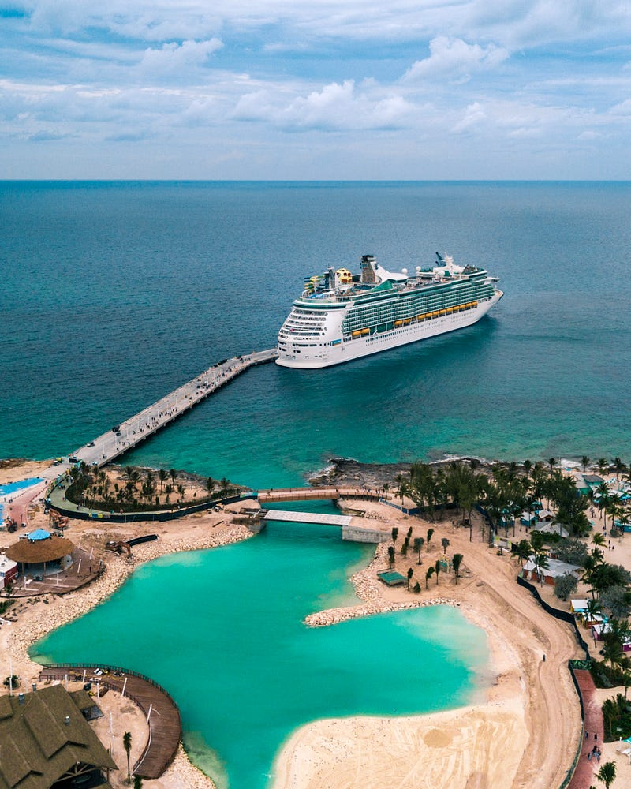
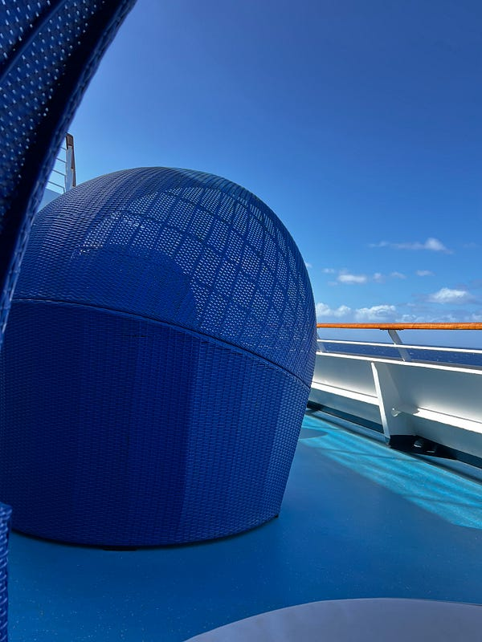
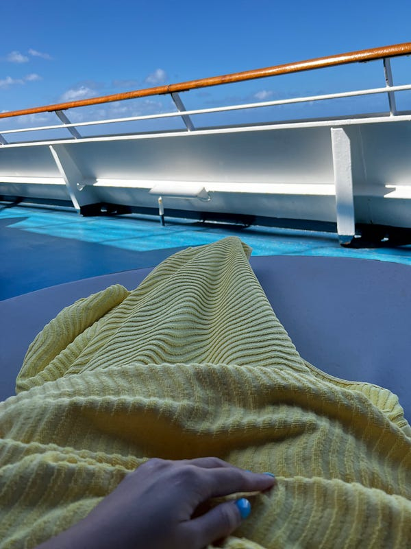
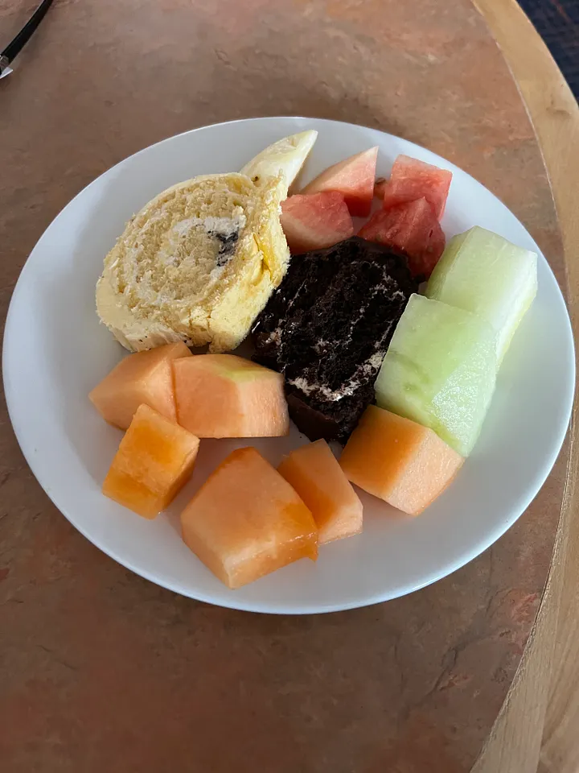

---

### [旅遊] 2023.05.22 Carnival Splendor 澳洲南太平洋郵輪 — Day 8 Sea Day 3

Photo by [Adam Gonzales](https://unsplash.com/@adamgonzales?utm_source=medium&utm_medium=referral) on [Unsplash](https://unsplash.com?utm_source=medium&utm_medium=referral)

* * *

今天我們完全大睡特睡到10點。稍微整理了一下，我出門去參加10:30的折毛巾教學。

### 折毛巾教學

我們先後折了小狗、大象跟恐龍，坐在我後面的杯杯人超好，不斷提供我指示(他自己沒有在折)，最後還幫我拍照，算是一個很有趣的體驗。船上也有販賣毛巾教學故事書，一本$17，我覺得還滿有趣的。

我折的毛巾小狗，還滿成功的吧XD

### 藍色圓球休息區

接著去吃了早餐，然後借了兩條海灘巾，找了一個藍色圓球準備在那邊悠閒得讀書休息，可是風好大又好冷，一點都沒有享受的感覺

甲板上的藍色圓球休息區

覺得有點可惜，要是天氣再熱一點就好了！五月的郵輪真的不太適合怕冷的我，只要不在房間的時間(房間的空調可以自己調溫度)，我大概有50%的時間都覺得很冷哈哈哈

### 冰雕秀

接著去看冰雕秀，一開始真的很像是烏龜，最後才發現他們雕的是海豚XD

冰雕海豚

因為太晚吃早餐了，中午一點也不餓，不過中午的甜點是各種口味的現切瑞士捲，於是忍不住拿了一些甜點跟水果回房間。

現切瑞士捲與水果

今天晚上是第二個 formal night，我們跟泰國情侶約了一起拍照，但是Nan 暈船暈得非常嚴重，感覺每個場景他拍一張照就快不行了。因為他們的房間在一樓，據說超級晃，所以他好像也沒辦法回房間休息，感覺真是太可憐了。

### Piano Bar

今晚第一次體驗了 piano bar，其實氣氛還是不錯的，跟泰國情侶聊的很開心！鋼琴酒吧的觀眾可以自由點歌，但觀眾要求彈的歌都太老了，我幾乎都沒聽過！而且駐唱歌手感覺特別喜歡唱一些逗趣的歌，我個人沒有太喜歡這種風格，不過觀眾非常嗨就是了。

### Alchemy Bar

今天還試了 alchemy bar 的調酒，我覺得雖然比其他酒吧貴個$3–4，但是酒真的比較好喝

酒保會穿上實驗室的服裝! 他們的酒單還會發光，超酷

### 郵輪夜店 Red Carpet

最後去了遊輪上的夜店 red carpet，嗯音樂真的不怎麼樣哈哈哈哈。倒是播了幾首夜店經典歌

夜店的 bar

* * *

👉 **需要職涯導師嗎？澳洲雲端架構師 EC 提供轉職工程師、澳洲求職、移民生活等全方位諮詢服務。想進一步了解諮詢細節，請點擊** [**<<澳洲雲端架師 EC：專為轉職者量身打造的職涯諮詢｜海外職場×履歷優化 × 面試攻略 × DevOps /雲端職涯>>**](/posts/2018-01-03-ec-consultation/)**，開啟你的職涯新篇章!**

☕️ **如果想要進一步支持 EC，歡迎請我喝杯咖啡！**

**📱 想追蹤更多？**

  * 📘 [Facebook 粉專：澳洲雲端架構師 EC](https://www.facebook.com/cloudarchitectec)
  * 🧵 [Threads：Cloud Architect EC](https://www.threads.com/@cloud_architect_ec)
  * 📩 合作信箱：[cloudarchitectec@gmail.com](mailto:cloudarchitectec@gmail.com)

