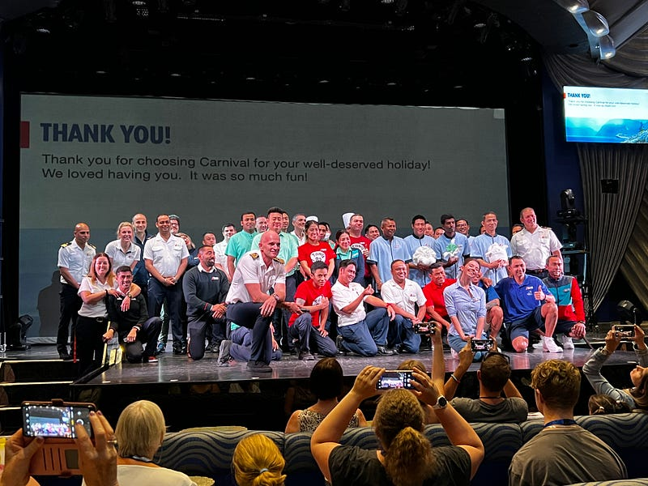
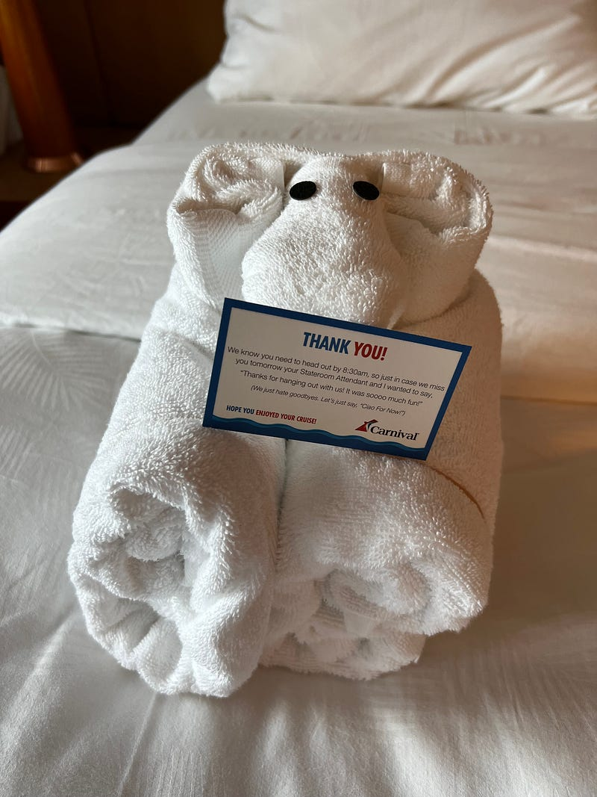
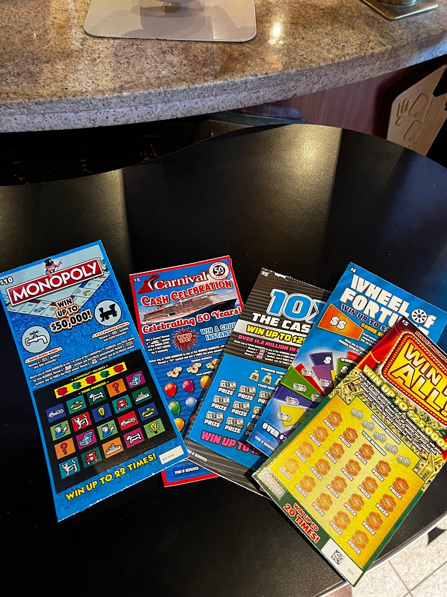
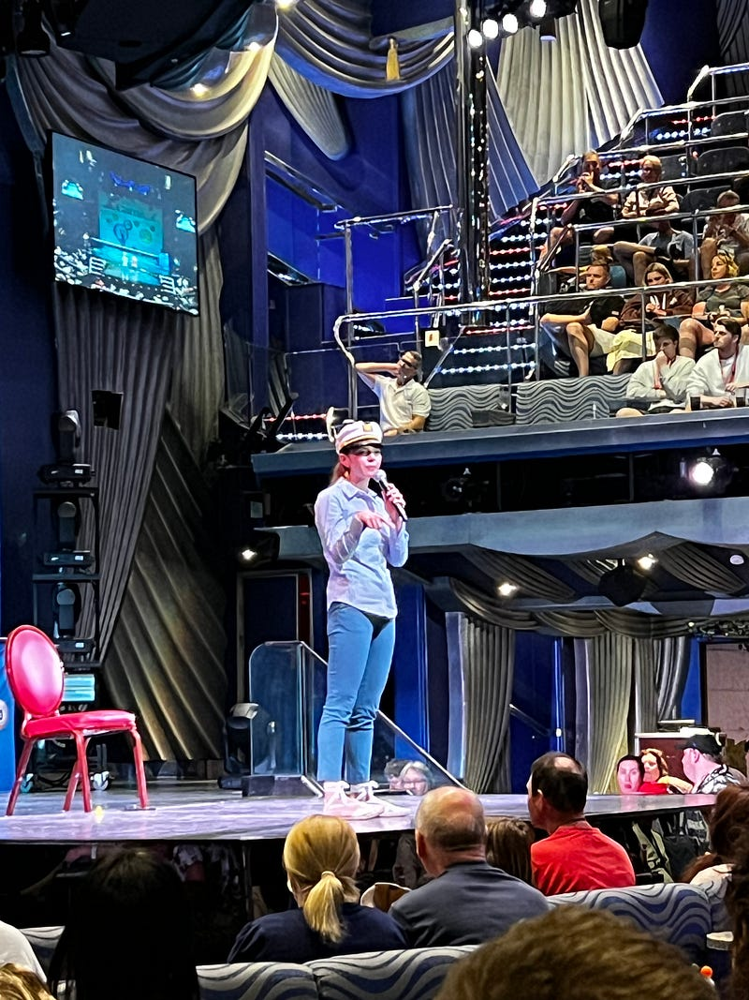
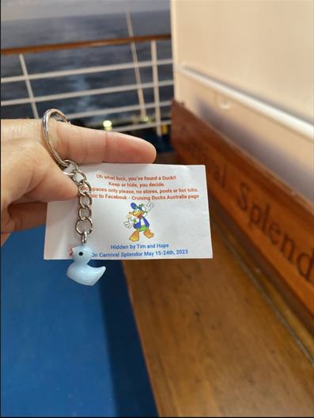
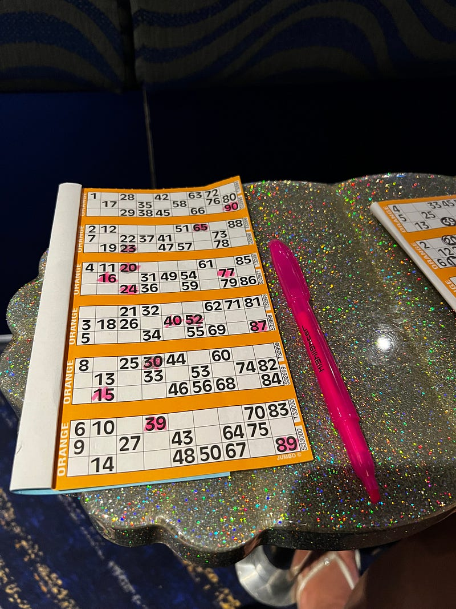

---

### Carnival Splendor 澳洲南太平洋郵輪 2023.05.23 — Day 9 Sea Day 4

* * *

### 下船說明會

吃完早餐後我們立刻去聽了下船說明會，然後拍了一張全體工作人員代表的合照。

*員工代表合照最後一天的毛巾大象加感謝小卡!*

### 賭場刮刮樂

接著因為太無聊了，所以我們就跑去賭場，我買了五張刮刮樂共$25，工作人員還免費贈送一張$5的刮刮樂。刮完之後我只中了一張$25，剛好打平哈哈哈哈。感覺我在賭場追求的就是消磨時間加打平哈哈哈

*五張刮刮樂*

### Q&A with Lizzie

下一個活動是 Cruise Director (算是遊輪活動的主要主持人吧)的問答時間，我個人覺得很有趣。大家問了很多遊輪相關的問題，例如初階的遊輪人員必需要 share 房間，但隨著等級的提升就可以住自己的單人房。Lizzie 的房間甚至有浴缸。這艘遊輪可以容納3900人，我們這次大概有3200人登船。

也有很多關於 Lizzie 個人的問題，例如她最喜歡的顏色、動物、歌曲跟她的衣服都在哪裡買的等等，真的是什麼樣的問題都有(澳洲觀眾的互動性真的好高XD)

被問到在遊輪上遇過最奇怪的事，Lizzie 說她有一次遇到一對情侶吵架，然後女生就開始把男生行李箱裡面的所有東西往外一件一件丟下海，然後後來就被保安制止，他們從今以後被列為黑名單，再也無法參加遊輪

我非常建議大家參加，可以獲得很多有趣的小知識！

*Cruise Director Lizzie*

今天還得知一個遊輪傳統就是尋找藏在各處的小鴨，有些遊客也會特地帶小鴨上來藏。Lizzie 說她本人搜集了超過100隻小鴨。

*其他遊客發的找到小鴨的照片*

### 賓果遊戲

接住去排了1:15pm的 bingo card sale，每次賓果卡的人潮都超長一條。

*今天的賓果獎金加碼$7000*

今天是我跟Ashley 第一次參加賓果活動，我們各花了$35買賓果卡。賓果遊戲還滿緊張刺激的，而且非常考驗英文聽力，甚至有澳洲人自己也聽錯數字以為自己賓果了。

Ashley 戲稱我旁邊的阿姨是我的賓果小天使，不僅借我螢光筆，還教我怎麼找賓果卡上的數字！最後一場我還以為我賓果了，結果只是我搞錯遊戲規則（每一場的遊戲規則略有不同）。

*濱果卡，螢光筆真的比鉛筆好畫太多了*

### Epic Rock show

是我目前看過最精彩的秀，完全不容錯過！一開始的歌曲配合了動畫背景，非常有巧思。不管是舞台設計、舞蹈編排跟歌唱爆發力都非常精彩，非常值得推薦。

今天聽了 Lizzie 的問答才知道 8 位舞蹈演員裡面有四位主要負責唱歌、四位主要負責舞蹈，難怪重要的 vocal 部分都是其中幾個人在唱XD 而且他們完全沒有多餘的人員，所以每個人都不能生病，不然就無法完整演出了

### Comedy Show

*脫口秀場地*

接著去看了第一場脫口秀，表演的是一個印度人叫 Tarun，他還滿好笑的，而且充滿了很多自嘲的印度梗，我覺得很有趣！

之後看了另一個美國人的脫口秀，首先他的風格我不是喜歡(走mean跟髒話路線)，再來是他感覺好像沒怎麼準備就上台了

第三個是個澳洲人，我覺得他的梗也是滿無聊的lol

### 賭場特別活動

今天還有個特別的活動是會從所有沒刮中的刮刮樂裡面抽出三個人來進行轉盤！結果沒想到三個被抽到的都是七樓的房客，而且還都是男生! 看來我個人實在沒有太多偏財運，還是靠正財賺錢吧XD

*巨大轉輪*

今天是在郵輪的最後一晚了!
