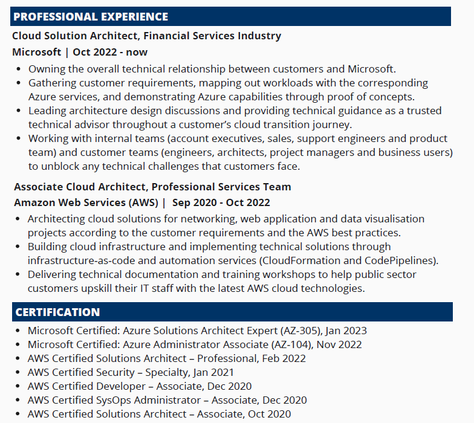
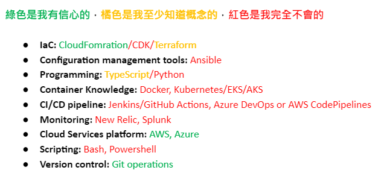

* * *

### 澳洲求職必勝法則：澳洲最大旅行社公司 Flight Centre DevOps Security Engineer 面試心得分享

Photo by [Eldar Nazarov](https://unsplash.com/@eldarnazarov?utm_source=medium&utm_medium=referral) on [Unsplash](https://unsplash.com?utm_source=medium&utm_medium=referral)

光說不練非君子XD

覺得微軟現職雲端解決方案架構師（Cloud Solution Architect） 不太符合個人職涯目標的我，正在積極嘗試不同職涯選項。投了幾封履歷後，我很幸運獲得了澳洲最大的旅行社公司 Flight Centre (公司市值約 45 億澳幣) 的 DevOps 資安工程師的第一關面試。

### 第一版履歷

以下是我第一版的履歷，可以看出我的技能跟 DevOps 基本上不太符合XD

2023年履歷 v1.0

但我可能勝在分別在兩大雲平台 (AWS & Microsoft Azure) 工作過，再加上擁有不少雲端證照 (其實我總共有九張，但限於版面因素放不下XD)，有些 Hiring Manager (HM) 還是會對找我來聊聊感興趣。

目前為止我投了四間，有兩間拿到面試機會。 獲得面試的機率大概是 50%，算是相當高 (雖然樣本數也很小啦 XD)

基本上 HM 最好奇的兩個問題: 1. 為什麼想要離開微軟? 2. 在 AWS 跟微軟工作是什麼感覺? XD

* * *

### DevOps 工程師所需技能vs現有專業能力的自評

以下是我對於 DevOps 工程師所需技能跟我現有專業能力的自評。

大家可以看出綠色真的是少的可憐，我的強項主要在於雲端解決方案的架構規劃 (solution architecting)，而且只是在理論層面。實際操作的經驗都是在自己的 AWS/Azure account 裡面玩一玩而已，完全沒有企業等級的實務經驗，但這也就是我為什麼想要從架構師 (Architect) 轉職工程師 (Engineer)的原因，比起架構師「著重於解決方案的整體架構」，我更想要獲得的是「在企業級的大型系統上的實務處理經驗」。

### **面試心得**

  1. **HM 感覺缺乏面試的經驗，而且時間管理的技能感覺也有待加強XD**

HM 首先花了 40 分鐘跟我解釋公司的組織架構 (organisational structure)、每個部門/團隊在做什麼、他們公司用的 DevOps tools、tech stacks 等等。雖然我很感謝他願意花時間讓我了解更了解這個公司的組織架構，但我覺得第一次面試真的不需要花這麼多時間在解釋這些 (可以等我真的錄取後再說XD)。

40 分鐘後他終於問我有沒有什麼問題，所以我針對 DevOps tools、tech stacks 問了一些後續問題 (約10分鐘)。接下來他終於請我自我介紹並正式開始面試流程 (30分鐘)。

本來預定一小時的面試，超時了20分鐘，而且他講話的時間還比我多XDD

**2\. HM問我的面試問題，很微妙XD**

雖然我很感激他願意花很多時間讓我更了解 Flight Centre，也很感激他沒有問任何刁難我的問題，但他問我的問題，感覺其實比較像是我應該要問他的問題XDDDD

這樣講你們可能覺得很抽象，所以下面我會舉幾個例子:

_(結果寫出來之後我覺得好像只有第一、二題比較奇怪，其他問題感覺只是用來更加了解我這個人的?)_

  * 你對雲端證照的想法是什麼?

_(我的想法重要嗎? 哈哈，我以為雇主對這一點的想法比較重要XD)_

我的答案: 「對於沒有相關雲端知識和平台經驗的人來說，用雲端證照作為學習的目標會讓人有一個更系統化的學習路徑 (而不會東學一點、西學一點)。 考到雲端證照後，求職者可以展現他們在該領域中具有基本知識，並且願意投入時間和努力參加考試。通過證照考試也證明他們達到了門檻。然而實際工作從來不像考試那麼簡單，有很多因素會影響雲端架構解決方案的設計決策，比如成本和資源的限制。而且考試也完全無法展現實際操作的規模，例如考試可能會問你基本的設計問題，但並不會教你需要部署 1000 個虛擬伺服器 (VMs) 到到多個環境 (dev, test, pre-production, production) 時該該怎麼做。」

  * **你理想的工作型態是什麼?**

_(一般來說，應該是雇主先告訴我公司目前的規定，然後看看跟我的預期是否符合? 結果我都還沒問他這題，他就先問我了XD)_

我的答案: 「一週大概進辦公室 1–2天，剩下時間遠端。」

  * **你理想的團隊是怎麼樣的?**

我的答案: 「大公司裡的小團隊、團隊裡有資深的工程師完全了解系統的裡裡外外 (ins and outs)、互相支持的團隊文化 (supportive team culture)」

  * **你理想的 tech lead 是怎樣的?**

我的答案: 「擁有技術專業知識 (technical expertise)、熟悉公司系統 (Knows the in and outs of the system)、願意花時間跟團隊成員一起 pair programming、在意團隊成員的身心健康 (personal wellbeing)」

**3\. 在我詢問之下，發現他們並沒有正式的 onboarding 程序，也沒有可以量化的績效評估 (performance review) 標準，甚至也沒有 job level 標準，career progression 的路線也不明。**

其實我不知道這點是不是我該擔心的點?

[先來個免責聲明: 以下的描述是我的個人感受，從其他人的角度來看事情可能會完全不同，所以以下言論不代表任何人或是微軟的立場XD] 因為我之前面試微軟時，HM 說會有微軟會有一系列的入職培訓 (onboarding support)，結果我進去後 入職培訓近乎於零，沒有任何培訓、shadow 或是任何資深同事的陪同，他們就把毫無準備的我丟進客戶會議裡了。我不要說完全沒辦法回答客戶的問題，或是提供技術建議給客戶，我根本完全就聽不懂客戶的問題 😭

前提: 我是英文系出身，在澳洲學了 6 個月 web development bootcamp 轉職，有兩年 AWS 雲端經驗。想看我的轉職過程，請參考：

[**文組轉職澳洲 IT 工程師，我靠 Coding Bootcamp 進了 Amazon 當工程師！**  
 _我為什麼決定從文組轉職工程師？在澳洲讀 coding bootcamp 又是如何的體驗？第一份工作就進 Amazon？如果有興趣，那就請繼續看下去吧～_ medium.com](/posts/2022-12-03-bootcamp-to-aws/)

以下只是其中一個例子:

> _那個會的主題是一個當時的我從來沒聽過技術概念 (on-premises file system, Windows file sever configuration, file share, file synchronisation through another jump server, how to manage file access and file share access)，但對於有實務經驗的人來說或是 on-premises 出身的人其實不難(我現在其實也稍微有概念了)。_

>  _但當時在會議結束後，我看著我的筆記，根本不知道我到底寫了什麼(內心OS: file server 跟 file share 不是同一個東西嗎??? file access 跟 file share access 不是同一個東西嗎????)，所以我後續也沒有辦法拿這筆記去問其他同事 (其實我後來還是硬著頭皮問了，同事說「我真的聽不懂你的問題，你要不要再回去跟客戶開一次會釐清他們的問題?」QAQ)_

> _其實會議當下我有試圖請客戶複述他們的問題，他們又講了一次，我還是沒聽懂。然後我試圖用我自己的語言再複述一次，但從他們的眼神中我可以看出他們知道我根本完全不懂，我不好意思再繼續追問下去(因為我知道再問下去也不會有結果)，於是我只好默默說我會再回去問別人。_

>  _那種挫折、覺得自己一無是處、覺得自己求助無門，那種客戶看著你發現你什麼都不懂的眼神，真的讓我對於自己很失望。而且這件事發生無數次，直到現在也還在發生，因為 infrastructure 的範圍實在太廣了(客戶今天問我 Windows file server，明天問我 network routing across site-to-site & point-to-site VPNs，後天問我如何建立 enterprise scale logging and monitoring solution)，沒有在業界工作過的我，根本沒有辦法從架構師的角度給予技術建議。其實我覺得這是我為什麼想要離開微軟的原因，雖然我現在已經不是菜鳥了，也變堅強了一點，但這只是表示我受的傷夠多了，並不代表微軟的情況改善了。而且除了這點之外，微軟組織文化跟我個人的價值觀越來越背道而馳…_

回到主題，我的室友 C 是個軟體工程師，她在面試她現在的工作時也問了關於入職培訓的問題，當時她的 HM 只是靦腆一笑說「我們團隊的人都很好啊，如果你有問題我們當然會幫你。」聽起來感覺也是一個很雷、很沒有規劃的答案吧? 但事實證明他們團隊的人真的都很好，資深工程師非常願意花時間跟她一起研究問題，協助她成長。身為常常一起在家工作的室友我，完全有感受到她在職業技術上的成長，我真的非常羨慕！！！

‘How would you support your new starters/what kind of onboarding support will be provided?’ 是我在面試中必問雇主的一題，但現在我也不知道要怎麼判斷我收到的答案了。有正式的培訓流程跟規範的公司就就一定好嗎? 還是只要大家人都很好就夠了？ (但我要怎麼透過一個小時的判斷對方人好不好呢? QAQ)

如果你們有什麼判斷的標準或是秘訣，請告訴我！！！！！

**4\. HM 的個性感覺滿直接單純的**

  * 他直接跟我說，雖然職稱裡面有資安(security)，但我的工作內容跟資安一點關係也沒有XD
  * 我問說他對於這個職位的預期 level 是什麼 (junior, mid-level, senior?) 他說他沒有預設什麼 level，只希望能找到願意學習的人。接著他又說，不過在面試過程中其實也很難看出誰喜歡學習 (Looking for someone who can learn, but at the same time, it’s hard to tell who can learn XD)

### **面試結果**

其實這次面試中，HM並沒有問我很多具體的技術問題，但他可能還是可以根據他的經驗就從這些對話中來評估我的技術水平吧?

面試結束後過幾天我就收到結果信，我覺得他們的 HR 跟招聘流程真的很專業，給我的印象很好 (很多公司完全會直接發無聲卡)。信上說 HM 非常喜歡我，而且覺得我跟他們的團隊文化很合 (a great culture fit)，但是因為他們團隊最近要展開另一個大型項目，所以需要找個即戰力，他們希望如果以後有機會的話，我可以多累積一點經驗再來申請。

其實這個面試結果我覺得非常合理！我也很感謝他們給我這個機會，因為我真的從中學到了好多，例如 DevOps team 的日常工作流程、怎麼分配工作(長期項目 vs day to day support)、DevOps 工程師日常需要的技能，想要轉職 DevOps 我可以繼續再往那些方向前進等等。這次面試的經驗，完全為我的下一次面試奠定了非常好的基礎。

### 未來要去哪

搶先預告一下，在第二間公司的 DevOps Engineer面試，我已經成功通過第一關技術面試 (Technical Interview)，等跑完所有面試流程後，我會再來跟大家分享結果。

* * *

**需要職涯導師嗎？澳洲雲端架構師 EC 提供轉職工程師、澳洲求職、移民生活等全方位諮詢服務。**[**現在就填寫線上 1:1 諮詢預約表單，開啟你的職涯新篇章!**](https://docs.google.com/forms/d/e/1FAIpQLSeWoo4ZVLNc6IQc76nRU29ydr2T9vUJrlNgX5fFrkqiOT-K3g/viewform)

**如果想要進一步支持 EC，歡迎透過以下連結請我喝杯咖啡！你們的支持是我持續創作的動力，如有任何問題或是想要看的主題，歡迎留言與我互動 :)**

  * **歡迎追蹤 Facebook**[**澳洲雲端架構師 EC 臉書粉專**](https://www.facebook.com/cloudarchitectec)
  * **歡迎追蹤 Threads**[**Cloud Architect EC**](https://www.threads.net/@cloud_architect_ec)
  * **合作請聯繫:**[**cloudarchitectec@gmail.com**](mailto:cloudarchitectec@gmail.com)

