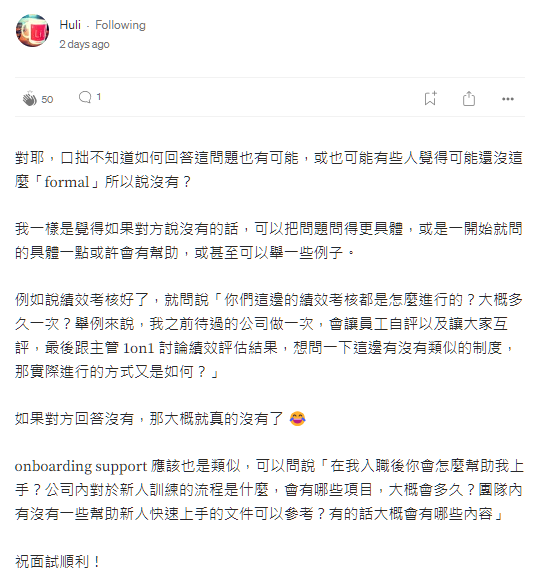

Photo by [AltumCode](https://unsplash.com/@altumcode?utm_source=medium&utm_medium=referral) on [Unsplash](https://unsplash.com?utm_source=medium&utm_medium=referral)

### **Round 1: Technical Interview with DevOps Manager**

直接先講結論！

**對我來說，這是一場接近滿分的面試體驗！滿分！！！**

面試官是 Hiring Manager (HM)，他不僅做了一個完美的開場白，整場面試還問了非常多非常好的問題!!! 

面試的節奏帶得非常好，我覺得我們好像就是兩個 IT 同行在技術上以及工作風格上進行各式討論，只是他的專長領域是 DevOps 跟團隊管理，我的專長領域是 Cloud Infrastructure 跟 Solution Architecting。

雖然我沒有 DevOps 的相關經驗，但我也從過往經驗加 solution architecting 的角度回答，把 DevOps 各領域的問題都回答得非常好 (大概有 95 %的問題我都答出來了)！

回答過程中，如果是我缺乏的知識點跟不足的地方，我也會直接說：「這個東西我只懂概念上怎麼設計解決方案，但我沒有親自動手做過，這也是我為什麼想要加入這個職位的原因，因為這就是我想要學的技能、也是我未來職涯想要前往的方向！」

在我提問的環節，我也是直接把訴求表明出來，例如我問了我最近面試最熱愛的問題「What kind of onboarding support will you provided to new starters? (你們將為新進員工提供什麼樣的新進員工訓練？)」 可惜這場面試是在 [Huli](https://medium.com/u/f1fb3e40dc37) 大大的指點之前，不然我肯定會更具體的問法來表達!!! 

關於 Huli 大大的建議，請看這裡:

總之 HM 的回答也是說，沒有正式的入職訓練 QAQ

但我緊接著就回說「我會問這個問題是因為在我過往的工作經驗中，有幾個不太好的onboarding 經驗。

有些經理什麼訓練都沒有提供，就把我直接丟到客戶面前，讓我過得很辛苦。

我是一個剛加入團隊時，需要經理稍微手把手帶著我的人，但是一旦我熟悉工作流程、熟悉團隊、熟悉文化之後，我其實是可以為團隊貢獻很多助力的人 (Once I become comfortable with the process, with the team, with the organization culture, I’m that kind of person who has a lot to contribute)。」

雖然沒有獲得我想要的資訊，但我至少表達了我的訴求。如果 HM 覺得這是一個他可以辦到，或是他可以認同的方式，至少他錄取我後他應該會按照我希望／需要的方式來進行入職培訓 (如果他要錄取我的話XD)。

### 面試問題與流程

以下是面試問題與流程的分享:

首先 HM 一開始的第一個問題是 "What do you know about our company? (你對我們公司有什麼了解?)"。

我稍微講了一下網路上查到的公司資訊，然後提到了我很喜歡他們公司的核心價值 (respect、integrity、honesty)。接著 HM 順著我的回答就開始針對公司背景、組織架構跟他們的部門做了一個簡單介紹，然後也稍微提及了一下他們的 tech stacks。一切就是如此流暢又自然，既試探了我對公司的了解，我回答後就把話題順暢地接過去，然後讓我也大概了解公司的架構。

接著他問我有沒有什麼問題，於是我問了他 1) DevOps team 跟 Dev teams 的合作關係、2) CI/CD pipeline 的成熟度:

  * You mentioned there are xx dev squads, are they pretty much using the same technology stacks? Or are they in general very different and your team needs to provide a consolidated solution for them?
  * How do you structure your team to support xx squads?
  * How mature is your CI/CD pipelines? Are you pretty automated at the moment? Or are you still improving from manual process?
  * How does your team balance between day-to-day support and on-going projects?

他回答完後我就說，我現在負責的金融業客戶很多都還在手動部署狀態，所以覺得他們還算滿成熟的。

接著他要求我談一談我目前在微軟的職位跟我在 AWS 的經驗，我解釋了一下這兩個職位雖然名稱聽起來很像 (AWS Cloud Architect vs Microsoft Cloud Solution Architect)，也都是做 cloud engineering 的，但其實兩個職務差別非常大，前者是 hands-on technical consultant (cloud engineering/programming)，後者是 solution architecting/technical sales，然後他問我說這兩個職位裡面我偏好哪一個，我說當然是前面那個啦，我想要回到 hands-on engineering role，他回說「很好那看來我們對職位的期許很一致」。

接著他說我們之前已經聊過很多他清單上的問題了，所以那些可以直接跳過(我非常欣賞這種會隨機應變的面試官!!! 有些面試官比較僵化，一定要照本宣科把全部問題都念完，才覺得自己算達成任務，我覺得這種不太有效率XD)。

[底下問題我懶得翻譯了，如果有需要的話再留言跟我說XDD]

  * **Q: What does DevOps mean to you?**
      * A: For me, DevOps is where you use relatively new technologies in different domains to help different teams (devs, ops, architects). DevOps brings them together and then work together to build the foundation for each team to work at the best towards certain goal. That’s why I like it — there’s always so much to learn.

  * **Q: This role involves a bit of consulting. How would you provide info or guidance to engineers especially someone who’s less knowledgeable than you in this domain? (我之前AWS就是做technical consulting，問這題豈不是問到我的專業XDD)**
    * A: The 1st step is to build the trust relationship and identify the right people to be in the right call. In my previous experience, sometimes I spoke to an engineer for quite a while to help them identify the issues and guide them with a solution, but at the end I realised that they aren’t actually the people who can make the call on the design decision. Or sometimes they thought the issue was about networking design, but as we proceeded with the conversation, we realised that it’s actually security related so we needed the security team to be presented. That’s why the 1st step is very important.

    * The 2nd step is to understand the requirement/issue — why do they need this solution in the first place? What’s the end goal? What are their current challenges? These questions are very important as people might not be in the right direction or there are some other possibilities that they haven’t considered.
  
    * Lastly, it’s also very important that you listen to their concerns and put yourself in their shoes.

  * **Q: What’s your experience with DevOps pipeline?**
    * A: Use Jenkins and Optus Deploy before, but wasn’t the one who designed and implemented them. Why I want to achieve in this role. I don’t have implementation experience and that’s what I want => HM: That’s good. I don’t expect people to know everything. As long as you know what you want, and what you want to learn
  
  * **Q: Have you done much with code quality and security checks? Imaging you are building a pipeline. What kind of things could you put in place to make sure the code you are shipping is of good quality and secure?**
    * A: 1). Installing linting formatting tools will give you some warnings & info regarding code compliance. 2). Enabling logging for debugging and troubleshooting. 3). Also use static code analysis tool. 4.) There are also some security tools and packages to help you run vulnerability check.
  
  * **Q: How would you ensure that the same infra is deployed to different accounts for an app?**
    * A: Centralised repo, good git practices (main/dev branches), make sure when you deploy everything comes from your template and pipeline, avoid any click-ops.
  
  * **Q: Have you ever set up a custom CI/CD agent? How do you connect your agent hosted in whether it’s self hosted or vendor to your AWS env?**
    * A: Tried to answer a bit with my assumption, and asked HM to clarify question ‘Can you tell me a bit more what you mean by that’? Then I realised that the question was related to one of my current projects. Tell him it’s still on the design phase and I know the conceptual framework, but don’t know the implementation. I might know more as the project go further, but currently have no experience. But that’s also why I wanted to learn as currently I don't have any chances of doing that.
  
  * **Q: How can you ensure all AWS security groups are not open to the world (0.0.0.0/0) and not to be open across all ports? What options do you have to implement these requirements?**
    * A: 1). Service Control Policy to regulate: when creating, don’t allow to be created if port is open to 0.0.0.0/0 or if all the ports are open. 2). Use compliance tool like AWS Security Hub and Config to regularly check the compliance status, implement automatic remediation to rectify if any non-compliance is identified.
  
  * **Q: Any experience with working on monitoring and logging tool?**
    * A: Don’t have the implementation experience, but understand monitoring/logging design principles. 1) Some customers use a central logging place, some of them split logs into two places: security logs (only accessible to security team as logs may contain sensitive info that you don’t want other teams to have visibility with) or general logs (all logs other than security logs). 2) Understand what are you trying to monitor? Without monitoring strategy, your logs are just sitting there and when you try to use it, you don’t know where to start. 3). Once you have the logs collected, the next step is set up alerting (who to alert? How to alert? Do you need automatic remediation?).
  
  * **Q: You have a containerised app deployed in ECS, what metrics you put in to ensure its’ working?**
    * A: 1) Infra: CPU, memory, system info, 2) App: app log, telemetry (how’s your app integrates with other parts of your infra and the compute resource as well)
  
  * **Q: Any limitations of AWS API-Gateway that might affect the design?**
    * A: From memory, 1) How many times you can hit the API GW within certain time limit, 2) How do you allocate capacity to different API connected to API-GW?. But I might be wrong. Sorry I haven’t working on AWS for a while.
  
  * **Q: Any side projects you currently work on?**
    * A: Currently I’m not working on any side project as work gets busy all the time. I know this is an ‘excuse’ and I’m really trying to get back to side projects. But a project I did a while ago was with React/hitting a public API for Covid cases in Australia and Taiwan /SPA (single page application). In that side project, I played with different visualisation packages to show the data in different format (pie chart, line chart etc.). => HM: Although I’m asking this question, there’s actually no requirement for you to do anything, I’m just interested in knowing what you are interested to learn and work on.

從最後一個例子，就可以看出他真的是一個很 decent 的 hiring manager!!! 

他問這個問題的目的只是單純想要再多了解我這個人的興趣，而不是他期待我除了正職工作之外，還需要做很多額外的事。太感人了～

雖然我完全沒有 DevOps 相關工作經驗，但我真心覺得我的面試回答可圈可點！

如果想要知道後續如何，請參考下集：[跨國能源公司 DevOps 工程師面試心得 II：行為面試](2023-06-17-devops-interview-2)


