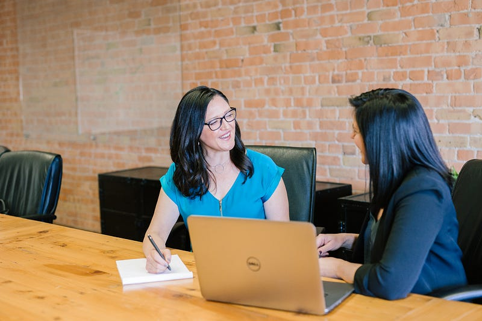

* * *

### 跨國能源公司 (市值 210 億美元) DevOps Platform Engineer 第二關: Culture Interview 面試心得

Photo by [Amy Hirschi](https://unsplash.com/@amyhirschi?utm_source=medium&utm_medium=referral) on [Unsplash](https://unsplash.com?utm_source=medium&utm_medium=referral)

Round 2: Culture Interview with the GM of Engineering & Architecture and the Head of Portfolio

### 從對話式面試經驗，回歸傳統面試模式

我前幾次的面試經驗都是比較對話式的面試經驗，通常是面試官問我幾個問題，我回答，接著從回答中我可能會衍伸出我想要問的問題，於是我提出後續問題，面試官回答。基本上比起面試，比較像是兩個在同一個產業的人互相交流自己的產業知識、了解彼此的技能跟工作價值觀是否相符。

具體可以參考我之前的面試分享，這也可以說是我人生目前為止我覺得最棒的一次面試：

[**跨國能源公司 (市值 210 億美元) DevOps Platform Engineer 第一關: 技術面試心得**  
 _Round 1: Technical Interview with DevOps Manager 直接先講結論！ 對我來說，這是一場接近滿分的面試體驗！滿分！！！ 面試官是 Hiring…_ medium.com](https://medium.com/@cloudarchitectec/%E8%81%B7%E5%A0%B4-%E8%83%BD%E6%BA%90%E5%85%AC%E5%8F%B8-devops-platform-engineer-%E9%9D%A2%E8%A9%A6%E5%BF%83%E5%BE%97-%E7%AC%AC%E4%B8%80%E9%97%9C-%E6%8A%80%E8%A1%93%E9%9D%A2%E8%A9%A6-c1f87fd52441)

這次的第二次面試則回歸到最傳統的面試官問我答，我答完面試官再問下一題模式，讓我居然有些不習慣XDD

而且能源公司感覺真的好傳統啊! 我在澳洲科技業一直以來做的都是純科技業(Amazon/Microsoft)，還沒有做產業客戶端的工程師，不知道是否文化都類似這樣?XD

* * *

### 面試官 Diversity

雖然一開始的面試邀請信上只有工程師組織的 Director (白人男性)，但我加入視訊會議之後就發現他還找了公司領導階層的另外一名女性高層來共同面試。是說澳洲近幾年的公司文化很重視 diversity，所以通常在面試環節中至少會有一關是一男一女面試官同時進行，我覺得其實還不錯，至少大家是有意識想要改善科技業性別平等的議題。

### 出乎我意料的面試題 (但也可能是我見識少XD)

以下就節選幾題來跟大家分享吧~

  * **自我介紹，但不談過往工作經歷**

面試一開始，工程師 Director 就說，這是一個純 culture 的面試，完全不會提及任何技術相關的問題。接著他們就請我先自我介紹，但要求「自我介紹的時候請不要提工作相關的事」。我當下完全愣住，雖然我可以理解對於這一關來說，比起過往工作經驗，他們更想要了解我這個人本身，但這還是一個工作面試啊，完全避開工作經歷不聊會不會太奇怪?XDD

我後來的回答還是從我個人轉換職涯的角度出發(文組讀 coding bootcamp 轉工程師)，然後快速帶過我在 AWS 跟微軟的經歷，最後提到因為我過往的經歷，所以我在工作以外特別關注 Women in Tech 這個議題，常常參加相關的業界聚會與活動 (tech meet ups)，也特別喜歡幫助和我有著類似經歷的轉職者以及女性達成他們的轉職目標。

  * **如果我問你一台車裡面可以放幾顆網球，你會怎麼回答?**

這好像是好幾年前很流行的面試題，但我從來沒有認真研究過大家都怎麼回答，或是面試官到底想看到怎麼樣的回答? 這題是想要考驗申請人的創意嗎?XD

(題外話，寫這篇文章時我上網找了相關資訊，看到這篇簡體中文的文章，才知道原來這是 Google 的面試題，解析請參考: <https://www.woshipm.com/zhichang/3455467.html>)

我個人覺得我的答案還滿無聊的，首先我問了面試官這台車是怎樣的車? 是貨車、轎車還是 SUV? 面試官說，你希望它是什麼車都可以。我說那就當它是台現代 i30 吧，因為我有一台 i30 XD

接著我說，在網路上應該可以查到 i30 內部空間大小，網路上應該也可以查到網球的大小，我會利用查到的資料，再加上我自己的假設，用一些數學公式算出一個可能的答案，然後在答案的上下加上一點浮動空間，接著就開始進行部分空間的試錯 (trail and error)，直到找出答案為止。

  * **如果你可以擁有一個超能力的話，你會想要有怎樣的超能力?**

也是一個我沒有預料到的面試問題! 結果剛剛一查居然是微軟的面試題??? 我身為一個微軟員工，在非微軟的面試，被問到微軟的面試題，會不會太微妙?XDDD (不過微軟的問題是選擇題，我的是開放性問答題? 請參考: <https://zhuanlan.zhihu.com/p/147727296>)

我的答案是「如果可以的話，我希望我可以有一個超能力，見到每個人的時候，他們旁邊會浮出一個 1–10 之間的數字，代表他們現在的心情狀態。如果發現他們表現得很正常，但其實心情不好的話，我就會多關心他們。而且我不會直接問他們 "最近怎麼啦，心情不好嗎?" 而且會採用更間接的方式閒聊，希望可以提振他們的心情~」

女性面試官說這是她第一次聽到的答案(我真的只是當下浮現的想法就說了XD)，然後我問說大家通常都回答什麼? 她說通常是瞬間移動或飛行。

  * **什麼是你的超能力? (What’s your super power?)**

(面試當下我沒發現，我就直接回答了，因為這題其實是 Amazon 在員工績效評估裡的必問題，對於前 Amazon 員工來說這個概念我簡直不要太熟。但我回家後問了室友 Connie，她一開始根本不能理解這個問題在問什麼XD 這題主要就是問說你覺得跟別人比起來，你的優勢是什麼? 只是他們在英文用了 superpower 這個字，看起來比較高級? 我事後一想，這家公司是不是蒐集了各大軟體公司的經典面試問答題來問?哈哈哈~ Google、Microsoft、Amazon都有了XD)

這題我的答案是溝通能力 (communication)! 這點其實我也是這一兩個禮拜才發現的XDD 雖然我一直以來都算是一個腦袋清晰、能言善道的人，但我最近不斷收到別人(同事、客戶、朋友、諮商師等等)在這方面的稱讚，讓我突然覺得這應該是我的強項沒錯!

  * **你是一個完美主義者，還是一個可以很快下決定的人? (工程師組織的 Director 特別強調這題是簡答題，希望我不要過度思考)**

我的回答是: 「其實我從來都不覺得自己是個完美主義者! 只是我覺得如果要做一件事，那我就要做到達到我自己的標準，然後我就被朋友笑說"你要不要去看一下完美主義者的定義再回來跟我說?"」(兩位面試官直接大笑XDD)

我接著說「其實我真的不覺得這是完美主義啊，我只是做事情喜歡考慮所有的選項，我不只是工作上這樣，其實生活上也是這樣的一個人。假設我今天要買一台筆電，我絕對會打開一個 excel sheet，然後把所有符合預算的筆電的規格全部列出來，然後一一比較，找出最好的選擇。」

工程師組織的 Director 說「這裡我就必須插嘴一下，我家最近在裝修，結果我把流理台的14個選項也做成 excel 表格，我太太都快瘋了XDDD 但她都跟我結婚了，也只能忍受我這一點了。」(結果他講完我也大笑，感覺找到同伴了XDD)

不過我立刻接著補充說「但我覺得完美主義者也不見得一定是件好事啦，例如在某些情況下，還是要因應情況必須做出妥協」(其實我當下補充也不是因為大家都知道在面試時表現出自己的完美主義，有時候反倒是缺點，而是我真的覺得完美主義也是要看情況的!)

比較有印象的大概就是這幾題，剩下的就是傳統的行為題「描述你最近一次的失敗經驗、發現時限要到了，但事情還沒完成怎麼辦等等」等等。

### 我問面試官的問題

大概問了30分鐘，好險後來工程師組織的 Director 就說可以開始換我問問題了! 我當下心想，太好了，終於可以換我問一些我感興趣的問題了。

這裡有一個面試小技巧，如果面試官是兩個人的話，我通常第一個問題會問主面試官，第二個問題會問副面試官，有些問題則會直接說是問他們兩個人的，勢必要讓雙方都有參與感 (通常副面試官都不會是這場面試的主要決定者，但我還是覺得不要因此就厚此薄彼比較好。不然另一個人被晾在一旁，應該也很無聊吧XD)

**工程師組織的 Director**

  * 你對於三年後的 DevOps 團隊有什麼規劃或願景？ (How would you envision the DevOps team in 3 yrs?)
  * DevOps 團隊目前面臨的主要挑戰或障礙是什麼？ (What are the main challenges or obstacles that the DevOps team is currently facing?)

**Head of Portfolio**

  * 想要請問兩位的團隊平常如何合作？ (How do your teams work together?): 其實我問這題是想要搞懂女性面試官的團隊在做什麼，結果她答完我還是不懂LOL
  * 你或你的團隊在日常工作中遇到的最大挑戰是什麼？這些挑戰是 DevOps 團隊可以幫助你們解決的問題嗎？還是DevOps 團隊無法幫忙的挑戰？(What are your or your team’s biggest day-to-day challenges? Are they something that the DevOps team can help you with? Or are they something else?)

**雙方**

  * 你如何描述你的公司的組織文化？你個人更加認同的公司價值觀是什麼？(How would you describe your company’s organization culture? What company values that you personally feel more aligned with?)
  * 從你的角度來看，作為一名 DevOps 工程師，理想的個人特質是什麼？ (From your perspective, what are the ideal personal traits for the role as a DevOps Engineer?)
  * 請問下一步的面試流程是什麼? (What are the next steps from here?)

### 整體面試感想

其實我覺得兩位面試官人都滿好的，而且可以看出他們是真的熱愛公司文化，並且有認真執行公司文化的價值 (uphold the company’s values)。但不知道是不是因為公司是傳產(能源公司算傳產嗎? 其實我不知道XD)，感覺就有一種老派的作風，但我覺得他們是真心想改變(例如他們在提高職場性別多樣化做了非常多的努力，從他們的分享我可以感受到他們不只是說說而已，而是真的有在身體力行!)，也真心在乎公司跟員工的發展。

對我個人來說，這不是我個人最享受的一場面試，滿分 10 分我給 7 分(前面我說過我喜歡對話式的面試)。不過這兩位都是領導階層，也不是我每天要面對面的直屬主管，就領導階層來說，我會給他們8.5分，因為我覺得他們是真心關心員工的發展。

### 下集預告

面試完隔天我就收到了HR的電話，我猜他們本來是已經要準備跟我談 offer 了。沒想到在這個時候，我提出了一個新的要求!!! 我的諮商師說我超猛的，她這輩子沒有看過這樣的求職者 XDD 到底後來發生了什麼事呢? 我會不會因此把即將到手的 offer 搞丟呢? 那麼就請大家繼續期待下集吧~

* * *

**為了服務廣大讀者，雲端架構師 EC 線上諮詢服務上線囉！如果你想要跟 EC 進行 1:1 線上職涯諮詢，麻煩請填寫：**[**雲端架構師 EC 諮詢服務預約表單**](https://forms.gle/Zuro8YryCN5hH9Gk9)

**如果想要進一步支持 EC，歡迎透過以下連結請我喝杯咖啡！你們的支持是我持續創作的動力，如有任何問題或是想要看的主題，歡迎留言與我互動 :)**

  * 歡迎追蹤[臉書粉專](https://www.facebook.com/cloudarchitectec/) / [脆](https://www.threads.net/@cloud_architect_ec)
  * 合作請聯繫：[cloudarchitectec@gmail.com](http://cloudarchitectec@gmail.com)
  * 如果想要閱讀更多 EC 的文章，請參考以下系列書單：

[**澳洲雲端架構師 EC: 海外職場/英文面試系列**  
 _EC 關於海外職場的心得與英文面試的技巧分心_ medium.com](https://medium.com/@cloudarchitectec/list/b399bb173eae)

[**澳洲雲端架構師 EC: 澳洲科技大廠 (Amazon & 微軟) 工作分享系列**  
 _分享 EC 在 Amazon 跟微軟的工作經歷_ medium.com](https://medium.com/@cloudarchitectec/list/4c54b243916e)

[**澳洲雲端架構師 EC: 轉職工程師系列**  
 _描述 EC 如何從英文系轉職工程師的系列文章_ medium.com](https://medium.com/@cloudarchitectec/list/db0d29c96b57)
