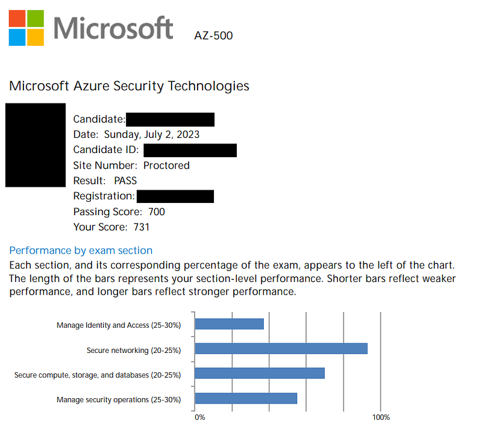
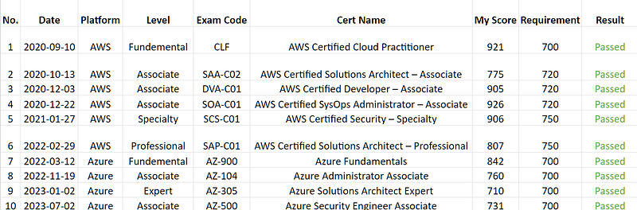

* * *

### 八小時速成攻略！我如何通過微軟 AZ-500 Azure Security Engineer Associate 資訊安全工程師認證｜資安新手也能上手

Photo by [Nick Morrison](https://unsplash.com/@nickmorrison?utm_source=medium&utm_medium=referral) on [Unsplash](https://unsplash.com?utm_source=medium&utm_medium=referral)

> 💡 適合：非資安專業背景、全職準備考試、希望用最少時間搞懂 AZ-500 考試重點的人！（以下為我 2023 年準備考試的經驗，僅供參考！）

### 前言

成績單

身為微軟澳洲的 Azure 雲端解決方案架構師，我的日常工作與雲端密不可分。然而，資安從來不是我的專長。這次挑戰 AZ-500 認證，完全是自我突破的一場實驗。憑藉我過去累積的雲端證照考試經驗（AWS + Azure），我擬定了一套高效率的備考方式，並在不到 8 小時內完成準備並一次通過考試！

擁有豐富考證歷史的我，已經非常了解對我自己最有效的證照學習方式：我喜歡從教學影片入門、快速建立概念，再搭配大量練習題測試吸收程度、針對弱點加強。

我的 AWS 和 Microsoft Azure 雲端證照考試歷史

### 我的 AZ-500 證照準備清單

以下三個資源，是我覺得最有幫助的，而且都是線上免費公開的資源!

不過我的考試語言是英文，所以這些準備材料都是英文喔～

#### 1\. [YouTube] AZ-500 Microsoft Azure Security Technologies Study Cram by John Savill

  * **連結** : <https://www.youtube.com/watch?v=6vISzj-z8k4>
  * **時間** ：影片大約有3小時，但我通常都是以1.5倍的速度觀看考試準備影片，來節省時間XD
  * **EC 的筆記** ：這個影片幫助我快速回顧了與 AZ-500 考試相關的所有 Azure 服務和概念。如果你對本地 Active Directory（on-prem AD）或 Azure Active Directory（AAD）不熟悉，我覺得 identity 相關的章節非常有用。但這個影片的其他章節內容對考試準備來說並不是非常實用（別誤會，這是一個非常好的教學影片，但我覺得更適合拿來作為學習 Azure 相關的資安知識的教材。如果你單純使用這個影片來準備 AZ-500 證照考試，我覺得你很有可能會考不過XDDD）。

#### 2\. [YouTube] Azure Security Technologies AZ 500 dumps by Cloud Guru Amit

  * **連結** : [https://www.youtube.com/watch?v=hLXL5AeDxFs&list=PLyABYqulvUwYDZ5wVM1Y7qckfb0bnYbe9](https://www.youtube.com/watch?v=hLXL5AeDxFs&list=PLyABYqulvUwYDZ5wVM1Y7qckfb0bnYbe9)
  * **時間** ：少於1小時
  * **EC 的筆記** ：我非常喜歡他的影片風格，非常直接。老師只講重點，不會浪費時間！我從這個系列影片中獲得了一些不錯的考試知識（系列中有一些付費內容，但我並沒有真的付費去觀看）。對於這個系列影片，我有一個小秘訣就是在每個問題後暫停影片，試著自己回答問題，然後再觀看答案。我認為這樣做絕對有助於我思考我之前的學過的資安知識，然後更好地理解考試概念。

#### 3\. Exam Topic — Microsoft AZ-500 Exam

  * **連結** : <https://www.examtopics.com/exams/microsoft/az-500/view/>
  * **時間** ：約3小時
  * **EC的筆記** ：對我來說，這可能是準備 AZ-500 考試的最有用的資源。記得要閱讀討論區的討論內容，因為有時候顯示的答案可能不是正確的答案。我通常會在準備雲端證照考試的最後一步使用 Exam Topic來驗證我學到知識（他們有各式雲端證照的考試題目）。有時候我在實際考試中也會看到非常相似的問題，所以這也是使用這個網站準備考試的一個加分項！

### 對於 AZ-500 考試的反思 ( 2023年7月2日考取證照)

  1. 關於如何管理資料庫安全(Database) 和 Container Security 的問題比我想像的多。
  2. 關於網路安全 (Networking Security) 和不同類型的 AD roles 的問題比我預期的少。
  3. 如果想要通過考試，你絕對必須要好好了解 Microsoft Defender for Cloud 和 Sentinel。我對這兩個服務只有概念上的了解 (high level overview)，這就是為什麼我的分數不是太高的原因（幸運的是，我對網路安全有很強的理解，我認為這是我能通過考試最主要的原因）。

### 結論

雖然我很順利第一次就通過了 AZ-500，但現在想想我覺得我應該在參加 AZ-500 考試之前先參加 <<AZ-700 考試：設計和實施 Microsoft Azure 網路解決方案（Microsoft Certified: Azure Network Engineer Associate）>>。由於網路安全在 AZ-500 中佔了很大的比重（20–25%），我覺得通過 AZ-700 考試會是一個極大的優勢。（有趣的是，我計劃接下來要參加的考試就是 AZ-700哈哈）

大家也考過 Azure 或 AWS 雲端證照嗎？有沒有什麼獨門準備秘技？歡迎留言與我分享～

* * *

👩‍💻 **需要職涯導師嗎？澳洲雲端架構師 EC 提供轉職工程師、澳洲求職、移民生活等全方位諮詢服務。**

👉點擊 [<<澳洲雲端架構師 EC：專為轉職者量身打造的職涯諮詢｜海外職場×履歷優化 × 面試攻略 × DevOps /雲端職涯>>](./2018-01-03-ec-consultation/index.md)，開啟你的職涯新篇章!

📬 **不想錯過更多海外生活、澳洲職場、文組轉職工程師的精選文章？**  
👉 按此訂閱[澳洲雲端架構師 EC 的 Medium 部落格](https://medium.com/@cloudarchitectec/subscribe)，不錯過最新文章！

**📱 想追蹤更多？**

  * 📘 [Facebook 粉專：澳洲雲端架構師 EC](https://www.facebook.com/cloudarchitectec)
  * 🧵 [Threads：Cloud Architect EC](https://www.threads.com/@cloud_architect_ec)
  * ☕ 喜歡我的創作分享？[請 EC 喝杯咖啡吧](https://donate.stripe.com/8wM8xU44n5Ld9Q4bIJ)
  * 📩 合作信箱：[cloudarchitectec@gmail.com](mailto:cloudarchitectec@gmail.com)

