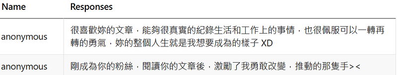
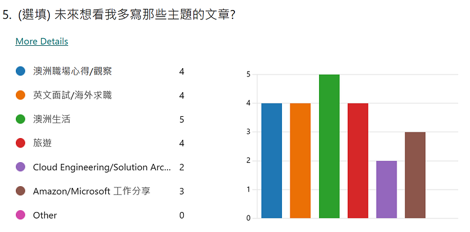
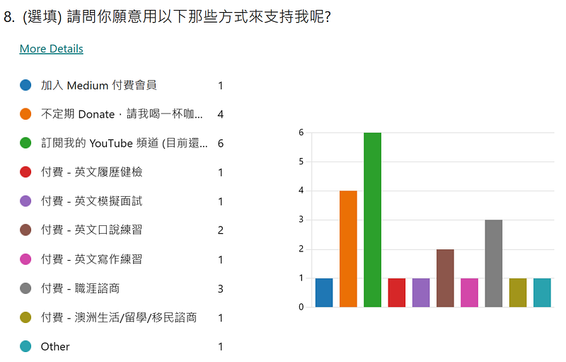

* * *

### [回饋] 讀者意見調查結果 + 讀者Q&A

Photo by [AbsolutVision](https://unsplash.com/@freegraphictoday?utm_source=medium&utm_medium=referral) on [Unsplash](https://unsplash.com?utm_source=medium&utm_medium=referral)

首先非常感謝大家參與這次的讀者回饋兼意見調查活動! 每次可以收到你們的任何留言與回饋，我都覺得非常開心!

尤其是以下兩位讀者的留言，真心是讓我超級感動!!!!! 很高興我的文章可以帶給你們一點力量，讓我們一起繼續朝自己的目標前進吧~

想對 EC 說的話

另外也很開心可以跟當中的你們幾位聊聊。聊天過程中除了可以根據我自身的經驗來提供讀者們一些建議，我自己也從跟你們的對話中學到了不少：）

以下就來分享這次讀者意見調查結果：

### 關於部落格

文章主題投票結果

想看的主題前四名為:**澳洲生活** 、**澳洲職場心得/觀察、英文面試/海外求職、旅遊** 。可以麻煩大家留言跟我說一下澳洲生活是指哪些方面嗎?XD 如果你們可以舉一些例子給我，對我來說會很有幫助!

另外旅遊居然有登上前四名 (後三項其實並列第二)，其實我還滿意外的，因為我的郵輪文章的點閱率並不高哈哈，但是你們的聲音我聽到了，我以後會多寫一些澳洲當地的遊記。

### 關於 EC 的未來發展方向

未來發展方向投票結果

呼聲最高的是 YouTube，其實這也是我下半年打算要進行的方向喔! 目前的規劃是英文頻道，但會上中文字幕。不管成功與否，我個人的目標是下半年至少 6 支影片，等我準備好會再來跟大家分享~

付費的職涯諮商跟英文口說練習可能會等到明年再展開，但如果你們真的有類似需求的話，也可以寄信到我的信箱 [cloudarchitectec@gmail.com](mailto:cloudarchitectec@gmail.com)，我可以視情況提供一些免費的諮詢與練習XD

### 讀者 Q&A

那麼在讀者在留言中和跟 EC 的視訊對話中，他們都問了哪些問題呢？以下順便做成文字版 Q&A 與大家分享~

**Q1: 想知道你是如何每週都保持寫作的習慣，我覺得如果工作上的事情一忙，就很容易把工作以外的事情都先擱置到一旁，之後不忙的時候也可能是幾週後的事情，然後我覺得心情上也要穩定，才能很有紀律的挪出時間給自己紀錄生活中的大小事**

我是一個很目標導向的人，所以一旦我幫自己訂下目標後(例如: 一週至少發表一篇Medium文章)，不管怎樣我都會盡自己的全力去達成XD 而且寫文章對我來說其實是一件很快樂的事，當然我也是會有想不出來要寫什麼，或是因為當週行程太滿，所以在週日晚上最後一刻趕文的日子哈哈。但是對我來說如果沒辦法達到我設定的目標我會很難受，所以不管怎樣我都會勉強自己達成。

關於寫作時間管理的小秘訣，我會利用短暫空檔時間先把文章的主旨跟要點記下來，然後在下一個空檔時間把要點發展成文章大綱，最後再找比較大段的空閒時間把整篇文章完成。

其實寫作這件事終歸沒什麼秘訣，就是花時間寫下去就對了XD 不過我之後會寫一篇如何提高生產力的文章來跟大家分享。

* * *

**Q2: 想知道英文要到什麼程度，才比較好投海外的工作，以及如何準備? 一定要英文好才能在澳洲生活嗎?**

這個之後會寫一篇專文來討論，先簡單回答，我覺得只要基本生活跟工作上溝通沒問題，就可以在澳洲工作且生活了。有時候不需要太著重文法是否正確之類的(因為有些澳洲人自己文法跟拼寫也很爛XD)，只要敢開口，可以達成雙方溝通這個目的最重要。

* * *

**Q3: 我忘記妳的文章有沒有說過，但我想知道在 bootcamp 後為什麼不是做前端或後端，而是想做 Solution Architect 或是 DevOps**

我當年 2020 年 3 月 bootcamp 畢業是一心想做前端的 (其實那個時候我根本不知道雲是什麼XD)，只可惜當時澳洲遇到 Covid，工作機會銳減，我申請了200份工作 (我有個工作申請紀錄的excel為證)，最後只拿到一個 offer，就是在 AWS (Amazon Web Services) 做 Cloud Consultant，我也是從那個時候才開始學習 cloud engineering 的XD

接著在 AWS 做了兩年，我想嘗試 Solution Architect 這個職位跟學習另一個雲平台，所以我決定跳到 Microsoft Azure。

現在覺得 Solution Architect 不太適合我現階段的職涯目標，所以才考慮做 DevOps Engineer。DevOps 對我來說是一個可以結合我之前在 bootcamp 學過的 full stack web development，跟我後來在 AWS 和 Azure 兩大雲平台學到的雲端技術的結合體。我也很期待自己未來還會有怎麼樣的發展哈哈

* * *

**Q4: 為什麼當初是選擇澳洲打工度假，而非其他國家?**

我當年申請打工度假的時候 (2011–2013年，其實我離打工度假真的很遙遠了XD)，可以選擇的國家不是很多。在英語系國家中，唯一一個不用抽籤的就是澳洲，所以我當年選擇澳洲的原因就只是因為澳洲的申請程序最簡單XD

* * *

**Q5: 在澳洲生存最重要的技能是什麼?**

這個問題好廣喔~ 我不知道要怎麼回答耶。我覺得其實沒有什麼必要技能耶，只要「你想在澳洲生活」加上「你找到可以合法讓你長期在澳洲待的簽證」就可以了。如果硬要說的話，可能是解決問題的能力? 因為澳洲生活真的不像台灣這麼方便，很多事情都得要靠自己處理。

* * *

**Q6: AWS、微軟工作面試著重的人格特質？**

AWS/Amazon 最重視的個人特質我們稱之為 Leadership Principles，不管是入職面試，甚至是入職後的績效評估跟日常對話，這些用語都會不斷出現在亞麻人的日常生活中。詳情請參考官網上的 14 條 [Amazon’s Leadership Principles (aboutamazon.com)](https://www.aboutamazon.com/about-us/leadership-principles)。

**我覺得 AWS 員工最重要的個人特質是：ownership ＆ customer obsession:**

  * 對亞麻人來說 ownership 就是 “If you see something that is not right (although it’s not your job), you will take ownership of the issue and try to fix it”，這種看到需要修正/可以改善的地方，立刻就會主動承擔責任並做出行動，就是 AWS/Amazon 最重視的個人特質。
  * 亞麻人做什麼事都是從客戶的角度出發，如果公司利益跟客戶利益有所衝突，我們會選擇做對客戶更有利的方案，這點是為什麼我們的電商跟雲服務都能如此成功的關係。這一點在微軟就非常不同，微軟的文化是做任何事都是從微軟這個公司的最大利益為出發。Satya在今天的員工內部活動又說了一次 “Microsoft itself is a sales organisation. Everyone in Microsoft is a seller.”

**微軟最重視的個人特質則是 growth mindset、leverage others、 Diversity & Inclusion，可以參考微軟的網站 **[**Culture | Microsoft Careers**](https://careers.microsoft.com/v2/global/en/culture)**:**

  * 關於 growth mindset 跟 fixed mindset 的比較，可以參考這篇 <<[Growth Mindset vs Fixed Mindset: How what you think affects what you achieve](https://www.mindsethealth.com/matter/growth-vs-fixed-mindset)>>。Growth mindset 對應的就是 fixed mindset。簡單來說，如果今天有個數學考試，我考了80分。Growth mindset 的人會想著，很好我已經掌握了 80 分的知識，代表我只剩下小部分的 (20分) 知識需要加強，加強後我就可以成為一個更好的人。Fixed mindset 的人則會想考 80分就是我的極限了，我的智商就是只能考到 80，不管我再怎麼努力都沒用，我個人的先天限制是無法透過努力改變的。
  * Leverage others 就是把他人的成功當做自己的成功，也要把自己的成功當作他人的成功。例如我今天要做一個 AI 相關的簡報，與其我自己從頭做起，我應該利用同事已經做好的簡報，如此既省時又省力。同樣的，如果我做過一個關於 Azure ARC 的簡報，當我知道同事 A 也要做同樣的簡報的時候，我會主動跟他說這個我之前做過，你拿去用吧，如果有問題再問我。
  * 第三點簡稱為 D&I，微軟是我見過男女員工比例最平等的科技公司，就連技術職位，也有非常多女性擔任，這個比例遠比 AWS 高很多XD

以上三個就是微軟重視的人格特質，不僅在面試中會提到，微軟績效評估的其中一部分也是以這三個標準為衡量點。

* * *

**Q7: 軟實力重要還是硬實力重要?**

答案是，都很重要XDDD 。

但是新鮮人剛開始踏入職場時，通常公司會更看重你的軟實力(例如溝通能力、學習能力、協作能力等等)，因為初入職場的人通常還沒有強大的技術能力。當你在職場上累積了一定的經驗後，軟實力跟硬實力就同等重要了。

* * *

**Q8: 如果要在一份我有熱情但薪水較低的工作，跟一份薪水高但我比較沒有興趣的工作之間做選擇，哪一份工作我會做得比較久? 延續這個問題，如果我選了薪水比較低的那個工作，我以後會後悔嗎?**

第一個問題我要給一個顧問業的標準答案 —視情況而定。

對於某些人來說，金錢是最重要的考量，也是他們不願意在職涯上妥協的地方，所以無論他們對工作有多少不滿意、多常抱怨工作，他們就是不會離職。或是他們只有在跳到下一份薪水更好的工作時，才會離職 (但新工作可能還是一樣有他們討厭的點，他們只是為了薪水而跳，所以在新工作上還是會持續抱怨XD)。這一點其實沒有不好，因為金錢/薪水是客觀的，而且非常容易評估和比較。例如你很難評估你在新工作會不會比較快樂，但如果薪水對你來說是最重要的考量，那用這點來評估你所有的 job offers 就很簡單了。

對於其他人來說，興趣或其他工作價值觀 (未來的職業發展、成就感) 更重要。例如我有朋友就覺得可以在工作上幫助他人很重要，所以她決定從英文系轉職為藥師(重讀藥學系)，目前在實習過程中也因為幫助來求助的患者而感到非常有成就感。所以這真的取決於你是哪種人！同時，正如我上面提到的，在選擇工作時，除了金錢和興趣之外還有更多要考慮的因素。例如，工作風格、你想要什麼樣的生活方式以及你想成為什麼樣的人。

推薦你們閱讀以下這兩篇文章，我在當中都探討了我個人選工作時的考量:<<[[職涯] 轉職可以一轉再轉嗎？薪水是轉職最重要的考量？](https://medium.com/@cloudarchitectec/%E8%81%B7%E6%B6%AF-%E8%BD%89%E8%81%B7%E5%8F%AF%E4%BB%A5%E4%B8%80%E8%BD%89%E5%86%8D%E8%BD%89%E5%97%8E-%E8%96%AA%E6%B0%B4%E6%98%AF%E8%BD%89%E8%81%B7%E6%9C%80%E9%87%8D%E8%A6%81%E7%9A%84%E8%80%83%E9%87%8F-f6e9ee6e7d85)>> 與 <<[[職涯] 你該轉職嗎? 來自轉職成功者的忠告 (台灣文組轉澳洲 IT 工程師)](https://medium.com/@cloudarchitectec/%E6%BE%B3%E6%B4%B2%E8%81%B7%E5%A0%B4-%E4%BD%A0%E8%A9%B2%E8%BD%89%E8%81%B7%E5%97%8E-%E4%BE%86%E8%87%AA%E8%BD%89%E8%81%B7%E6%88%90%E5%8A%9F%E8%80%85%E7%9A%84%E5%BF%A0%E5%91%8A-%E6%96%87%E7%B5%84%E8%BD%89it-9bb2bb9485ca)>>

> _·_** _你未來想要怎麼樣的工作型態？_** _你想要繼續當一個朝九晚五的上班族，或是你希望你上班的時間地點可以有所彈性？你希望在同一個地區／國家工作嗎？還是你希望新職涯可以讓你在世界各地工作？_

>  _·_** _你未來想要怎樣的生活？_** _如果你覺得家庭生活遠比職場成就更重要，那或許在轉換跑道時，薪水就不是最重要的考量，有沒有時間陪家人可能更重要。_

* * *

**Q9: 如果沒有證照或是其他有力證明的狀況下我要如何在履歷上證明自己會這項技術/能力? 舉例來說：像是溝通軟實力或是熟練 Git 指令這種書面履歷不好呈現的項目，如果是EC的話會如何在履歷上證明自己有這項能力來讓履歷能夠更吸引人呢?**

軟實力 (例如溝通能力) 這部分我覺得不用特別證明，因為雇主面試你就知道了! 每個人基本上會在履歷上提到自己擅長 communication，而我覺得在履歷上提到這點只是讓你通過履歷審核那關而已XD

所以第一個問題其實可以分成兩部分:

1\. 如何加強你的履歷，讓雇主看了會想要來找你面試。

2\. 如果你真的溝通能力不佳的話，該怎麼加強實際德溝通能力 (這方面我不是專家，你可能需要另外找資源)。

再來，我覺得熟悉 Git 指令不是能讓你錄取一份工作的關鍵點。或者是說，基本上你可以在 Google 上找到答案的事情也都不是關鍵點。重點是，你會Google 嗎?XD

舉例來說，當你在 troubleshooting bugs，你有沒有辦法找到正確的 logs 跟 error messages? 當你在 Stakeoverflow上找到 10 個相關答案時，你要怎麼判斷哪些是真的相關，還是他們只是包含了類似的關鍵字，但跟你實際上要解決的問題不相關? 假設 10 個答案裡面有 3 個跟你的問題真正相關好了，你要怎麼決定從哪一個 solution 開始嘗試?

如果你在 Google上找不到答案，你的下一步 troubleshooting 方式是什麼?或者是說，Google 應該是你 troubleshooting 的第一步嗎? 還是你該從閱讀內部技術文件開始? 或是你該先問問同事有沒有遇過類似問題? 如果要問同事，你該從誰問起、該怎麼問、什麼時候問? 通常前輩都會期許你已經先做好功課再發問，而不是無頭蒼蠅一樣，看到什麼問什麼。

結論是，我覺得這些軟實力是你在履歷上必須要提到的關鍵字，不然你可能會過不了履歷審核那一關XD 但是面試官對於申請人軟實力的評估，只需要用幾題面試問題就可以了解了，不會光靠閱讀你在履歷上的描述。

* * *

**Q10: 在亞馬遜的工作分享那篇有提到 Learning ability 的部分，想請問 EC 是如何培養學習新事物的能力呢? 或者是 EC 有一個自己學習新技術的 SOP 嗎?**

我覺得每個人都必須要盡快找到適合你的學習方法，才能事半功倍。用證照考試來說，我有一套自己的學習方法跟系統。當然這些是我摸索出來的，所以對我來說非常直接有效 (但對你可能就不一定那麼有效了XD)，以下供大家參考:

1\. 我喜歡影音資源，所以我通常都是看線上課程。

2\. 我的英文很好，所以影音資源我可以用 1.5 倍速撥放節省時間，30小時的課我花 20 小時就可以看完。

3\. 看完線上課程後，我會做練習題加深知識，順便驗證一下我是不是真的學會了。

適合其他人的方法可能不一樣，例如有些人喜歡讀 technical documentation，因為那是官方最深入的知識系統。有些人喜歡實際動手做做看，例如我今天要學 React，有些人不會從 React doc 看起，他們可能會直接開始做 side project & deploy，然後從中學習技術、可能會遇到的困難，如何解決等等。結論是我覺得你可以多方嘗試，看看哪些方法適合你，哪些方法不適合你。找出適合自己的學習方式最重要!

* * *

### **讀者們給我的文章靈感(以下主題會分別發表一篇文章)**

  * **台灣軟體工程師/產品經理如何在台灣找到澳洲軟體業的工作？或是剛登入澳洲的台灣軟體工程師/產品經理如何提高在澳洲找到工作的機會？**
  * **如何保持一週發表一篇文章的動力？維持生產力/高效工作的秘訣是什麼？**
  * **澳洲打工度假相關** ：在澳洲生活或是打工度假需要具備什麼樣的勇氣?在出國前有做什麼樣的準備嗎? 去之前有想過要在澳洲待那麼久嗎?
  * **如何增進英文: 花多少時間、用什麼方式**
  * **各種軟體相關的職業到底在做什麼的角色分析圖: Web Developer (Front End Engineer, Back End Engineer, Full Stack Engineer), Cloud Engineer, Solution Architect, DevOps Engineer, Site Reliability Engineer**
  * **Cloud Engineer 到底在做什麼? 你(作為網頁工程師)寫的程式碼跟我(Cloud Engineer/DevOps Engineer) 寫的程式碼到底有什麼不一樣?**(雲端架構師最主要想要提供的服務是什麼？雲端架構師和一般的網路管理infra差異性？還有devops跟在工作定位上dev指的開發跟一般的軟體工程師有何不同?還是更著重在CI/CD的開發流水線上?)

其中第一篇我已經打好寫作大綱了，請給我一點時間把文章們生出來！如果有你們特別想看的主題，也請記得留言告訴我，呼聲越高的主題越有可能儘早出現XD

### 總結

那麼這次的讀者回饋活動與意見調查就這麼結束了~ 希望不管是我們的視訊對話諮詢或是以上的文字 Q&A 都可以對你們有一些幫助，期待下次與你們相見!

* * *

**如果你喜歡海外生活、澳洲職場、文組轉職工程師的相關文章，歡迎按下「拍手」給我鼓勵 (喜歡的話請多拍幾次！)。同時記得「**[**按此訂閱我的Medium部落格**](https://medium.com/@cloudarchitectec/subscribe)**」，這樣你就不會錯過我每週的更新囉～你們的支持是我持續創作的動力，如果有任何問題或是想要看的主題，歡迎留言與我互動 :)**

  * 中文部落格: [https://medium.com/@cloudarchitectec](/@cloudarchitectec?source=about_page-------------------------------------)
  * 英文部落格: [https://medium.com/architecting-your-cloud-career](https://medium.com/architecting-your-cloud-career?source=about_page-------------------------------------)
  * Email: [cloudarchitectec@gmail.com](mailto:cloudarchitectec@gmail.com?source=about_page-------------------------------------)
  * 臉書粉絲頁(文章與中文部落格相同): [https://www.facebook.com/cloudarchitectec/](https://www.facebook.com/cloudarchitectec/?source=about_page-------------------------------------)

* * *

**延伸閱讀**

  * [[介紹] 大家好，我是EC!](https://medium.com/@cloudarchitectec/%E4%BB%8B%E7%B4%B9-%E5%A4%A7%E5%AE%B6%E5%A5%BD-%E6%88%91%E6%98%AFec-afcf45d128eb)
  * [[目錄] 雲端架構師 EC — Medium 文章列表](https://medium.com/@cloudarchitectec/%E7%9B%AE%E9%8C%84-%E9%9B%B2%E7%AB%AF%E6%9E%B6%E6%A7%8B%E5%B8%AB-ec-medium-%E6%96%87%E7%AB%A0%E5%88%97%E8%A1%A8-2023-06-03-%E6%9B%B4%E6%96%B0-76c1ed3b871d)
  * [[職場] 澳洲微軟雲端架構師 Microsoft Azure Cloud Solution Architect 面試心得 (同場加映 AWS 面試心得)](https://medium.com/@cloudarchitectec/%E6%BE%B3%E6%B4%B2%E5%BE%AE%E8%BB%9F%E9%9B%B2%E7%AB%AF%E6%9E%B6%E6%A7%8B%E5%B8%AB-microsoft-azure-cloud-solution-architect-%E9%9D%A2%E8%A9%A6%E5%BF%83%E5%BE%97-%E5%90%8C%E5%A0%B4%E5%8A%A0%E6%98%A0-aws-%E9%9D%A2%E8%A9%A6%E5%BF%83%E5%BE%97-9dff9fc59ae8)
  * [[職涯] Solution Architect、Technical Consultant、Software Developer 比較](https://medium.com/@cloudarchitectec/%E8%81%B7%E5%A0%B4-solution-architect-technical-consultant-software-developer-%E6%AF%94%E8%BC%83-1484a6401723)
  * [[職涯] 如何評估現職是否適合你 — 工作小任務(work tasks)分析](https://medium.com/@cloudarchitectec/%E8%81%B7%E5%A0%B4-%E5%A6%82%E4%BD%95%E8%A9%95%E4%BC%B0%E7%8F%BE%E8%81%B7%E6%98%AF%E5%90%A6%E9%81%A9%E5%90%88%E4%BD%A0-%E5%B7%A5%E4%BD%9C%E5%B0%8F%E4%BB%BB%E5%8B%99-work-tasks-%E5%88%86%E6%9E%90-d07d09a192c)

