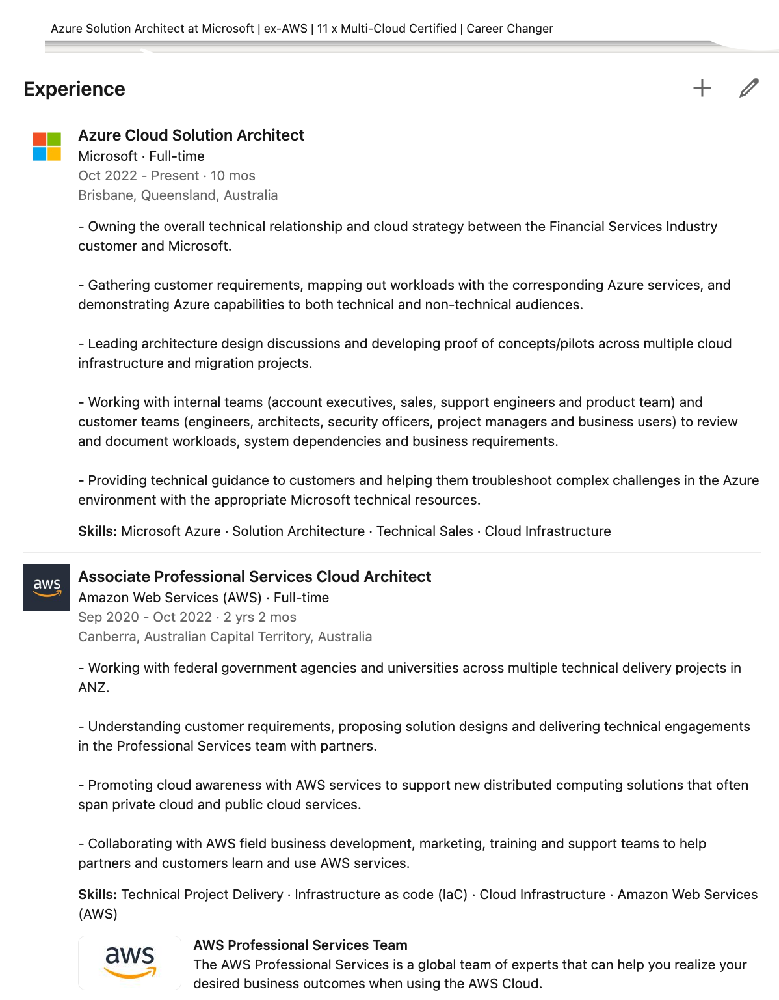
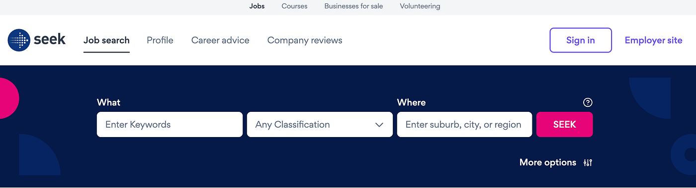
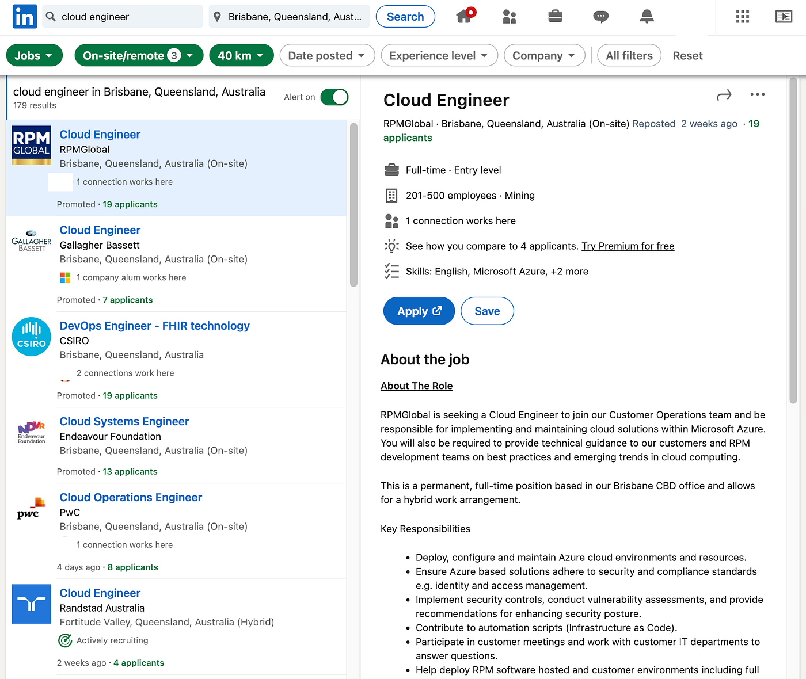
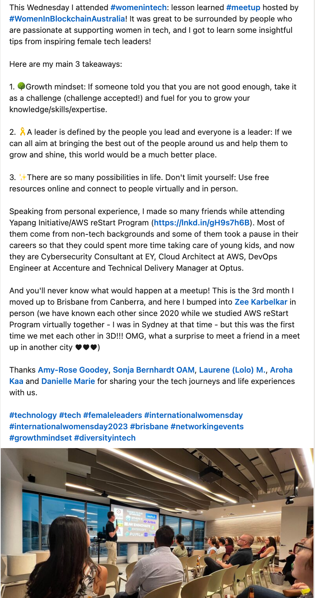
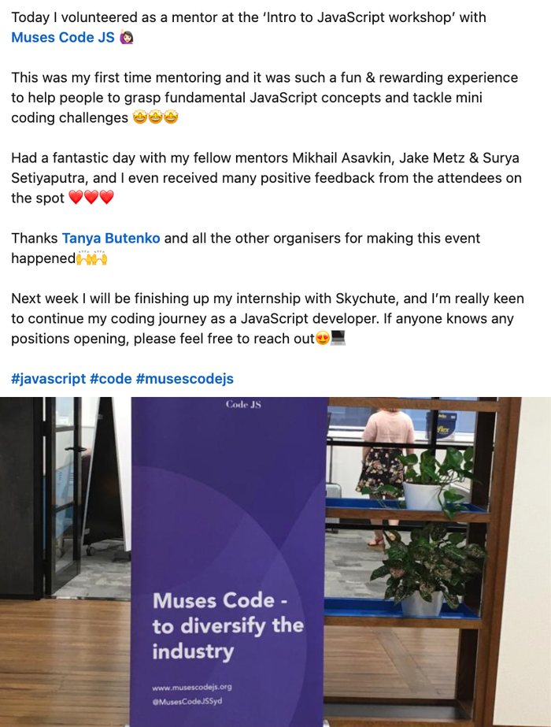

* * *

### 澳洲求職必勝法則：外國人身份也能成功找到澳洲科技業正職工作 — 旅澳台灣工程師的實戰秘笈公開！

Photo by [Eric Prouzet](https://unsplash.com/@eprouzet?utm_source=medium&utm_medium=referral) on [Unsplash](https://unsplash.com?utm_source=medium&utm_medium=referral)

「外國人如果想嘗試在澳洲找到軟體工程師職缺，有辦法在去澳洲前就找到嗎?」

「我是一個在台灣有著三年軟體業工作經驗的產品經理，請問我有可能在台灣就找到澳洲軟體業的產品經理工作嗎?」

首先感謝讀者 Helena 跟 Martin 給我的靈感! 我在澳洲生活太久了，完全忘了有些人會有「在台灣，但想要尋找澳洲工作的需求」。今天就來跟大家分享我對這件事的看法，同時我也會提供你們一些外國人初來澳洲想要找到軟體業工作的秘訣，我個人親身實驗有效XD

### 前言

雖然大家的問題主要是「人在台灣，想找澳洲工作」，但我其實會想要先反問你們一個問題，那就是「你來過澳洲嗎？」

如果沒有，而且年齡允許，我會建議你先拿打工渡假簽過來，一邊體驗生活，一邊找工作，確定你真的喜歡澳洲的生活再說，因為萬一你來了之後不喜歡澳洲的生活怎麼辦?XD

如果你已經超過了打工度假的年紀，那另一個可以考慮的方法就是先來澳洲留學。這是一個成本很高，但更有可能提高成功機率的方法。澳洲大學或是研究所畢業後，可以獲得為期 2–4 年不等的畢業生簽證，允許你合法在澳洲工作，而這個時候你也有了澳洲學歷以及在澳洲的實習經驗，可以有效提高你找到澳洲工作的可能性。

人在台灣找到澳洲工作的可能性不能說是沒有，但我個人覺得機率不高。唯一的例外可能是你在台灣的公司是跨國公司，可以申請內部轉調(我目前唯一知道的例子就是台灣Amazon 轉調澳洲Amazon)。但如果是這種情形，相信你也不需要上網查資訊，直接問公司主管或人資可能比較快XD

讓我們設想一個情境。假設你是一個澳洲雇主，同時收到五份履歷，其中四個是澳洲人或是住在澳洲的人，至少你對於他們的所在地區或是學經歷會多少有些概念。第五個是個台灣申請者，你可能根本不知道台灣是哪裡，上面列的學經歷你也絲毫沒有概念。在這種情況下，身為澳洲雇主的你會想要找這個人來面試嗎？而且你甚至不知道這個人有沒有辦法合法在澳洲工作？所以我會建議大家先來澳洲體驗一下生活，看看喜不喜歡。如果喜歡，至少你現在有了澳洲地址跟電話，找工作起來會容易很多，以下也會提供一些小方法。

### 事前準備

下一個我會聽到的問題通常是「那我想在澳洲工作，需要做哪些事前準備呢？」

當你人還在台灣的時候，我建議你做以下三件事：

- **加強英文面試的能力：**歡迎參考以下幾篇文章XD

1. [澳洲求職必勝法則：前微軟雲端架構師的英文面試攻略](/posts/2023-01-21-eng-interview/)
2. [澳洲求職必勝法則：Phone Screening 電話初篩策略應答分析與實戰分享](/posts/2023-05-11-phone-screening/)
3. [澳洲求職必勝法則：英文面試結尾別說沒問題！這樣反問面試官才加分](/posts/2023-04-15-interview-ending-questions/)

- **準備好英文履歷：**這個東西本身可以寫成一篇文章，想看的人再留言告訴我XD 但簡單來說，澳洲履歷上不用放照片，也不用提出生日期，也不需要準備自傳。

- **更新 LinkedIn Profile，把所有的工作經歷跟成就寫成英文** (以下是我自己的 LinkedIn 工作經歷描述，供大家參考)

我的 LinkedIn 工作經歷描述

**當你抵達澳洲後，我建議你立刻做以下三件事：**

- 把履歷上的電話更改為澳洲電話號碼
- 把履歷上的地址更改為澳洲地址
- 如果你是打工度假簽證，我會建議你在履歷上放上一行「Full working rights in Australia」來增加自己通過第一關履歷審查的機會

### 預期困難

好的，現在你已經做完最基礎的準備工作，但在這裡我想要跟你們說你們可能會面臨的困難，先把心態準備好了，到時候才不會太著急。

大家可以先想一下，如果你是一個澳洲雇主，今天有一個外國人來申請工作(台灣是什麼? 可以吃嗎?)，你要怎麼判斷要不要給這個人機會?

1. **學歷**

對澳洲人來說，他們很難判斷你的學歷背景。就算你讀台大，可能也不會因此加分 (我本人是政大畢業的，這個台灣學歷在澳洲基本上完全沒有用XD)

2. **工作經歷**

對澳洲人來說，除非你之前的工作經驗是人人都知道的跨國公司(例如 FAANG)，不然就算你在台積電工作，可能也不一定加分？(請不要懷疑，這不是台積電的問題，而是一般澳洲人不一定像你想像的那麼有世界觀XD 我這裡指的是一般澳洲中小企業跟澳洲民眾，如果是在稍有規模的企業，他們可能還是知道的？不過這邊也要提醒一點，澳洲的企業分布就是以中小型企業為主，大型企業偏少。)

3. **語言文化**

畢竟澳洲是一個不同的國家，有它獨特的語文及文化背景，所以我覺得一開去一定要花點時間適應以及學習。

……不過我們難道是遇到困難就放棄的人嗎? 不，我們不是!!! 相信我，請秉持著一股勇氣：「我知道這很難，我其實也覺得這不太可能成功，但是我想試試! 就算最後真的失敗，但試過之後，我可以很驕傲的對自己說，我試過了，就算失敗我也多了一種人生體驗、從中學習到了一些經驗」! 因為我就是靠著這樣的信念，一路過關斬將拿到澳洲 Amazon 的 offer，然後也是因為這種信念，讓我後來成功跳槽微軟 XD

### 開始嘗試

心態準備完畢，下一步就是正式開始在澳洲找工作囉～

就我個人的經驗來說，IT 業主要有三個找工作的管道：

1. **澳洲版的 104 人力銀行** [**Seek.com**](https://www.seek.com.au/)

Seek.com.au

**2. 透過 LinkedIn Jobs**

LinkedIn Jobs

**3. 最後一個方法就是 Networking/Networking/Networking**

請多多參加 tech meetups 擴展自己在當地城市的科技業生活圈！參加時記得鼓起勇氣多跟幾個人聊聊，可以表達自己正在找工作，詢問他們有沒有知道什麼工作機會「我剛來澳洲，想要找某某方面的工作，不知道你這邊有什麼相關資訊嗎？」。或是詢問他們目前工作的內容，例如「我對於在澳洲當前端工程師的工作內容很有興趣，可以請你跟我分享一下嗎？」重點是記得要跟交談過的人交換 Linkedin，這樣方便你更加了解對方的背景與工作內容。

也可以在Linkedin 上多多發表文章，例如你最近學習了哪些課程，或是每參加完一個 tech meetup 都一定要寫參加心得，這樣可以讓大家更加了解你。

以下是兩篇我寫的 Linkedin 文章，供大家參考。其實我突然想到如何經營 Linkedin 也可以寫一篇，想看的人一樣請留言XD

 LinkedIn posts

最後請多多在 LinkedIn 加 connections，增加自己在澳洲科技業的人脈。但也不要隨便亂加XD。我每送出一個申請都會寫 personal note，上面寫說我們是在哪裡認識的，或是我是透過誰看到他們的個人資訊，想要跟他們 connect。假設你在 LinkedIn 上看到一個人的工作背景你非常有興趣，也可以傳訊息問他們願不願意出來喝杯咖啡聊聊，你請客，向他們討教一些問題，或是約 virtual coffee 也可以，基本上我遇見的人都非常樂意幫忙。

### 結語

以上就是我個人這幾年在澳洲科技業混得風聲水起(並沒有XD)的求職與職場個人品牌 (self branding) 的經營心得。不得不說在科技業，職場個人品牌的經營真的是很重要，不僅能提高你找工作的機會，同時也可以提高你在老闆或同事心中的好感度。像我個人很常發一些證照心得跟 meetup 參加感想，營造出一個這個人好像技術上很厲害、很積極參與社群活動、很喜歡學習新科技的個人形象XD

當然你可能也會說「我就想當個安靜的工程師，我不想搞這些有的沒的」，這也沒有關係，個人選擇而已。但在澳洲通常越會經營職場個人品牌的人，越容易獲得升遷跟老闆的賞識。像我目前微軟Director (我經理的經理) 在我每一篇 LinkedIn上都按讚，就算我們平常根本沒交集，績效評估時他直接就跟我經理說「EC 表現得很不錯啊～我常常看到她參與社群活動並分享心得，也從其他同事口中聽過不少對EC的稱讚」。

最後，要是你知道其他在澳洲找工作的小秘訣，也歡迎留言跟我分享喔～


