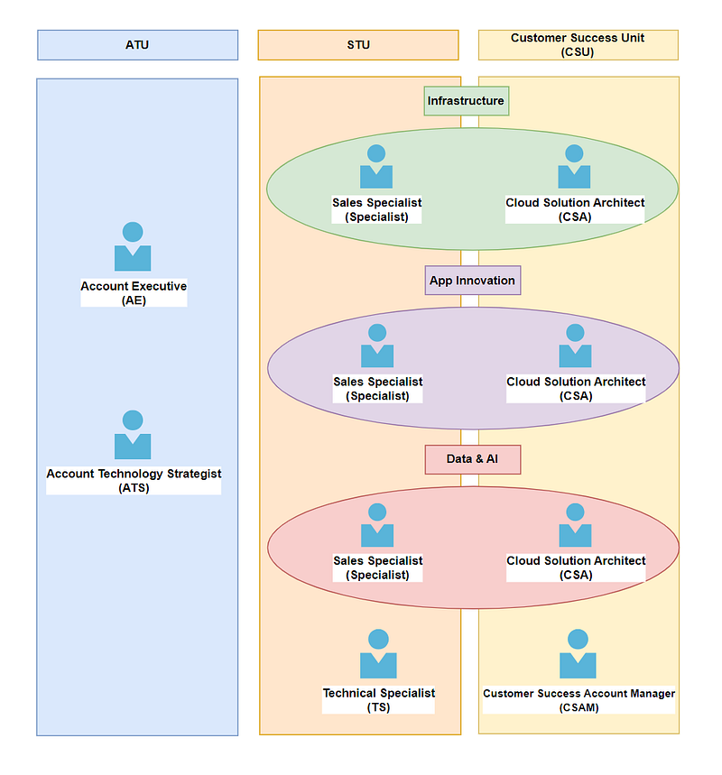
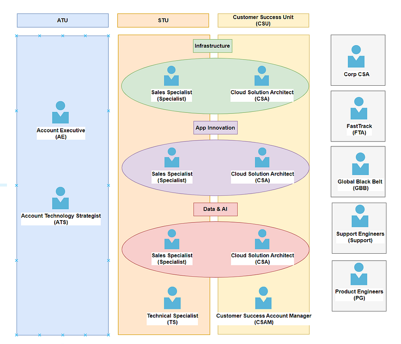

* * *

### [職場] 微軟雲端架構師 (Azure Cloud Solution Architect) 到底在做什麼? 第一集：Org Chart

Photo by [Smartworks Coworking](https://unsplash.com/@smartworkscoworking?utm_source=medium&utm_medium=referral) on [Unsplash](https://unsplash.com?utm_source=medium&utm_medium=referral)

* * *

### 前言

跟讀者們或是朋友們聊天時，他們對我提出的第一個問題總是「所以雲端架構師 (Solution Architect) 到底是在做什麼?」但我每次解釋後，大家看起來還是一知半解 (當然這有可能是因為我解釋得不夠好XD)。所以我決定用近期在工作上遇到的實際案例，來描述一下雲端架構師的日常工作內容，希望可以增進大家對於這個職位的了解。

這個系列預計會有五篇文章，以雲端架構師在日常工作中最主要的任務為例 :

  1. **Org Chart >> 你正在閱讀的文章**
  2. Solution Architecting
  3. Technical Guidance/Customer Meetings
  4. Technical Presentation/Workshops
  5. Sales Pipeline Management

**我希望大家在看完這個系列之後，可以留言告訴我:**

  1. 如果你不是微軟雲端架構師 (Azure Cloud Solution Architect)，你覺得這個職位符合你對於技術職位 (technical role) 的想像嗎?
  2. 如果你是微軟雲端架構師 (對，我最近發現有同事會看我的部落格! 太可怕了QAQ)，你覺得我對於 CSA 的工作描述還算客觀嗎?

**當然，總是要先放一下免責聲明XD**

這個系列完全是以我個人在澳洲微軟工作的親身經歷作為出發點，所以是我個人的主觀感受。雖然我敘述時會盡可能客觀呈現，讓各位讀者自行判斷。如果你在不同國家的微軟工作，甚至是你在不同的微軟團隊，你對於這個職位的感受可能會跟我略有出入或完全不同。

* * *

### 核心組織架構：ATU、STU、CSU

開始這個系列前，為了讓大家更了解架構師這個職位的背景，先來簡單講一下微軟目前的組織架構圖(PS: 這個東西每年都在改，所以我現在是以 FY24 的配置來講，上一個財政年 FY23 是沒有 Technical Specialist 的。)

雲端架構師 (Cloud Solution Architect) 隸屬於 CSU (Customer Success Unit)，基本上分為三個領域: Core/Infrastructure、Application Innovation、Data & AI。CSA 跟 Specialist「通常來說」是一對一的關係，也就是說 Specialist 有哪些客戶 (accounts)，CSA 負責的就是那些客戶。

**微軟的銷售階段分為五個階段(我不能講太細，怕洩漏公司機密XD)，但簡單來說:**

  * **階段 1 是 ATU 負責：** AE 負責 account management，ATS 是 AE 的 technical counterpart，負責技術相關的部分。
  * **階段 2 & 3 由 STU 負責**：Specialist 是銷售人員。FY24 之後會有一個 TS 職位，也就是 Specialist 的 technical counterpart，負責技術相關的部分。TS 雖然是 FY24的新職缺，但其實微軟以前是有這個職位的，只不過他們五年前因為組織改革 (re-orgnisation) 的原因，把這個職位移除了。沒想到五年後這個職位又復活了XD
  * **階段 4 & 5 由 CSU 負責：**在沒有 TS之前，CSA (也就是我)就是 Specialist 的 technical counterpart，也就是說當 Specialist 跟客戶談好，確定他們的 requirmetns, solution design, project plan & expected Azure costs 之後，就由CSA接手，負責確保客戶最終在 Azure 上的部署能順利完成。

Core Org Chart

好，請大家靜下心來看一下這張圖，你們覺得上面這張圖有什麼問題?

答案是，請問一個客戶到底需要多少個技術/sales/account management 職位來 carry? 哈哈

### 外核心組織架構：**Corp CSA、Fastrack、GBB、Support、PG**

但這還沒有結束喔~ 其實上面那張圖並不是全貌，在我身為 Azure Infra CSA 的日常生活中，其實我還要跟這些人打交道。以下這五組人馬分別屬於不同的 orgnisation unit，但顯然我用來畫圖的顏色已經用完了XD:

  * **Corp CSA:** 技術職，但也只能提供 technical advisory。基本上如果一般 CSA 搞不定時，就可以在內部系統上 lodge requests 找 Corp CSA 幫忙。這個是按 request 算的，基本上解決完一個 request 的問題他們就走了。下次要再找他們，就得要在內部系統上再提一次 request。
  * **Fastrack:** 技術職，但也只能提 technical advisory。雖然請他們的門檻其實不高，一個月在 Azure 上花一萬澳幣就可以了(一年 12 萬澳幣，約台幣 240 萬)。對於我負責的企業型客戶來說，根本小菜一碟(我的客戶一個月大概在 Azure上花幾十萬到幾百萬澳幣都有可能)。但是 FTA 資源有限，基本上是大型的項目才有可能請到他們，FTA算是比較長期的資源，沒有固定的時間長短。
  * **GBB** : 技術職，但也只能提 technical advisory。不過 GBB 可以說是微軟內部的技術菁英，雖然他們也是 advisory 的角色，但是他們通常都有豐富的業界實務經驗，而且GBB跟PG走得很近，他們常常可以獲得 Azure services 的第一手消息。所以如果你是一個 Azure 客戶，然後你的 Specialist/CSA 可以幫你找到GBB，那你就有福了!
  * **Support:** 技術職，Support 可以看到後端數據，這是上面三個組跟我本人都做不到的，所以如果客戶有 implementation 跟 troubleshooting 相關的問題，我們一律建議你直接在 Azure 平台上 raise support tickets 就可以了。你寄信給我是沒有用的，因為我沒有後台權限。而且說真的，不管是CSA、Corp CSA、FastTrack、GBB 能給的都是 advisory guidance，實作上面你問我們真的是沒有用，我們最多也只能在自己的 Azure portal 上試圖模擬一下。但如果你是相關人士，你就知道企業客戶的 production scale deployment 豈是我在自己的 Azure portal 上能模擬的XD
  * **PG:** 技術職，負責真正開發 Azure services 的工程師，通常都在西雅圖。基本上除非你的CSA有特殊關係，不然是找不到 PG 來幫忙的。(像我就沒有特殊關係lol)

Extended Core Org Chart

這也是為什麼我一開始加入微軟時總是昏頭轉向，因為光是技術職位就有 ATS、TS (這個是新的)、CSA x3、Corp CSA x 無限 (他們是分技術領域的，例如 networking、IoT、container 等等)、GBB x 10 (他們是分產品的，例如 networking、AVD、W365 等等)，還有 Support 跟 PG。一開始我遇到解決不了的技術問題，根本不知道要從哪個方向找資源，然後帶我的人也沒教。反正一切就是做中學，錯中學吧?XD

### 結論

其實我一開始寫這個系列的時候，只規劃了三篇，結果我後來發現三篇寫不完我想要講的東西。例如今天這一篇本來只是個前言，結果我寫一寫就發現這篇已經太長了，只好先到這裡為止。

下一篇要來講 Solution Architecting，也是我覺得CSA這個職位最專業，也最有技術力的地方，請大家敬請期待吧～

我上次在一個好朋友(他是台灣的高中英文老師，非 IT 專業)面前跟另一個資工所的學生聊完 solution architecting/solution design，他看我的眼神立刻就不一樣了XDD 可能是因為我之前只有在他面前抱怨過工作，沒有講過技術內容，我一講完我可以感受到他看我的眼神立刻充滿了崇拜哈哈哈哈

我發文的頻率通常是一週一篇，但據說如果拍手數或留言數增加的話，就會提高我的發文頻率喔～如果你等不及想看這個系列了，請多多拍手以及留言！

* * *

**如果想要進一步支持我，歡迎透過以下連結請我喝一杯咖啡！你們的支持是我持續創作的動力，如有任何問題或是想要看的主題，歡迎留言與我互動 :)**

* * *

**延伸閱讀**

  * [[職涯] 微軟雲端架構師 (Azure Cloud Solution Architect) 入職九個月的反思](/posts/2023-07-28-ms-csa-in-9-months/)
  * [[職場] 澳洲微軟雲端架構師 Microsoft Azure Cloud Solution Architect 面試心得 (同場加映 AWS 面試心得)](/posts/2022-11-25-ms-csa-interview/)
  * [[職涯] 如何評估現職是否適合你 — 工作小任務(work tasks)分析](/posts/2023-04-01-work-tasks/)
  * [[職場] 澳洲微軟菜鳥 Azure Cloud Solution Architect 的一天](/posts/2022-12-16-day-of-ms-csa/)
  * [[職場] 2023 Q1 科技大廠裁員潮 — 澳洲微軟員工心得](/posts/2023-02-11-2023-q1-layoff/)

