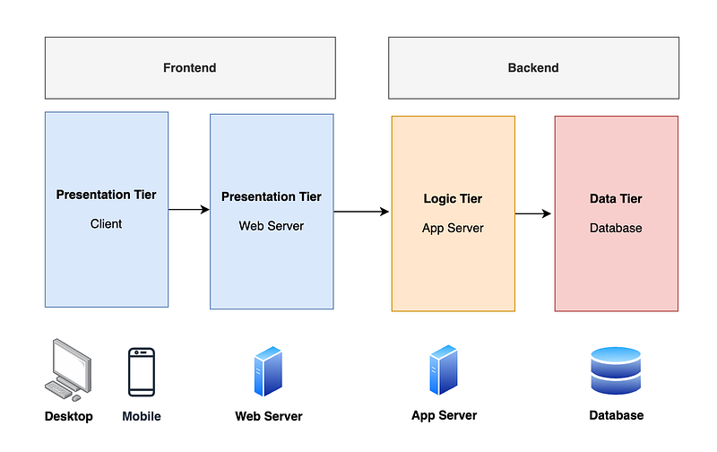
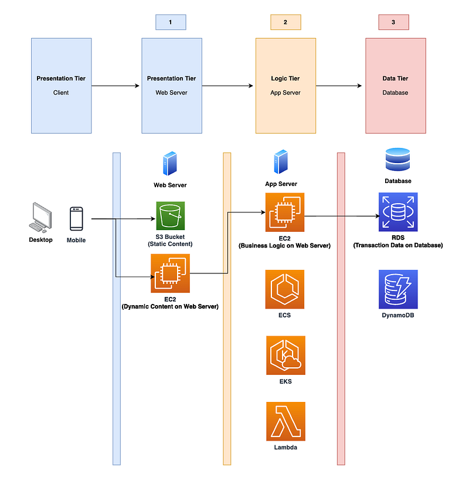
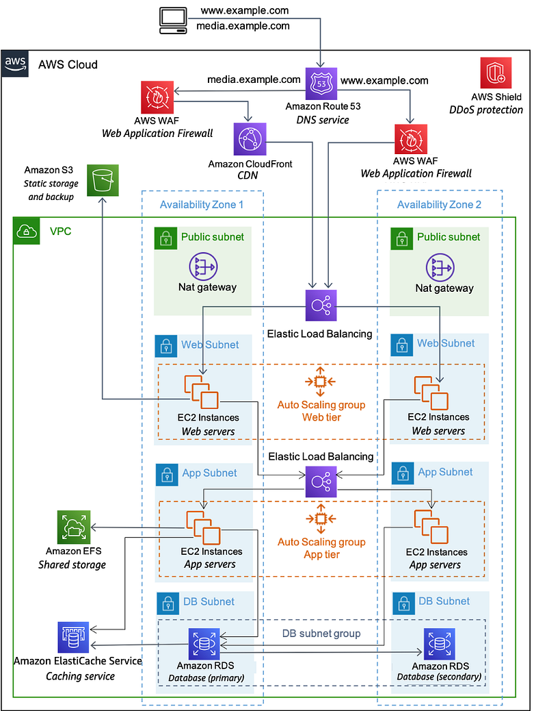

* * *

### 微軟雲端架構師 (Azure Cloud Solution Architect) 到底在做什麼? 第二集：Solution Architecting

Photo by [Daniel McCullough](https://unsplash.com/@d_mccullough?utm_source=medium&utm_medium=referral) on [Unsplash](https://unsplash.com?utm_source=medium&utm_medium=referral)

* * *

### 前言

這篇文章是 <<微軟雲端架構師 (Azure Cloud Solution Architect) 到底在做什麼?>> 系列的第二集，如果你還沒有看過第一集，請點擊以下文章：

[**微軟雲端架構師 (Azure Cloud Solution Architect) 到底在做什麼? 第一集：Org Chart & Solution Architecting**  
 _跟讀者們或是朋友們聊天時，他們對我提出的第一個問題總是，「所以雲端架構師(Solution Architect) 到底是在做什麼?」但我每次解釋後，大家看起來還是一知半解…_ medium.com](/posts//posts/2023-07-28-ms-csa-1//)

**這個系列預計會有五篇文章，以雲端架構師在日常工作中最主要的任務為例 :**

  1. [**Org Chart**](2023-07-28-ms-csa-1)
  2. **Solution Architecting >> 你正在閱讀的文章**
  3. Technical Guidance/Customer Meetings
  4. Technical Presentation/Workshops
  5. Sales Pipeline Management

**我希望大家在看完這個系列之後，可以留言告訴我:**

  1. 如果你不是微軟雲端架構師 (Azure Cloud Solution Architect)，你覺得這個職位符合你對於技術職位 (technical role) 的想像嗎?
  2. 如果你是微軟雲端架構師 (對，我最近發現有同事會看我的部落格! 太可怕了QAQ)，你覺得我對於 CSA 的工作描述還算客觀嗎?

**當然，總是要先放一下免責聲明XD**

這個系列完全是以我個人在澳洲微軟工作的親身經歷作為出發點，所以是我個人的主觀感受。雖然我敘述時會盡可能客觀呈現，讓各位讀者自行判斷。如果你在不同國家的微軟工作，甚至是你在不同的微軟團隊，你對於這個職位的感受可能會跟我略有出入或完全不同。

* * *

其實我發現寫這篇之前應該要來寫一篇解釋「到底什麼是雲」文章，但我最近真心忙到昏天黑地哈哈哈！所以繼續列入待寫清單，這個清單目前已經越來越長囧

第二集會是這個系列中最技術性的一篇，如果覺得太多技術概念看不懂，我建議可以直接等待第三集跟第四集，因為這兩集會有趣許多，請不要因此放棄這個系列XDDD

### **讓我們就以經典的案例 3-tier web app migration 來說吧！**

如果你對於 3-tier web app 沒有概念，這件事是這樣的。一般來說 web applications 的基本概念會分為三層：

  1. **Presentation Tier** ：這一層簡單來說就是使用者看得到、摸得到的那層。可以再細分成 web clients (使用者用來打開 app 的電腦或手機) 跟 web servers (企業用來呈現靜態內容或是動態內容的伺服器)。
  2. **Logic Tier** ：這一層就是廣義的後端 (backend)，是用來運行企業商業邏輯的 application servers。
  3. **Data Tier** ：這一層就是廣義的資料庫 (databases)。

圖 1: Three-Tier Web App Concept

### **接著讓我們把這個概念轉換成雲端架構，這裡以 AWS 為例。**

我先做個簡單的一對一圖示，請注意這裡的每一個服務，都有其他替代選項。我只是先挑一個常見的AWS雲服務作為案例，實際上企業會選擇哪一個AWS雲服務，需要靠雲端架構師了解客戶的需求，經由多次討論之後才會下決定。

圖 2: Three-Tier Web App on AWS (Super Simplified Version)

  * **Stage 1** ：我先簡單分為靜態內容跟動態內容。靜態內容，例如圖片或是簡單的html/CSS， 通常會放在 S3，也就是 AWS 的 Object Storage Service。這樣做的主要原因是就費用來說 S3 會比 EC2 便宜很多，所以靜態內容放那邊就可以了。如果是動態內容的話，可以放在 EC2 server 上。
  * **Stage 2：** 最簡單直接的方式就是直接用 EC2 server (就 cloud migration 來說的術語叫做 lift and shift，就是把本來在實體機房的實體伺服器搬到AWS雲上變成 EC2 server)。其他的選擇有: 使用 container，此時可以選的 AWS 雲服務有 ECS 或是 EKS，選哪個就根據企業想要對於他們的 container instance 有多少控制而定。或是走 serverless 路線的話，這裡會用的AWS 雲服務就是 Lambda functions。
  * **Stage 3：** 資料庫的選擇一般來說有 RDS (relational DB) 或 DynamoDB (non-relational DB)，要選哪個要根據 application 的 business logic 而定，也可以兩個都用。

好的，如果我告訴你以上只是簡化的版本呢?XD

### **一般來說，AWS 的 web application 架構圖 (solution design) 會長這樣：**

 圖 3: Three-Tier Web App on AWS (AWS simplified version)

這裡添加的新元素有：

  1. **Route 53:** AWS 的 DNS 服務，簡單來說就像是交警(traffic controller)，這個服務會負責幫忙指揮網路交通要往哪去。
  2. **WAF (Web Application Firewall)** ：Layer 7 防火牆，如果你不懂這裡的 Layer 7 是什麼意思，可以讀一下 OSI model。基本上它就是一個比較聰明的防火牆，比 Layer 3/4 的防火牆聰明，至於聰明在哪裡，讀完 OSI model 應該就會懂了XD
  3. **CloudFront (Content Delivery Network)：** AWS 的 CDN 服務，如果你不知道 CDN 是什麼概念，可以直接搜尋一下 Content Delivery Network。簡單來說， CDN 透過把網站內容 cache 在 edge points，可以大大減低使用者使用 app 時的 latency。
  4. **Shield** ：AWS 的 DDoS 服務，這個是資安相關的服務。簡單來說，就是避免駭客用假流量灌爆企業網站，使得伺服器無法運作。
  5. **VPC, Public Subnet (green), Private Subnet (blue)：** 簡單來說就是當企業從傳統的 hardware defined network (switches, routers, cables) 變成雲上的 software-defined network 時要怎麼規劃跟控制企業網絡。
  6. **Availability Zone：** 簡單來說就是在不同地點的 AWS 數據中心，通常會建議企業的雲基礎設施不要部署在單一 Availability Zone。專業術語叫做 multi-AZ deployment。
  7. **NAT Gateway：** 管 Internet outbound traffic 的AWS 雲服務。
  8. **ELB (Elastic Load Balancer)：** AWS 的 load balancer 服務，可以分為聰明版的 Layer 7 Application Load Balancer (ALB) 跟比較不聰明版本的 Layer 4 Network Load Balancer (NLB)，至於為什麼 ALB 比 NLB 聰明，你還是要讀一下 OSI model 囧
  9. **Autoscaling Group：** AWS 的 autoscaling 服務，簡單來說就是企業可以根據使用者流量而自動增加或減少伺服器的部署數量。例如一般來說 PTT 有100台伺服器，但是八卦版因為 Me Too 事件爆了，AWS會自動幫我部署200台伺服器來 cover 流量，這樣大家就可以繼續追八卦，而不會看到「批踢踢過載中，請稍後再嘗試登入」的錯誤訊息。（單純舉例，我不知道批踢踢是否部署在AWS上，還是在台大的機房裡?XD）
  10. **Elasticache：** AWS 的 data caching 服務，簡單來說為了減低資料庫的負擔，企業可以把使用者常常要讀取的資料放在 Elasticache 上。

有興趣進一步閱讀細節的人請參考：[**< <An AWS Cloud architecture for web hosting>>**](https://docs.aws.amazon.com/whitepapers/latest/web-application-hosting-best-practices/an-aws-cloud-architecture-for-web-hosting.html)

### **看到這裡還有人嗎？XDD**

雖然我上面講了超多次「簡單來說」，但我知道應該有讀者已經在心中吐槽無數次說「這哪裡簡單了啊啊啊啊啊啊啊啊」。

但殘酷的事實是，在實務上客戶的架構圖會遠比上面的圖 3 更複雜，基本上是一頁畫不完，而且你必須要用放大鏡竟看每一層的程度LOL

### **所謂的 solution architecting 到底在做什麼？**

  1. **你必須要懂 IT infrastructure** ：networking, web application architecture (你可以不用真的會寫 React applications 沒關係，但是我上面說的那個 3-tier web application 的概念要有), storage, security, database, load balancing 等等。
  2. **你必須要懂雲服務** ：AWS 或是 Azure 對應的 networking, web application , storage, security, database, load balancing 服務是什麼。除此之外，cloud migration 常見的幾個策略你要懂 (lift & shift, refactor, rehost 等等)。雲的基本概念你要懂 (regions, availability zones, multi-region deployment)。
  3. **除了個別雲服務跟概念之外，你要懂得規劃整體雲端架構方案：** 試著想像我告訴你圖三裡，客戶想要部署 2000 個 EC2 servers，這些伺服器必須要在兩個 regions (例如澳洲跟台灣)。那如果我的使用者在美國的時候，請問他會連到澳洲的伺服器還是台灣的伺服器? (連到哪一個對客戶比較有利？) 如果客戶跟你說，他覺得 active-active deployment 太貴了，兩個 regions 客戶打算把 primary region 在澳洲，只有在澳洲 region 掛了的時候才 fail over 到台灣，請問這裡的 DR (disaster recovery) 要如何規劃？
  4. **延續上一點，你必須要懂得跟客戶的不同部門打交道：**

  * 有時候你必須要跟客戶的 CEO/CTO 談上雲之後的商業效益跟長遠規劃。
  * 有時候你必須跟客戶的 Networking Team 談 south-north traffic 跟 east-west traffic 要怎麼規劃。
  * 有時候你必須跟客戶的 Project Manager 談圖 3 的架構在 AWS 上需要多少錢，如果客戶說他們沒有那麼多預算，請問你要如何簡化圖 3 的架構來省錢？同時讓客戶了解到省錢之後的後果可能是他們的 application 的安全性會降低，或是 reliablity 會降低，該如何取捨？
  * 有時候是在同一個會議裡跟客戶的不同部門大亂鬥XD Project Manager 說圖 3 太貴了，他們不想要買 Shield Advance，Security Team 說不行我們這樣資安會有漏洞。然後 Networking Team 跳出來說，multi-region deployment 這樣網路很難規劃，但 CTO 說不行我們的一定要multi-region deployment，因為 single-region deployment 的話我們無法滿足跟客戶的 SLA (service level agreement)。

### 結語

看到這裡的人，我覺得比起你們幫這篇文章拍手，我更想幫你們拍手XDDD 所以請留言吧，每一個留言我都會幫你們拍手的，因為要看一個這麼長又充滿英文技術名詞的文章真的不容易，我真心佩服！

其實我後來覺得「 solution architecting 到底在幹嘛」這件事完全更適合拍 YouTube 影片來解釋，但一樣，我現在還擠不出時間，所以請大家再等等吧！一切都在計劃之中。

另外之前問我要怎麼一個禮拜產出一篇文章的讀者 (其實我這禮拜寫了兩篇)，我告訴你們，秘訣就是「少睡一點」XDD 我今天早上九點就出門了，晚上九點才回來，開始寫文的時候已經晚上十點了。現在寫到尾聲的時候是凌晨一點，我猜等我加完圖片、修完文之後大概會是兩點？XD (我明天也是一個從早到晚的行程，所以只能今晚熬夜趕稿了)。

如果你欣賞我這份熬夜寫文的精神，請多多留言給我鼓勵、告訴我你們的讀後感想或建議。如果你覺得第二集完全看不懂就是天書，那請期待第三集 Technical Guidance/Customer Meetings，因為這集我會用實務上的例子來解釋，非常具故事性，你們也可以一窺微軟架構師平常是怎麼準備跟客戶開會的XD


